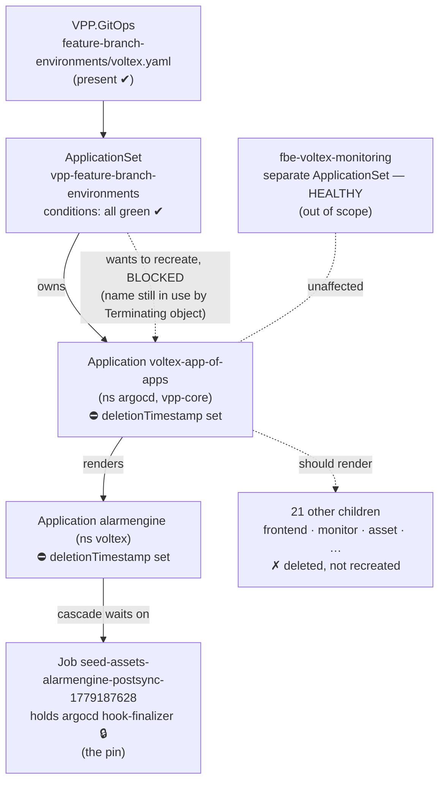
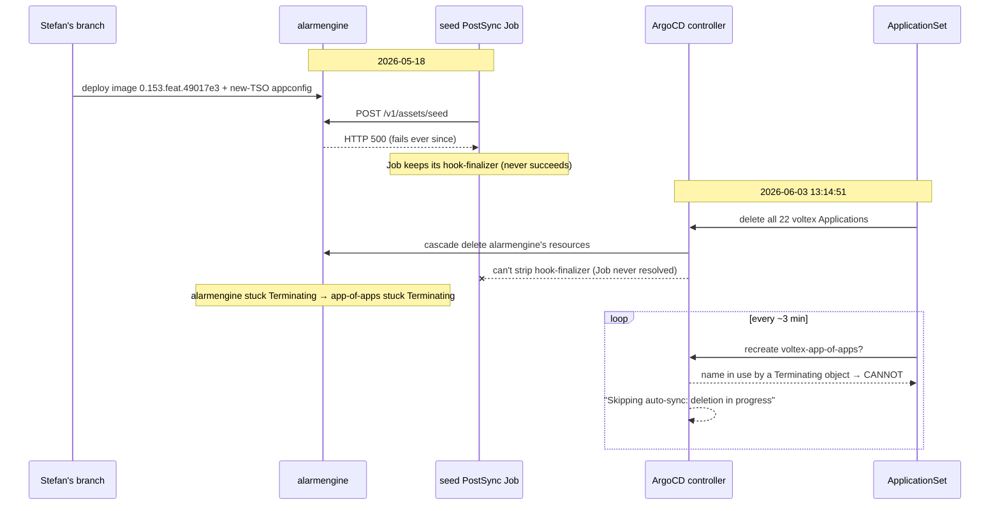

# Feynman Explainer — Why the voltex FBE "recreation" got stuck, and how I proved it

**Topic:** an ArgoCD *finalizer deadlock* that half-killed a Feature Branch Environment, hiding behind a "successful" pipeline.
**Mastery level:** operational — after this you can diagnose, defend, and reproduce this class yourself.

## Audience & scope

For Stefan (and the next on-call). You know what an FBE is and can run `kubectl`.
**In scope:** the mechanism that made voltex half-dead, how I ruled out your branch
as the *render* cause, why "clear the deadlock" is necessary-but-not-sufficient, and
the exact probe sequence so you can redo it. **Out of scope:** a full ArgoCD internals
course — we go only as deep as needed to defend the diagnosis.

---

## Knowledge Contract

After reading this, you will be able to:

1. **draw** the chain `VPP.GitOps → ApplicationSet → app-of-apps → 22 child apps → pods`, and mark where it broke;
2. **explain why** an ArgoCD `Application` with a `deletionTimestamp` freezes the whole slot (auto-sync is skipped while deleting);
3. **trace** the deadlock: hook Job finalizer → alarmengine can't delete → app-of-apps can't delete → ApplicationSet can't recreate;
4. **reject** the tempting-but-wrong cause "my branch broke the Helm render" — and say what evidence kills it;
5. **diagnose** the second, separate problem (the seed-500) and explain why clearing the deadlock alone won't make the FBE green;
6. **defend** "cause, not coincidence" against an expert, and name the one probe that would change my mind;
7. **reproduce** the entire investigation from cold using the command ladder.

**This document does NOT** make you able to fix the alarmengine 500 itself — that needs
one more probe (a log capture) that the teardown destroyed mid-investigation.

---

## TL;DR picture

```
What you expected:                         What actually existed:

ApplicationSet                              ApplicationSet  (healthy, WANTS voltex)
   └ voltex-app-of-apps                         └ voltex-app-of-apps   ⛔ Terminating (stuck 23h)
        └ 22 children (all healthy)                  └ alarmengine      ⛔ Terminating (stuck)
             └ pods Running                          └ (21 others)      ✗ deleted, can't come back
                                                          pods: 1 zombie alarmengine, frontend/monitor zombies
```

One sentence: **a delete that never finished is jamming the door, so the system that
would rebuild voltex keeps knocking and can't get in.**

---

## First-principles ladder

Climb these in order; each line is the smallest true thing the next one needs.

```
TERM        Finalizer        = a string on a k8s object meaning "don't actually delete me
                               until a controller does cleanup and removes this string."
PRIMITIVE   Deletion is 2-phase: set deletionTimestamp (mark)  →  finalizers clear  →  object vanishes.
            If a finalizer never clears, the object lives forever in "Terminating".
INVARIANT   ArgoCD will NOT auto-sync an Application that has a deletionTimestamp.
            (Its own rule: "Skipping auto-sync: deletion in progress.")
MECHANISM   app-of-apps uses resources-finalizer → "cascade-delete my children first."
            A child (alarmengine) uses the same finalizer → "delete my k8s resources first."
            One of those resources is a PostSync hook Job with its OWN hook-finalizer.
CONSEQUENCE The hook Job never succeeded (seed → HTTP 500), so ArgoCD never strips its
            hook-finalizer → alarmengine can't finish deleting → app-of-apps can't finish
            deleting → the ApplicationSet can't create a fresh same-named app-of-apps.
FAILURE     The slot is frozen half-deployed: 1 child, no frontend, 404, Pester red.
DEFENSE     Read deletionTimestamp + finalizers + the controller log. They name the cause.
```

The single most important leap: **"OutOfSync + no error conditions + only leftovers" is
the signature of a stuck *deletion*, not a broken *build*.** That is why your branch was
not the render cause.

---

## System map (topology — what exists, who owns what)

> Job of this diagram: show the two control planes and the single ownership chain, so you
> know which object to inspect first.



What to read off it: the ApplicationSet is **healthy and wants voltex** (so the branch's
GitOps file is fine), the chain is jammed at the two ⛔ objects, and the **pin** is one hook
Job. The monitoring plane is a different ApplicationSet — never touch it during the fix.

---

## Mechanism over time (the causal sequence)

> Job of this diagram: force ordering, so "the branch broke it" can't hide. Notice the seed
> 500 starts **16 days before** the delete — it is a cause, not an aftershock.



---

## Local mental model (redraw this from memory)

```
DELETE that won't finish = a door propped open by one stuck bolt

  [ApplicationSet]  →  wants to open a NEW door "voltex-app-of-apps"
        │               but the OLD door of the same name is stuck half-closed
        ▼
  [voltex-app-of-apps]  ⛔  waiting on 1 child
        ▼
  [alarmengine]         ⛔  waiting on its resources
        ▼
  [seed Job] 🔒 hook-finalizer  ← the ONE stuck bolt
        ▲
   never succeeds because: alarmengine /v1/assets/seed → 500
```

Carry just this: **one stuck bolt (a failed hook Job's finalizer) jams a chain of
deletions, which jams recreation.**

---

## How to decide what you're looking at (evidence ladder)

```
Symptom: "recreation succeeded but only app-of-apps + 1 service; 404; Pester red"
   │
   ├─ controller log "deletion in progress" for the slot? ──YES──▶ FINALIZER DEADLOCK
   │        (kubectl -n argocd logs argocd-application-controller-0 | grep <slot>)        │  → not your branch's render
   │                                                                                       │  → go unblock (fix.md Track 1)
   │                                                                                       ▼
   ├─ app-of-apps has deletionTimestamp? ──YES──▶ confirms stuck Terminating
   │
   ├─ ApplicationSet conditions all green + no ComparisonError? ──YES──▶ render/credential is FINE
   │        → kills "branch broke the Helm render"
   │
   └─ seed Job StatusCode 500 / which image+appconfig? ──▶ the SEPARATE health problem (Track 2)
            → afi (clean) vs voltex (500) on same chart ⇒ voltex-specific branch content OR missing secret
```

---

## Examples & counterexamples

**Positive (this incident):** `deletionTimestamp` present + `"deletion in progress"` looping
+ only `alarmengine` live in ns voltex + ApplicationSet green ⇒ deadlock. All four observed. (FACT)

**Counterexample A — the false cause we rejected:** "His appconfig broke the Helm template, so
children don't render." If true, you'd see the app-of-apps with a `ComparisonError` /
`InvalidSpecError` condition and the ApplicationSet `ErrorOccurred=True`. We saw the
**opposite**: conditions empty, `operationState=Succeeded`, ApplicationSet
`ParametersGenerated=True`. Render success is *witnessed*, so this cause is **eliminated**. (FACT→INFER)

**Counterexample B — the false fix:** "Run the destroy pipeline 2629 to roll back, then recreate."
Mechanism of failure: destroy issues *another* delete into a slot whose delete is already wedged
— you deepen the deadlock and pin an older Terraform version. The correct move is to let the
delete that's already running *finish* by removing the one stuck bolt.

**Near-case transfer (try it):** suppose instead the controller log shows
`ComparisonError ... source 1 of 2: authentication required` and the ApplicationSet is
green. Is that the same class? **No** — that's a per-app *credential coverage* gap, fixed by
registering a repo-creds template, not by clearing a finalizer. Same "looks broken" surface,
different mechanism. (This is why we probe conditions, not vibes.)

---

## Failure modes / anti-patterns (with mechanism)

| Shortcut | Why it fails (mechanism) |
|----------|--------------------------|
| Blame the feature branch's render | Render success is witnessed (no error conditions); the freeze is a deletion, not a build |
| `argocd app delete --cascade` to "force it" | The apps are *already* mid-delete; re-deleting can't reach the **k8s Job** finalizer that's actually stuck |
| Force-remove `resources-finalizer` immediately | Orphans the child's k8s resources; if they're half-deleted, the recreate hits immutable-field conflicts (Service clusterIP, Deployment selector) |
| Force-delete the zombie frontend/monitor pods to "unblock" | Those pods have **no finalizer** and aren't alarmengine-managed — deleting them is hygiene, it does **not** advance the cascade |
| Declare done when the deadlock clears | The seed still 500s; the FBE rebuilds *unhealthy* and can re-wedge the next teardown |
| Touch `voltex-monitoring` / `kps-voltex-*` | Different control plane; you'd break a healthy stack |

---

## Evidence ledger & uncertainty

| Claim | Status | How we know |
|-------|--------|-------------|
| app-of-apps + alarmengine have `deletionTimestamp 2026-06-03T13:14:51Z` + `resources-finalizer` | **FACT** | live `kubectl ... jsonpath`, reproduced by an independent reviewer |
| ArgoCD skips auto-sync on these (`"deletion in progress"`) | **FACT** | live controller log, looping |
| Only `alarmengine` child CRD exists in ns voltex (afi has 20) | **FACT** | `kubectl get applications -A` |
| The pin = `Job/seed-…-1779187628` holding `hook-finalizer` | **FACT** | per-object finalizer probe; only that Job carries it |
| seed `POST /v1/assets/seed → 500` since 2026-05-18 | **FACT** | seed pod logs; repeated failed Jobs |
| ApplicationSet will auto-recreate voltex once the object clears | **FACT** | it currently lists voltex + empirically created `fbe-voltex-monitoring` the same way |
| Branch changes alarmengine tag `0.117.dev → 0.153.feat.49017e3` + adds new-TSO appconfig | **FACT** | `az devops` file diff main vs branch |
| The 500's *exact* root (branch content vs missing secret mount) | **UNVERIFIED** | alarmengine pods were torn down mid-investigation; **probe:** capture alarmengine log at seed time after recreate |
| Who issued the 13:14:51 delete (prune vs destroy pipeline) | **UNVERIFIED** | actor bounded to ApplicationSet controller (INFER); exact trigger not recoverable from live state |

---

## Challenge-defense (survive the expert)

- **"How do you know it's the deletion, not the branch?"** — Two independent witnesses:
  (1) the controller literally logs `"Skipping auto-sync: deletion in progress"`; (2) the
  ApplicationSet conditions are all green with no `ComparisonError`. A broken render would
  flip those. (FACT)
- **"What else could explain only-one-child?"** — Render failure, credential gap, generator
  failure. Each has a *named condition* we checked and found absent (eliminated, not ignored).
- **"What would change your mind about the seed-500 being your branch?"** — One probe: recreate
  with secrets mounted and read the alarmengine log. If it seeds 2xx, the 500 was the missing
  secret/teardown artifact and your branch is exonerated on that axis. I'm not claiming your
  branch is guilty — I'm claiming the question is *open and answerable*.
- **"Where does the explanation leak?"** — The exact 500 mechanism and the original delete
  trigger are UNVERIFIED (state was destroyed). The deadlock + the fix are not.
- **"Why is afi relevant?"** — afi runs the *same chart*, a *different* branch/commit, and seeds
  clean. Same machine, opposite outcome ⇒ the differing variable (per-slot branch content or
  secret) is where the 500 lives — controlled comparison, not coincidence.

---

## Self-test (answers below)

1. You see a slot with only `<slot>-app-of-apps` + one service and a green ApplicationSet. What's
   your **first** command, and what single field decides "deadlock vs render bug"?
2. Why does removing the *hook Job's* finalizer (not the Application's) fix the deadlock with the
   least risk?
3. Pester is green-ish but the FBE is broken. Name the two reasons "pipeline success" lies here.
4. After you clear the deadlock and voltex rebuilds, the frontend is *still* 404. Is the fix
   wrong? What do you check?
5. Transfer: a different slot shows `ComparisonError ... source 1 of 2: authentication required`,
   ApplicationSet green. Same fix? Why/why not?

<details><summary>Answers</summary>

1. `kubectl -n argocd logs argocd-application-controller-0 --since=20m | grep <slot>` → look for
   `"deletion in progress"`; the deciding field is the app's `.metadata.deletionTimestamp`
   (non-empty ⇒ stuck deletion, not a render bug).
2. The hook Job is the *only* object carrying a stuck finalizer and has no live pods; stripping it
   lets the empty Job delete, the alarmengine cascade completes naturally, and ArgoCD's own
   cleanup contract is preserved (no orphaned resources). Removing the Application finalizer
   instead force-deletes the CR and orphans its k8s resources.
3. (a) The create pipeline tolerates downstream failures (it doesn't fail on a half-built slot);
   (b) the Pester step merely *observes* the cluster — it reported the deadlocked half-state, it
   didn't cause or gate on it.
4. Not necessarily wrong — Track 1 only unblocks recreation. The frontend child must sync *and*
   come up healthy; check its Deployment/endpoints and whether it has its own seed dependency.
   Track 1 ≠ "FBE healthy."
5. **No.** Green ApplicationSet + per-app `source N of M ... authentication required` is a
   credential-coverage gap (register a repo-creds template), not a finalizer deadlock. The fix is
   different because the *mechanism* is different — always anchor the fix to the witnessed
   condition, not the surface symptom.
</details>

---

## Durable principles

1. **"OutOfSync + no error conditions + only leftovers" = stuck deletion, not broken build.** Check `deletionTimestamp` first.
2. **A controller's own log usually names the cause** — `"Skipping auto-sync: deletion in progress"` is a diagnosis, not noise.
3. **Render success ≠ runtime health.** "ApplicationSet generates params" says nothing about whether the branch's image/appconfig actually *runs*.
4. **A chronically failing hook is a latent deadlock generator** — it leaves a finalizer that wedges the next teardown. Failing seeds should alert, not rot.
5. **Unblock and heal are two tracks.** Clearing a deadlock makes the slot *rebuildable*; making it *green* is a separate, named probe.
6. **Capture logs before the teardown eats them.** The diagnostic window closes as ArgoCD deletes; probe early.
