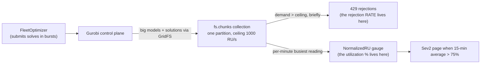
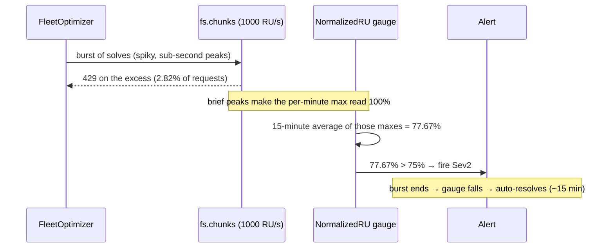

# How the Gurobi Cosmos RU alert works — and how you'd diagnose it alone next time

Let me build this up from the bottom, the way I wish someone had explained it to me
the first time a Cosmos throttling page woke me up. By the end you should be able to
look at a fresh version of this alert and reason your way to the verdict without
anyone's help — because you'll understand the machine, not just the runbook.

## Knowledge contract

After reading this, you will be able to, without help:

1. **explain** what a request unit is and what `NormalizedRUConsumption` actually
   measures (and why a reading of 77% is neither reassuring nor alarming on its own);
2. **compute** the one number that decides ack-versus-escalate, and say what its
   denominator is;
3. **run** the short probe sequence that turns the alert into a verdict;
4. **reject** the two wrong conclusions that look rigorous but aren't;
5. **predict** how this same system would behave under a bigger or steadier load.

If you can't do these by the end, the document failed — tell me which step lost you.

## First principles: three numbers, only one of which is the truth

The whole incident is a story about three numbers that are easy to confuse. Get
them straight and everything else follows.

A **request unit per second (RU/s)** is Cosmos's unit of throughput. You buy a
budget; every read and write costs some RU; and when demand briefly exceeds the
budget, Cosmos does not slow down politely — it **rejects** the surplus with an HTTP
`429` and tells the client to back off and retry. So a rejection is not "something
broke." It is back-pressure working exactly as designed. Microsoft's documentation
states that a rejection rate of 1–5%, with acceptable latency, is *healthy* and
needs no action.

The metric that paged, **`NormalizedRUConsumption`**, is the one people misread. It
is not "average fullness." It is the *maximum*, across the database's partitions, of
(RU used ÷ RU provisioned), sampled once a minute, from 0 to 100%. That definition
has two consequences that ambush your intuition: a per-minute reading of 100% can be
a single-second spike rather than a full minute at the ceiling, and one hot
partition can sit at 100% while the whole account looks calm. So this metric is a
**utilization gauge** — it tells you something was *busy*. It does not tell you
anybody was *hurt*.

The number that measures hurt is the **rejection rate**: rejections divided by total
requests over the same window. There is one last trap on the way to it. The MongoDB
driver retries a rejected operation up to about nine times, and each retry emits
another protocol-level error. So if you count those protocol errors and divide by
distinct operations you get a number several times too big. The honest figure
divides HTTP `429` responses by total requests.

This ASCII ladder is the model I want you to be able to redraw from memory — it is
the spine of the whole diagnosis.

```text
  utilization gauge      retry-inflated count        rejection RATE
  (NormalizedRU %)        (16500 events)          (429 / total requests)
        │                       │                          │
   "busy" — not impact    over-states by ~9x          the real impact
        │                       │                          │
   tempting wrong read #1   tempting wrong read #2     the truth (2.82%)
```

Read it left to right as three candidate "how bad is it?" answers. The left two are
the traps; only the right one is defined the way Microsoft's threshold is. The
takeaway to carry: **busy is not hurt, and a count is not a rate.** Everything below
is just watching those three numbers play out on a real system. This ladder connects
directly to the next picture, which shows where in the real architecture each number
comes from.

## The system, built up one piece at a time

Now the machine. The platform here is Eneco's **VPP** — a Virtual Power Plant, which
is software that aggregates lots of flexible energy assets (batteries, etc.) and bids
their combined capacity into the grid operator TenneT's balancing markets. To decide
how to dispatch all those assets, a service called FleetOptimizer turns the decision
into a math problem, and Gurobi — a solver — solves it. Gurobi's control plane needs somewhere to put the big
input models and their solutions, so it uses this Cosmos database through a mechanism
called **GridFS**, which exists for exactly one reason: databases dislike very large
objects, so GridFS chops a big object into fixed-size **chunks** and stores them in a
collection named `fs.chunks`. That collection is where the heat goes.

Here is the whole path on one diagram. I want you to see where each of the three
numbers above is actually generated.



Trace it from the left. FleetOptimizer submits solves; Gurobi writes their large
payloads through GridFS into the single `fs.chunks` collection; and that collection,
because it is unsharded and capped at 1000 RU/s, is the one place that can run out of
budget. When it does, two different sensors light up from the *same* event: the
rejection rate (bottom branch) and the utilization gauge (right branch). The page
comes off the gauge, not off the rate. The mental model to keep: **the gauge and the
rate are two readings of one moment, and the alert is wired to the less meaningful
one.** That is the seed of the whole problem, and the next diagram shows it unfolding
in time.

## The mechanism: how a normal burst becomes a page

The topology shows *where*; this next view shows *when*, which is a different angle —
not the same picture redrawn. Watch one burst move through the system.



Read the exchange top to bottom. The burst is spiky, so for a few sub-second moments
demand beats the ceiling and Cosmos returns `429` on the surplus — 2.82% of requests,
inside the healthy band. Those brief peaks are enough to make the per-minute gauge
read 100% a handful of times, and the alert averages those maxes over fifteen minutes
to get 77.67%, which crosses 75% and pages. Then the burst ends and the alert clears
itself. Notice what this animates: it is the bottom-and-right branches of the previous
diagram firing in sequence. The thing to hold onto is that **the average of per-minute
maxes hides the shape of the load** — nine brief spikes and a nine-minute wall produce
similar averages but mean very different things. That is precisely why you cannot stop
at the gauge, which sets up the trap below.

## The trap (challenge defense): two wrong reads that both feel rigorous

This is the challenge-defense section — the part worth internalizing, because both
wrong answers feel like good engineering at the time, and you need to be able to
defend the right one under questioning.

The first wrong read is the lazy one: "77%, barely over the line, it's an average,
probably noise." Tempting, and not yet evidence. The second wrong read is the one that
feels rigorous and is actually worse: you pull the throttle counters, see thousands of
protocol-level errors, divide by distinct operations, and conclude "a third of
operations failed!" You grabbed a real number and divided by the wrong denominator —
those thousands are retries of a few hundred rejections, inflated up to ninefold. The
discipline that ends both arguments: **don't trust the gauge for impact, and don't
trust the raw rejection count either — compute the rate with the right denominator.**
The rate is observable, it discriminates between healthy and unhealthy, and it is the
exact figure Microsoft's threshold is defined on. Here it was 2.82% — real, minor,
self-healing.

## Diagnosing it yourself: the decision tree

Here is the reasoning compressed into a tree you can run on the next version of this
alert. It is a decision surface, not a repeat of the topology.

```text
Cosmos NormalizedRU alert fires
   │
   ├─ self-resolved (autoMitigate)? ── single short fire → low urgency
   │
   ├─ compute the 429 RATE = (429 responses) / (total requests) for the window
   │      │
   │      ├─ rate ≤ ~5% AND self-resolved → within the healthy band → ack, link the RCA
   │      └─ rate > 5%, or sustained, or solves failing → escalate
   │      (do NOT use the protocol-error count or the gauge % as the impact figure)
   │
   ├─ split the gauge by collection → expect fs.chunks; if not, the design changed
   │
   └─ check Gurobi job history for the window → did solves complete? (the metric can't say)
```

Walk it top to bottom. The first branch is urgency — "autoMitigate" is just the
alert rule's setting that makes the page clear itself once the condition goes away,
so a single self-resolved fire is rarely an emergency. The second branch is the
decisive impact test, the third localizes the heat, and the fourth closes the one
question the metrics cannot answer. The reason this tree works on a *different* incident is that
none of its branches depend on today's specific numbers — they depend on the
distinction between the gauge and the rate, which is universal. The misunderstanding
this tree prevents is treating the page itself as the incident; the page is a
question, and the rate is the answer.

## The reusable mental model

Strip away the Gurobi nouns and here is what remains, ready to carry to the next
incident on any RU-billed store:

> A saturation gauge reports that *a partition was busy*. It does not report that
> *a client was hurt*. Before you treat a self-resolved saturation page as an
> incident, compute the rejection **rate** with requests as the denominator. If it
> sits in the provider's healthy band, the bug is the alert, not the database.

If you can say that back in your own words, you can diagnose this whole class.

## Self-test (explain it back)

The point of these is reconstruction, not recall. If you can answer them unaided, you
can rebuild the reasoning.

1. The account shows 60% utilization and a partition is still returning rejections.
   Explain how both can be true at once.
2. Two engineers compute "throttle %": one gets 34.5%, one gets 2.82%, both from real
   numbers. Who is right, and what did the other one divide by?
3. The per-minute max reads 100% for nine minutes. How do you tell nine brief spikes
   from a nine-minute wall — and which number settles it?
4. Name the single number that decides ack-versus-escalate, and its denominator.
5. Why is re-calibrating the alert the *first* fix here, ahead of buying more RU/s?

## Evidence ledger

The status codes live here, not in the prose above.

| Claim | Status | Source |
|---|---|---|
| RU model, NormalizedRU definition, 1–5% healthy band | A1 FACT | Microsoft Learn (`context/03-external-docs.md`) |
| `fs.chunks` is the hot collection, ceiling 1000 RU/s, single partition | A1 FACT | live `az` collection probes (`context/04-live-azure-evidence.md`) |
| 586 rejections = 2.82% of 20,792 requests | A1 FACT | live metrics this session |
| Gurobi stores models/solutions via GridFS | A1 FACT | Gurobi Remote Services docs |
| Solves completed (vs failed) during the burst | A3 UNVERIFIED | job history not read; resolving probe named in `rca_v2.md` L8 |

For the full incident write-up, the fix order, and the command playbook, see
[`rca_v2.md`](./rca_v2.md).
