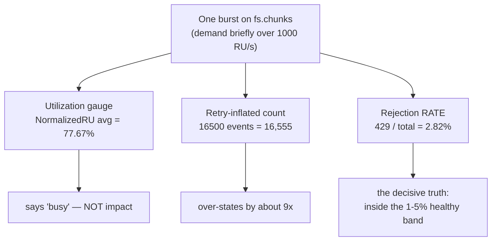
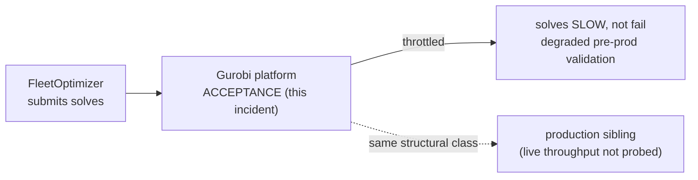
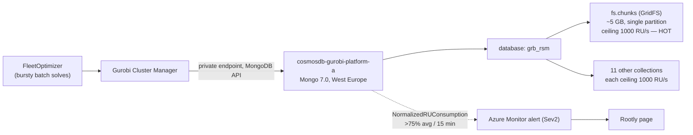
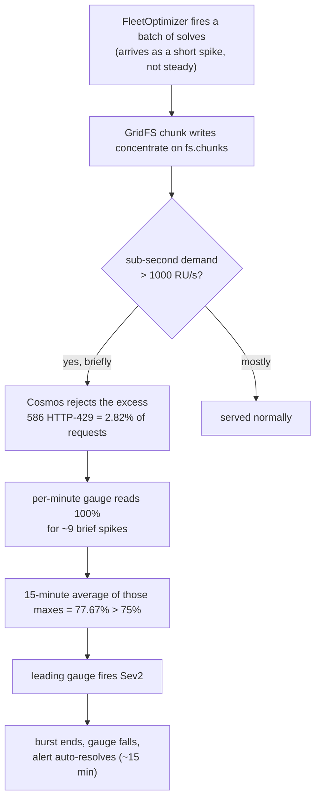
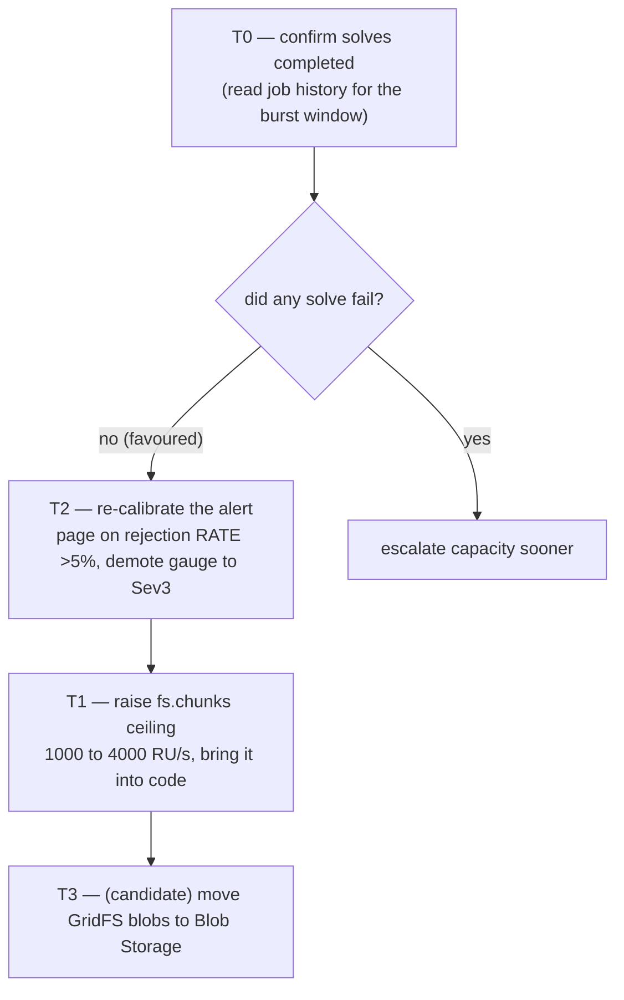

# RCA — Gurobi Cosmos RU micro-burst (acceptance)

> **Reader**: a next-shift on-call engineer who has never seen the Gurobi platform.
> By the end you should be able to explain what throttled and why, tell a real
> outage apart from this micro-burst, and know why the fix is "re-calibrate the
> alert," not "buy more database."
>
> **How evidence is marked.** This document is written in plain words. Every claim
> says whether it was directly observed, inferred, or still unverified. The audit
> codes that back each claim live in the Context Ledger and the evidence tables —
> never in the narrative — so you can read for understanding and audit separately.

## Executive summary

The affected resource is an Azure Cosmos DB account using the MongoDB API. It runs
in West Europe, is reachable only over a private network, and it stores the Gurobi
optimization platform's models, solutions, and job history. That matters because
this alert was not about a generic database: it was about the storage path that a
bursty optimization workload hammers.

What happened is this. The FleetOptimizer service submits optimization work to
Gurobi, and Gurobi stores large model and solution files in this database through
GridFS, which chops big objects into chunks and writes them into one collection
called `fs.chunks`. That one collection has a throughput ceiling of 1000 request
units per second. When several solves arrive close together, the writes do not
arrive smoothly — they arrive as a short spike. For a few sub-minute moments the
spike exceeded the ceiling, so Cosmos did exactly what it is designed to do: it
rejected the excess requests and told the client to retry.

The visible symptom was a severity-2 (Sev2) page: a utilization gauge averaged over
fifteen minutes crossed 75%. But the gauge is not the same as impact. When we computed the
metric that actually measures client pain — the fraction of requests that were
rejected — it was 2.82%, which sits inside Microsoft's own "healthy, no action"
band of 1–5%. The throttling was real, brief, and self-healing; the database was
never down. The alert auto-resolved on its own about fifteen minutes later.

So the root cause is not a capacity emergency. The root cause is that the team's
alert watches a *leading utilization gauge* with no companion signal for real
client impact, and pages at Sev2 when that gauge twitches on a healthy-band
micro-burst. The right fix, in order, is therefore: first re-calibrate the alert
(page on the rejection *rate*, demote the gauge to a warning); then, secondarily,
raise the ceiling on the hot collection to reduce the spikes; and only as a
longer-term candidate, move the large objects off Cosmos entirely.

One thing is not yet verified: whether any individual solve actually *failed*
during the burst, as opposed to retrying and completing a little slower. The
driver retries this kind of rejection automatically and the burst was brief, so
"slower but completed" is strongly favoured — but the job history was not read
this session, so that single question stays open. The next probe is named in the
fix section.

If a future engineer remembers one thing, let it be this: a saturation gauge tells
you a partition was *busy*, not that anyone was *hurt*. Confirm with the rejection
rate before you treat a self-resolved Cosmos page as an incident.

## Table of Contents

- [Executive summary](#executive-summary)
- [Context ledger](#context-ledger)
- [How to read this RCA](#how-to-read-this-rca)
- [RCA Knowledge Contract](#rca-knowledge-contract)
- [Backward derivation from the contract](#backward-derivation-from-the-contract)
- [Knowledge domain map](#knowledge-domain-map)
- [Mental model map](#mental-model-map)
- [First principles: what the numbers actually mean](#first-principles-what-the-numbers-actually-mean)
- [L1 — Business: why the Gurobi platform exists](#l1--business-why-the-gurobi-platform-exists)
- [L2 — Repo system](#l2--repo-system)
- [L3 — Runtime architecture: the burst path](#l3--runtime-architecture-the-burst-path)
- [L4 — The failure mechanism](#l4--the-failure-mechanism)
- [L7 — Timeline](#l7--timeline)
- [L8 — Fix](#l8--fix)
- [L9 — Verification](#l9--verification)
- [L10 — Lessons](#l10--lessons)
- [L11 — End-to-end command playbook](#l11--end-to-end-command-playbook)
- [L12 — One-page on-call playbook](#l12--one-page-on-call-playbook)
- [Evidence index](#evidence-index)

## Context ledger

### Evidence labels

These codes appear only in the Confidence columns and the Evidence index, never in
the narrative. The prose says the same thing in words.

- **A1 FACT** — directly observed this session (live `az` output, a file and line,
  or a primary-source document).
- **A2 INFER** — reasoned from A1 facts by a named chain.
- **A3 UNVERIFIED** — could not be probed this session; the resolving probe is named.

| Term | Plain-language meaning | Source | Confidence |
|---|---|---|---|
| VPP | Virtual Power Plant — Eneco's platform that aggregates flexible energy assets to bid into TenneT balancing markets. | ddd-ubiquitous-language | A2 |
| FleetOptimizer | The VPP component that decides optimal asset dispatch; it submits the solver jobs. | ADR C015 | A2 |
| Gurobi | A commercial mathematical-programming solver; its platform stores models/solutions/job-history in this database. | [Gurobi Remote Services docs](context/03-external-docs.md) | A1 |
| Cosmos DB for MongoDB | Azure Cosmos DB speaking the MongoDB API, billed in request units. | `az cosmosdb show` → kind MongoDB, v7.0 | A1 |
| RU/s | Request Unit per second — Cosmos's throughput currency; every operation costs RU. | [MS Learn](context/03-external-docs.md) | A1 |
| NormalizedRUConsumption | The metric that fired: the busiest partition's RU usage as a percent of its ceiling, per minute. | [MS Learn](context/03-external-docs.md) | A1 |
| GridFS / `fs.chunks` | MongoDB's large-object store; `fs.chunks` holds the binary chunks. The hot collection here. | live `collection show` | A1 |
| 429 / Mongo 16500 | A throttling rejection: HTTP `429` at the request layer, Mongo error `16500` at the protocol layer. | live metrics | A1 |
| autoMitigate | The alert rule auto-resolves when the condition clears. | live `alert show` | A1 |
| Solve success during the burst | Whether any solve actually failed (vs retried and completed) — not read this session. | — | A3 |

A reader should be able to follow the rest of this document from this table alone,
without knowing the domain or the platform's internal names.

## How to read this RCA

This document climbs from "what is this system and how does it work" to "how do I
prove the fix." It is not an incident log; the timeline is evidence for causality,
not the spine. Read the prose first; the tables and diagrams are supporting maps.

| Level | The question it answers |
|---|---|
| First principles | What do RU, the gauge, and the rejection rate actually measure? |
| L1 Business | Why does this system exist and who is affected? |
| L2 Repo system | Which repository owns the alert and the fix? |
| L3 Runtime | What path does the failing workload take, and where is the ceiling? |
| L4 Mechanism | How does a normal burst cross the threshold and become a page? |
| L7 Timeline | What happened, in what order? |
| L8 Fix | What changes, in what order, and why? |
| L9 Verification | How do we know the fix works? |
| L10 Lessons | What durable knowledge do we keep? |
| L11 Playbook | How does a fresh on-call reproduce this from cold? |
| L12 One-pager | How do I triage this class in five minutes? |

## RCA Knowledge Contract

After reading this package, a zero-context on-call engineer can:

1. **Draw** the burst path from FleetOptimizer through Gurobi and GridFS to the hot
   `fs.chunks` collection and its ceiling.
2. **Trace** the causal chain from a spiky workload to a few rejected requests to a
   tripped utilization gauge.
3. **Recreate** the investigation from cold using the command playbook.
4. **Reject** the two tempting wrong reads — "the database is failing" and "a third
   of operations failed" — and say why each is wrong.
5. **Repair** the alert safely and prove the new rule behaves, using the fix and
   verification sections.
6. **Evaluate** whether to raise capacity or move the data, including when not to.

Rejection condition: this package does not certify whether individual solves
failed during the burst; that claim stays unverified with a named resolving probe.

## Backward derivation from the contract

Each contract line is backed by a knowledge domain, a primitive, a visual with a
job, a probe, a challenge the reader can answer, and a section.

| Contract item | Knowledge domain | Primitive / invariant | Visual (cognitive job) | Probe / evidence | Challenge answered | Section |
|---|---|---|---|---|---|---|
| Draw the burst path | runtime topology | one hot partition has a fixed ceiling | topology diagram (where the ceiling sits) | live collection throughput | which collection saturates first? | L3 |
| Trace the mechanism | metrics + workload shape | a per-minute max averaged over 15 min hides spikes | failure-mechanism diagram | live per-minute series | why a 77% average is brief spikes | L4 |
| Recreate from cold | probe authority | the rejection rate, not the gauge, measures impact | — | command playbook | which command gives the decisive number | L11 |
| Reject false reads | retries vs distinct ops | a retry inflates the protocol-layer count | feedback-loop diagram | live 429 + 16500 counts | why 34.5% is the wrong denominator | L4, L10 |
| Repair safely | alert design | a page should track client impact | fix-strategy diagram | backtest over 7-day history | why calibrate before buying capacity | L8, L9 |
| Evaluate capacity | partition limits | a single partition serves up to 10k RU/s | — | size + ceiling probe | when raising the ceiling is enough | L8 |

## Knowledge domain map

| Domain | What the reader learns | Why it is needed here | Main evidence |
|---|---|---|---|
| Business / functional role | why optimization runs at all | explains why the storage path matters | ADR C015 |
| Cosmos throughput model | what RU/s and autoscale mean | the ceiling is the whole story | MS Learn |
| The metric vs the impact | gauge vs rejection rate | the alert misreads one for the other | MS Learn + live metrics |
| GridFS storage shape | why one collection is hot | localizes the saturator | live collection split |
| Workload shape | bursts vs steady load | explains the brief spikes | live per-minute series |
| Alert design | leading gauge vs client-impact signal | the actual root cause | IaC + alert history |
| Fix and verification | calibration over capacity | proves the right repair | backtest plan |

## Mental model map

| Level | Reader takeaway | General pattern |
|---|---|---|
| First principles | a utilization gauge says "busy," not "broken" | saturation ≠ impact |
| L3 | one unsharded collection hits the ceiling first | the hot partition is the bottleneck |
| L4 | average-of-maxes hides a brief spike | the shape of the load matters, not just the average |
| L8 | re-calibrate before you buy capacity | when impact is healthy, the alert is the bug |

## First principles: what the numbers actually mean

Before interpreting the alert, it helps to know exactly what each number measures,
because two of them are routinely misread.

Cosmos bills work in **request units per second (RU/s)**. You provision a budget;
every read and write costs some RU; and when demand exceeds the budget in a given
moment, Cosmos does not slow down gracefully — it **rejects** the excess with an
HTTP `429`, and the client library retries after a short back-off. So a `429` is
not an error in the "something is broken" sense; it is back-pressure working as
designed.

The metric that fired, **NormalizedRUConsumption**, is the subtle one. It is not
"how full the database is on average." It is the *maximum*, across the database's
partitions, of (RU consumed ÷ RU provisioned), sampled per minute, from 0 to 100%.
Two consequences break naive intuition. First, a per-minute reading of 100% can be
a single-second spike, not a full minute pinned at the ceiling. Second, one hot
partition can read 100% while the account as a whole looks calm. So the metric is a
**utilization gauge** — it tells you a partition was busy. It does **not** tell you
whether any client was hurt.

The number that tells you about client impact is the **rejection rate**: the count
of `429` responses divided by total requests, over the same window. That is the
figure Microsoft's own action framework is defined on, and Microsoft says a
rejection rate of 1–5% with acceptable latency is **healthy — no action required**.

There is one more trap. The MongoDB driver retries a rejected operation up to about
nine times, and each retry emits another protocol-layer `16500`. So if you count
`16500` events and divide by distinct operations you get a wildly inflated number.
The honest figure is the HTTP `429` rate, because that counts request-layer
rejections against total requests. Keep these three apart — utilization, distinct
rejections, retry-inflated counts — and the incident decodes itself.

The trap is easier to hold as one picture: a single burst is seen by three
instruments, and only one of them measures harm.



Read it as one event watched by three instruments. The same brief burst makes the
utilization gauge read high, makes the protocol-level retry count look enormous, and
produces a small rejection rate. Only the rate — rejections divided by total
requests — measures whether a client was actually turned away, which is why the
whole triage hangs on it. The takeaway to carry: a busy partition and a
retry-inflated count are not impact; the rate is. This is the lens for every section
below.

## L1 — Business: why the Gurobi platform exists

The VPP earns money by bidding aggregated flexibility into TenneT's balancing
markets. FleetOptimizer turns that dispatch problem into a mathematical model, and
Gurobi solves it. The Gurobi platform's control plane stores the input models,
their solutions, and roughly thirty days of job history in this Cosmos database, as
the provider's architecture documentation describes.

When this database throttles, FleetOptimizer's model and solution traffic is
rate-limited and *slows*; it does not necessarily fail. This incident is in the
acceptance environment, which degrades pre-production validation rather than live
trading. A production sibling exists in the same structural class, so an unaddressed
weakness here is a possible early warning for production — with one caveat: this
session did not probe production's live throughput, which may already be provisioned
higher.

Before the forensics, it is worth fixing the stakes in one picture — what actually
degrades, and where the watch-item is.



The throttle slows pre-production validation; it does not stop live trading, because
this is acceptance and the driver retries. The dotted edge is why this is worth
fixing at all: a production sibling sits in the same structural class, so a weakness
here is an early warning — with the honest caveat that production's own throughput
was never probed and may already be higher. Hold this and you will neither
over-react (it is not a production outage) nor under-react (it is a calibrated early
warning), which is exactly the judgement the fix section makes.

## L2 — Repo system

### The story in plain English

Three repositories sit behind this platform, but only one owns the alert and the
fix. The infrastructure repository defines the Cosmos account, its private network,
and the metric alert rules. A separate GitOps repository configures the Gurobi
compute side, and a third holds the deployment pipelines. The alert that paged —
and the change that fixes it — both live in the infrastructure repository.

| Repository | Role | Relevance to this incident |
|---|---|---|
| `gurobi-infrastructure` | Cosmos account, private endpoint, metric alerts, token-server VMs | Owns the alert. The fix lands here. |
| `gurobi-gitops` | ArgoCD / cluster config for Gurobi compute | Compute side, not the database. |
| `gurobi-azuredevops` | Pipelines | Deploys the infrastructure. |

### How the paths interact under the hood

The collections and their throughput ceilings are **not** created by the
infrastructure repository at all — the Gurobi control-plane application provisions
them at runtime. That is the quiet structural fact behind this incident: the 1000
RU/s ceiling on the hot collection has no review surface in code, so it drifts
without anyone seeing a diff.

### Why this matters for the fix

Because the alert is team-authored infrastructure, the calibration fix is a normal
code change in the infrastructure repository. But because the throughput ceiling is
created out of band, raising capacity is a runtime change, not a pull request —
which is exactly why "bring the ceiling into code" is one of the lessons.

> **A note on a methodology trap.** The local clone of the infrastructure repository
> was several months stale, and a first pass concluded "the alert is not in code."
> After pulling the latest, that reversed: the alert is team-authored. The lesson —
> pull before you trust a negative — is recorded in L10.

## L3 — Runtime architecture: the burst path

The most useful way to see this system is not as a whole Cosmos account but as a
single hot path. Here is the path the failing workload actually takes, so you can
see exactly where the pressure lands.



Read the path from the left. FleetOptimizer submits solves to the Gurobi Cluster
Manager, which talks to Cosmos over a private endpoint. Large models and solutions
go through GridFS, which breaks them into chunks and writes them into one
collection, `fs.chunks`. That collection is the bottleneck: it is unsharded, sits
on a single physical partition at about five gigabytes, and has a ceiling of 1000
RU/s. The other eleven collections each have the same ceiling but stay cool. When a
burst of solves lands, the write pressure concentrates on `fs.chunks`, and that is
where the ceiling gets touched. The dotted line is the alert: Azure Monitor watches
the account-level utilization gauge and pages Rootly when its fifteen-minute average
exceeds 75%.

The one mental model to keep: **the incident is not about the whole account, it is
about one hot collection's ceiling.** That is the link to the failure mechanism
below — the bottleneck the diagram shows is the threshold the mechanism crosses.
This picture prevents the most common wrong turn, which is to reason about the whole
database's average load instead of the one collection that actually saturates.

## L4 — The failure mechanism

Now watch how a perfectly normal burst becomes a page. The diagram below is a
different angle from the topology: it follows one burst forward in time, from the
workload to the page.



Follow the path from the top. The solves do not arrive smoothly; they arrive as a
short spike. For a few sub-second moments that spike pushed demand on `fs.chunks`
past its 1000 RU/s ceiling, and Cosmos rejected the excess — 586 rejections, which
is 2.82% of all requests in the window. Those brief over-the-ceiling moments made
the per-minute gauge read 100% about nine times. The alert averages those maxes
over fifteen minutes, and the average came to 77.67%, which crossed the 75%
threshold and paged. Then the burst ended, the gauge fell, and the alert resolved
itself.

Two readings of this same data are tempting and both are wrong. The first is "the
database is failing" — but the rejection rate was 2.82%, inside the healthy band,
and the page auto-resolved. The second is "a third of operations failed," which
comes from dividing the 16,555 protocol-layer `16500` events by distinct
operations. That number is retry-inflated: a single rejected write retries up to
nine times, each emitting another `16500`. The honest figure is the 2.82% HTTP-429
rate. The mental model to carry: **average-of-maxes hides the shape of the load, and
a retry-inflated count hides the real rate.** This connects straight to the fix —
the alert pages on the misleading gauge and has no signal for the honest rate.

## L7 — Timeline

The timeline is evidence for the causal story above, not the story itself. Read it
to confirm the ordering: chronic spikes, a sensor change, then this burst.

| Time (UTC) | Event | Confidence |
|---|---|---|
| Ongoing (≥7 days) | `fs.chunks` per-minute max touches 100% several times daily — chronic, low-grade. | A1 |
| ~Apr–Jun | The team removes the old throttling-count alert and adds the leading utilization gauge at Sev2. | A1 |
| 15:27–15:40 | A spiky burst: per-minute max hits 100% across ~9 minutes, but RU actually served averaged only ~55 RU/s — brief spikes, not a sustained wall. | A1 |
| 15:28–15:38 | 586 HTTP-429 rejections out of 20,792 requests = 2.82% (within the 1–5% healthy band). | A1 |
| 15:44:03 | The alert fires: fifteen-minute average = 77.67% > 75%. | A1 |
| ~15:59 | The alert auto-resolves; no rejection-rate or latency alert fired (none exists). | A1 |

The change worth noticing is not in the database — it is in the *sensor*. The team
deliberately swapped a chronically-noisy rejection-count alarm for a leading
utilization gauge. That is a reasonable move; the gap is that they kept no tuned
client-impact signal at all, and left the gauge at Sev2.

## L8 — Fix

The diagnosis is a verified root cause for the saturation mechanism: a bursty
workload briefly exceeds a single collection's 1000 RU/s ceiling. The fix is
ordered by the principle that **a page should track real client impact**, so
calibration comes before capacity.

The diagram below is the fix strategy as a sequence — what to do first, second, and
why each step is gated by evidence.



Read the sequence top to bottom. The one open question gates everything: T0 is to
read the Gurobi job history for the burst window and confirm the solves actually
completed (the metric cannot tell us). If they did, the impact really was in the
healthy band and the rest proceeds calmly; if a solve failed, capacity moves up the
list. The primary fix, T2, is to re-calibrate the alert — add a page on the
*rejection rate* (which would not have fired on today's 2.82%) and demote the
utilization gauge to a warning. T1 is secondary: raise the hot collection's ceiling
from 1000 to 4000 RU/s — the single partition can serve up to 10k, so no sharding is
needed — and bring that ceiling into code so it has a review surface. T3 is a
longer-term candidate: move the large GridFS objects to Blob Storage so large-object
volume stops competing for the database's RU budget. The takeaway: **when impact is
in the healthy band, alert calibration outranks capacity spend.**

One honest caveat about whether this recurs. This was not a configuration change —
the activity log shows nothing touched since the previous day, so the system did not
regress. But a *workload-growth* regression is not ruled out: the fifteen-minute
average was 77.67% this June against roughly 39% back in March, which is consistent
with the bursts simply getting hotter as more solves run. That is why raising the
ceiling (T1) is on the list at all, and why the verification step backtests over
seven days rather than trusting one window. If the burst is recurrent and growing,
the named escalation owner for this class is the platform team's Nuno (fallback
`#team-platform`).

One methodology note worth carrying. When we compared the deployed alert against the
code, the two matched *semantically* — every threshold, aggregation, and window value
was identical — but not byte-for-byte, because Azure serializes the rule with
different key names than the Terraform source. "Semantically identical" is the honest
claim; do not read it as "byte-identical," or the next person will chase a phantom
drift.

### What this fix does NOT change

- It does not touch the Gurobi compute side or the solve logic.
- It does not, on its own, resolve whether a solve failed during the burst — that is
  the T0 probe, and it stays open until the job history is read.
- It does not change production, whose live throughput was not probed this session.

## L9 — Verification

Each fix has an externally-witnessable acceptance test.

| Fix | How we will know it worked | Probe |
|---|---|---|
| T0 | The job history shows the burst-window solves completed (or names the failures) with no resubmission storm. | Gurobi job history / acceptance app logs, 15:27–15:40. |
| T2 | Backtested over the 7-day history, the new rejection-rate page does **not** fire on a 2.82% burst but **does** fire above 5%; the gauge fires only as a warning. | rejection count ÷ total over historical bursts. |
| T1 | After raising the ceiling, a comparable burst keeps the gauge below 100% and the rejection count at zero. | per-minute gauge + RU-served on `fs.chunks`. |

## L10 — Lessons

1. **A utilization gauge is not an impact metric.** Confirm a saturation page with
   the rejection rate before treating it as an incident. Here a 77.67% gauge looked
   alarming, but the real impact was 2.82% — inside the healthy band.
2. **Average hides shape.** A fifteen-minute average of per-minute maxes can be a
   few brief spikes; pull the per-minute series and the RU-served series before
   calling anything "sustained."
3. **A count is not a rate.** The old rejection-count alarm would have fired hard
   (586 rejections), while the rate says healthy (2.82%). On a bursty workload,
   prefer the rate.
4. **"Not broken before" can mean the sensor changed.** Nothing in the database
   changed; the alert changed. Check the alert's own history before assuming the
   system regressed.
5. **Throughput outside code has no review surface.** The hot collection's ceiling
   is created at runtime; bring it into the infrastructure repository.

## L11 — End-to-end command playbook

A fresh on-call can reproduce this diagnosis from cold by walking these steps. Each
step names the question it answers; the decisive one is Step 2.

### Step 0 — set context

**Question**: are we pointed at the right subscription and resource?

**Why this command**: every later probe reads from this account; the wrong
subscription silently returns nothing.

```bash
enecotfvppmcloginacc
SUB=b524d084-edf5-449d-8e92-999ebbaf485e; RG=rg-gurobi-platform-a; ACC=cosmosdb-gurobi-platform-a
RID="/subscriptions/$SUB/resourceGroups/$RG/providers/Microsoft.DocumentDB/databaseAccounts/$ACC"
```

### Step 1 — see what the gauge actually did

**Question**: was the gauge a flat wall or a spiky average?

**Decision rule**: per-minute max at 100% with a low average means brief spikes.

```bash
az monitor metrics list --resource "$RID" --metric NormalizedRUConsumption \
  --aggregation Maximum Average --interval PT1M \
  --start-time 2026-06-15T15:10:00Z --end-time 2026-06-15T16:10:00Z -o table
```

### Step 2 — compute the decisive number: the rejection rate

**Question**: what fraction of requests were actually rejected?

**Why this command**: this rate, not the gauge and not the retry-inflated count, is
the figure Microsoft's healthy-band threshold is defined on.

**Decision rule**: rate ≤5% and self-resolved → acknowledge; above 5% or sustained
→ escalate.

```bash
az monitor metrics list --resource "$RID" --metric TotalRequests --aggregation Total \
  --start-time 2026-06-15T15:26:00Z --end-time 2026-06-15T15:41:00Z --interval PT15M \
  --query "value[0].timeseries[0].data[0].total"            # denominator
az monitor metrics list --resource "$RID" --metric TotalRequests --aggregation Total \
  --filter "StatusCode eq '429'" \
  --start-time 2026-06-15T15:26:00Z --end-time 2026-06-15T15:41:00Z --interval PT15M \
  --query "value[0].timeseries[0].data[0].total"            # rejections; rate = this / denominator
```

### Step 3 — find the hot collection and its ceiling

**Question**: which collection saturated, and is it under-provisioned?

```bash
az monitor metrics list --resource "$RID" --metric NormalizedRUConsumption \
  --aggregation Maximum --filter "CollectionName eq '*'" --interval PT1M \
  --start-time 2026-06-15T15:26:00Z --end-time 2026-06-15T15:41:00Z \
  --query "reverse(sort_by(value[0].timeseries[].{c:metadatavalues[0].value,p:max(data[].maximum)}, &p))" -o table
az cosmosdb mongodb collection throughput show --account-name "$ACC" -g "$RG" \
  --database-name grb_rsm --name fs.chunks --subscription "$SUB" \
  --query "resource.{ru:throughput,autoscaleMax:autoscaleSettings.maxThroughput}"
```

## L12 — One-page on-call playbook

**Alert: Gurobi Cosmos normalized RU consumption (acceptance or production).**

1. **Self-resolved?** If `autoMitigate` cleared it in ~15 minutes, a single fire is
   low urgency.
2. **The decision: real client impact?** Compute the HTTP-429 *rate* (Step 2 above).
   - Rate ≤5% and self-resolved → acknowledge and link this RCA. (2026-06-15 was
     2.82% — this case.)
   - Rate above 5%, or sustained across windows, or solves failing → escalate to the
     platform team.
   - Do not use the Mongo `16500` count or the gauge percentage as the impact figure
     — both overstate it.
3. **Which collection?** Expect `fs.chunks`. If it is a different one, the partition
   design changed — investigate.
4. **Did solves fail?** The metric cannot tell you; read the Gurobi job history for
   the window.

## Evidence index

The codes in the tables above map to specific, replayable probes. The audit trail
is here in full — moving it out of the narrative does not delete it. Every live
reading was captured this session via `az` against the acceptance control plane and
recorded verbatim in [`context/04-live-azure-evidence.md`](context/04-live-azure-evidence.md)
as captures E1–E14.

| Code | Claim it settles | Probe / source |
|---|---|---|
| E1 | per-minute gauge series (max + average) | `az monitor metrics list … NormalizedRUConsumption` (E1) |
| E2 / E13 | 586 HTTP-429 = 2.82% of 20,792 requests | `az monitor metrics list … TotalRequests` total + StatusCode=429 (E2/E13) |
| E3 | `fs.chunks` is GridFS, unsharded, 1000 RU/s ceiling | `az cosmosdb mongodb collection … throughput show` (E3) |
| E8 | account kind MongoDB v7.0, West Europe, private-only | `az cosmosdb show` (E8) |
| E11 | `fs.chunks` peaked 100% vs next collection 16% | per-collection split (E11) |
| E12 | RU served ≈ 55 RU/s avg during the burst | `az monitor metrics list … TotalRequestUnits` (E12) |
| E14 | `fs.chunks` ≈ 5.1 GB → single partition at current size | size probe (E14) |
| IaC | alert is team-authored at `src/locals.tf:21-41`, rendered by `src/alerts.tf:19-54` | `gurobi-infrastructure@c17995a` |
| Change | the 429 alarm was removed and the gauge added | commits `f956e9b`, `d7fc972` / PR 176135 |

Infrastructure facts come from the `gurobi-infrastructure` repository at head
`c17995a`. External facts come from Microsoft Learn and the Gurobi documentation
([`context/03-external-docs.md`](context/03-external-docs.md)). Precedent comes from
[`context/02-precedent-and-canon.md`](context/02-precedent-and-canon.md). The one
open item is whether individual solves failed during the burst; the resolving probe
is the Gurobi job history for 15:27–15:40. This RCA was reviewed by an external
adversarial pass; the receipts are in [`adversarial/`](adversarial/).

## Mutation log

- 2026-06-15 — human-readable rewrite (v2): evidence codes moved out of the
  narrative into the Context Ledger and Evidence index; a human Executive summary
  was added; the runtime and failure diagrams were given mechanism prose; the
  reviewer-name references were moved into the Evidence index.
