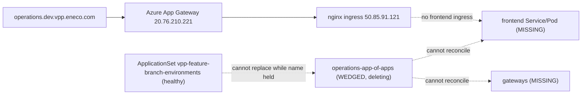
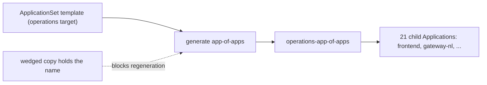
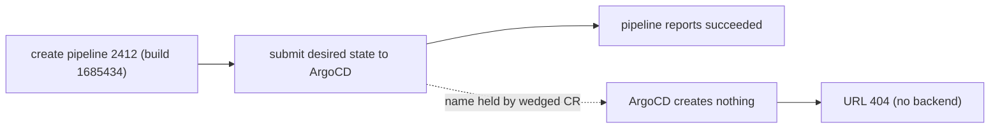

> **Status rule**: `status: complete` requires `output_package: standard`,
> `adversarial_review: external`, and a Mutation log entry citing the external
> review artifact. This RCA is delivered `status: review` /
> `adversarial_review: pending` — the coordinator runs the mandatory adversarial
> gate after this draft.

# RCA — FBE operations slot 404 (ArgoCD finalizer-wedged app-of-apps)

> **Reader**: the next-shift on-call engineer who has never seen the Feature
> Branch Environment (FBE) platform and does not know ArgoCD internals.
>
> **Mastery transferred**: after this RCA you can (1) **replicate** the diagnosis
> — prove an FBE slot is wedged mid-deletion rather than mis-built; (2)
> **explain** why a green pipeline and a 404 coexist; (3) **defend** the fix
> against the tempting-but-wrong reflexes (re-run the create pipeline, run the
> destroy pipeline).
>
> **Adversarial gate**: two external typed adversarial reviews ran and their
> findings were absorbed — epistemic
> ([`reviews/rca-epistemic-socrates.md`](../../../../../../../.ai/tasks/2026-06-22-005_fbe-404-rca-howtofix/reviews/rca-epistemic-socrates.md))
> and technical
> ([`reviews/rca-technical-demoledor.md`](../../../../../../../.ai/tasks/2026-06-22-005_fbe-404-rca-howtofix/reviews/rca-technical-demoledor.md)).
> Status held at `review` pending the coordinator's final clean validator run
> before promotion to `complete`.
>
> **Output package**: this RCA (`rca.md`) plus the sibling repair spec
> [`how-to-fix.md`](./how-to-fix.md). Raw probe evidence and pre-fix snapshots
> live in the task workspace at
> `.ai/tasks/2026-06-22-005_fbe-404-rca-howtofix/context/probes/`.

> **How evidence is marked.** This document is written in plain words. Every
> claim says, in prose, whether it was directly observed, inferred, or still
> unverified ("the live cluster showed…", "this is inferred because…",
> "unverified because az was not logged in…"). The audit codes appear **only** in
> the Evidence Ledger and the evidence columns of tables, never in the narrative.

## Executive summary

A "Feature Branch Environment" — FBE for short — is a disposable copy of the VPP
platform that engineers spin up on a fixed Sandbox slot so they can test a branch
against a real cluster and a real public URL. One such slot, named `operations`,
served nothing: its public address `https://operations.dev.vpp.eneco.com/`
returned a flat **404 Not Found** even though the create pipeline had reported a
green build. The slot looked deployed on paper and was empty in reality.

The cause was not a bad build. Inside the cluster, the ArgoCD object that is
supposed to deploy the whole slot — the `operations-app-of-apps` Application —
had been asked to delete itself back on 1 June and then got stuck halfway. A
deletion guard (a Kubernetes finalizer) never finished, so for twenty-one days
the object sat frozen, carrying a deletion mark. While an object is being torn
down, ArgoCD will not reconcile it to the desired live state, so it never
(re)created the slot's web frontend or its gateways. The only live child app left
in the namespace was `assetmonitor` — itself wedged the same way — alongside
terminal Job residue (completed `seed-assets-*` and cleanup pods) from earlier
tenancies; the web `frontend` and gateways were simply absent. The URL 404'd
because there was no backend behind it: the edge proxy had
no frontend Service or Pod to route to. We confirmed this with a `curl` that came
back 404 from nginx with **no** `x-correlation-id` header — the signature of "no
backend deployed", not "backend deployed at the wrong path".

The reason every recreate failed is the heart of the story. The slot was
terminated and recreated several times across 17–19 June, the last by Stefan
Klopf on 19 June. Each recreate was a no-op, because the wedged Application still
occupied the `operations-app-of-apps` name; Kubernetes cannot create a fresh
object over a name held by one that is mid-deletion. "Build succeeded" only ever
proved the pipeline reached ArgoCD, never that the cluster materialised the slot.

The fix is small and exactly matched to the mechanism: remove the stuck finalizer
from both wedged Applications so the twenty-one-day-pending deletion completes.
The slot's managed workloads were already gone, so clearing the guard is safe.
The moment the wedged object disappeared, the healthy ApplicationSet that owns the
slot — `vpp-feature-branch-environments` — regenerated a fresh
`operations-app-of-apps`, which then synced the full child set. The public URL
went from 404 to 200 within about a minute and the slot converged to 21 of 21
child apps Synced. No pipeline re-run was needed.

What a future engineer should remember: a 404 with a green build on an FBE slot is
usually a control-plane wedge, not a build failure — and the single highest-value
signal is a deletion mark on the app-of-apps. Do **not** reach for the destroy
pipeline to "reset" such a slot; it is not a rollback and it wipes 260+ resources.
One thing remains unverified: *what* triggered the original 1 June deletion. The
timing (12:50 local) does not match the 14:30 auto-eviction schedule, so a manual
destroy is the leading suspicion, but az was not logged in during the incident so
the Logic-App run history could not be read.

## Table of Contents

- [Executive summary](#executive-summary)
- [Context ledger](#context-ledger)
- [Knowledge domain map](#knowledge-domain-map)
- [How to read this RCA](#how-to-read-this-rca)
- [Mental model map](#mental-model-map)
- [RCA Knowledge Contract](#rca-knowledge-contract)
- [Backward derivation from the contract](#backward-derivation-from-the-contract)
- [L1 — Business / Functional](#l1--business--functional)
- [L2 — Repo system](#l2--repo-system)
- [L3 — Runtime architecture](#l3--runtime-architecture)
- [L4 — Application / control flow](#l4--application--control-flow)
- [L5 — IaC / declarative contract](#l5--iac--declarative-contract)
- [L6 — Pipeline / delivery](#l6--pipeline--delivery)
- [L7 — Timeline (UTC)](#l7--timeline-utc)
- [L8 — Fix](#l8--fix)
- [L9 — Verification](#l9--verification)
- [L10 — Lessons](#l10--lessons)
- [L11 — End-to-end command playbook](#l11--end-to-end-command-playbook)
- [L12 — One-page on-call playbook](#l12--one-page-on-call-playbook)
- [Evidence Ledger](#evidence-ledger)
- [Residual / unverified items](#residual--unverified-items)

## Context ledger

A zero-context reader should understand the rest of this RCA after this table,
without knowing ArgoCD, FBE, or the VPP platform. Evidence codes appear here and
in table columns only; the prose uses words.

| Term | Plain-language meaning | Source | Confidence | Why it matters here |
|---|---|---|---|---|
| FBE (Feature Branch Environment) | A disposable, fixed Sandbox slot with its own namespace and public URL where an engineer tests one branch against a real cluster | sre-intake §3 | A1 | The thing that broke is one FBE slot |
| slot | A named FBE tenancy (here `operations`) — a namespace plus a public hostname that gets reused across many feature branches over time | sre-intake §2 | A1 | Slot reuse is why an old wedged object collided with a new recreate |
| app-of-apps | One ArgoCD Application whose only job is to create and manage all the *other* Applications (children) that make up a slot | probe `03-app-of-apps.json` | A1 | The wedged object; when it cannot reconcile, the whole slot is starved |
| ApplicationSet | A higher-level ArgoCD controller that generates one app-of-apps per FBE slot from a template; here `vpp-feature-branch-environments` | probe `04-applicationset.json`, `03` ownerRef | A1 | It owns the app-of-apps and regenerated it once the wedge cleared (the self-heal) |
| child Application | One of the ~21 ArgoCD Applications the app-of-apps manages: `frontend`, `gateway-nl`, `clientgateway`, `assetmonitor`, etc. | probe `03` `.status.resources` | A1 | `frontend` serves `/`; its absence is the literal 404 |
| frontend / gateway | The child apps that deploy the web SPA (`frontend`, serves `/`) and the API gateways (`gateway-nl`, `clientgateway`) | probe `03`, `02-all-applications.txt` | A1 | Never (re)deployed → nothing behind the URL |
| finalizer | A named guard Kubernetes attaches to an object so it is not fully deleted until some cleanup completes; deletion blocks until the guard is removed | probe `03`, `prefix-snapshot/` | A1 | The wedged guard is the root mechanism |
| `resources-finalizer.argocd.argoproj.io` | ArgoCD's specific finalizer: "delete the managed child resources before letting this Application disappear" | probe `03` `.metadata.finalizers` | A1 | This exact guard never completed for 21 days |
| deletionTimestamp | The mark Kubernetes stamps on an object the instant a delete is requested; while present, the object is "being torn down" and is not reconciled to desired state | probe `03` `.metadata.deletionTimestamp` | A1 | Present since 2026-06-01 → 21-day wedge |
| Sandbox | The non-MC Azure subscription (`7b1ba02e-…`) and AKS cluster `vpp-aks01-d` that hosts all FBE slots; reachable directly by `kubectl`, no AVD | sre-intake §2 | A1 | Where every probe and the fix ran |
| pipeline 2412 | The ADO **create** pipeline that builds + requests deployment of an FBE slot (`build 1685434` was its 19 June run) | sre-intake §2 | A1 | Its "green" runs were no-ops against the wedged slot |
| pipeline 2629 | The ADO **destroy** pipeline that tears a slot down (260+ resources) | vault-fbe-knowledge §safety | A1 | The forbidden reflex — it is NOT a rollback |
| auto-evict Logic App (`vpp-fbe-autodelete-trigger`) | A Sandbox Logic App that, Mon–Fri 14:30 W.Europe, POSTs the destroy pipeline for slots idle >4 days | vault-fbe-knowledge §auto-evict | A1 | The leading-but-unconfirmed suspect for what triggered the 1 June deletion |
| x-correlation-id | A response header that a real VPP backend pod stamps; a 404 *without* it came from the edge proxy with no backend | probe `06-curl.txt`, routing note | A1 | Its absence proves "nothing deployed", ruling out a path-misalignment 404 |

## Knowledge domain map

This is the reader's zero-context syllabus, not a glossary.

| Domain | What the reader must learn | Why it is needed here | Main proof surface |
|---|---|---|---|
| Business / functional | What an FBE slot is for and who is blocked when one is dead | Establishes that the impact is one developer on a Sandbox slot, not production | sre-intake §3 |
| Repo / artifact system | The three delivery paths (app code, GitOps config, infra) and which one failed | The failure is in the GitOps control path, not the app build | sre-intake §2; probe `03` |
| Runtime topology | ApplicationSet → app-of-apps → child apps on AKS, and the edge URL path | Where the 404 surfaces and where the wedge sits | probes `03`, `04`, `05`, `06` |
| Control-flow mechanism | What a finalizer + deletionTimestamp do to reconciliation | The exact mechanism that starved the slot | probe `03`, `prefix-snapshot/` |
| Declarative / GitOps | An app-of-apps is desired-state config the ApplicationSet regenerates | Why removing the wedge self-heals with no pipeline | probe `03` ownerRef; `04` |
| Pipeline / delivery | Why a green create build did not deploy the slot | Separates "build ran" from "cluster materialised" | sre-intake §2; Slack bot card |
| Timeline | The 27 May create → 1 June wedge → failed recreates → 22 June fix arc | Shows the 21-day latency and the collision mechanism | Slack permalinks; probe timestamps |
| Fix mechanism | Removing the finalizer completes deletion → ApplicationSet regenerates | Why this specific repair closes the mechanism | `fix-apply.log`; verification probes |

## How to read this RCA

The document climbs from "what is this system?" to "how do I prove the fix?".
Read the anchor sentence and prose of each level first; the tables and diagrams
are supporting maps. The spine is: business → repos → topology → mechanism →
declarative contract → pipeline → timeline → fix → verification → lessons →
playbook.

| Level | Mental-model question |
|---|---|
| L1. Business | Why does an FBE slot exist and who is blocked when it 404s? |
| L2. Repo system | Which delivery path (app / GitOps / infra) actually failed? |
| L3. Runtime | What is deployed, and where does the 404 surface? |
| L4. Control flow | What does a deletionTimestamp do to ArgoCD reconciliation? |
| L5. IaC | What declares the slot, and who regenerates it? |
| L6. Pipeline | Why did a green create build deploy nothing? |
| L7. Timeline | What happened, and where did the 21-day gap open? |
| L8. Fix | What changes, and what does it deliberately not change? |
| L9. Verification | How do we know 404 became 200? |
| L10. Lessons | What durable pattern do we keep? |
| L11. Playbook | Every probe to recreate this diagnosis from cold |
| L12. One-pager | The 5-minute triage card for the next shift |

## Mental model map

This turns each layer into a reusable pattern the reader can carry to the next
incident, independent of this slot's names.

| Level | Reader takeaway | General pattern |
|---|---|---|
| L1 | An FBE slot is a disposable full-platform sandbox; a dead one blocks a developer, not a customer | Ephemeral environments fail in ways production does not, because they are reused |
| L2 | The break was in the GitOps control path, not in any repo's content | "Build green" tests the artifact, not the controller that materialises it |
| L3 | A 404 is a downstream shadow of a control-plane object that cannot reconcile | Read the surface that *carries the state*, not the symptom layer |
| L4 | A deletionTimestamp freezes reconciliation; a held name blocks recreation | An object mid-deletion is neither alive nor gone — it occupies its identity |
| L5 | A declarative owner regenerates its children once their names are free | Forward-recovery beats manual rebuild when a controller owns the desired state |
| L8 | The fix removes a *stuck guard on a dying object*, not the guard concept | Distinguish "this instance is wedged" from "this mechanism is wrong" |

## RCA Knowledge Contract

After reading this package a zero-context reader will be able to:

1. **Draw** the FBE control path (ApplicationSet → app-of-apps → child apps →
   edge URL) without team-specific acronyms.
2. **Trace** the mechanism from "delete requested 1 June" to "URL 404s" to "every
   recreate is a no-op".
3. **Recreate** this diagnosis from cold using the L11 command playbook.
4. **Reject** the false explanations — PAT expiry, per-app credential gap, and
   path/ingress misalignment — using the evidence ledger.
5. **Repair or stop safely** using [`how-to-fix.md`](./how-to-fix.md), including
   the destroy-pipeline and auto-evict safety gates.

Rejection condition: this package does not certify the trigger of the 1 June
deletion, which remains unverified; its resolving probe is named in the residual
section.

## Backward derivation from the contract

Each contract item is satisfied by a knowledge domain, a visual/proof surface, a
probe, and a section. If a row could not be filled, the contract would not be met.

| Contract item | Knowledge domain | Primitive or invariant | Visual / table (cognitive job) | Probe / evidence surface | Challenge the reader can answer | Section |
|---|---|---|---|---|---|---|
| Draw the FBE control path | Runtime topology + declarative GitOps | A slot is materialised only via ApplicationSet → app-of-apps → children | L3 topology diagram (where the backend went missing) | probes `03`, `04`, `05`, `06` | Which boundary is easy to confuse: namespace vs Application CR? | L1–L3, L5 |
| Trace the mechanism (delete → 404 → no-op recreate) | Control-flow + pipeline delivery | An object with a deletionTimestamp is not reconciled; its name is occupied | L4 step-flow + L6 pipeline diagram (why green build ≠ deployed) | probes `03`, `06`; Slack bot card | Why is this cause, not correlation? (deletionTimestamp + name-collision) | L4, L6, L7 |
| Recreate the diagnosis from cold | Probe authority + evidence labels | Each probe output promotes/weakens/falsifies exactly one claim | L11 decision ladder (what output flips the route) | probes `01`–`09` | What output would reject the finalizer-wedge hypothesis? | L11 |
| Reject PAT-expiry / cred-gap / path-misalignment | Declarative GitOps + routing | A 404 without `x-correlation-id` means no backend, not a wrong path | L9/Evidence Ledger discriminators | probes `04`, `04b`, `06` | Which single header proves "no backend" vs "wrong path"? | L9, L11, Evidence Ledger |
| Repair or stop safely | Fix + verification + rollback boundary | Removing a stuck finalizer completes deletion; recovery is forward, not undo | L8 coherence matrix + `how-to-fix.md` | `fix-apply.log`, `post-fix-verification.txt` | What does this fix deliberately NOT change? | L8, [`how-to-fix.md`](./how-to-fix.md) |

---

## L1 — Business / Functional

**Anchor**: an FBE slot is a throwaway full-platform sandbox so one engineer can
test one branch against a real cluster and a real URL; when a slot 404s, that
engineer is blocked but no customer is.

A Feature Branch Environment is the VPP platform's mechanism for pre-merge
integration testing. Rather than mock the cluster, an engineer claims one of a
fixed set of named Sandbox slots — `operations` is one — and the platform deploys
their branch into a dedicated namespace fronted by a public hostname
([`operations.dev.vpp.eneco.com`](https://operations.dev.vpp.eneco.com/)). The
engineer then exercises the real web frontend, gateways, and services end-to-end.
The slot is disposable and
reused: many different feature branches occupy `operations` over its lifetime,
which is exactly why a stale object from a previous tenancy can collide with a
new one.

The user-visible role here is narrow. The filer, Stefan Klopf, recreated the
`operations` slot on 19 June and found the URL serving 404 with services
apparently undeployed; his request was simply "restore the FBE to a live state".
Impact is one developer blocked on a Sandbox slot — low severity — but the
recreate churn (three people recreating across three days) and the latent
21-day-old wedge are the interesting parts. The deployment event is recorded as a
fact in the `#myriad-env-fbe` bot card
([terminate](https://grid-eneco.enterprise.slack.com/archives/C066CGC5VCY/p1781863670573499)
→ [recreate, build 1685434](https://grid-eneco.enterprise.slack.com/archives/C066CGC5VCY/p1781868522055889));
the verbatim Slack-Lists filing text could not be read through the available tools
and is treated as unverified.

---

## L2 — Repo system

**Anchor**: three delivery paths feed an FBE slot — app code, GitOps config, and
infrastructure — and this incident failed entirely inside the GitOps control
path; no repo content was wrong.

### The story in plain English

An FBE slot is assembled from three flows. The **app path** builds container
images from the branch under test. The **GitOps path** is the one that matters
here: ArgoCD reads desired-state config (Helm values + an app-of-apps definition)
and reconciles the cluster to it. The **infra path** provisions the slot's Azure
resources. In this incident the build succeeded and the images were fine — the
break was that the GitOps controller could not act, because the desired-state
object for the slot was frozen mid-deletion. Nothing in any repo needed to change
to fix it.

| Repo | System role | Technology / artifact | Source surface | Deployment handoff | Incident relevance |
|---|---|---|---|---|---|
| [Myriad - VPP](https://dev.azure.com/enecomanagedcloud/Myriad%20-%20VPP) | App code + the `Helm/vpp-core-app-of-apps` chart that defines the slot's child apps | .NET services + Helm charts | [build 1685434](https://dev.azure.com/enecomanagedcloud/Myriad%20-%20VPP/_build/results?buildId=1685434) (pipeline 2412) | Container images + chart consumed by ArgoCD | Source healthy; the app-of-apps chart was never the problem |
| [VPP-Configuration](https://dev.azure.com/enecomanagedcloud/Myriad%20-%20VPP/_git/VPP-Configuration) | GitOps values consumed by the child Applications | Helm values YAML | branch `fbe-*` values files | ArgoCD repo-server renders manifests | Healthy; ApplicationSet read it without error |
| MC-VPP / Sandbox infra | The AKS cluster and the slot's Azure resources | Terraform / AKS | (out of incident scope) | Hosts ns `argocd` + ns `operations` | Cluster healthy; only the two ArgoCD CRs were wedged |

### How the paths interact under the hood

The three paths converge at ArgoCD, and that convergence is where this incident
lived. The app path produces images and the `vpp-core-app-of-apps` chart; the
GitOps path is what turns that chart into running objects — the ApplicationSet
reads the chart, generates the `operations-app-of-apps` Application, and that
Application generates ~21 child Applications, each of which pulls its own values
from VPP-Configuration and renders Services, Pods, and ingresses into namespace
`operations`. The infra path merely provides the cluster those objects land on.
The drift point was precise: the `operations-app-of-apps` object carried a
deletionTimestamp, so ArgoCD treated it as tearing down and stopped reconciling it
— the chart was fine, the values were fine, the cluster was fine, but the one
control-plane object that should have fanned the chart out into live workloads was
frozen. No artifact moved through the GitOps edge, so the slot rendered nothing.

### Why this matters for the fix

Because the failure is a control-plane wedge and not a content error, the fix
touches **no repo and no pipeline** — it removes a stuck guard from a live object
and lets the GitOps controller resume. The app-of-apps is the platform mechanism
to understand: it is one Application that fans out into ~21 children, so when it
cannot reconcile, the entire slot — frontend, gateways, services — is starved at
once. Old/oddly-named reports mislead here: the create build was green and the
slot's *namespace* was `Active`, both of which hide the wedge. Only the
Application CR reveals it.

---

## L3 — Runtime architecture

**Anchor**: the slot is materialised by a chain — ApplicationSet → app-of-apps →
~21 child apps → edge URL — and the chain broke at the app-of-apps, which carried
a deletion mark and therefore never (re)created the frontend that serves `/`.

| Runtime question | Answer | Evidence |
|---|---|---|
| Which environment failed? | FBE Sandbox slot `operations` on AKS `vpp-aks01-d` (`rg-vpp-app-sb-401`) | A1 — probes ran against this context |
| Is the slot independent? | Namespace `operations` is slot-specific; the ApplicationSet and ArgoCD are shared | A1 — probe `01`, `04` |
| How does the slot bind to runtime? | The shared ApplicationSet generates one `operations-app-of-apps`, which generates the child apps into ns `operations` | A1 — probe `03` ownerRef |
| Which layers are involved? | ArgoCD control plane (ns `argocd`), slot namespace (`operations`), nginx ingress edge, Azure Application Gateway | A1 — probes `03`, `05`, `06` |

The diagram below is the path the slot's traffic *should* take, with the break
marked. The one question it answers: where, in the chain from URL to pod, did the
backend go missing?



Reading the picture, lead with the failure path. Traffic arrives at the public
URL, passes the Azure Application Gateway and the nginx ingress, and then has
nowhere to go: the only ingress in namespace `operations` is `assetmonitor`'s, not
`frontend`'s, so a request for `/` matches no backend and nginx returns its own
404. One level up, the `operations-app-of-apps` is the component that is supposed
to create the `frontend` Service, Pod, and ingress — but it carries a deletion
mark, so ArgoCD treats it as being torn down and never reconciles it to desired
state. The ApplicationSet above it is perfectly healthy; it simply could not
replace the app-of-apps while a wedged copy still held the name. The mental model
to keep: **the 404 is a downstream shadow of a control-plane object that is stuck
deleting, not of a routing or build error.**

The live cluster confirmed every element of this. The app-of-apps listed 21 child
Applications, all OutOfSync, including `frontend`, `gateway-nl`, `clientgateway`,
`marketinteraction`, `monitor`, and `telemetry`. Of those, the only live child
*Application* in namespace `operations` was `assetmonitor`; no `frontend` or
gateway Application — and no `frontend` Service, Pod, or ingress — existed. The
running `assetmonitor` replicas were themselves stuck at `0/1`
(`ContainerStatusUnknown` / `ContainerCreating`) because `assetmonitor` was
mid-deletion too. The namespace also held ~10 *terminal* Job pods (completed
`seed-assets-*-postsync` and `*-database-cleanup` from prior tenancies, plus
`docker-pull-secret` jobs) — residue, not live workloads, and not part of the
undeployed slot.

| Runtime claim | Observed value | Decision if value changes |
|---|---|---|
| app-of-apps deletionTimestamp | `2026-06-01T10:50:12Z` (present) | empty → reject finalizer-wedge, pivot to credential gap |
| app-of-apps finalizers | `[resources-finalizer.argocd.argoproj.io]` | absent → deletion would have completed; different cause |
| children that exist in ns `operations` | only `assetmonitor` (no `frontend`/gateways) | frontend present → routing/path 404, not undeployed |
| 404 response headers | nginx 404, no `x-correlation-id` | header present → backend exists, path misaligned |

---

## L4 — Application / control flow

**Anchor**: a Kubernetes object carrying a deletionTimestamp is "being torn down",
and ArgoCD will not reconcile a tearing-down Application to its desired state — so
the wedged app-of-apps could neither finish dying nor start living.

The failing path, step by step:

1. The ApplicationSet generates `operations-app-of-apps` as desired state. **(OK)**
2. On 1 June a cascading delete was requested; Kubernetes stamped a
   `deletionTimestamp` on the app-of-apps and on its child `assetmonitor` within
   one second of each other. **(OK — delete accepted)**
3. The `resources-finalizer.argocd.argoproj.io` guard must delete the managed
   child resources, then clear itself, before the object can vanish. Most children
   deleted. **(OK)**
4. **The guard never cleared on the app-of-apps and on `assetmonitor`.** ← *the
   wedge.* The two objects sat with deletionTimestamp + finalizer for 21 days.
5. Because those objects are mid-deletion, ArgoCD does not reconcile them to
   desired state, so the app-of-apps never (re)creates `frontend`/gateways.
6. Every later create-pipeline run tries to produce a fresh `operations-app-of-apps`
   but cannot: the name is held by the wedged CR. The run reports green (the
   request reached ArgoCD) and changes nothing. **← the no-op recreate.**

There is no application exception to quote — the failure is in the Kubernetes /
ArgoCD control plane, not in service code. The observable signatures are the
deletionTimestamp, the lingering finalizer, and the absent child objects, all of
which the live cluster showed directly.

---

## L5 — IaC / declarative contract

**Anchor**: the app-of-apps is declarative desired state owned and regenerated by
the ApplicationSet, which is why the correct repair is to let the wedged copy
delete and trust the controller to recreate it — no apply, no pipeline.

The slot's existence is declared, not imperatively built. The live app-of-apps CR
carried an `ownerReference` with `controller: true` pointing at the ApplicationSet
`vpp-feature-branch-environments` (uid `1b27efe3-…`). That ownership is the whole
basis of the self-heal: the ApplicationSet's generator was healthy
(`ErrorOccurred=False`, `ParametersGenerated=True`, `ResourcesUpToDate=True` on the
live cluster), and it still lists `operations` as a target. The regeneration claim
— that once the wedged copy is gone the ApplicationSet recreates the app-of-apps
from its template — is classified in the table below; the witnessing evidence is
the ownership link and the post-fix capture.

| Declarative claim | Produced resource | Relevance | Confidence | Evidence |
|---|---|---|---|---|
| ApplicationSet owns the slot and regenerates a fresh app-of-apps once its name is free | one `operations-app-of-apps` Application per slot | The generator that regenerates the slot | A1 | ownerReference `controller:true` (probe `03`); regeneration witnessed in `post-fix-verification.txt`; see Evidence Ledger #3, #14a |
| app-of-apps fans out into the slot's children | ~21 child Applications (`frontend`, gateways, …) | The fan-out that the wedge froze | A1 | 21 children in `.status.resources` (probe `03`); Evidence Ledger #4 |

The diagram below renders that declarative loop as a picture; the one question it
answers is *where* the loop jams when a wedged copy holds the slot's name.



The diagram shows the single declarative loop and the single point it jammed:
while a wedged copy holds the `operations-app-of-apps` name, the generator cannot
place a fresh one. Clear the wedge and the loop runs to completion on its own.

---

## L6 — Pipeline / delivery

**Anchor**: the create pipeline (2412, build 1685434) reports success when the
deploy *request* reaches ArgoCD — not when the cluster materialises the slot — so
a green build over a wedged slot is a guaranteed no-op.

### Before this fix

The create pipeline 2412 (build 1685434, the 19 June run) reported **succeeded**,
but its Infra Tests were **2 of 4** (Total 4 / Success 2 / Failures 2) per the
`#myriad-env-fbe` bot card. Even a fully green build would not have helped: the
deployment step submits desired state to ArgoCD and returns, and ArgoCD then
silently cannot act on a name held by a wedged object. The pipeline has no
end-to-end check that the URL actually serves.

### After this fix

No pipeline change. The corrective action is entirely in the cluster control
plane (L8); the pipeline is left as-is. The lesson for the pipeline — a post-deploy
URL probe — is captured in the toil discussion, not applied here.



Reading the pipeline path: the green badge is produced at the "request submitted"
edge, two hops before anything is actually deployed. The branch that 404s is the
one where ArgoCD cannot act — and the pipeline never observes it. This is why
"build succeeded" and "URL 404s" are not a contradiction.

---

## L7 — Timeline (UTC)

| Time (UTC) | Event | Evidence | Consequence / latency |
|---|---|---|---|
| 2026-05-27 07:38 | `operations-app-of-apps` created on the slot | probe `03` `.metadata.creationTimestamp` | Slot healthy at this point |
| 2026-06-01 10:50:12 | Delete requested on the app-of-apps (deletionTimestamp stamped) | probe `03` `.metadata.deletionTimestamp` | Reconciliation stops; slot starts to die |
| 2026-06-01 10:50:13 | Delete requested on child `assetmonitor` (1 s later) | `prefix-snapshot/assetmonitor.yaml` | Cascading delete; child wedges too |
| 2026-06-01 → 06-22 | Finalizer never clears; objects frozen mid-deletion | probe `03`; controller pod `09` | **21-day wedge** — the latency gap |
| 2026-06-16 (≈) | `argocd-application-controller-0` pod replaced/re-scheduled (age 5d22h, RESTARTS 0 at probe time) | probe `09-controller.txt` | A controller cycle already happened after 06-01 and did **not** clear the wedge |
| 2026-06-17 | Duncan Teegelaar recreates `operations` (build 1681985) | Slack bot card | No-op — name held by wedged CR |
| 2026-06-18 | Stefan Klopf recreates `operations` (build 1683302) | Slack bot card | No-op |
| 2026-06-19 10:07 | Stefan Klopf terminates `operations` | [permalink](https://grid-eneco.enterprise.slack.com/archives/C066CGC5VCY/p1781863670573499) | No-op — wedge unaffected |
| 2026-06-19 11:28 | Stefan Klopf recreates `operations` (build 1685434, Infra 2/4) | [permalink](https://grid-eneco.enterprise.slack.com/archives/C066CGC5VCY/p1781868522055889) · [build](https://dev.azure.com/enecomanagedcloud/Myriad%20-%20VPP/_build/results?buildId=1685434) | Green build, still 404 → the filing |
| 2026-06-22 11:19–11:22 | Read-only diagnosis probes run; root cause confirmed | probes `01`–`09` | Wedge proven, fix authorised |
| 2026-06-22 ~11:31 | Finalizers cleared on both wedged CRs | `fix-apply.log` | Deletion completes; name freed |
| 2026-06-22 11:32:48 | ApplicationSet regenerates a fresh `operations-app-of-apps` | `post-fix-verification.txt` (`creationTimestamp`) | Slot begins syncing |
| 2026-06-22 ~11:33–11:36 | URL 200 throughout; child health climbs Synced 21, Healthy 7→14→19 | `convergence-poll.txt` (t+1m/t+2m/t+3m) | URL served within ~1 min; health still settling |
| 2026-06-22 11:49:46 | Full convergence: 21/21 Synced **and** Healthy, no CR mid-deletion, URL 200 | `post-fix-verification.txt` | Slot fully restored |

(Slack permalink times are local CEST in their source; this table normalises to
UTC — 06-19 12:07 CEST = 10:07 UTC, 13:28 CEST = 11:28 UTC.)

---

## L8 — Fix

### What changes

Clear the wedged finalizer on both Applications so the 21-day-pending deletion
completes. Two `kubectl patch` commands, run against the Sandbox context, both
returning `application.argoproj.io/<name> patched`:

```bash
kubectl --context vpp-aks01-d -n argocd \
  patch application operations-app-of-apps --type=merge \
  -p '{"metadata":{"finalizers":[]}}'

kubectl --context vpp-aks01-d -n operations \
  patch application assetmonitor --type=merge \
  -p '{"metadata":{"finalizers":[]}}'
```

### Why each part

Removing `resources-finalizer.argocd.argoproj.io` releases the only thing blocking
the deletion. Once the wedged objects vanish, the `operations-app-of-apps` name is
free. The ApplicationSet — which owns the slot (ownerReference `controller:true`)
and still generates `operations` as a target — immediately regenerates a fresh
app-of-apps, which then reconciles the full child set into the namespace. This
closes the control plane: a desired-state object that could finally be created and
synced. The positive signal that the plane converged is the fresh app-of-apps
appearing `Synced / Healthy` with no deletionTimestamp, followed by the URL
serving 200.

Note on what was — and was not — wrong: the fresh, healthy app-of-apps **also**
carries `resources-finalizer.argocd.argoproj.io` (confirmed in
`post-fix-verification.txt`). The finalizer's mere presence is normal — it is the
cascade-delete guard every ArgoCD Application carries. The bug was never the
finalizer; it was a finalizer paired with a `deletionTimestamp` whose cleanup
never completed. The fix removes the *stuck* guard on the *dying* object, not the
guard concept.

### What this fix does NOT change

- The deletion trigger: the fix restores the slot but does not explain — or
  prevent — whatever requested the original 1 June delete. Unverified.
- The pipeline signal: a future wedge will again look like a successful build;
  this repair does not add an end-to-end check. Out of scope.
- The eviction timer: if the slot's limiter row is >4 days old, the auto-eviction
  Logic App can re-delete the slot on the next 14:30 run; the fix does not disarm
  it.

### Coherence with verified diagnosis

| Verified-diagnosis claim | Fix step | Control plane | Why this closes the mechanism | Positive-signal proof |
|---|---|---|---|---|
| app-of-apps wedged with finalizer + deletionTimestamp | clear finalizer on app-of-apps | ArgoCD / Kubernetes | Lets the deletion complete, freeing the name | Fresh app-of-apps `Synced/Healthy`, no deletionTimestamp |
| `assetmonitor` wedged the same way | clear finalizer on assetmonitor | ArgoCD / Kubernetes | Removes the orphan child blocking the namespace | No CR with deletionTimestamp remains |
| frontend/gateways never deployed → 404 | (none — self-heal) | ArgoCD reconcile | ApplicationSet regenerates → children sync | `frontend`/`gateway-nl`/`clientgateway` `Synced/Healthy`, URL 200 |

---

## L9 — Verification

Verification was captured in two durable artifacts: `convergence-poll.txt` (the
404→200 timeline at t+1m/t+2m/t+3m) and `post-fix-verification.txt` (the final
fully-converged state at 11:49:46Z). The honest two-stage story: the **URL served
200 within about a minute** and stayed 200 throughout; **full 21/21 child health**
took a few more minutes to settle.

| What | Status | Evidence |
|---|---|---|
| Both wedged CRs deleted (no deletionTimestamp anywhere) | DONE | `apps_with_deletionTimestamp=0` (`post-fix-verification.txt`) |
| Fresh `operations-app-of-apps` regenerated | DONE | `creationTimestamp 2026-06-22T11:32:48Z`, `Synced / Healthy`, `deletionTimestamp: NONE` (`post-fix-verification.txt`) |
| Public URL serves | DONE | `http_code: 200` from t+1m through t+3m (`convergence-poll.txt`) and at 11:49:46Z (`post-fix-verification.txt`); was 404 |
| Frontend + gateways live | DONE | `frontend` / `gateway-nl` / `clientgateway` all `Synced / Healthy` (`post-fix-verification.txt`); during settling, gateways briefly `Progressing` (`convergence-poll.txt`) |
| Child set converged (transient) | DONE | Synced 21 throughout; Healthy climbed 7 → 14 → 19 across the poll (`convergence-poll.txt`) |
| Child set fully converged | DONE | total 21, **Synced 21, Healthy 21**, Missing 0, Progressing 0 at 11:49:46Z (`post-fix-verification.txt`) |

### Confidence

| Evidence state | Count | Meaning |
|---|---:|---|
| A1 confirmed | high | Root cause, fix, and the 404→200→full-health convergence all directly observed and captured in raw probe files |
| A2 infer | low | Only the mechanism narrative linking the A1 facts, and the controller-pod-replaced inference |
| A3 blocked | 2 | Trigger of the 1 June deletion; per-test breakdown of build 1685434 |
| Open contradictions | 0 | — |

The two still-blocked items do not affect the root cause or the fix path: the slot
is restored and the URL serves regardless of *why* the 1 June delete fired. Status
is held at `review` pending the final clean validator run, not because of an open
root-cause gap.

---

## L10 — Lessons

1. **A green build with a 404 on an FBE slot is a control-plane wedge until
   proven otherwise.** The pipeline's success only proves the request reached
   ArgoCD. *Probe:* read the app-of-apps for a `deletionTimestamp` — that single
   field discriminates "wedged" from "mis-built" in one command. *Defense:* a
   post-deploy URL probe in the create pipeline would have caught the empty slot
   immediately.
2. **Recreating a slot does not clear a wedged Application of the same name.** The
   name is held by the mid-deletion CR, so every recreate is a silent no-op —
   which is why three people recreated `operations` over three days with no
   effect. *Probe:* if a recreate "succeeds" but the URL is unchanged, check for a
   deletionTimestamp before recreating again. *Defense:* treat repeated no-op
   recreates as a wedge signal, not a flaky build.
3. **A namespace staying `Active` does not mean the slot is healthy.** The
   `operations` namespace was `Active` throughout because a sibling child was
   still syncing into it; the wedge lived on the Application CR, not the namespace.
   *Probe:* never conclude from `get ns`; read the Application CR. *Defense:*
   diagnosis runbooks must point at the app-of-apps CR, not the namespace phase.

---

## L11 — End-to-end command playbook

The reader walks Step 0 → Step 9. These are the exact read-only probes run on
2026-06-22, then the two-command fix, then verification. Each step builds only on
prior outputs.

### Step 0 — Confirm the cluster context

**Question**: am I pointed at the right cluster before I read or change anything?

**Why this command**: every later probe and the fix are scoped by `--context`; a
wrong context silently reads/writes the wrong cluster. The FBE Sandbox is direct
`kubectl` access (no AVD), context `vpp-aks01-d`.

**Fields selected**: the context name only.

**Expected output**: the line `vpp-aks01-d` appears in the context list.

**Decision rule**: present → proceed; absent → fix kubeconfig first, do not guess.

**Principle**: bind identity (which cluster) before state (what is on it).

```bash
kubectl config get-contexts | grep vpp-aks01-d
```

### Step 1 — Is the slot's namespace the cause?

**Question**: does the namespace itself reveal the wedge?

**Why this command**: rules out (or in) namespace-level termination as the story
before trusting the Application CR.

**Fields selected**: `.status.phase`, `.metadata.deletionTimestamp`.

**Expected output**: `phase: Active` with **no** namespace deletionTimestamp.

**Decision rule**: `Active` + no deletionTimestamp → the namespace does **not**
reveal the wedge (this is the trap); go to Step 2. A `Terminating` phase would add
a compounding namespace-residue problem but is not required for the wedge.

**Principle**: the absence of a signal at one layer does not clear the hypothesis;
probe the layer that actually carries the state.

```bash
kubectl --context vpp-aks01-d get ns operations -o json
```

The probe returned `phase: Active` with finalizer `kubernetes` only — i.e. a
normal live namespace. The wedge is not here.

### Step 2 — The decisive probe: is the app-of-apps wedged mid-deletion?

**Question**: does the slot's controlling Application carry a deletion mark and a
lingering finalizer?

**Why this command**: the app-of-apps CR is the single authoritative surface for a
finalizer wedge; the UI "Deleting" badge is a rendering of exactly these fields.

**Fields selected**: `.metadata.deletionTimestamp`, `.metadata.finalizers`,
`.metadata.creationTimestamp`, `.metadata.ownerReferences`, and the child list
under `.status.resources`.

**Expected output**: a non-empty `deletionTimestamp` and finalizer
`[resources-finalizer.argocd.argoproj.io]` (the probe returned deletionTimestamp
`2026-06-01T10:50:12Z`, created `2026-05-27`, owner = ApplicationSet
`controller:true`, 21 children all OutOfSync).

**Decision rule**: non-empty deletionTimestamp + finalizer → **confirms the
wedge**, proceed. Empty deletionTimestamp → reject the wedge, pivot to the
credential-gap hypothesis (Step 4b).

**Principle**: pick the one field that splits the hypotheses and read it directly.

```bash
kubectl --context vpp-aks01-d -n argocd \
  get application operations-app-of-apps -o json | \
  jq '{deletionTimestamp:.metadata.deletionTimestamp,
       finalizers:.metadata.finalizers,
       created:.metadata.creationTimestamp,
       owner:.metadata.ownerReferences,
       children:(.status.resources|length)}'
```

### Step 3 — Which children actually exist for the slot?

**Question**: are the frontend and gateways really missing, or just OutOfSync?

**Why this command**: OutOfSync in the parent's child list is desired-state; this
proves which child *objects* exist in the namespace.

**Fields selected**: Application names in ns `operations`.

**Expected output**: only `assetmonitor` present; no `frontend` / `clientgateway`
/ `gateway-nl` Application objects.

**Decision rule**: frontend/gateways absent → the slot is **undeployed** (matches
the wedge). A live serving `frontend` present → the 404 would be a routing problem,
not undeployment.

**Principle**: distinguish "declared but absent" from "present but unhealthy".

```bash
kubectl --context vpp-aks01-d -n operations get applications
```

### Step 4 — Rule out the ApplicationSet PAT-expiry hypothesis

**Question**: is the generator itself broken (which would predict *no* app-of-apps
at all)?

**Why this command**: a dead generator is a different root cause with a different
fix (rotate PAT); it must be excluded.

**Fields selected**: the `ErrorOccurred`, `ParametersGenerated`,
`ResourcesUpToDate` conditions.

**Expected output**: `ErrorOccurred=False`, `ParametersGenerated=True`,
`ResourcesUpToDate=True` (what the probe returned).

**Decision rule**: all three healthy → generator healthy, **PAT-expiry ruled
out**, proceed. `ErrorOccurred=True` + `authentication required` → pivot to PAT
rotation.

**Principle**: exclude the upstream generator before trusting the downstream
object.

```bash
kubectl --context vpp-aks01-d -n argocd \
  get applicationset vpp-feature-branch-environments -o json | \
  jq -r '.status.conditions[]? | "\(.type)=\(.status)"'
```

### Step 4b — Rule out the per-Application credential gap

**Question**: does any `operations` child carry a `source N of M … authentication
required` comparison error (a known prior failure mode for this slot)?

**Why this command**: the credential gap can co-fire and re-404 the slot even after
the wedge clears; it must be checked, not assumed.

**Fields selected**: each Application's sync status, health, and condition errors.

**Expected output**: no operations app shows `authentication required` (the scan
showed `assetmonitor` `Synced/Progressing`; the only auth-shaped error was on the
unrelated `loki` app — a helm-values manifest error, not an operations-slot auth
gap).

**Decision rule**: no `authentication required` → **credential gap ruled out** for
this slot, proceed. An `authentication required` here → register the missing
repo-creds template before declaring done.

**Principle**: a confounder that survives the primary fix must be cleared
explicitly.

```bash
kubectl --context vpp-aks01-d -n operations get applications -o json | \
  jq -r '.items[] | "\(.metadata.name) sync=\(.status.sync.status) health=\(.status.health.status)"'
```

### Step 5 — Confirm the 404 has no backend

**Question**: is the 404 "nothing deployed" or "deployed at the wrong path"?

**Why this command**: a real VPP backend pod stamps an `x-correlation-id` header; a
404 *without* it came from the edge with no backend.

**Fields selected**: the HTTP status line and response headers.

**Expected output**: `HTTP/1.1 404 Not Found` from `nginx`, with **no**
`x-correlation-id` header (what the probe returned).

**Decision rule**: 404 without `x-correlation-id` → undeployed backend (matches the
wedge), proceed. A 404 *with* `x-correlation-id` → objects exist, path is misaligned
→ this RCA is the wrong authority, stop.

**Principle**: read the headers, not just the status code — they say *where* the
404 was generated.

```bash
curl -svk "https://operations.dev.vpp.eneco.com/" 2>&1 | \
  grep -iE "HTTP/|x-correlation-id|Request-Context|Content-Type|server"
```

### Step 6 — Confirm a controller cycle already happened without self-healing

**Question**: would restarting the controller alone have cleared the wedge?

**Why this command**: if the controller pod already cycled after the wedge and the
wedge persists, restarting it again is not the fix — finalizer removal is.

**Fields selected**: pod age and in-place restart count.

**Expected output**: `argocd-application-controller-0 Running 1/1` age ~5d22h with
`RESTARTS 0` — i.e. the pod was replaced/re-scheduled ~06-16 (after the 06-01
delete), not restarted in place.

**Decision rule**: controller already cycled after 06-01 yet the wedge persists → a
controller cycle alone is not the fix; proceed to finalizer removal.

**Principle**: do not propose a remedy the system has already tried and that
demonstrably did not work.

```bash
kubectl --context vpp-aks01-d -n argocd \
  get pod argocd-application-controller-0 -o wide
```

### Step 7 — Snapshot before mutating (one-way door)

**Question**: can I restore forensic state if the fix behaves unexpectedly?

**Why this command**: finalizer removal completes a deletion and is irreversible;
a snapshot preserves the pre-fix object for the record.

**Fields selected**: full object YAML for both wedged CRs.

**Expected output**: two YAML snapshot files written to disk.

**Decision rule**: both files written → proceed. Write failure → stop; do not
mutate without a snapshot.

**Principle**: before a one-way door, capture the state you cannot get back.

```bash
kubectl --context vpp-aks01-d -n argocd get application operations-app-of-apps -o yaml \
  > prefix-snapshot/operations-app-of-apps.yaml
kubectl --context vpp-aks01-d -n operations get application assetmonitor -o yaml \
  > prefix-snapshot/assetmonitor.yaml
```

### Step 8 — Clear the wedged finalizers (the fix)

**Question**: how do I let the 21-day-pending deletion complete?

**Why this command**: a merge patch that sets `finalizers: []` removes the only
guard blocking deletion; nothing else is changed on the objects.

**Fields selected**: `.metadata.finalizers` set to empty.

**Expected output**: both commands return `application.argoproj.io/<name> patched`.

**Decision rule**: both patched → deletion proceeds, continue to verify. An error →
stop and re-probe.

**Principle**: make the smallest mutation that removes exactly the blocker.

```bash
kubectl --context vpp-aks01-d -n argocd \
  patch application operations-app-of-apps --type=merge -p '{"metadata":{"finalizers":[]}}'
kubectl --context vpp-aks01-d -n operations \
  patch application assetmonitor --type=merge -p '{"metadata":{"finalizers":[]}}'
```

### Step 9 — Verify self-heal and the URL

**Question**: did the ApplicationSet regenerate the slot and does the URL serve?

**Why this command**: confirms the control plane converged end-to-end (fresh
object + children + 200), not just that the patch returned.

**Fields selected**: deletionTimestamp scan, fresh app-of-apps health, child
counts, and the HTTP status.

**Expected output**: no deletionTimestamp remains anywhere; a fresh
`operations-app-of-apps` `Synced/Healthy`; children converge (21 Synced); `curl`
returns `200`.

**Decision rule**: all four hold → fix verified, done. Any one failing → re-probe
before declaring done.

**Principle**: verify the user-observable outcome (200), not just the intermediate
control-plane events.

```bash
kubectl --context vpp-aks01-d get applications -A -o json | \
  jq -r '.items[] | select(.metadata.deletionTimestamp) | .metadata.name'   # expect: empty
kubectl --context vpp-aks01-d -n argocd get application operations-app-of-apps \
  -o jsonpath='{.metadata.creationTimestamp} {.status.sync.status}/{.status.health.status}{"\n"}'
curl -sk -o /dev/null -w '%{http_code}\n' https://operations.dev.vpp.eneco.com/   # expect: 200
```

---

## L12 — One-page on-call playbook

**Symptom**: an FBE slot URL returns 404 although the create build is green.

| Step | Probe | Branch outcome |
|---|---|---|
| 1 | `kubectl -n argocd get application <slot>-app-of-apps -o json \| jq .metadata.deletionTimestamp` | **non-empty** → wedged finalizer (this incident, go to step 4) · empty → not a wedge, check credentials |
| 2 | `kubectl -n <slot> get applications` | only stragglers, no `frontend` → undeployed slot |
| 3 | `curl -svk https://<slot>.dev.vpp.eneco.com/ 2>&1 \| grep -i x-correlation-id` | **absent** → no backend (undeployed) · present → routing 404, different runbook |
| 4 | `kubectl get applicationset vpp-feature-branch-environments -n argocd -o json \| jq '.status.conditions'` | `ErrorOccurred=False` → generator healthy, safe to clear the wedge |
| 5 | snapshot, then `kubectl patch application … -p '{"metadata":{"finalizers":[]}}'` on the wedged CR(s) | deletion completes → ApplicationSet regenerates → URL 200 in ~1 min |

**Hard stops** (see [`how-to-fix.md`](./how-to-fix.md)): never run destroy pipeline
2629 to "reset" the slot (not a rollback, wipes 260+ resources); be aware the
auto-evict Logic App can re-delete the slot at 14:30; confirm you are on
`vpp-aks01-d` before patching. Recall L10: a recreate does **not** clear a wedged
Application of the same name.

---

## Evidence Ledger

This is the only place evidence codes live. A1 = directly observed this session
(command output / file:line / primary URL); A2 = inferred from A1 by a named
chain; A3 = could not be probed, resolving probe named.

| # | Claim | Code | Source |
|---|---|---|---|
| 1 | app-of-apps `deletionTimestamp=2026-06-01T10:50:12Z`, finalizer `resources-finalizer.argocd.argoproj.io`, created 2026-05-27 | A1 | probe `03-app-of-apps.json` |
| 2 | `assetmonitor` `deletionTimestamp=2026-06-01T10:50:13Z`, same finalizer | A1 | `prefix-snapshot/assetmonitor.yaml` |
| 3 | app-of-apps owned by ApplicationSet `vpp-feature-branch-environments` (`controller:true`, uid `1b27efe3-…`) | A1 | probe `03` `.metadata.ownerReferences` |
| 4 | app-of-apps lists 21 children, all OutOfSync, incl. `frontend`, `gateway-nl`, `clientgateway` | A1 | probe `03` `.status.resources` |
| 5 | The only live child *Application* in ns `operations` is `assetmonitor`; no `frontend`/gateway Application exists. The namespace also holds ~10 *terminal* Job pods (completed `seed-assets-*`, `*-database-cleanup`, `docker-pull-secret`) — residue, not live workloads | A1 | probes `02`, `05-pods.txt` |
| 6 | ns `operations` is `Active`, no deletionTimestamp | A1 | probe `01-ns-operations.json` |
| 7 | ApplicationSet healthy: `ErrorOccurred=False`, `ParametersGenerated=True`, `ResourcesUpToDate=True` | A1 | probe `04-applicationset.json` |
| 8 | No operations child shows `source N of M … authentication required` (loki error is unrelated helm-values) | A1 | probe `04b-credgap-scan.txt` |
| 9 | `curl /` → `HTTP/1.1 404 Not Found` from nginx, no `x-correlation-id` | A1 | probe `06-curl.txt` |
| 10 | `argocd-application-controller-0` Running 1/1, age 5d22h, RESTARTS 0 | A1 | probe `09-controller.txt` |
| 10a | The controller pod was replaced/re-scheduled ~06-16 (after the 06-01 delete) yet the wedge persisted → a controller cycle alone did not clear it | A2 | inferred from #10 (pod age 5d22h, in-place RESTARTS 0 ⇒ the pod is a ~06-16 replacement, not a restart-in-place) |
| 11 | Build 1685434 / pipeline 2412 succeeded with Infra Tests 2/4; terminate 12:07 → recreate 13:28 CEST 06-19 by Stefan Klopf | A1 | Slack bot card permalinks |
| 12 | Recreate is a no-op because the wedged CR holds the `operations-app-of-apps` name | A2 | inferred from #1, #4, #5 and Kubernetes delete semantics |
| 13 | The 404 is caused by the undeployed frontend, itself caused by the wedged app-of-apps | A2 | inferred from #1, #4, #5, #9 |
| 14 | Both `kubectl patch … finalizers:[]` returned `application.argoproj.io/<name> patched` | A1 | `fix-apply.log` |
| 14a | ApplicationSet regenerated a fresh app-of-apps `creationTimestamp 2026-06-22T11:32:48Z`, `Synced/Healthy`, `deletionTimestamp: NONE`; `apps_with_deletionTimestamp=0`; at 11:49:46Z children total 21 / Synced 21 / Healthy 21; URL `http_code: 200` | A1 | `post-fix-verification.txt` (captured 2026-06-22T11:49:46Z) |
| 14b | URL served 200 from t+1m through t+3m while child health climbed Synced 21, Healthy 7 → 14 → 19 | A1 | `convergence-poll.txt` |
| 14c | The fresh healthy app-of-apps still carries `resources-finalizer.argocd.argoproj.io` — the finalizer's presence is normal; the bug was finalizer + a wedged deletionTimestamp | A1 | `post-fix-verification.txt` (`.finalizers`) |
| 15 | Trigger of the 2026-06-01 deletion | A3 | `az` not logged in (`07-az-account.json`); resolve via `az login` → Logic App `vpp-fbe-autodelete-trigger` run history + ADO pipeline 2629 runs near 06-01 |
| 16 | Per-test breakdown of build 1685434's 2/4 infra failures | A3 | `az` blocked; resolve via `az pipelines build show --id 1685434` + Timeline |

## Residual / unverified items

| Item | Classification | Resolving probe |
|---|---|---|
| What triggered the 1 June 12:50 CEST deletion | A3 UNVERIFIED[blocked: az not logged in] | `az login` → `az logic workflow run list -n vpp-fbe-autodelete-trigger -g rg-vpp-app-sb-401`; the 12:50 timing does **not** match the 14:30 auto-evict schedule, so a manual destroy / pipeline 2629 run on 06-01 is the leading suspicion — unconfirmed |
| Which 2 of 4 infra tests failed on build 1685434 | A3 UNVERIFIED[blocked: az not logged in] | `az pipelines build show --id 1685434 --org https://dev.azure.com/enecomanagedcloud -p "Myriad - VPP"` + Timeline — does not affect root cause or fix |

---

## Mutation log (for the audit trail)

- 2026-06-22 — external epistemic adversarial review
  ([`.ai/tasks/2026-06-22-005_fbe-404-rca-howtofix/reviews/rca-epistemic-socrates.md`](../../../../../../../.ai/tasks/2026-06-22-005_fbe-404-rca-howtofix/reviews/rca-epistemic-socrates.md)),
  Socrates. Finding (BLOCKING): the post-fix verification was labeled A1 with no
  backing raw-probe artifact. Patch: durable evidence `convergence-poll.txt` +
  `post-fix-verification.txt` (captured 11:49:46Z) now back the A1 labels; L7
  timeline, L9 verification table, and Evidence Ledger #14/#14a–#14c rewritten to
  cite them and to state the honest two-stage convergence (200 within ~1 min; full
  21/21 health at 11:49:46Z). Secondary: controller "restart" regraded to A2
  (RESTARTS 0 ⇒ pod replaced ~06-16) in the timeline, L11 Step 6, and Ledger
  #10/#10a. Verify: re-read each cited file against the listed numbers.
- 2026-06-22 — external technical adversarial review
  ([`.ai/tasks/2026-06-22-005_fbe-404-rca-howtofix/reviews/rca-technical-demoledor.md`](../../../../../../../.ai/tasks/2026-06-22-005_fbe-404-rca-howtofix/reviews/rca-technical-demoledor.md)),
  El-Demoledor (0 BLOCKING). F1 (HIGH): "only assetmonitor exists" overstated —
  corrected in the executive summary, L3 prose, and Ledger #5 to "only live child
  *Application*; plus terminal Job residue". F4 (LOW): L3 mermaid now encodes the
  name-collision (`ASET -. "cannot replace while name held" .-> AOA`). F2/F3
  (how-to-fix preconditions + `--context` on verification probes) applied in
  `how-to-fix.md`. Verify: re-run the four validators + the heading check.
