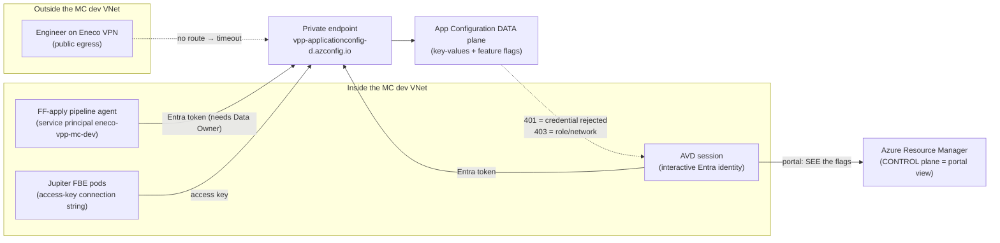
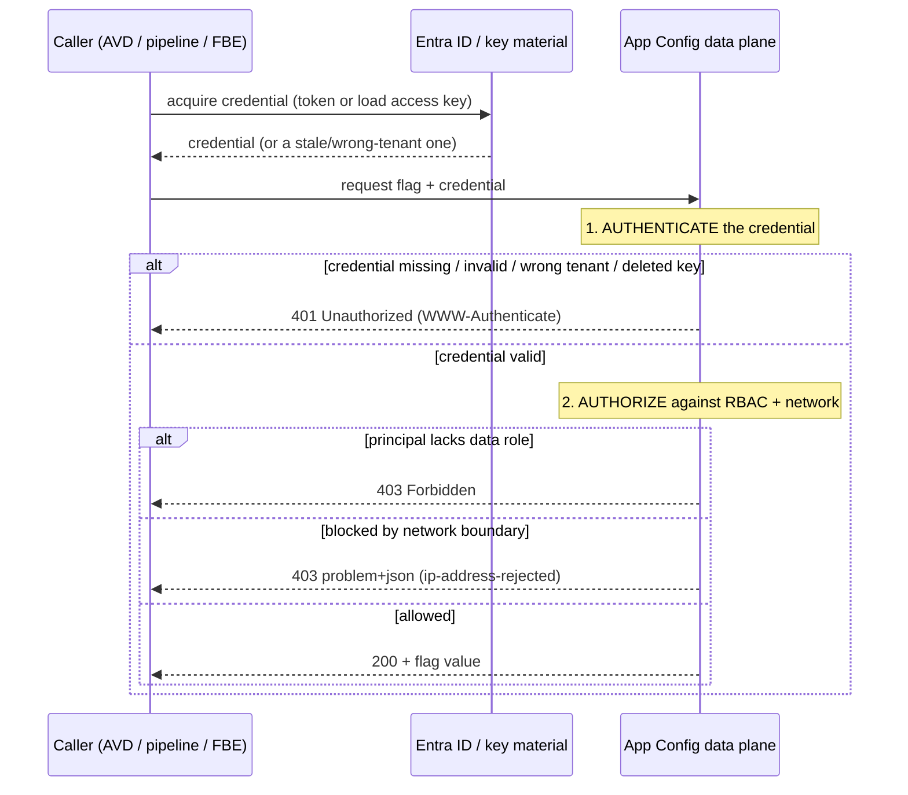

# How to fix — Jupiter FBE feature flags failing with 401 on Azure App Configuration (dev-mc)

**Companion to:** [`rca.md`](./rca.md) (the full root-cause analysis). The RCA explains *what happened*
and *why the cause is a hypothesis set*; this document teaches you to **drive the failing call to a
verdict and repair the right branch safely**.

## Audience and scope

Written for the **next-shift Trade Platform on-call engineer** (and for Duncan, the filer) who must
resolve an "App Configuration 401" on Managed Cloud dev. You do not need prior App Configuration
internals — this guide builds them. It is **not** a blind command list: because the deciding probe is
**AVD-gated** (it must run from an Azure Virtual Desktop session against MC dev, which automation cannot
reach), this guide makes you able to **choose and justify** the correct fix from the error you observe,
and to **stop** at the one-way doors.

## Knowledge Contract

After reading this, you will be able to:

1. **draw** the three planes a feature-flag interaction crosses (control-plane/portal view, data-plane
   read via access key, data-plane write via an Entra service principal) and the private-endpoint
   boundary;
2. **explain why** an HTTP 401 is an *authentication* failure that is categorically different from a 403
   (role or network) and from a timeout (off-VNet) — and why "I can see the flag in the portal" proves
   none of them are working;
3. **trace** a single feature-flag call from credential acquisition to the server's 200/401/403 verdict,
   and predict which verdict each failure mode produces;
4. **diagnose** which branch you are in from one discriminator probe, and **repair** that branch with the
   least-privilege, reversible action;
5. **reject** the three dangerous shortcuts — disabling/regenerating access keys, opening public network
   access, and granting a consumer Data Owner — by naming the mechanism that makes each one harmful;
6. **defend** your fix to a skeptical reviewer: cite the verdict you observed, the probe that produced
   it, and the observed effect that proves convergence.

This guide does **not** make you able to pick the cause without running the discriminator probe — that
is the one thing it deliberately refuses to fake.

## TL;DR — the one move that decides everything

Before you touch anything, get the **exact** error of the failing call. One status code eliminates whole
families of cause and selects your branch:

```text
        ┌─ timeout / no connect ───────► NETWORK off-VNet  → use AVD / link private DNS  (the CLOSED 18-Jun ticket)
        │
 STATUS ├─ 403 + problem+json ──────────► NETWORK block     → fix route/DNS, NEVER open public access
 of the │   (ip-address-rejected/nsp)
 failing├─ 403  (no network body) ──────► RBAC role missing → grant LEAST data role to the SET identity
 call ──┤
        ├─ 401  Bearer "invalid_token"  ► TOKEN wrong/stale → re-`az login` to the dev-mc tenant
        │       / "wrong issuer"
        └─ 401  HMAC "Invalid Credential"► ACCESS KEY broken → check disableLocalAuth / refresh KV secret
```

If you remember nothing else: **read the status before you act, and never "fix" a 401 by disabling keys,
opening networking, or handing out Data Owner.**

## First principles — the smallest true statements about App Configuration auth

Everything below follows from these. Climb them in order.

| Rung | Statement |
|---|---|
| **Term** | *App Configuration* is an Azure service that stores key-values and **feature flags** (a feature flag is just a specially-named key-value). It is reached two ways: the **data plane** at `https://{store}.azconfig.io` (serves the *values*), and the **control plane** via Azure Resource Manager (serves the *resource* — its properties, the portal blade). |
| **Primitive** | Every data-plane request must carry a credential. There are exactly **two** credential types: an **access key** (an HMAC-SHA256-signed connection string) or a **Microsoft Entra (Azure AD) bearer token** governed by **RBAC roles**. |
| **Invariant** | *Authentication* (proving who you are) happens **before** *authorization* (checking what you may do). A request that fails authentication can never reach the authorization check. This ordering is what makes 401 and 403 mutually exclusive. |
| **Mechanism** | The server inspects the credential. No/!invalid/expired/wrong-tenant token, or a deleted/stale/mis-signed key → **401 Unauthorized**. A valid credential whose principal lacks the data role → **403 Forbidden**. A valid credential blocked by the network boundary → **403** with a machine-readable `problem+json` body. A reachable, authenticated, authorized request → **200**. |
| **Consequence** | The **portal blade** reads the resource through the **control plane** (Azure RBAC "Reader"/Contributor), a *third* permission unrelated to either data-plane credential. So you can **see** the flag values while every data-plane call fails. "I can see it" is not "it authenticates." |
| **Failure** | If the invariant or a credential breaks: a deleted access key (someone disabled local auth) → every connection-string caller 401s; a stale token (wrong tenant after re-login, expired) → 401; a missing data role → 403; the store's `public_network_access=Disabled` with the caller off-VNet → timeout (no route) or 403 (reached but rejected). |
| **Defense** | You repair by restoring the *one* broken thing — re-authenticate, refresh the key, grant the least role, or reach from AVD — and you **prove** it by re-running the *failing operation* on the *failing plane* from the *failing context* and watching it return 200. Never by an exit code, never by the portal view. |

The single most important consequence to internalize: **the portal view and the data-plane call use
different permissions.** Duncan seeing the flags "set properly" and the call returning 401 are perfectly
consistent — they are different planes.

## The system — what exists and how it connects

Here is the whole picture you must be able to draw: who calls the store, through what boundary, with
which credential, and where the portal sits. Read it to answer "which arrow is my 401 on?"



What you are looking at: four callers and two planes. The **VPN** caller's arrow dies before the store —
no VNet route, so it **times out** (that was the earlier, closed ticket). The three **in-VNet** callers
reach the private endpoint and hit the **data plane**, each with a *different credential*: AVD with an
interactive Entra token, the pipeline with a service-principal token that needs **Data Owner**, and the
FBE pods with an **access key**. Separately, the AVD's **portal** arrow goes to the **control plane** —
that is the "see the flags" path, and it authorizes nothing on the data plane. The return arrow carries
the verdict: a **401** means the credential on whichever data-plane arrow you used was rejected. The one
takeaway: **identify your arrow (which caller, which credential) before you reason about the verdict** —
the fix differs per arrow. This connects directly to the next view, which slows that arrow down in time.

## The mechanism over time — how a single call earns its verdict

The topology shows *who* connects; this shows *what happens in order* on one call, because the ordering
is exactly what makes 401 and 403 distinguishable. Read it to predict which verdict each failure
produces.



What you are looking at: a credential is acquired, then the server runs **two gates in order** —
authenticate, then authorize. The picture makes the invariant concrete: a 401 is emitted at **gate 1**,
so the request never reaches gate 2; a 403 is emitted at **gate 2**, which means gate 1 already
*passed* (you were authenticated). That is why "401 vs 403" is not a synonym for "auth error" — it tells
you **which gate** failed, and therefore **what to fix**: a 401 means repair the *credential* (token or
key); a 403 means repair the *authorization* (role or network route). The takeaway to keep: **the status
code names the gate.** With the gate identified, the decision ladder next tells you exactly what to do.

## The decision ladder — diagnose, then act

This is the surface to redraw from memory on the next incident. It takes the verdict from the mechanism
above and walks you to a single branch. Run it top-down; stop at the first match.

```text
STEP 0    Are you ON AVD, and does {store}.azconfig.io resolve to a 10.x private IP?
          ── no  → off-VNet. This is the CLOSED network ticket: use AVD / link the private
          │         DNS zone. STOP. (Symptom would be a timeout, not a 401.)
          └─ yes → the network is fine; the problem is the credential, the role, or the flag.

STEP 0.5  WHICH caller is failing?  (the status code does NOT tell you whose credential it was)
          ├─ your interactive az/portal action ..... credential = YOUR Entra token  → A or E
          ├─ the FF-apply ADO pipeline run ......... credential = the SP eneco-vpp-mc-dev → A-SP
          └─ the running FBE pod (reading a flag) .. credential = the access key → B

STEP 1    Capture the EXACT failing call: HTTP status + WWW-Authenticate + any problem+json body.
          │  NOTE: `az appconfig kv list --auth-mode login` tests the ENTRA arm ONLY — a clean 200
          │  means YOUR token works; it does NOT reproduce the FBE pod's HMAC failure. For the pod,
          │  read the pod's own SDK/startup error; for the pipeline, read the failing run's log.
          │
          ├─ 401 Bearer invalid_token/"wrong issuer", caller = YOU ..... → BRANCH A (your token)
          ├─ 401 Bearer, caller = the PIPELINE SP ..................... → BRANCH A-SP (SP secret)
          ├─ 401 HMAC "Invalid Credential", caller = FBE pod .......... → BRANCH B (access key)
          ├─ 403  (no problem+json body) ............................. → BRANCH C (RBAC role)
          ├─ 403  problem+json ip-address-rejected / nsp-rejected ..... → BRANCH D (network)
          ├─ portal blade itself 401s in the browser ................. → BRANCH E (browser/PE)
          └─ no error, the flag is simply ABSENT ..................... → BRANCH F (unapproved)
```

What you are looking at: a **three-question funnel**. **Step 0** rules the network in or out — off-AVD is
the old (closed) problem, answered by "use AVD." **Step 0.5** asks *which caller* failed, because the
same status code from a different caller needs a different fix: a `401 Bearer` from *you* is fixed by
your re-login (Branch A), but a `401 Bearer` from the *pipeline SP* is fixed by rotating the SP's secret
(Branch A-SP) — re-authenticating yourself does nothing for it. **Step 1** then reads the server's verdict
and routes to one branch. The reason the ladder is safe is that each branch has a *different* fix and
*different* one-way doors — guessing the branch is how people reach for the dangerous shortcut. The
takeaway: **three questions (on-AVD? which caller? which status?) select the branch deterministically.**

> **AVD-execution boundary (applies to every command below).** All live `az`/`oc`/SDK probes against
> Managed Cloud dev run **from your AVD session** — automation and off-VNet machines cannot reach the
> private endpoint. Run read-only probes first. Re-auth first per `rca.md` L11 Step 1
> (`az login` into the dev-mc tenant, `az account set --subscription 839af51e-…`).

---

## Branch A — 401 `invalid_token` / "wrong issuer": the interactive token is stale or wrong-tenant

**You are here if** the failing call is yours (interactive, from AVD) and the body says
`Bearer error="invalid_token"` or mentions the wrong issuer/tenant. This is the most common cause for a
returning engineer: a leftover `az`/browser session pointed at the wrong Entra tenant, or an expired
token.

**Why this is the mechanism:** App Configuration validates the token's issuer/audience against the
tenant that owns the store. A token minted for another tenant (or an expired one) fails **gate 1** →
401. Nothing is wrong with your *permissions* yet — you simply have not proven *who* you are to *this*
tenant.

**Fix (reversible, no gate):**

```bash
# From AVD. Prefer an in-place refresh; only `az logout` if you must SWITCH identity/tenant —
# `az logout` clears the token cache for ALL your shells on this (shared) AVD host, so do it only
# when no concurrent az/Terraform/oc run is mid-flight.
az login                                                            # pick the Eneco dev-mc tenant
az account set --subscription 839af51e-c8dd-4bd2-944b-a7799eb2e1e4  # dev-mc
az account show --query "{user:user.name, tenant:tenantId, sub:id}" -o json
```

**Verify by EFFECT, not exit code:** re-run the *failing* operation and watch it return data:

```bash
az appconfig kv list --name vpp-applicationconfig-d --auth-mode login --top 1 -o table
```

A table of key-values (HTTP 200) means the token now authenticates. If you still get 401 with a valid,
right-tenant token, the credential is fine and you are likely in Branch C (role). **Rollback:** none for
the credential itself — but note `az logout`/`az login` rewrites your AVD session's *shared* token cache,
so it is not state-free on a shared host, and picking the wrong tenant interactively re-creates the very
401 you are fixing (the `az account show` check catches that — read the tenant, not just exit code).

---

## Branch A-SP — 401 `Bearer` on the FF-apply *pipeline* run: the service principal's token, not yours

**You are here if** the failing caller is the **FF-apply ADO pipeline** (not your interactive session),
and its run logs a `401`/auth error. The credential is the pipeline's service principal
`eneco-vpp-mc-dev` — a *different identity* from you. Re-`az login` as yourself fixes nothing, and the
Branch A verify (`az appconfig kv list --auth-mode login`) will return 200 under *your* identity and
**falsely signal "fixed."** This branch exists because the RCA's own L6 names the pipeline SP as the most
probable actual writer of "set FFs."

**Why this is the mechanism:** the pipeline authenticates to the data plane with the SP's Entra token
(`use_azuread_auth = true`). If the SP's secret expired, was rotated, or the service connection points at
the wrong tenant, the apply fails authentication → 401 — independent of any human's session.

**Fix (ADO-admin / platform owned):** rotate/refresh the `eneco-vpp-mc-dev` ADO **service-connection**
secret and confirm the SP's tenant, then re-run the FF-apply pipeline.

> **One-way door — verify the identity before acting.** Do **not** "fix" a pipeline-SP 401 by changing
> *your* login, and do **not** grant the SP broad roles to compensate — a credential failure is a 401,
> an *authorization* failure would be a 403 (Branch C). Service-connection secret changes are tracked,
> platform/ADO-admin-owned actions.

**Verify by EFFECT:** the FF-apply run authenticates AND the slot reads the written flag — never your own
`--auth-mode login` 200 (that is a different identity).

---

## Branch B — 401 "Invalid Credential" (HMAC): the access-key read path is broken

**You are here if** the failing caller is a *service* reading flags (the FBE pods, via a connection
string) and the body is an HMAC `"Invalid Credential"`/`"Invalid Signature"`. The flags are visible in
the portal, but the running service cannot read them.

**Why this is the mechanism:** the read library connects with an **access key**. The key becomes invalid
in exactly two ways. (1) Someone **disabled local auth** on the store — which *deletes all access keys* —
so every connection-string caller 401s. (2) A key was **rotated/regenerated** and the new value never
reached the Key Vault secret `connectionstrings-app-config` that the service reads, so the service
presents a stale key.

**Diagnose which sub-case (read-only):**

```bash
# From AVD. Is local (key) auth disabled on the LIVE store? (IaC says it is NOT — but a portal flip is invisible to IaC.)
az appconfig show -n vpp-applicationconfig-d -g mcdta-rg-vpp-d-res \
  --query "{disableLocalAuth:disableLocalAuth, publicNetworkAccess:publicNetworkAccess}" -o json
```

- `disableLocalAuth = true` → keys are gone by policy. The correct repair is **not** to re-enable keys;
  it is to move that caller to **Entra auth** (managed identity + Data Reader), because someone disabled
  keys deliberately. Escalate to the platform team to confirm intent.
- `disableLocalAuth = false` → keys are enabled; the service *may* have a **stale** connection string —
  but **confirm that read-only before overwriting anything**, because the secret is shared, IaC-managed
  state.

**Confirm staleness first (read-only):** compare the key embedded in the live KV secret against a live
store credential — only act if they differ.

```bash
# Read-only. Does the KV secret still match a LIVE store credential id? (if it matches, it is NOT stale)
az keyvault secret show --vault-name <dev-mc-kv> --name connectionstrings-app-config --query value -o tsv | grep -o 'Id=[^;]*'
az appconfig credential list -n vpp-applicationconfig-d -g mcdta-rg-vpp-d-res --query "[].{name:name,id:id}" -o table
```

**The durable fix is to re-run the App Config IaC pipeline — NOT a manual `az keyvault secret set`.** The
secret `connectionstrings-app-config` is written by Terraform (`module primary_connectionstring_appconfig`,
`appconfig-mc-lz.tf`), so a hand-set value **drifts from IaC and is silently reverted by the next apply** —
re-breaking the consumer at an unrelated later time with no operator present. Re-running the pipeline makes
Terraform rewrite the secret from the live key, durably.

> **One-way door — HALT for platform authorization.**
> - Do **NOT** toggle `disableLocalAuth` or regenerate keys — disabling **deletes every key** and
>   regenerating invalidates the old one immediately; either breaks every connection-string caller across
>   environments.
> - Do **NOT** hand-`az keyvault secret set` this IaC-managed secret as the fix — it is reverted on the
>   next apply (re-run the pipeline instead). If an emergency hand-set is truly unavoidable: get platform
>   sign-off; **capture the existing value first** (`az keyvault secret show … -o tsv`) for rollback; use a
>   **read** connection string, not the Primary *write* key (over-privileges the read path); guard for a
>   non-empty value; and pass the secret via `--file`/stdin, never `--value` on the command line (it leaks
>   into `ps`/shell history on a shared AVD host). Open a tracked follow-up to reconcile IaC. Never paste
>   the connection string into Slack/logs.

**Verify by EFFECT:** the FBE pod loads its flags (the frontend lights up / update events resume),
observed from the running slot — not from the portal.

---

## Branch C — 403 with no network body: the identity lacks an App Configuration Data role

**You are here if** the status is **403** (not 401) and there is **no** `problem+json` network body. You
are authenticated (gate 1 passed) but not authorized.

**Why this is the mechanism:** data-plane access needs a **data** role — `App Configuration Data Reader`
to read, `App Configuration Data Owner` to write/set flags. Control-plane "Reader"/"Contributor" (which
lets you *see* the blade) grants **nothing** on the data plane. On `vpp-applicationconfig-d`, Data Owner
is granted to the group `sg-vpp-core-release-masters`; an identity outside it gets 403 on a write.

**Diagnose (read-only):**

```bash
# From AVD. Does the calling identity hold an App Configuration *Data* role on the store?
APPCFG_ID=$(az appconfig show -n vpp-applicationconfig-d -g mcdta-rg-vpp-d-res --query id -o tsv)
az role assignment list --scope "$APPCFG_ID" --include-inherited \
  --query "[?contains(roleDefinitionName,'App Configuration Data')].{role:roleDefinitionName, principal:principalName}" -o table
```

> **Note:** `az role assignment list` is itself a *control-plane* read needing ARM **Reader** on the
> scope. If the command **errors** (you lack that read — plausible given Duncan's pending dev-mc access),
> that is a tooling-permission problem, not evidence of a missing role: distinguish an **empty result**
> (no Data role → H3) from a **command error** (cannot read assignments).

**Fix (least privilege):** grant the **correct** identity the **smallest** sufficient role:

- If the failure is a *runtime read* by a service identity → grant that identity a **direct
  `App Configuration Data Reader`** assignment scoped to the store. **Do NOT** add it to
  `sg-vpp-core-release-masters` to "stay IaC-clean": that group carries **Data Owner store-wide**
  (create/delete/disable every flag, every slot) plus release-master authority — for a *read* need it is
  the same over-grant the HALT below forbids.
- If the failure is the *FF-apply pipeline* SP (`eneco-vpp-mc-dev`) → it needs **Data Owner**; the
  `sg-vpp-core-release-masters` group is appropriate here, but add the member **in IaC** (`dev.tfvars`),
  not by hand, so it does not drift — and note membership = store-wide create/delete/disable.

```bash
# Example: grant Data Reader to a service identity (write path needs Data Owner instead).
az role assignment create --assignee <objectId> \
  --role "App Configuration Data Reader" --scope "$APPCFG_ID"
# Allow up to 15 minutes for the assignment to propagate before retrying.
```

> **One-way door — HALT.** Do **NOT** reflexively grant **Data Owner** to a frontend consumer (e.g.
> Duncan), and do **NOT** add a read-only identity to `sg-vpp-core-release-masters`. Data Owner —
> directly or via that group — can create/delete/disable every flag in the store *for every slot*, and
> group membership also carries release-master authority and is rarely reviewed; a consumer needs at most
> Data Reader. Over-granting is a standing privilege escalation, not a fix.

**Verify by EFFECT:** after propagation, the same read/set operation returns 200 / applies the flag.

---

## Branch D — 403 `problem+json` (`ip-address-rejected` / `nsp-rejected`): a network block

**You are here if** the 403 carries a `problem+json` body whose `type` is `ip-address-rejected` or
`nsp-rejected`. The credential was fine; the *source* is blocked.

**Why this is the mechanism:** `vpp-applicationconfig-d` has `public_network_access = Disabled` and a
private endpoint. A request that reaches it from a non-permitted network path is rejected at the network
gate with this exact body. This usually means an AVD whose private DNS zone is not linked for this store,
so it resolved the public IP.

**Fix:** make the caller reach the store **through the VNet** — confirm you are on AVD and that
`vpp-applicationconfig-d.azconfig.io` resolves to a `10.x` address; if not, link the private DNS zone (or
add the host to the AVD hostfile as the documented interim) per the platform pattern.

```bash
nslookup vpp-applicationconfig-d.azconfig.io   # MUST resolve to a private 10.x address from AVD
```

> **One-way door — HALT.** Do **NOT** "fix" this by enabling **public network access** on the store. The
> standing Managed Cloud posture is "everything through AVD"; opening the store to the public internet is
> a security change the platform team owns, not an on-call shortcut.

**Verify by EFFECT:** the FQDN resolves to a private IP and the data-plane call now connects and returns
200.

---

## Branch E — the portal blade itself returns 401 in the browser

**You are here if** "the calls failing" turns out to be the **Azure Portal** App Configuration blade
throwing 401 while Duncan browses it — not a programmatic call.

**Why this is the mechanism:** the portal reaches private-endpoint resources from the browser, and some
browsers (notably Edge) mishandle the private-endpoint flow on MC, surfacing a 401 in the blade even
though the resource is healthy.

**Fix (cheap, reversible):** open the blade in **Chrome or Firefox**, from **AVD**. This is a
two-minute exclusion worth running early because it costs nothing.

**Verify by EFFECT:** the blade loads in the alternate browser **AND** re-run the data-plane call
(`az appconfig kv list --auth-mode login`) returns 200. The browser swap only excludes the *portal-render*
fault — it does not prove the data plane works, so do not close on the blade alone (that is the very
portal-as-proof trap this guide forbids).

---

## Branch F — no error at all: the flag is simply not applied yet

**You are here if** there is **no 401/403** — the flag just isn't present where expected. This is a
different failure wearing the same complaint.

**Why this is the mechanism:** feature flags are applied by a **manual, approval-gated** Azure DevOps
pipeline. If the run is **waiting for approval** (or never ran for this slot), the flag never lands —
exactly the case Duncan himself hit on FBE Kidu (a *different* slot) in September 2025, resolved the
moment the gate was approved.

**Fix:** check the App Configuration pipeline's approval gate for the **Jupiter** prefix (not Kidu —
that was the precedent); approve and run it.

**Verify by EFFECT:** the **slot reads the flag** (the frontend lights up / update events resume) — not
merely that the flag "appears in the store" (a control-plane view). The slot read is the closing signal.

---

## Anti-patterns — shortcuts that look right and fail (with the mechanism)

| Shortcut | Why it fails (mechanism) |
|---|---|
| "It's a 401 — disable/regenerate the access keys" | Disabling **deletes all keys**; regenerating invalidates the old one **immediately**. Every connection-string caller across environments 401s. You converted one engineer's blocked flag into a multi-service outage. |
| "Just hand-`az keyvault secret set` the connection string" | `connectionstrings-app-config` is Terraform-managed; a manual set drifts from IaC and is **silently reverted by the next App Config apply** — re-breaking the consumer later with no operator present to correlate cause. Re-run the IaC pipeline instead. |
| "Add the read-only identity to the release-masters group — it's IaC-clean" | That group grants **Data Owner store-wide** (+ release-master authority); for a read need it is the same over-grant a direct Data Reader avoids. Group membership is unreviewed standing privilege. |
| "Open public network access so VPN works too" | The store is private-endpoint-only **by design**. Opening it exposes config data to the public internet and breaks the MC security posture; it does not even address a 401 (a network block is a 403/timeout). |
| "Just grant the user Data Owner" | Data Owner can delete/disable every flag in the store. A consumer needs at most Data Reader. The over-grant is a permanent privilege escalation to clear a transient error. |
| "Rerun the FF pipeline / recreate the FBE" | If the cause is the SP's token/role, a rerun fails identically; recreating the FBE rebuilds the same identity into the same gap. Neither touches the credential or role that actually failed. |
| "The portal shows the flags, so it's fine / it's broken" | The portal reads the **control plane**. It proves ARM permission only — nothing about whether the data-plane credential authenticates. It is the trap, not the test. |
| "The command exited 0, so it's fixed" | A green exit or a synced pipeline is not the effect. Convergence is the **failing operation returning 200** from the failing context. Anything else is theater. |

## Evidence ledger

Audit codes live here, not in the prose above. A1 = externally witnessed this analysis; A2 = inferred
via named reasoning; A3 = unverified/blocked + the probe that resolves it.

| Claim behind a branch | Label | Basis / resolving probe |
|---|---|---|
| 401 = authentication failure; 403 = role-or-network; network block carries `problem+json` | A1 | Microsoft Learn data-plane auth/error pages (`msdocs-appconfig-auth.md`) |
| Read path uses an access-key connection string; `DefaultAzureCredential` only for Key Vault refs | A1 | `fbe-ff-mechanism.md` Q1 (`HostBuilderExtensions.cs`) |
| Set-FF path = ADO pipeline SP over Entra, needs App Configuration Data Owner (group `sg-vpp-core-release-masters`) | A1 | `fbe-ff-mechanism.md` Q2/Q5 (`dev.tfvars`, `main.tf`) |
| Store is `public_network_access=Disabled` + private endpoint; `disableLocalAuth` not set in IaC | A1 | `fbe-ff-mechanism.md` Q3/Q4 (`appconfig-mc-lz.tf`) |
| Disabling local auth deletes all keys; key rotation also yields 401 | A1 | `msdocs-appconfig-auth.md` Q1 |
| Control-plane Reader does not grant data-plane access (portal view ≠ data auth) | A1 | `msdocs-appconfig-auth.md` Q4 |
| Earlier (18-Jun) ticket resolved by-design: private endpoint, "use AVD"; symptom was a timeout | A1 | `slack-harvest.md` §2a |
| Browser/private-endpoint portal 401 fixed by Chrome/Firefox on AVD | A1 | vault troubleshooting note (`vault-appconfig-knowledge.md` §2a) |
| Unapproved-pipeline flag-absence precedent (Duncan, FBE Kidu, Sep-2025) | A1 | `slack-harvest.md` §3 |
| Which branch is the actual cause for Rec0BC1FTLV35 | A3 — blocked: AVD-gated | run the decision ladder Step 1 from AVD |
| Whether Jupiter FBE reads the shared store via key or an FBE-specific store via MI | A3 — blocked: FBE service code not read | read the FBE service `Program.cs`/Helm |

## Challenge defense — answer these before you act

| Challenge | Answer |
|---|---|
| "How do you know it's auth, not network?" | The reported symptom is a 401 from inside AVD. A network block from off-VNet is a timeout or a 403 with a `problem+json` body — never a 401. Step 0 of the ladder confirms on-AVD + private-IP resolution. |
| "What else could explain it?" | The six branches are the competing hypotheses; the discriminator probe (exact status + body) eliminates all but one. Until it is run, no single branch is asserted. |
| "What would disprove your leading branch?" | If the status is actually 403 (not 401), Branches A/B are out and C/D lead; if there is no error at all, it's F. The body decides. |
| "Where does this guide fail?" | If the failing call is something neither of us modeled (e.g. a non-`az` SDK with a wrapped error), capture its raw HTTP response; the same status→branch mapping still holds. |
| "Why not just grant access / disable keys to unblock fast?" | Those are one-way doors (privilege escalation / key deletion / posture change). The reversible fixes (re-auth, refresh secret, least role, use AVD) clear the real cause without shared-state damage. |

## Durable principles (carry these to the next incident)

1. **Read the status before you act.** 401/403/timeout name *different gates* and select *different*
   fixes. Guessing the gate is how the dangerous shortcut gets chosen.
2. **The portal is the control plane.** "I can see it" never proves a data-plane credential works.
3. **Repair the one broken thing, reversibly.** Re-auth, refresh the key, grant the least role, or reach
   from AVD — never disable keys, open networking, or over-grant.
4. **Prove the fix by the failing operation returning 200**, from the failing context — not by an exit
   code, a green pipeline, or the portal.
5. **On Managed Cloud the answer is usually "authenticate correctly from AVD," not "change the store."**

## Self-test (reconstruct the reasoning unaided)

Success condition: you can answer these from memory, rebuilding the chain — not by recall of trivia.

1. Draw the three planes and say which credential each in-VNet caller uses. Which plane does the portal
   read, and why does that let you "see" a flag whose data-plane call 401s?
2. A colleague says "App Config is down — I get 401 on VPN." Trace the ladder: what is your first
   question, and why is "401 on VPN" probably a mislabeled timeout?
3. The failing call returns **403** with a body containing `ip-address-rejected`. Which branch, what is
   the fix, and which one-way door must you refuse?
4. The FBE pods 401 with an HMAC "Invalid Credential" but your AVD `az appconfig kv list --auth-mode
   login` returns 200. What does that combination tell you about which path broke, and what is the safe
   repair?
5. Transfer: the same store later returns **403 with no body** for the FF-apply pipeline SP. Is that
   Branch C or Branch D? What is the least-privilege fix, and why not just add the SP as Data Owner with a
   one-off assignment?

<details>
<summary>Answer key</summary>

1. Control plane (portal/ARM), data-plane read (FBE = access key), data-plane write (pipeline SP =
   Entra token). The portal reads ARM, a separate permission, so visibility ≠ data-plane auth.
2. First question: "are you on AVD and does the FQDN resolve to a 10.x private IP?" Off-VNet, the store is
   unreachable → **timeout**, which engineers often report loosely as "401/unauthorized." A literal 401
   only happens after the network path succeeds.
3. Branch D (network). Fix: reach via AVD / link the private DNS zone. Refuse: enabling public network
   access on the store.
4. The Entra path authenticates (200 from AVD), so the broken thing is the **access key** the FBE uses
   (Branch B) — a deleted key (disableLocalAuth) or a stale KV connection-string secret. Safe repair:
   confirm `disableLocalAuth`, then either move the caller to Entra (if keys were disabled on purpose) or
   refresh the KV secret — never regenerate keys to "fix" it.
5. Branch C (RBAC) — a 403 *without* a network body is authorization, not network. Least-privilege fix:
   the apply SP genuinely needs Data Owner, but add it via the `sg-vpp-core-release-masters` group so IaC
   stays the source of truth, rather than a drift-prone one-off assignment.

</details>
