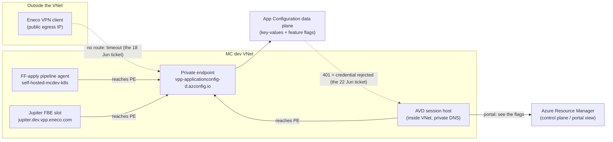
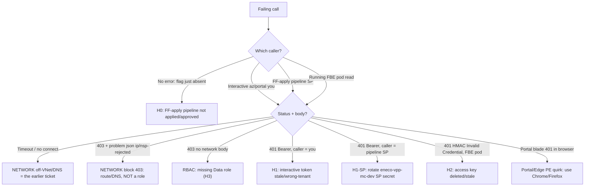

# RCA — Jupiter FBE feature flags fail with 401 on Azure App Configuration (dev-mc)

> **Status: `review` — awaiting independent challenge AND one AVD-gated discriminator probe.**
> The causal mechanism is a deliberately-preserved **hypothesis set**: the single probe that would
> collapse it (the exact failing call + its HTTP status and `WWW-Authenticate`/`problem+json` body,
> plus the live `disableLocalAuth` and data-plane role state on `vpp-applicationconfig-d`) requires an
> AVD session against Managed Cloud dev, which the analysis environment cannot reach
> (`mc-avd-execution-boundary`). This document is honest about that gap: it ranks the hypotheses, names
> the one probe that decides between them, and ships a branch-structured repair plan in
> [`how-to-fix.md`](./how-to-fix.md). The companion how-to-fix is written to the Feynman teaching
> contract.
>
> **Package scope (`output_package: minimal`):** by request, this incident ships two deliverables — this
> RCA and the comprehensive Feynman [`how-to-fix.md`](./how-to-fix.md) (which serves as the RCA's
> repair sibling). The "recreate from cold" path is folded into L11 and the toil decision into L10/L12,
> rather than shipped as separate `how-to-recreate` / `sre-toil-removal` files.

## Executive summary

Duncan Teegelaar — a **frontend engineer** on the VPP / Flex Trade Optimizer team who, in his own
words, "[has] not worked on VPP in a bit" — opened a Platform intake ticket on 22 June 2026 saying that
his **Jupiter Flex Budget Engine (FBE)** slot, which he was inspecting **through AVD**, was getting
**HTTP 401** back from **Azure App Configuration** when feature flags were being set, even though he
could **see the flag values sitting correctly in the App Configuration store**. He noted it felt
"similar to my earlier one from Thursday about feature flags and FBEs."

That earlier Thursday ticket is the trap this RCA exists to disarm. On 18 June Duncan reported that
feature-flag **fetch worked from AVD but not from the Eneco VPN**, and the platform team closed it
**by design**: the dev-mc App Configuration store is **private-endpoint-only**, so there is "no line of
sight outside the VNet" and AVD "is the way forward." That earlier symptom was a **connection timeout
on the network layer**. The new symptom is an **HTTP 401 from inside AVD** — i.e. the network path
already succeeded and the *credential* was rejected. **They are two different failures at two different
layers, and conflating them is the most likely way the next on-call gets this wrong.**

The system works like this. VPP services have **two distinct ways of talking to App Configuration**.
The **read path** (a service loading its feature flags at runtime) connects with an **access-key
connection string** pulled from Key Vault. The **write / "set the flags" path** is an Azure DevOps
Terraform pipeline that authenticates with a **service principal's Microsoft Entra (Azure AD) token**
over the App Configuration **data plane**, and it needs the **App Configuration Data Owner** role on
the store. Crucially, *seeing the flags in the portal* uses a **third, separate permission** (the
Azure Resource Manager control plane) — so "I can see the flags" proves nothing about whether the
data-plane call that failed was allowed to authenticate.

What does a 401 actually mean here? Microsoft's data-plane contract gives us a precise decision rule,
and that rule is the spine of this RCA — **but read one caveat first**: the "401" is Duncan's word in a
one-line intake ticket, *not* a captured HTTP status line, and he describes himself as rusty on VPP. So
the rule's job is to tell us *what to confirm*, not to license a conclusion before the status is
witnessed. The rule: on the App Configuration data plane, **401 = authentication failed** (no token, an
invalid / expired / wrong-audience / wrong-tenant Entra token, or a deleted / stale / mis-signed access
key), while **403 = authenticated-but-not-authorized**, which splits into a missing data-plane **role**
(403-RBAC) or a **blocked network source** (403 with a network `problem+json` body). A blocked VPN is a
403 or a timeout — *never* a 401. So **if** the failing call truly returns a literal 401 from inside AVD,
it points at the **credential/token itself**, not at networking and not (strictly) at a missing role —
and if the reported "401" is actually a 403 (or a paraphrase of a tooling banner), the cause shifts to a
role, the network, or the cases below. Confirming the literal status (L11 Step 2) is therefore the first
action, not an afterthought.

Because the analysis could not run the one live probe that names the exact failing call, this RCA
delivers a **ranked hypothesis set**. Before ranking, resolve a question the word "set" hides: **which
caller is failing?** "The FFs cannot be set" can mean three different callers with three different
credentials — (i) Duncan running an interactive `az appconfig`/portal action from AVD (his own Entra
token), (ii) the **FF-apply ADO pipeline**, whose service principal `eneco-vpp-mc-dev` writes the flags
(the SP's Entra token — and "set" most literally denotes *this* path), or (iii) the **running FBE pod**
failing to *read* a flag (its access key). The status code alone does **not** tell you *whose*
credential failed, so the discriminator must capture both the status **and** which operation/caller
produced it.

The hypotheses, re-ranked with that in mind:

- **(H0) The flags were never applied — the FF-apply pipeline is pending its approval gate (or never ran
  for Jupiter).** This is the **strongest base-rate prior for this exact filer on this exact symptom**:
  Duncan hit precisely this on FBE *Kidu* in September 2025 ("FF didn't appear" → the App Configuration
  pipeline was waiting for approval; resolved on approval, no auth fix). A rusty engineer is *more*
  likely to forget the gate, and this predicts **no real 401 at all** — the "401" would be a frontend/SDK
  artifact of missing config. The RCA previously buried this as a "cheap exclusion"; it belongs in the
  ranked set.
- **(H1) An interactive AVD identity's token is stale or wrong-tenant** (a literal 401, `Bearer`).
  *Conditional on evidence that Duncan actually ran an interactive data-plane command* — which no
  evidence yet establishes, and which is an unusual action for a frontend consumer. Demoted from
  "leading" to "conditional."
- **(H1-SP) The FF-apply pipeline SP's token/secret is invalid or wrong-tenant** (a literal 401,
  `Bearer`, but a *different identity* — fixed by rotating the `eneco-vpp-mc-dev` service connection, not
  a personal re-login). This is the same-status, different-caller twin of H1 and is well-supported because
  the pipeline SP is the documented writer.
- **(H2) The access-key read path is broken** — keys disabled at the portal (deletes them → 401 for every
  connection-string caller) or a stale connection-string KV secret after rotation. This is the literal-401
  path **on the connection-string read** (note H1/H1-SP also produce literal 401s on the *token* path —
  the two are split by the `WWW-Authenticate` shape: `Bearer` vs HMAC, not by "literal vs not").
- **(H3) A data-plane role gap** — the calling identity lacks `App Configuration Data Owner`/`Reader`.
  Best fit for "set fails, values visible," but it surfaces as **403**, not 401 — so if the witnessed
  status is 403, H3 leads.

The single probe that decides between all of them is: **capture the exact HTTP status, the
`WWW-Authenticate` / `problem+json` body, AND which caller produced the failing call.**

Why this matters for the fix: each hypothesis implies a **different** repair, and several of the naive
fixes are **one-way doors**. Disabling/regenerating access keys deletes every existing key and breaks
every connection-string caller; "opening up networking" so VPN works violates the standing MC posture;
granting a frontend consumer **Data Owner** is an over-privilege. The how-to-fix is therefore a
**decision tree gated on that first probe**, not a single command. The durable lesson for the next
engineer: **401 ≠ 403 ≠ timeout; "I can see it in the portal" is control-plane, not data-plane; and on
Managed Cloud the answer is almost always "authenticate correctly from AVD," not "change the store."**

## RCA Knowledge Contract

After reading this RCA package, a zero-context reader can:

1. **Draw** the two App Configuration access paths (key-based read, Entra-SP write) and the dev-mc
   private-endpoint boundary, and place the portal view as a third, separate plane.
2. **Trace** why an HTTP 401 observed from AVD is an authentication failure distinct from the earlier
   VPN timeout, using the 401/403/timeout decision rule.
3. **Reproduce** the discriminator investigation from cold (the AVD-gated probe sequence in L11),
   knowing what each probe proves.
4. **Reject** the three main false explanations: "it's the same as the VPN ticket," "it's a
   networking/whitelist problem," and "just grant Data Owner / disable local auth."
5. **Repair or roll back** safely along the correct hypothesis branch, respecting the one-way-door
   safety gates.
6. **Decide** which toil to remove — the recurring "use AVD" confusion and the calendar-credential
   class — versus what to leave as a deliberate security posture.

### Backward derivation (contract line → how it is made true)

| Contract line | Knowledge domain | Primitive / invariant | Visual | Probe (L11) | False explanation rejected | Section |
|---|---|---|---|---|---|---|
| 1 Draw paths + boundary | Runtime topology + App/data flow | Two auth modes; PE boundary | L3 topology + L4 flow | Steps 3, 6 | "one path" | L3, L4 |
| 2 Trace 401≠timeout | App/data flow + first principles | 401=authn, 403=authz/net | L4 decision tree | Step 2 | "same as VPN ticket" | Exec summary, L4, L7 |
| 3 Reproduce cold | Reproduction path | probe = question+authority | L11 table | Steps 1–7 | "just rerun the pipeline" | L11 |
| 4 Reject false explanations | Verification + on-call recognition | discriminator splits 401/403 | L4 + L12 | Step 2 | network / role / portal confusions | L4, L8, L10, L12 |
| 5 Repair safely | Fix mechanism + IaC | one-way doors; least privilege | how-to-fix tree | Steps 4–7 | "disable local auth / grant Data Owner" | L8, how-to-fix.md |
| 6 Toil decision | SRE toil removal | recurring class vs posture | L10/L12 | — | "automate the workaround" | L10, L12 |

### Knowledge Domain Map

| Domain / aspect | Reader capability it supports |
|---|---|
| Business / functional role (VPP, FBE, feature flags) | Explain why a blocked feature-flag set matters and who is affected. |
| Repo / artifact system | Identify which code, IaC, and pipeline owners can change the outcome. |
| Runtime topology | Draw `vpp-applicationconfig-d`, its private endpoint, AVD vs VPN, and the Jupiter slot. |
| Application / data / control flow | Trace how a 401 emerges on the data plane while the portal view still works. |
| Declarative infrastructure (IaC) | Compare what Terraform says exists (PE, keys enabled, Data Owner group) with runtime. |
| Delivery pipeline | Explain how feature flags become live config, including the approval gate. |
| Timeline | Separate the 18 June by-design ticket from the 22 June open one. |
| Fix mechanism | Connect each repair branch to the violated invariant. |
| Verification / falsifiers | Prove a fix by the actual call returning 200 / the flag loading. |
| Reproduction path | Let another engineer run the discriminator probe from cold. |
| On-call recognition | Spot "App Config 401 on dev-mc" in five minutes next time. |
| SRE toil removal | Decide what to automate, document, or leave as posture. |

## Context Ledger

Zero-context reader test: a new engineer should understand L1 after reading this table.

| Term / entity | Definition | Evidence basis |
|---|---|---|
| **VPP** | Virtual Power Plant — Eneco's energy-trading platform aggregating flexible assets for TenneT balancing markets. | Known (ubiquitous language) |
| **FBE (Flex Budget Engine)** | Platform for managing flexible energy assets within VPP; deployed as named **slots** (e.g. `jupiter`) on feature-branch environments at `<slot>.dev.vpp.eneco.com`. | Known (ubiquitous language; pipeline param doc) |
| **Jupiter** | The specific FBE feature-branch slot Duncan is working on (`environmentPrefix=jupiter.`). | Known (intake; pipeline template) |
| **FTO / Flex Trade Optimizer** | VPP component; Duncan's team. | Known (Slack profile) |
| **Feature flag (FF)** | A runtime on/off switch stored as a key-value in Azure App Configuration; gates frontend/service behavior. | Known (App Config feature-flag docs) |
| **Azure App Configuration** | Azure service holding key-values + feature flags; reached at `{store}.azconfig.io` (data plane) or via ARM (control plane). | Known (Microsoft Learn) |
| **`vpp-applicationconfig-d`** | The dev-mc App Configuration store in RG `mcdta-rg-vpp-d-res`, subscription `839af51e-c8dd-4bd2-944b-a7799eb2e1e4`. | Known (intake URL; IaC) |
| **dev-mc** | The Managed Cloud **dev** environment (an Azure subscription/landing-zone), as opposed to Sandbox. | Known (ubiquitous language) |
| **MC (Managed Cloud)** | Eneco's locked-down Azure environment (dev/acc/prd); resources are private-endpoint-only with public access disabled. | Known (IaC; vault) |
| **AVD (Azure Virtual Desktop)** | The VNet-integrated desktop from which engineers reach MC private resources; "everything through AVD." | Known (Slack precedents) |
| **Private endpoint (PE)** | A private IP inside the VNet that exposes the store; public access is disabled, so off-VNet callers cannot reach it. | Known (Microsoft Learn; IaC) |
| **Data plane vs control plane** | Data plane = the `azconfig.io` endpoint serving key-values/flags; control plane = ARM serving the resource's properties. Different permissions. | Known (Microsoft Learn) |
| **Access key / connection string** | HMAC-SHA256 credential for the data plane; the "read path" uses it. | Known (Microsoft Learn; read library) |
| **Microsoft Entra ID (AAD) token + RBAC** | The other data-plane auth mode; the "write path" uses an SP token + the App Configuration Data Owner role. | Known (Microsoft Learn; pipeline) |
| **App Configuration Data Owner / Data Reader** | Data-plane RBAC roles (write+delete / read). Distinct from control-plane "Reader." | Known (Microsoft Learn) |
| **`disableLocalAuth`** | Property that turns off access keys; disabling **deletes all keys** and Entra becomes the only auth. | Known (Microsoft Learn) |
| **`sg-vpp-core-release-masters`** | The security group (`d5a241bf-…`) granted App Configuration Data Owner on `vpp-applicationconfig-d` in IaC. | Known (dev.tfvars) |
| **HTTP 401 vs 403** | 401 = not authenticated (credential failed); 403 = authenticated but not authorized (role or network). Mutually exclusive. | Known (Microsoft Learn) |
| **Slack-Lists intake** | The Trade Platform "Help requests tracker Platform" list in `#myriad-platform`; records identified by `record_id`. | Known (Slack) |
| **Rec0BC1FTLV35 / Rec0BBGJ9DMFU** | The NEW (open) and EARLIER (resolved by-design) intake records. | Known (Slack CSV) |

Everything in this ledger is supported by the Evidence Ledger at the end of the document. Unresolved
items are carried as explicit gaps there.

---

## L1 — Business — Why feature flags on VPP exist

**Anchor question: why does a blocked feature-flag call matter, and who is blocked?**

Eneco's **Virtual Power Plant (VPP)** aggregates flexible energy assets to trade on TenneT's balancing
markets. Engineers ship and validate VPP behavior behind **feature flags** — runtime switches that turn
capabilities on or off without redeploying code. A **Flex Budget Engine (FBE)** "slot" such as
**Jupiter** is a short-lived feature-branch environment where a developer exercises a slice of VPP
end-to-end at `jupiter.dev.vpp.eneco.com`.

Duncan Teegelaar is a **frontend engineer** on the VPP / Flex Trade Optimizer team. When his Jupiter FBE
cannot **set/fetch its feature flags**, his frontend cannot light up (or correctly gate) the features he
is trying to validate — and, as he observed in the release thread, downstream effects follow ("it's
most likely because of the failing FFs that we do not get the update events"). So the user-visible
impact is **a developer blocked from validating feature-flagged work on a dev FBE** — not a production
outage, but a real productivity stop for a returning engineer who no longer remembers the platform's
access rules. That "returning, rusty" detail is load-bearing — but it must be applied **even-handedly**:
it raises the prior on a human-side cause over a platform regression, and a rusty engineer is
simultaneously **more likely to mis-report a status code** ("401's"), **more likely to forget the
approval-gate step** (exactly what happened to this same Duncan on FBE Kidu in Sep-2025, → H0), and
*less* likely to be running interactive data-plane writes at all (which cuts against H1). On net the
"rusty" prior flattens the ranking toward H0 (unapplied pipeline) and status-misreport, not toward an
exotic token failure.

**Mental model to keep:** feature flags are data the running app must *fetch from App Configuration*;
"the flag is set" and "my app/identity is allowed to read/write it" are different facts.

## L2 — Repo system — Which code components are in play

**Anchor question: which repositories and artifacts can change this outcome?**

Four repository surfaces matter. The first reads flags; the second sets them; the third declares the
store; the fourth is a representative consumer.

| Repo / path | Role | Artifact / technology | Source (resolving path) | Incident relevance |
|---|---|---|---|---|
| `Eneco.Vpp.Configuration.AzureAppConfiguration` | **Read path** library every VPP service uses to load config + flags | .NET; `Microsoft.Extensions.Configuration.AzureAppConfiguration` + `Microsoft.FeatureManagement` | `…/Extensions/HostBuilderExtensions.cs`, `ConfigurationExtensions.cs` | Defines that runtime reads use an **access-key connection string**, not Entra |
| `MC-VPP-Infrastructure/main` | **Declares** `vpp-applicationconfig-d`, its private endpoint, and the Data Owner grant | Terraform | `terraform/appconfig-mc-lz.tf`, `configuration/dev.tfvars` | Source of truth for networking, key-auth, and who holds Data Owner |
| `Eneco.Pipelines` + the VPP `appconfiguration` pipeline | **Write / set-FF path** | Azure DevOps YAML + Terraform `azurerm_app_configuration_feature/_key` | `…/azure-appconfiguration/appconfiguration/main.tf`, `development/azure-pipeline/pipelines/appconfiguration/devmc.pipeline.yml` | The data-plane writer; authenticates with the pipeline SP's Entra token and needs Data Owner |
| `FleetOptimizer` (FTO) | Representative consumer wiring the read library | .NET | `…/FleetOptimizerGateway.API/Program.cs` | Shows the read-library usage pattern (the FBE service is expected to wire it similarly) |

The repository history showed **no change to the App Configuration IaC in the last two months** — the
most recent touch to `appconfig-mc-lz.tf` predates the incident window — which is why this RCA does not
treat "a recent infra change broke it" as a leading explanation.

**Mental model to keep:** the read path and the write path live in *different repos with different auth
models*. A 401 means "find which path failed, then find which credential that path uses."

> **Open structural question (carried forward):** whether the **Jupiter FBE** service reads the shared
> `vpp-applicationconfig-d` or a historically FBE-specific App Configuration store is not settled by the
> code read in this analysis — the legacy FBE IaC provisioned its own store. This remains unverified;
> the resolving step is to read the FBE service's `Program.cs`/Helm values for the configured store and
> connection-string key. It is captured in the Evidence Ledger and L11.

## L3 — Runtime architecture — What is deployed and where the boundary is

**Anchor question: which deployed pieces touch this incident, and where is the failure boundary?**

This diagram shows the three planes a feature-flag interaction crosses and the one boundary (the private
endpoint) that the earlier VPN ticket ran into. Read it to answer: *which arrow does a 401 sit on?*



What you are looking at: three callers (VPN, AVD, the pipeline, the FBE) trying to reach one store
through one **private endpoint**, plus a separate ARM/portal path. The VPN's dotted arrow **dies before
the store** (no VNet route → timeout) — that is the *earlier* ticket. Every in-VNet caller (AVD, the
pipeline agent on `self-hosted-mcdev-k8s`, the FBE pods) **does** reach the store, so for them the
network is not the issue. The new ticket's 401 sits on the **return arrow from the data plane** — the
call arrived and was **rejected for its credential**. And note the portal arrow goes to **ARM, not the
data plane**: that is why Duncan can "see the flags" while a data-plane call fails.

| Environment | Independent runtime? | Network posture | What reaches the store |
|---|---|---|---|
| dev-mc (this incident) | Shared MC dev landing zone | `public_network_access = Disabled` + private endpoint, no IP allow-list | Only in-VNet callers (AVD, in-cluster pods, the pipeline agent) |
| Sandbox | Separate; public with allow-list | Public | Direct from VPN/laptop |

**Mental model to keep:** on dev-mc, reachability is binary (inside the VNet or blocked) and is a
*network* fact; once you are inside (AVD), any failure is an *auth* fact. The 401 is on the inside.

## L4 — Application / data flow — How a 401 emerges while the portal still works

**Anchor question: what exactly does the failing code/call do, and why 401 not 403?**

There are two code paths into the data plane, and a third, unrelated path for the portal:

- **Read path (runtime fetch).** The shared library calls `.Connect(connectionString)` — it presents an
  **access key**. `DefaultAzureCredential` is used here *only* to resolve Key Vault references that App
  Configuration hands back, **not** to authenticate to App Configuration. So a 401 on this path means
  the **access key is bad**: deleted (because someone disabled local auth) or stale (a rotated key whose
  new value never reached the connection-string secret).
- **Write / set-FF path.** The Azure DevOps Terraform pipeline writes `azurerm_app_configuration_feature`
  using the **pipeline service principal's Entra token** (`use_azuread_auth = true`) and therefore needs
  the **App Configuration Data Owner** role. A *missing role* here is a **403**; a *bad token*
  (expired, wrong tenant, wrong audience) is a **401**.
- **Portal view.** Seeing flag values in the portal uses **Azure Resource Manager (control-plane)**
  permission, which is *separate* from both data-plane modes. This is why "I can see the FFs set
  properly" is true at the same time the data-plane call fails.

The decision rule that the whole investigation hinges on — note the **two** questions it asks (which
caller, then which status), because the same status from different callers needs different fixes:



How to read it: the fork has **two** axes — *which caller* and *which status+body*. Microsoft's contract
makes the statuses mutually exclusive (a 401 carries a `WWW-Authenticate` challenge — `Bearer` for a
token, HMAC for an access key; a network block is always a **403** with a `problem+json`
`ip-address-rejected`/`nsp-rejected` body; a missing role is a plain **403**). But the status alone does
**not** name *whose* credential failed: an interactive-you 401 and a pipeline-SP 401 both read
`401 Bearer`, yet one is fixed by your re-login and the other by rotating the SP's service-connection
secret. So capture **both** the status/body **and** the caller before acting.

One sharp caveat the next engineer must not miss: the convenient probe
`az appconfig kv list --auth-mode login` exercises the **Entra-token arm only**. It can confirm an
interactive token (H1) and it returns 200 if *your* token is fine — but it **cannot reproduce the FBE
pod's access-key (HMAC) failure (H2)**, which lives on a different code path. A clean 200 from that probe
means "my Entra token works," not "the incident is resolved"; the FBE pod's own startup/SDK HTTP error is
the probe for H2.

**Mental model to keep:** two axes select the branch — caller and status. A status read in isolation
("it's a 401") routes you to the wrong fix when the failing caller is the pipeline SP or the FBE pod, not
you.

## L5 — IaC / declarative contract — What the spec says should exist

**Anchor question: what does Terraform say is true about the store, and does it explain a 401?**

Reading the Managed Cloud **repository** Terraform **showed** three load-bearing facts about
`vpp-applicationconfig-d`:

1. **Network:** the repository showed `public_network_access = "Disabled"` plus a **private endpoint**
   bound to the MC landing-zone subnet, and a grep over the repository showed **no IP firewall / network
   ACL**. Access is binary: in-VNet or blocked.
2. **Local auth:** the repository showed **no `local_auth_enabled` / `disableLocalAuth` setting at all**,
   so it defaults to **enabled** — access keys exist. (This is the *intended* state; whether the live
   store still matches it remains unverified — see the live probe in L11.)
3. **Data-plane RBAC:** the repository showed the **App Configuration Data Owner** role on the store
   granted to the security group **`sg-vpp-core-release-masters`** (`d5a241bf-…`). Data Owner is the
   role whose code comment in the module states it can "Create, Edit, Delete, Enable and Disable feature
   flags."

> **Scope caveat (load-bearing):** every store-specific fact in this level — the Data Owner group, the
> connection-string secret, the `disableLocalAuth` state — assumes the **Jupiter FBE reads/writes the
> shared `vpp-applicationconfig-d`**. The legacy FBE IaC historically provisioned its *own* App
> Configuration store, so this is unconfirmed (see C17). If L11 Step 6 shows Jupiter uses an FBE-specific
> store, re-run L5/L6/L8 against **that** store's IaC — every fact below would point at a different
> resource.

Two consequences follow directly. First, an *IaC-driven* key-disable is **not** the cause — the spec
keeps keys enabled and nothing changed it recently. But IaC only proves intent, not the live store: a
**manual portal flip** of `disableLocalAuth` would not appear here, which is exactly why the live
`az appconfig show --query disableLocalAuth` probe is in L11. Second, whether the **identity Duncan is
using** belongs to `sg-vpp-core-release-masters` is the crux of the RBAC hypothesis — and a frontend
consumer almost certainly does **not**.

**Mental model to keep:** IaC is the *intended* state; a 401 can still come from a *live* drift (a
portal key-disable, a rotated secret, a non-member identity) that the spec cannot show. Always confirm
the live store, never just the `.tf`.

## L6 — Pipeline / delivery — How a flag becomes live config

**Anchor question: how does a feature flag actually get set, and where can that fail with 401?**

Feature flags on `vpp-applicationconfig-d` are applied by an **Azure DevOps Terraform pipeline**
(`devmc.pipeline.yml`): it runs on the in-VNet pool `self-hosted-mcdev-k8s`, authenticates with the ARM
service connection **`eneco-vpp-mc-dev`** (a service principal), is **manual-trigger** (`trigger: none`)
and passes through an **approval gate** on the ADO environment `vpp-core-appconfiguration-devmc`. The
Terraform writes the flags through the data plane with the SP's Entra token.

This gives two pipeline-shaped failure modes. If the **pipeline SP lost (or never had) Data Owner** on
the store, the apply fails authorization — a **403**. If the SP's **token/secret is invalid or
wrong-tenant**, it fails authentication — a **401**. And there is a known, separate "flag didn't appear"
mode that is neither: in September 2025 Duncan himself hit a case where the App Configuration pipeline
was **waiting for approval**, so the flag simply had not been applied yet — resolved the moment the gate
was approved. That precedent is why "is it actually a 401, or just an unapplied/un-approved flag?" is an
explicit branch in the how-to-fix.

**Mental model to keep:** "set the flags" is a gated pipeline with its own identity. A 401/403 from the
pipeline is about *that SP's* token/role; a "flag not there yet" is about the *approval gate*, not auth.

## L7 — Timeline — What happened, when

**Anchor question: how do the two tickets relate in time, and why is that decisive?**

| When (CEST) | Event | Why it matters |
|---|---|---|
| 2026-06-18 11:51 | Duncan files EARLIER record (`Rec0BBGJ9DMFU`): FF fetch works on AVD, not VPN; **connection timed out** on VPN | Establishes the *network* symptom — a timeout, not a 401 |
| 2026-06-18 12:13–14:37 | Duncan: works on AVD; "this ticket can be closed… I cannot reproduce it anymore" | He self-closes the network issue |
| 2026-06-19 09:55 | Platform (Nuno) states the cause: the store is **private-endpointed, no line of sight outside the VNet; AVD is the way forward** | The EARLIER ticket is closed **by design** |
| 2026-06-22 09:00 | Alex Torres goes on-call (trade-platform-primary) | Ownership context |
| 2026-06-22 11:10–14:00 | On-call override to Roel van de Grint | Who held primary when the new ticket landed |
| 2026-06-22 12:49 | Duncan files NEW record (`Rec0BC1FTLV35`): Jupiter FBE, **401 from App Configuration while on AVD**; can see flags in portal | The OPEN incident; symptom is now a **401 inside AVD** |
| (through analysis time) | NEW record has **zero replies, no diagnosis, status In progress** | Nothing has been resolved; this RCA is the first structured pass |

The time structure is the argument: the network issue was raised, reproduced as a **timeout**, and
**closed by design four days earlier**. *If* the new symptom is a literal 401 from inside AVD, it is a
different layer from the earlier timeout, so a naive "same as last time" recurrence is unlikely. But that
conclusion rests on the new status actually being a 401 — it is the **discriminator probe (L11 Step 2),
not the timeline alone, that confirms the separation**. The timeline raises the prior on "different
failure"; it does not, by itself, settle it.

**Mental model to keep:** "similar to my earlier one" is the filer's hypothesis, not the diagnosis. The
timeline shows the earlier one was network+closed; the new one is auth+open.

## L8 — Fix — What changes, what doesn't, and why (branch-gated)

**Anchor question: what is the safe repair, given the cause is not yet pinned?**

Because the mechanism is a hypothesis set, the fix is **a decision tree gated on the L11 discriminator
probe**, fully developed in [`how-to-fix.md`](./how-to-fix.md). The shape:

| Caller + what the probe shows | Hypothesis | Safe corrective action | One-way-door gate |
|---|---|---|---|
| No error — flag simply absent | H0 — pipeline not applied / pending approval | Approve + run the FF-apply pipeline (the Sep-2025 precedent — a *different* slot, Kidu) | Standard approval |
| You (interactive) — 401 `Bearer invalid_token`/"wrong issuer" | H1 — your token stale/wrong-tenant | `az login` refresh to the dev-mc tenant; confirm `az account show` (prefer in-place refresh; avoid `az logout` if other `az`/Terraform runs are live on the AVD host) | None (re-auth reversible) |
| Pipeline SP — 401 `Bearer` on the FF-apply run | H1-SP — SP token/secret invalid/wrong-tenant | Rotate/refresh the `eneco-vpp-mc-dev` ADO service-connection secret; check the SP tenant — **not** a personal re-login | Service-connection change — ADO-admin/platform owned |
| FBE pod — 401 HMAC "Invalid Credential" | H2 — access key deleted/stale | Confirm `disableLocalAuth` live; if disabled-on-purpose, move the reader to Entra (Data Reader); if a rotation, **re-run the App Config IaC pipeline** so Terraform rewrites the KV secret | One-way door — never disable/regenerate keys; the KV secret `connectionstrings-app-config` is IaC-managed, so a manual `az keyvault secret set` is reverted by the next apply |
| Any — 403, no network body | H3 — missing data-plane role | Grant the *least* role to the **failing** identity: a direct `App Configuration Data Reader` for a read; Data Owner (via the `sg-vpp-core-release-masters` group, declared in IaC) only for the apply SP | One-way door — never grant a consumer Data Owner, and never add a read-only identity to the Data-Owner group (it is store-wide + release-master authority) |
| Any — 403 `ip-address-rejected`/`nsp-rejected` | network block | Confirm AVD DNS-zone link; use AVD | One-way door — never enable public network access on an MC store |
| You — portal blade 401 in the browser | portal/Edge private-endpoint quirk | Open the blade in Chrome or Firefox on AVD | None (cheap exclusion) |
| Timeout / no connect | the earlier (closed) network issue | Use AVD / link the private DNS zone (per the 18 Jun resolution) | — |

**What the fix does NOT change** (carried residuals): it does not alter the dev-mc **network posture**
(private-endpoint-only is intended); it does not touch the **read library's** connection-string design;
and it does not, by itself, resolve Duncan's separate dev-mc ArgoCD access gap (acc/prd granted, dev
pending a CMC ticket) — that is a candidate enabling factor but is not linked to the 401 by any evidence
and is out of scope here.

**Mental model to keep:** the first probe selects the branch; several branches are one-way doors that
must stop for platform authorization. The fix is "authenticate/authorize correctly," not "change the
store."

## L9 — Verification — How we know a fix worked

**Anchor question: what observable proves convergence (not an exit code)?**

A fix is closed **only by the observed effect**, never by "the pipeline went green" or "command exited
0":

- **For a re-auth / role / key fix:** the *same* failing call now returns **HTTP 200** and the feature
  flag is read/written. The cleanest proof is the data-plane call itself succeeding from the same AVD
  context, e.g. `az appconfig kv list -n vpp-applicationconfig-d --auth-mode login` (Entra) or a
  successful `az appconfig feature set …` for the write path.
- **For the FBE specifically:** the Jupiter slot loads its flags (the frontend lights up / the update
  events flow again), confirmed from the running slot, not from the portal.
- **Falsifier:** if the portal still shows the flags but the data-plane call still 401/403s, the fix did
  **not** converge — the portal view is the trap, not the proof.

**Mental model to keep:** prove the fix on the *failing plane* (data plane), from the *failing context*
(AVD), with the *failing operation* (read/set the flag) — not on the portal and not on a return code.

## L10 — Lessons — Durable knowledge

**Anchor question: what should the next engineer keep, stripped of this incident's nouns?**

1. **401 ≠ 403 ≠ timeout, and the difference routes the fix.** On the App Configuration data plane: 401 =
   the credential failed (bad/expired/wrong-tenant token, or deleted/stale access key); 403 = a missing
   role *or* a network block (the latter carries a `problem+json` body); timeout = off-VNet. Reading the
   exact status before acting eliminates whole cause families.
2. **Control-plane visibility is not (necessarily) data-plane authority.** "I can see it in the portal"
   does not prove the data-plane call authenticates — but be precise about why: the portal flag blade may
   itself read the *data* plane (so a working blade can be weak positive evidence of read auth, shifting
   suspicion to the *write*/pipeline path), the view may be cached/stale, and the blade can even 401 on a
   private-endpoint store in some browsers. So "I can see the flags" is a confusion to *rule out* — not
   the one thing that explains the ticket. Confirm on the failing operation, not the blade.
3. **"Similar to my earlier one" is a hypothesis, not a diagnosis.** Two tickets with the same words
   ("feature flags," "FBE") can be different layers; the timeline and the status code separate them.
4. **On Managed Cloud, the answer is usually "authenticate correctly from AVD," not "change the store."**
   Disabling keys, opening networking, or granting broad data roles are one-way doors / posture changes,
   not quick fixes.
5. **This is a member of the recurring credential/access class** (`LL-006`): per-incident fixes do not
   reduce recurrence; the class needs structural treatment (deterministic identities, documented "use
   AVD + correct role" path).

## L11 — End-to-end command playbook (recreate the diagnosis from cold)

**Anchor question: how does a fresh on-call reproduce this investigation?**

> All probes below are **AVD-gated** (`mc-avd-execution-boundary`): they must be run by the on-call from
> an AVD session against MC dev, read-only first. The agent provides them; it does not run them. Run them
> top-to-bottom; each builds only on prior outputs.

### Step 1 — Establish the AVD session context (freshness probe)

- **Question:** am I authenticated to the right Managed Cloud dev tenant/subscription before I read
  anything?
- **Why this command/API:** App Configuration's data plane rejects a wrong-tenant token with a 401, so
  a stale `az` login can manufacture a false 401; establishing the session first makes every later probe
  test the *system*, not my session.
- **Fields selected:** signed-in user, tenant id, subscription id.
- **Expected output + decision rule:** `az account show` reports the dev-mc tenant and subscription
  `839af51e-…`; if it reports a different tenant/subscription, re-login before trusting any later probe.
- **Principle:** establish credential freshness before reading a remote surface.

```bash
az login                                                            # interactive, into the dev-mc tenant
az account set --subscription 839af51e-c8dd-4bd2-944b-a7799eb2e1e4  # dev-mc
az account show --query "{user:user.name, tenant:tenantId, sub:id}" -o json
```

### Step 2 — Capture the exact failing call AND which caller (the master discriminator)
- **Question:** which caller failed (interactive *you* / the FF-apply *pipeline SP* / the *FBE pod*), and
  is the status a 401 (auth), a 403 (role/network), or a timeout (network)?
- **Why this is authoritative:** the HTTP status + `WWW-Authenticate`/`problem+json` body is the
  server's own verdict; the *caller* tells you *whose* credential it was — the same status from a
  different caller needs a different fix.
- **Fields selected:** the caller; HTTP status line; `WWW-Authenticate` shape (`Bearer` vs HMAC); any
  `problem+json` `type`.
- **Expected output + decision rule:** no error / flag absent → **H0** (pipeline not applied/approved);
  `401 Bearer` from *you* → **H1**; `401 Bearer` from the *pipeline run* → **H1-SP**; `401 HMAC
  "Invalid Credential"` from the *FBE pod* → **H2**; `403` no network body → **H3**; `403`
  `ip-address-rejected`/`nsp-rejected` → network; timeout → the earlier (closed) issue.
- **Principle:** read the source-of-truth error AND the caller before forming a hypothesis.

```bash
# Ask Duncan WHICH caller failed (interactive command / FF-apply pipeline / FBE pod) — it selects the branch.
# (a) Entra-token arm — his interactive identity, or confirm your own token; grep for the verdict (do NOT blind-truncate):
az appconfig kv list --name vpp-applicationconfig-d --auth-mode login --top 1 --debug 2>&1 \
  | grep -iE 'HTTP/|www-authenticate|problem\+json|forbidden|unauthorized'
#   NOTE: --auth-mode login tests the ENTRA arm ONLY. A clean 200 here means YOUR token works;
#   it does NOT and cannot reproduce the FBE pod's access-key (HMAC) failure (H2).
# (b) Access-key (HMAC) arm — for H2, capture the FBE pod's OWN startup/SDK HTTP error:
#   kubectl -n <jupiter-ns> logs <fbe-pod> | grep -iE 'appconfig|401|invalid credential'
# (c) Pipeline-SP arm — for H1-SP, open the failing appconfiguration/devmc run and read its error.
```

### Step 3 — Confirm the network/identity context of the AVD session
- **Question:** is the call really coming from inside the VNet, and as which identity/tenant?
- **Why:** rules out a timeout/DNS issue and pins the principal whose token is used.
- **Fields:** resolved private IP for the store FQDN; `az account show` user/tenant.
- **Expected output + decision rule:** FQDN resolves to a `10.x` private IP (in-VNet) → network is fine,
  focus on auth; signed-in tenant ≠ the dev-mc tenant → H1 wrong-tenant.
- **Principle:** confirm the boundary before blaming the credential.

```bash
nslookup vpp-applicationconfig-d.azconfig.io      # expect a private 10.x address from AVD
az account show --query "{user:user.name, tenantId:tenantId, sub:id}" -o json
```

### Step 4 — Read the live store auth/network state (rules a portal key-flip in or out)
- **Question:** are access keys disabled, and is public access disabled, on the *live* store?
- **Why:** IaC shows intent only; a manual portal flip is invisible to Terraform.
- **Fields:** `disableLocalAuth`, `publicNetworkAccess`.
- **Expected output + decision rule:** `disableLocalAuth=true` → every connection-string caller 401s
  (H2 confirmed mechanism); `false` → key path still valid, look at rotation/token.
- **Principle:** confirm the live resource, never just the `.tf`.

```bash
az appconfig show -n vpp-applicationconfig-d -g mcdta-rg-vpp-d-res \
  --query "{disableLocalAuth:disableLocalAuth, publicNetworkAccess:publicNetworkAccess}" -o json
```

### Step 5 — List the data-plane role assignments (settles H3)
- **Question:** does the identity doing the set/fetch hold an App Configuration **Data** role?
- **Why:** a missing data role is the 403-RBAC cause; control-plane Contributor/Reader does not count.
- **Fields:** role name + principal for the store scope.
- **Expected output + decision rule:** the calling identity (Duncan, the pipeline SP, or the AVD VM
  identity) is **absent** from Data Reader/Owner → H3 confirmed (if the status was 403). **Caveat:**
  `az role assignment list` is itself a *control-plane* read needing ARM Reader on the scope — a command
  *error* here (vs an *empty result*) means you lack that read, NOT that the role is missing; never read
  an errored list as "no role."
- **Principle:** data-plane access needs a *data* role; resource roles do not grant it.

```bash
APPCFG_ID=$(az appconfig show -n vpp-applicationconfig-d -g mcdta-rg-vpp-d-res --query id -o tsv)
az role assignment list --scope "$APPCFG_ID" --include-inherited \
  --query "[?contains(roleDefinitionName,'App Configuration Data')].{role:roleDefinitionName, principal:principalName}" -o table
```

### Step 6 — Identify which path failed (read vs write) and which store the FBE uses
- **Question:** is the failing call the runtime *read* (connection string) or the pipeline *write*
  (Entra SP), and does Jupiter use the shared store or an FBE-specific one?
- **Why:** read-path 401 = key; write-path 401/403 = SP token/role; wrong store = different probe target.
- **Fields:** the FBE service's configured store + connection-string key; the failing pipeline run log.
- **Expected output + decision rule:** read-path failing → pursue H2; pipeline run failing → pursue
  H1/H3 on `eneco-vpp-mc-dev`.
- **Principle:** name the path before naming the fix.

```bash
# In the FBE service repo: confirm the store + key the slot reads.
grep -Rns "ConnectionStrings:AppConfiguration\|AppConfiguration\|azconfig.io" <fbe-service-repo>/src
# In ADO: open the most recent appconfiguration/devmc pipeline run for the jupiter prefix and read its error.
```

### Step 7 — Check for the un-approved-flag / propagation cases (cheap exclusions)
- **Question:** is the flag merely un-applied (approval gate) or the role just-granted (<15 min
  propagation)?
- **Why:** both masquerade as "it doesn't work" without being an auth bug.
- **Fields:** pipeline approval status; time since any role grant.
- **Expected output + decision rule:** flag absent + pipeline pending approval → approve+run (Sep-2025
  precedent); a role granted <15 min ago → wait and retry.
- **Principle:** exclude the benign timing causes before changing anything.

## L12 — One-page on-call playbook

**Anchor question: how do I triage "App Config 401 on dev-mc" in five minutes next time?**

| Step | Do | Decide |
|---|---|---|
| 1 | Ask for / capture the **exact status + body** of the failing call | 401 → auth; 403 → role/network; timeout → network |
| 2 | Confirm caller is **on AVD** and the store FQDN resolves to a `10.x` IP | If not → it's the earlier *network* issue: use AVD |
| 3 | If **401 invalid_token/wrong issuer** → re-`az login` to dev-mc tenant; check `az account show` | Fixed on retry? done |
| 4 | If **401 "Invalid Credential"** (key path) → check `disableLocalAuth` live; if rotated, refresh the KV connection-string secret | **Never** disable/regenerate keys to fix — platform-team gate |
| 5 | If **403** (no network body) → check Data role on the calling identity; grant **least** role to the *set* identity | **Never** grant a consumer Data Owner reflexively |
| 6 | If flag just **missing** (no error) → check the App Configuration pipeline's approval gate | Approve + run |
| — | Remember | "I can see it in the portal" = control plane, ≠ data-plane auth |

---

## Evidence Ledger

Audit metadata lives here, not in the prose above. A1 = externally witnessed this analysis; A2 =
inferred via named reasoning; A3 = unverified/blocked + resolving probe. Sources are the four context
sidecars under `.ai/tasks/2026-06-22-006_fbe-duncan-rca-deliverables/context/`.

| # | Claim | Label | Source / resolving probe |
|---|---|---|---|
| C1 | NEW record `Rec0BC1FTLV35` (2026-06-22 12:49): Jupiter FBE, 401 from App Config on AVD, flags visible; status In progress, zero replies | A1 | `slack-harvest.md` §1a/§2b (CSV row + thread read) |
| C2 | EARLIER record `Rec0BBGJ9DMFU` resolved **by design**: store private-endpointed, "AVD is the way forward"; symptom was a **timeout** | A1 | `slack-harvest.md` §2a (Nuno reply, verbatim) |
| C3 | Read path uses an **access-key connection string** (`.Connect(connectionString)`); `DefaultAzureCredential` only for Key Vault refs | A1 | `fbe-ff-mechanism.md` Q1 (`HostBuilderExtensions.cs`) |
| C4 | Write/set-FF path = ADO Terraform pipeline using the SP's **Entra token**, requiring **App Configuration Data Owner** | A1 | `fbe-ff-mechanism.md` Q5 (`main.tf`, `devmc.pipeline.yml`) |
| C5 | Data Owner on `vpp-applicationconfig-d` granted to `sg-vpp-core-release-masters` (`d5a241bf-…`) | A1 | `fbe-ff-mechanism.md` Q2 (`dev.tfvars:1051-1055`) |
| C6 | Store: `public_network_access = Disabled` + private endpoint, **no IP ACL**; **no `local_auth`/`disableLocalAuth`** in IaC (defaults enabled) | A1 | `fbe-ff-mechanism.md` Q3/Q4 (`appconfig-mc-lz.tf`) |
| C7 | **No App Config IaC change in the last ~2 months** | A1 | `fbe-ff-mechanism.md` Q3 (`git log` empty since 2026-04-22) |
| C8 | Microsoft contract: **401 = authentication**, **403 = RBAC or network** (network = `problem+json` `ip-address-rejected`/`nsp-rejected`). The 401/403 *category* split is quoted; the specific *disabled-key → 401* sub-case is inferred (see C9) | A1 (category) | `msdocs-appconfig-auth.md` Q2/Q3/Q5 (learn.microsoft.com) |
| C9 | Disabling local auth **deletes all keys** (quoted) → connection-string callers *then* 401, and key rotation *then* 401 (derived from the HMAC error table; the exact post-disable status is **not** quoted verbatim) | A1 (deletes keys) + A2 (→ 401) | `msdocs-appconfig-auth.md` Q1 — deletion = quoted; "→ 401" = stated INFER at `msdocs-appconfig-auth.md:74` |
| C10 | Control-plane "Reader"/Contributor does **not** grant data-plane access; portal visibility is control plane | A1 | `msdocs-appconfig-auth.md` Q4 (built-in-roles/integration) |
| C11 | Jupiter = a feature-branch FBE slot (`environmentPrefix=jupiter.`) | A1 | `fbe-ff-mechanism.md` Q5 (pipeline template) |
| C12 | Precedent: AVD VM identity drift after AVD recreation caused KV 401/403 (Fabrizio, 2025-07-03) | A1 | `slack-harvest.md` §3 |
| C13 | Precedent: Duncan's earlier "FF not showing" (2025-09) = App Config pipeline **awaiting approval** | A1 | `slack-harvest.md` §3 |
| C14 | The 22 Jun symptom is most consistent with a **data-plane auth gap for the AVD identity**, not the network cause | A2 | reasoning over C2+C6+C8 |
| C15 | "Can see the flags in the portal" is *consistent with* control-plane-only access — but it is weak evidence, not proof: the portal flag blade may itself read the data plane, and the view may be cached/stale | A2 | reasoning over C10+C1; the portal-blade read plane is unconfirmed |
| C16 | **Exact failing-call status/body + live `disableLocalAuth`/RBAC state** | A3 — blocked: AVD-gated | L11 Steps 2/4/5 from an AVD session |
| C17 | Whether Jupiter FBE reads the shared `vpp-applicationconfig-d` or an FBE-specific store; read vs MI auth for the FBE | A3 — blocked: FBE service code not read | L11 Step 6 (read FBE `Program.cs`/Helm) |
| C18 | Whether Duncan's pending ArgoCD dev-mc access gap is linked to the 401 | A3 — blocked: no evidence links them | ask platform / check the CMC ticket |

## Confidence

Computed from the ledger: of the load-bearing claims, the **system model** (C3–C11) is well evidenced
(A1), but the **causal mechanism** (which hypothesis is true) rests on **C16**, an A3 blocked on an
AVD-gated probe. Per the skill's confidence gate, an A3 on the root-cause path **blocks
`status: complete`** — hence `status: review`. Confidence in the *framing* is **medium**: it is
conditional on the reported "401" being a literal status (the input is a rusty filer's paraphrase) and on
Jupiter using the shared store (C17); the branch-gated decision tree holds either way. Confidence in any
*single* hypothesis is **deliberately not asserted**, and after adversarial review the ranking now leads
with **H0** (unapplied/unapproved pipeline) on base-rate grounds. The fastest way to raise confidence:
run **L11 Step 2** and paste the exact status + body + which caller produced it.

## Mutation log

- 2026-06-22T15:10 — Initial draft authored from the four context sidecars (Slack harvest, FBE/App-Config
  mechanism, Microsoft Learn auth semantics, vault). Diagnosis recorded as a ranked hypothesis set.
- 2026-06-22T16:30 — **External adversarial review absorbed.** Four typed reviewers ran in parallel; receipts
  at `.ai/tasks/2026-06-22-006_fbe-duncan-rca-deliverables/reviews/` (`socrates-assumptions.md`,
  `eldemoledor-break.md`, `sre-fix-safety.md`, `goal-fidelity.md`). Dispositions:
  - **RESOLVED (behavioral changes made):**
    - *Added H0 (unapplied/unapproved pipeline)* as a ranked, base-rate-leading hypothesis and *demoted
      H1* to conditional; *added H1-SP* (pipeline-SP token) as the same-status/different-caller twin
      (Socrates F3, El-Demoledor V2/V3). Exec summary, L1, L4 tree, L8 table, Confidence, summary FM.
    - *Added a caller-identity axis* to the L4 decision tree and L11 Step 2 (interactive / pipeline-SP /
      FBE-pod); status alone does not name whose credential failed (El V2).
    - *Noted `--auth-mode login` tests the Entra arm only* and added an access-key (HMAC) probe for the
      FBE pod (El V1); L11 Step 2 now greps for the verdict instead of truncating (El V9).
    - *Relabeled C9* A1 → A1+A2 to match `msdocs-appconfig-auth.md:74` ("the status is INFER, not FACT");
      annotated C8 (Socrates F4).
    - *Softened the literal-401 spine, the L7 separation, L10.2 portal claim, and framing confidence
      (high→medium)* — all now conditional on the discriminator probe (Socrates F1/F2/F5).
    - *Fixed the H2 "only literal-401 path" contradiction* (scoped to the connection-string read; both
      401 branches are literal, split by `WWW-Authenticate` shape) (Socrates F6).
    - *Propagated the C17 store-scope caveat* into L5 (Socrates F7).
    - *Added the portal-browser-401 case* to the L4 tree and L8 table for cross-doc coherence with
      how-to-fix Branch E (El V6).
    - *L8 fix-table corrections:* split Branch C into direct Data Reader (read) vs group/IaC Data Owner
      (apply SP) — adding a read-only identity to `sg-vpp-core-release-masters` is store-wide over-grant
      (SRE F2); gated the Branch B KV-secret write as IaC-managed (reverted by next apply) and pointed the
      durable fix at re-running the IaC pipeline (SRE F1); softened Branch A `az logout` (shared AVD
      session) (SRE F3); added the ARM-Reader caveat to L11 Step 5 (El V5).
  - **REBUTTED (no change — confirmed sound, evidence cited):** SRE F6 (AVD boundary + the three named
    one-way doors are correctly gated); Goal-fidelity F2–F5 (both MD docs are genuine skill-shaped
    artifacts, the how-to-fix is "very comprehensive," and `status: review` is honest given the AVD-gated
    A3 — not an under-delivery).
  - **DEFERRED (risk + revisit condition):** El V4 (Branch B `name=='Primary'` empty-overwrite — addressed
    with a non-empty guard + stdin in how-to-fix), El V8 (Kidu/Jupiter slot clarity — clarified), SRE F5
    (read-only staleness confirm before the secret write — added). Each revisits when the live AVD probe
    lands. **Goal-fidelity F1 (HTML absent)** is resolved by the HTML render step that follows.
  - Mirror patches applied to `how-to-fix.md` (caller pre-question, Branch A split, Branch B IaC-drift
    HALT + guard + stdin + read-key, Branch C read-vs-SP split + ARM-Reader note, Branch E/F effect-only
    verification, anti-pattern row for IaC-managed-secret drift).
