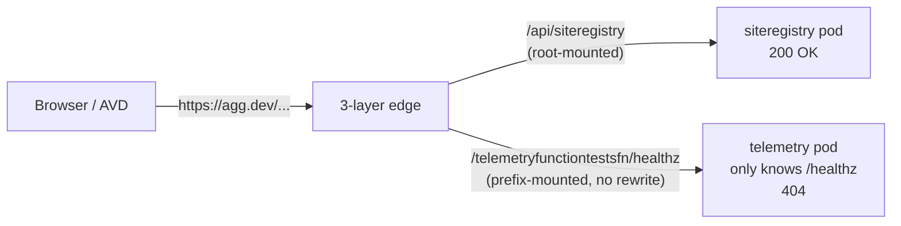
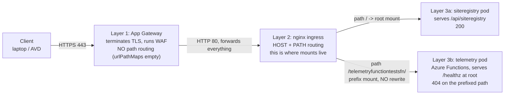
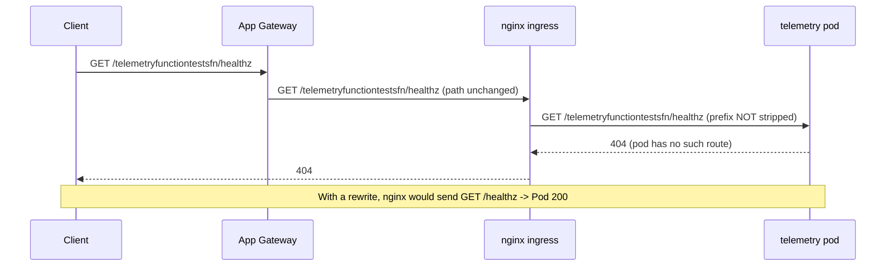

# Why one URL 404s and its sibling 200s on the very same host

**Audience:** an engineer who has never seen this stack and wants to *master* this failure class — not just copy the fix.
**Scope:** HTTP path routing through a three-layer edge (Azure Application Gateway → AKS nginx ingress → Azure Functions pod), and the single missing annotation that splits a healthy host into "works" and "404."
**Primary archetype:** RCA teaching (diagnose cause, reject false causes, verify repair), built on an engineering-concept spine (reverse-proxy path rewriting from first principles).

---

## Knowledge Contract — what you will be able to do after reading

1. **Draw** the path a request takes from a browser to the backend pod, and name what each of the three layers does.
2. **Explain** from first principles why a reverse proxy can mount a backend under a URL prefix the backend has never heard of — and why that needs a *rewrite*.
3. **Trace** why `…/telemetryfunctiontestsfn/healthz` returns `404` while `…/api/siteregistry` returns `200` on the *same* hostname, when both backends are healthy.
4. **Predict**, for any service on this edge, whether it will hit this bug — from one fact about how it is mounted.
5. **Reject** the instinctive "it's a network / AVD / firewall problem" explanation, and say exactly what evidence kills it.
6. **Defend** the diagnosis under expert challenge, and **choose** the correct fix (ingress rewrite) over the wrong ones (whitelist, new image, `kubectl edit`).
7. **Adapt** the reasoning to a nearby case (a different proxy, a different prefix) — a transfer test at the end.

This document will **not** make you able to invoke the test functions over HTTP — they are not HTTP endpoints. That boundary is part of the lesson.

---

## TL;DR picture

Before the details, hold this one image: the same front door, two corridors. One corridor (root-mounted) leads straight to a room that answers. The other (prefix-mounted) leads to a room that was never told its own door has a prefix on it — so it shrugs and says "404, no such room."



What you are looking at: one client, one hostname, one edge, two backends — and two different outcomes. The branch that decides the outcome is **how each backend is mounted at the edge**. `siteregistry` is mounted at the root `/`, so the path the client types is the path the backend expects. `telemetryfunctiontestsfn` is mounted under a *prefix*, and the edge forwards that prefix to a backend that only serves at root — so the backend rejects it. The takeaway to carry into the rest of the doc: **this is a routing-shape problem, not a health problem and not a network problem.** Every later diagram refines this one picture.

---

## First-principles ladder

Climb these in order; each rung is the smallest true statement the next one needs.

- **Term — reverse proxy.** A server that accepts a client request and forwards it to a backend on the client's behalf. The client only ever talks to the proxy.
- **Primitive — a backend has its own idea of its routes.** An HTTP app answers a fixed set of paths (here: `/`, `/healthz`). It knows nothing about how the outside world addresses it.
- **Primitive — "mounting" is the proxy's job, not the backend's.** The proxy decides *which external path* maps to *which backend*. Two common mounts: at the **root** (`/` → backend) or under a **prefix** (`/telemetryfunctiontestsfn/` → backend).
- **Invariant — the backend must receive a path it recognizes.** If the backend serves `/healthz` and receives `/healthz`, it answers. If it receives `/telemetryfunctiontestsfn/healthz`, it does not — that route does not exist.
- **Mechanism — prefix mounts require a rewrite.** When you mount a backend under a prefix, the proxy must **strip the prefix** before forwarding, or the backend sees a path it never defined. Root mounts need no rewrite because there is no prefix to strip.
- **Consequence — same host, different outcomes.** A root-mounted backend works without any rewrite; a prefix-mounted backend without a rewrite 404s every one of its own healthy routes.
- **Failure — the rewrite was dropped.** When this edge migrated proxies, the old proxy's prefix-strip setting was removed and the new proxy's equivalent (`rewrite-target`) was never added. The invariant broke silently.
- **Defense — prove it by composition.** Show the backend answers `/healthz` directly (it does), show the proxy forwards the unstripped prefix (it does), and show that adding the rewrite makes the edge answer `200` (it does, proven live).

The single sentence that holds the whole ladder: **a prefix mount is a promise to strip the prefix; break that promise and the backend 404s its own healthy routes.**

---

## The system, built up one layer at a time

Now we replace the "3-layer edge" box with what is actually inside it, and see the symptom *emerge* from the layers.



Read it layer by layer. **Layer 1, the Application Gateway**, only terminates TLS and runs a web-application firewall; it has no URL path map, so it forwards every path to the next layer unchanged. That is why it cannot be the culprit — it does not even look at the path to make routing decisions, and a firewall block would be a `403`, not a `404`. **Layer 2, the nginx ingress**, is where the real routing decisions live: it matches the hostname and the path and picks a backend. This is the only layer that knows about "mounts." **Layer 3** is the two backends. The siteregistry pod is mounted at `/`, so the path arrives intact and it answers. The telemetry pod is mounted under a prefix with no rewrite, so nginx forwards the whole prefixed path and the pod 404s.

The pressure point is the **Layer 2 → Layer 3b arrow**: a prefix mount with no rewrite. Change that one arrow (add the rewrite) and the `404` becomes a `200`. The mental model to keep: **only the middle layer routes; the front layer just carries bytes; the back layer only knows its own routes.** Next we add *time* — the exact order of who-sees-what — because the ordering is what makes the cause testable rather than a guess.

---

## Mechanism over time — where exactly the 404 is born

A static picture can hide *which* component produced the status code. A sequence diagram fixes the order so the cause is unambiguous.



Follow the arrows. The client asks for the prefixed path. The App Gateway passes it along untouched. nginx — because there is no rewrite — also passes the *full, prefixed* path to the pod. The pod looks up `/telemetryfunctiontestsfn/healthz` in its route table, finds nothing, and returns `404`. nginx faithfully relays that `404` back. The note shows the counterfactual: with a rewrite, the third arrow would carry `/healthz`, and the pod would answer `200`.

This ordering is the proof that the `404` is *born at the pod*, not invented by the proxy. Two independent observations confirm it: the nginx access log shows the request routed to the telemetry pod's IP and the pod returning `404`; and port-forwarding directly to the pod (bypassing nginx entirely) reproduces the exact `404` on the prefixed path while `/healthz` returns `200`. The takeaway: **time ordering turns "something is broken somewhere" into "the pod 404s the prefixed path, and the proxy never stripped the prefix."** That is a falsifiable claim, and the next ASCII model is the one you can redraw from memory under pressure.

---

## The local mental model (redraw this from memory)

Keep this tiny diagram in your head; it is the whole bug in five lines.

```text
   CLIENT TYPES                 NGINX FORWARDS              POD KNOWS        RESULT
   ------------                 --------------              ---------        ------
   /api/siteregistry      -->   /api/siteregistry     -->   yes (root)   -->  200
   /telemetryfn.../healthz -->  /telemetryfn.../healthz -->  NO           -->  404   <-- no rewrite
   (with rewrite)         -->   /healthz               -->   yes          -->  200   <-- fix
```

What this captures: the middle column is the only thing that changes between "broken" and "fixed." Root-mounted services have an identical left and middle column, so they always work. Prefix-mounted services have a *longer* middle column than the pod expects — unless a rewrite shortens it back. The fix does not touch the client, the pod, or the network; it edits the middle column. If you can redraw these three rows, you can explain the entire incident at a whiteboard.

---

## Decision / evidence surface — triage this class in five steps

This is the ladder to run when someone says "X is not accessible from AVD." It is ordered so each rung eliminates a whole family of causes.

```text
[1] curl the URL -> what status?
      timeout / connection refused  --> network/DNS/firewall problem (STOP, different playbook)
      403                           --> WAF/auth problem (STOP, different playbook)
      404 over a healthy TLS connect --> path-routing problem -> go to [2]
[2] does a SIBLING path on the same host return 200?
      no   --> the whole edge/cluster may be down -> widen scope
      yes  --> edge + cluster are fine; it's ONE service's mount -> go to [3]
[3] kubectl get ingress <svc> -> is it a PREFIX path with NO rewrite-target?
      yes  --> root cause found -> go to [4]
[4] port-forward to the pod: does /healthz = 200 at the ROOT?
      yes  --> app healthy; only the ingress prefix is wrong -> go to [5]
[5] FIX: add use-regex + rewrite-target:/$2 to the chart values, merge, deploy, re-curl -> 200
```

Reading the ladder: the first rung is the highest-value one, because the *shape* of the failure (timeout vs 403 vs 404) instantly routes you to the right family of causes. Most wasted on-call time on this class comes from skipping rung 1 and assuming "not accessible" means "network." A clean `404` over a completed TLS handshake is the system telling you the connection is fine and the path is wrong. Rungs 2–4 then narrow from "the edge" to "one service's mount" to "the app is healthy, only routing is wrong," so by rung 5 the fix is obvious and surgical. The takeaway: **let the status code pick your playbook before you touch anything.**

---

## Examples and counterexamples

- **Example (this incident):** `/telemetryfunctiontestsfn/healthz` → `404`. Prefix mount, no rewrite, pod serves at root. Textbook.
- **Counterexample that works (`siteregistry`):** `/api/siteregistry` → `200`. Root mount, so the typed path equals the expected path; no rewrite needed. It works *by luck of its mount point*, which is exactly why the bug is easy to miss in review — the service everyone tests happens to be the one that cannot show the bug.
- **Sibling that fails identically (`deliveryreportfn`):** `/deliveryreportfn/healthz` → `404`. Same prefix-mount-without-rewrite shape. This is the control that proves it is a *class* bug, not a one-off with the telemetry function.
- **The fix, proven (test ingress):** a throwaway ingress with `use-regex` + `rewrite-target:/$2` on a unique prefix made the edge return `200` for `/tf-rewrite-proof/healthz`. Same backend, only the mount's rewrite differed.

---

## Failure modes and anti-patterns (with the mechanism that makes each fail)

| Tempting action | Why it FAILS (mechanism) |
|---|---|
| Add the AVD IP to the whitelist / open the firewall | The host is **public** and the connection already completes (you get a `404`, not a timeout). Whitelisting changes *reachability*; the bug is *path routing*. Nothing improves. |
| Redeploy a newer image | The image is the app binary; the bug is in the **ingress** in front of it. The image was already rebuilt and it stayed `404`. |
| `kubectl edit` the live ingress to add the rewrite | Works for minutes, then the **next Helm deploy re-renders the ingress from the chart** and wipes your edit. This is literally how the bug survived ~15 redeploys. The fix must live in the chart values. |
| Treat the 2026-06-02 RCA as "the fix is done" | A diagnosis in a document does not change runtime. Only a **merged + deployed** chart change does. The fix existed on paper for 20 days while the endpoint stayed broken. |
| Point everyone at `agg.dev-mc` (which has the correct rewrite) | `agg.dev-mc` is **internal-only** (resolves to nothing on public DNS). Without an AVD whitelist it is unreachable, so it is not a same-day unblock. |

Each row shares one root error: acting on a *guess about the layer* instead of the evidence about *which layer produced the status code*.

---

## Evidence ledger (the audit trail — codes live here, not in the prose above)

| Claim | Status | Witness |
|---|---|---|
| Edge: telemetry 404, deliveryreport 404, siteregistry 200 | FACT (A1) | `evidence/01-edge-http-probes.txt` |
| Live ingress: prefix path, no rewrite-target anywhere | FACT (A1) | `evidence/02-ingress-objects.txt` |
| Backend healthy; `/healthz`=200 at root, prefixed=404, `/api/*`=404, `/admin/*`=401 | FACT (A1) | `evidence/03`, `evidence/06` |
| Deployed Helm release v230, chart 0.1.28, annotations `{}` | FACT (A1) | `evidence/05-helm-release.txt` |
| App Gateway pass-through (`urlPathMaps: []`, WAF_v2) | FACT (A1) | `evidence/07-azure-appgw.txt` |
| Rewrite annotation → public 200 (live test ingress, then deleted) | FACT (A1) | `evidence/08-live-rewrite-proof.txt` |
| The 2026-06-02 fix was never merged | FACT (A1) | canonical chart on the ADO default branch still has no rewrite, `evidence/11` |
| `pathType: Prefix` + regex is rejected by nginx admission → `ImplementationSpecific` required | FACT (A1) | `evidence/09` |
| WHO should own the chart merge | UNVERIFIED (A3) | org-attribution; not assignable from CLI tooling |

The diagnosis and the fix rest entirely on directly-observed facts, including a live `200` and a direct read of the canonical chart at the source. The only soft item left is *who* should own the merge — process, not mechanism.

---

## Challenge-defense (survive an expert's questions)

- **"How do you know it is the proxy and not the app?"** Port-forwarding straight to the pod (no proxy in the path) reproduces the `404` on the prefixed path while `/healthz` returns `200`. The app is healthy; it simply has no route for the prefixed path.
- **"What else could explain a 404 — could it be the App Gateway or WAF?"** The App Gateway has no URL path map at all, so it cannot single out one path; and a WAF block returns `403`, not `404`. Hitting nginx directly reproduces the same split, so the front layer is innocent.
- **"What would falsify your explanation?"** An edge `200` on the prefixed path with no rewrite present, or a backend that returns `200` for the prefixed path when port-forwarded. Neither occurs — I re-checked the edge at the end and it was still `404`.
- **"Why is adding a rewrite guaranteed to work and not just plausible?"** Because the backend already returns `200` for `/healthz`, and a live test ingress with the rewrite produced a public `200` for the same backend. The effect was observed, not predicted.
- **"Where does this abstraction leak?"** The rewrite restores `/healthz`, but it does **not** create HTTP function endpoints — this host exposes none among the paths probed (`/api/*`=404, `/admin/*`=401). The `*fn` functions run on timers/Kafka, not HTTP, so `/healthz` reachability is the whole achievable goal. (A wrinkle the deploy must respect: nginx rejects a regex path under `pathType: Prefix`, so the chart's template must set `pathType: ImplementationSpecific` — proven live.)

---

## Self-test (rebuild the reasoning, don't recall trivia)

Answer these from the mental model, then check yourself.

1. On the same hostname, `/a/foo` returns `200` and `/b/foo` returns `404`, both backends healthy. In one sentence, what is the most likely cause and the one ingress fact you would check first?
   *Answer:* `/b` is probably prefix-mounted without a `rewrite-target` while `/a` is root-mounted; check the `/b` ingress for a prefix path and a missing `nginx.ingress.kubernetes.io/rewrite-target`.
2. A teammate "fixes" it with `kubectl edit ingress` and it works. Why will it break again, and when?
   *Answer:* the ingress is Helm-managed; the next deploy re-renders it from the chart and drops the manual edit. It breaks on the next `HelmDeploy`.
3. The endpoint is still `404` even though the curl connects instantly and TLS succeeds. Which family of causes can you immediately rule out, and why?
   *Answer:* network/DNS/firewall/whitelist — those produce timeouts or refused connections, not a clean `404` over a healthy TLS handshake.
4. **Transfer (near case):** the same app sits behind an OpenShift `Route` instead of an nginx `Ingress`, also prefix-mounted, also `404`. What is the equivalent fix?
   *Answer:* add the HAProxy/OpenShift equivalent rewrite — `haproxy.router.openshift.io/rewrite-target: /` on the Route. Same invariant (strip the prefix), different proxy annotation. (This is exactly what the canonical `agg.dev-mc` deployment already does.)

**Success condition:** you can reconstruct, unaided, the chain *prefix mount → no rewrite → backend sees unknown path → 404 → add rewrite → 200*, and you can name the proxy-specific rewrite for at least two proxies.

---

## Durable principles (carry these to the next incident)

1. **The status code picks the playbook.** Timeout ≠ 403 ≠ 404. A clean `404` over a healthy connection is a path problem; stop reaching for the network.
2. **A prefix mount is a promise to strip the prefix.** Any reverse proxy mounting a backend under a prefix must rewrite the path, or the backend 404s its own healthy routes.
3. **A working sibling is a gift.** If one path on a host returns `200`, the edge and cluster are fine and you have narrowed the bug to one service's mount in a single curl.
4. **Verify against the deployed render, not the repo clone.** Decode the live release; a stale clone will lie about what is actually running.
5. **A fix is the merged, deployed chart change — not the RCA that describes it.** The most expensive failure here was organizational: a correct fix that nobody landed.
