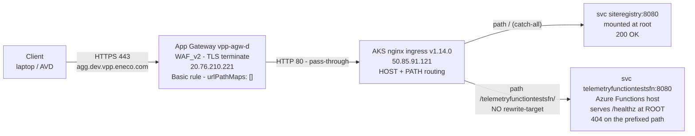
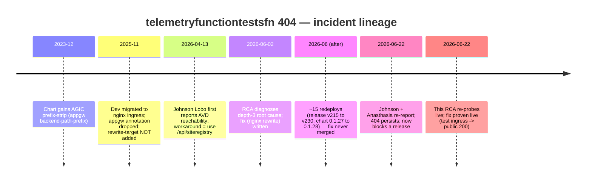

# RCA — `telemetryfunctiontestsfn/healthz` 404 on `agg.dev.vpp.eneco.com` (recurrence)

> **Incident class:** developer-tooling — aggregation test-function unreachable from AVD, blocking an e2e release gate.
> **Severity:** MEDIUM (it now blocks a release; the function itself is dev-only QA, no production/trade/customer impact). The recurring *class* is the real problem.
> **Diagnosis status:** Verified Root Cause (depth 3), confirmed live this session in seven independent ways — including a live, reversible proof that the fix produces a public `200`.
> **Relationship to prior work:** this is the **same root cause** as [`2026_06_02_vpp_aggregation_az_functions_not_visible_avd`](../2026_06_02_vpp_aggregation_az_functions_not_visible_avd/rca.md). That RCA diagnosed it correctly and proposed the fix. The fix was never merged.

---

## Executive summary

Two developers (Johnson Lobo, then Anasthasia) reported that `https://agg.dev.vpp.eneco.com/telemetryfunctiontestsfn/healthz` is "not accessible from AVD," while a sibling URL on the **same host** — `https://agg.dev.vpp.eneco.com/api/siteregistry` — works fine. Anasthasia needs the health endpoint to run an end-to-end test that gates today's release, so a small routing bug has become a release blocker.

The aggregation layer's dev edge is a three-layer pipe: an Azure **Application Gateway** terminates TLS and forwards everything to an **AKS nginx ingress**, which does the host-and-path routing to backend pods. The `telemetryfunctiontestsfn` backend is a stock **Azure Functions** container that serves its health check at the URL root — `/healthz`. Its nginx ingress mounts it under the path **prefix** `/telemetryfunctiontestsfn/`, but does **not** strip that prefix before forwarding. So nginx hands the backend the literal path `/telemetryfunctiontestsfn/healthz`, the Functions host has no such route, and it answers **404**. `siteregistry` escapes the bug only because it is mounted at `/` — there is no prefix to strip.

The visible symptom is a clean **404 over a healthy TCP/TLS connection** — not a timeout, not a 403. That single fact rules out the whole family of "network/AVD/firewall/whitelist" causes people instinctively reach for: the host is public, the connection completes, the edge is up and routing. The problem is purely *which path* nginx forwards.

This is not a new incident. On 2026-06-02 the same endpoint, same reporter, same mechanism was diagnosed to a depth-3 root cause and a fix was written: add the nginx `rewrite-target` annotation to the chart's ingress values. Twenty days later I re-probed everything live: the endpoint is still 404, and the live ingress still has **no** rewrite annotation — even though the service has been redeployed roughly fifteen times since (Helm release `v215`→`v230`, chart `0.1.27`→`0.1.28`, image rebuilt) in that window. I then read the canonical chart directly from Azure DevOps on its default branch (`development`): its `values.yaml` still carries `annotations: {}` and the template still hard-codes `pathType: Prefix` — so **the documented fix was never merged into the chart**, confirmed at the source, not merely inferred from the runtime. The most important corrective action is therefore organizational as much as technical — get the rewrite into the chart and deployed, and add a per-function health probe so this class can never silently regress again.

I proved the fix end-to-end this session without touching the managed service: I created a throwaway test ingress on a unique path with the proposed `use-regex` + `rewrite-target: /$2` annotations pointing at the same backend, and `https://agg.dev.vpp.eneco.com/tf-rewrite-proof/healthz` returned **`200 Healthy`** through the public edge. Then I deleted the test ingress and confirmed the managed paths were unchanged (telemetry still 404, siteregistry still 200). The fix is not an inference; it is a witnessed result. One sharp detail the proof surfaced: the deployable form is a **two-file** chart change — add the rewrite annotations to `values.yaml` **and** switch the template's hard-coded `pathType: Prefix` to `ImplementationSpecific`, because the ingress admission webhook *rejects* a regex path under `pathType: Prefix` (I confirmed that rejection live too). A values-only change would be denied at deploy.

What a future engineer should remember: **"not visible from AVD" plus a clean 404 and a working sibling path is a path-routing bug, not a network bug** — and a fix that lives only in an RCA document is not a fix until it is in the chart and deployed.

---

## Context Ledger (zero-context reader: read this table first)

| Term | What it is | Code / resource artifact | Relevance to THIS incident |
|------|-----------|--------------------------|----------------------------|
| **VPP** | Virtual Power Plant — Eneco's platform aggregating distributed energy assets into market-actionable volume | repos under `enecomanagedcloud/Myriad - VPP` | The aggregation layer is part of VPP |
| **Aggregation Layer** | VPP subsystem: ingests telemetry, computes merit order, produces delivery reports | repo `Eneco.Vpp.Aggregation` | Hosts the function that 404s |
| **AVD** | Azure Virtual Desktop — developers' restricted jump host into the CMC/Azure network | — | The vantage point both reporters used; **not** the cause |
| **CMC** | (Customer) Managed Cloud — Eneco's managed Azure landing zone | subs `*-sb` (Sandbox) / `-acc` / `-prd` | `agg.dev` lives in the Sandbox sub used as dev |
| **`agg.dev.vpp.eneco.com`** | Public hostname for the dev aggregation edge | DNS A → `20.76.210.221` | The host in the failing URL |
| **`telemetryfunctiontestsfn`** | A **QA test-only** Azure Function (publishes mock telemetry → Kafka, validates ← CosmosDB) | k8s `svc/deploy telemetryfunctiontestsfn` in ns `vpp-agg` | The function the reporters cannot reach |
| **`deliveryreportfn`** | Another prefix-mounted `*fn` test function | k8s objects in ns `vpp-agg` | Control: it 404s identically → proves a class bug |
| **`siteregistry`** | Aggregation API used as the "this works" example | k8s objects in ns `vpp-agg` | The 200 control; works because mounted at `/` |
| **App Gateway (`vpp-agw-d`)** | Azure Application Gateway, WAF_v2, terminates TLS for `*.dev.vpp.eneco.com` | RG `rg-vpp-app-sb-401`, PIP `vpp-awg-ip-d` `20.76.210.221` | The public front; pass-through, **not** the cause |
| **nginx ingress** | Kubernetes ingress controller doing host+path routing in AKS | ns `ingress-nginx`, controller `v1.14.0`, LB `50.85.91.121` | Where the broken path routing lives |
| **`rewrite-target`** | nginx-ingress annotation that rewrites the path before forwarding to the backend | `nginx.ingress.kubernetes.io/rewrite-target` | **Missing** here → root cause |
| **AGIC** | Azure Application Gateway Ingress Controller — a *different* controller reading `appgw.*` annotations | annotation `appgw.ingress.kubernetes.io/backend-path-prefix` | The chart was written for AGIC; dev now runs nginx |
| **PathBase** | ASP.NET Core / Azure Functions host setting that makes an app serve under a URL prefix | (app config) | Not set → app serves at root, so the prefix must be stripped at the ingress |
| **Helm release** | The deployed, versioned render of a chart, stored as a cluster Secret | `sh.helm.release.v1.telemetryfunctiontestsfn.v230` | The source of truth for what is *actually* deployed |

**Zero-context reader test:** a new engineer who reads only this table should understand every term used below.

---

## Evidence Ledger (where the codes live — the narrative above stays in plain words)

- **A1 FACT** — externally witnessed: command + captured output or a URL anyone can re-run.
- **A2 INFER** — derived from A1s by named reasoning.
- **A3 UNVERIFIED[blocked: reason]** — not probed; blocking reason + resolving path named.

All A1 facts were captured **2026-06-22 (this session)** from Mr. Alex's laptop on the open internet plus a read-only `kubectl`/`az` session (`Alex.Torres@eneco.com`, Sandbox sub `7b1ba02e-…`, AKS `vpp-aks01-d`). Raw captures live next to this file under [`evidence/`](./evidence/).

| # | Claim | Label | Witness (file = re-runnable capture) |
|---|-------|-------|--------------------------------------|
| E1 | Edge: `/telemetryfunctiontestsfn/healthz`→404, `/deliveryreportfn/healthz`→404, `/api/siteregistry`→200 | A1 | [`evidence/01-edge-http-probes.txt`](./evidence/01-edge-http-probes.txt) |
| E2 | `/telemetryfunctiontestsfn` (no trailing slash) → `301`→`http://` (plaintext downgrade); `/telemetryfunctiontestsfn/` (trailing) → `404` | A1 | [`evidence/01-edge-http-probes.txt`](./evidence/01-edge-http-probes.txt) |
| E3 | Live ingress: telemetry path `/telemetryfunctiontestsfn/` Prefix, className nginx, **no rewrite-target / use-regex anywhere** | A1 | [`evidence/02-ingress-objects.txt`](./evidence/02-ingress-objects.txt) |
| E4 | Backend healthy: deploy 1/1, pod Running, svc `10.2.155.205:8080`, endpoint `10.0.2.43:8080` | A1 | [`evidence/03-workload-health.txt`](./evidence/03-workload-health.txt) |
| E5 | nginx controller `v1.14.0`, LB `50.85.91.121` | A1 | [`evidence/04-nginx-controller.txt`](./evidence/04-nginx-controller.txt) |
| E6 | Deployed Helm release `v230`, chart `0.1.28`, `ingress.annotations: {}`, image `adhoc-0.0.1.1479` | A1 | [`evidence/05-helm-release.txt`](./evidence/05-helm-release.txt) |
| E7 | Backend (port-forward): `/`→200, `/healthz`→200 `Healthy`, `/telemetryfunctiontestsfn/healthz`→404, `/api/*`→404, `/admin/*`→401 | A1 | [`evidence/06-backend-portforward.txt`](./evidence/06-backend-portforward.txt) |
| E8 | App Gateway `vpp-agw-d`: `urlPathMaps: []`, Basic rules, WAF_v2, backend → `50.85.91.121`; PIP `vpp-awg-ip-d` | A1 | [`evidence/07-azure-appgw.txt`](./evidence/07-azure-appgw.txt), [`evidence/07b-resourcegraph-pip.txt`](./evidence/07b-resourcegraph-pip.txt) |
| E9 | **Live fix proof:** test ingress (`pathType: ImplementationSpecific`) with `use-regex`+`rewrite-target:/$2` → `/tf-rewrite-proof/healthz`→**200**; managed paths unchanged; test ingress deleted | A1 | [`evidence/08-live-rewrite-proof.txt`](./evidence/08-live-rewrite-proof.txt) |
| E10 | The 2026-06-02 fix was never merged — canonical chart on ADO default branch `development` still has `values.ingress.annotations: {}` and `templates/ingress.yaml` hard-codes `pathType: Prefix`; no rewrite anywhere | A1 | [`evidence/11-ado-canonical-chart.txt`](./evidence/11-ado-canonical-chart.txt) |
| E11 | No rewrite/prefix-routing PR exists; the only completed ingress/404-titled PRs (className-configurable ingress; an app-level 404) are unrelated | A1 | [`evidence/11-ado-canonical-chart.txt`](./evidence/11-ado-canonical-chart.txt) |
| E12 | `pathType: Prefix` + a regex path is **rejected** by the nginx admission webhook (`cannot be used with pathType Prefix`) → `ImplementationSpecific` is required | A1 | [`evidence/09-prefix-regex-proof.txt`](./evidence/09-prefix-regex-proof.txt) |
| E13 | `deliveryreportfn` backend serves `/`→200 but `/healthz`→**404** (no `/healthz` route) — its rewrite restores liveness via `/deliveryreportfn/`, not `/healthz` | A1 | [`evidence/10-deliveryreportfn-backend.txt`](./evidence/10-deliveryreportfn-backend.txt) |
| E14 | *Who* should own the chart merge | A3 | org-attribution; not assignable from CLI tooling |

**Confidence:** the diagnosis, the fix, and "the fix was never merged" are now **100% directly witnessed** (E1–E13), including a live public `200`, the admission-webhook rejection of the wrong shape, and a direct read of the canonical chart on its default branch. The *only* item tooling cannot settle is **E14 — who should own the merge** — a one-row org-attribution question, not a mechanism gap. There is no open contradiction (I re-ran the edge probe last and it was still 404). What would lower confidence fastest: an edge `200` on the prefixed path somewhere I did not probe — there is none.

---

## The one-sentence root cause

The `telemetryfunctiontestsfn` Azure-Functions container serves `/healthz` at its **root**, but its **nginx ingress mounts it under the path prefix `/telemetryfunctiontestsfn/` with no `rewrite-target`**, so nginx forwards the *unstripped* path `/telemetryfunctiontestsfn/healthz` to an app that only knows `/healthz` → **404**. The fix that closes this was written on 2026-06-02 and never merged.

---

## L1 — Business — Why the aggregation layer exists

**Anchor question: why does this system exist, and who is blocked?**

The VPP Aggregation Layer turns thousands of distributed energy assets into market-actionable aggregates: it ingests telemetry, computes merit order, prepares market input, and produces delivery reports. Developers and QA validate this pipeline in **dev** before acceptance and production. The `*fn` **test functions** (`telemetryfunctiontestsfn`, `deliveryreportfn`, …) exist only to drive and validate that pipeline in non-prod — they publish mock telemetry to Kafka and assert results in CosmosDB. They are explicitly *never deployed to production*.

Who is blocked: first Johnson Lobo, now **Anasthasia**, doing e2e/QA work from AVD. Anasthasia's note makes the stakes concrete: *"This function should be accessible from AVD so that I can execute my e2e tests today which is needed to be able to release."* So the impact is **developer productivity gating a release** — higher urgency than the prior incident, but still **no trade, market, or customer impact** (the function is dev-only). The health endpoint is the e2e harness's liveness gate; without a `200` it will not proceed.

---

## L2 — Repo system

**Anchor question: which code/config repos can change this outcome?**

| Repo | Role in this incident | Source |
|------|-----------------------|--------|
| `Eneco.Vpp.Aggregation` | App code **and** the legacy Helm charts (`azure-pipeline/Helm/<svc>/`) that render the live nginx ingress | [ADO repo](https://dev.azure.com/enecomanagedcloud/Myriad%20-%20VPP/_git/Eneco.Vpp.Aggregation) |
| `Eneco.Vpp.Aggregation.GitOps` | Canonical GitOps values for the **OpenShift** deployment (`agg.dev-mc`), where the Route rewrite is already correct | ADO (`Myriad - VPP`) |
| `Eneco.Vpp.Aggregation.Infrastructure[.Mc]` | Terraform for the aggregation infra (cluster/DNS/App Gateway) — not the cause | ADO (`Myriad - VPP`) |

The fix in L8 changes exactly **one file** in the first repo: the ingress block of the `telemetryfunctiontestsfn` chart values (and the same change for the other prefix-mounted `*fn`). No app-code change is needed — the app is healthy and correct; the wiring around it is wrong.

> **Caveat on local clones:** the aggregation repos are cloned at `…/eneco-src/enecomanagedcloud/myriad-vpp/`, but they are months stale and read-only here. Every current-state claim in this RCA comes from **live cluster + Azure probes this session**, not the clones — which is exactly the discipline the 2026-06-02 RCA established and which this RCA re-applies.

---

## L3 — Runtime architecture (the request's journey)

**Anchor question: which deployed pieces does the request touch, and where does the 404 originate?**

Here is the path a request takes from the developer's browser to the backend pod. Watch the third hop — it is where the two URLs diverge.



Reading the diagram: the client speaks TLS to the **App Gateway**, which I confirmed does *no* path-based routing (`urlPathMaps: []`, Basic rules) — it just forwards everything to the nginx LoadBalancer. So the App Gateway and its WAF are pass-through and cannot be the cause; a WAF block would be a `403`, and we see a `404`. The decision that matters happens at **nginx**: for `siteregistry` the rule is the catch-all `/`, so the request reaches a backend mounted at root and succeeds. For `telemetryfunctiontestsfn` the rule is the **prefix** `/telemetryfunctiontestsfn/`, and because there is no rewrite, nginx forwards the *whole* path — prefix included — to a backend that only serves at root. That is the fork in the road that produces a `200` on one URL and a `404` on its sibling.

I proved the App Gateway is innocent two ways: it has no path map at all (so it cannot be filtering one path and not another), and hitting the nginx LoadBalancer directly with the right `Host` header reproduces the exact same split (siteregistry 200, telemetry 404). The one mental model to keep: **on this edge, the App Gateway moves bytes; nginx makes routing decisions.** The next section drops one layer further — into the backend itself — to show *why* the prefixed path 404s even when you bypass nginx entirely.

---

## L4 — Application code flow (why the backend itself 404s the prefix)

**Anchor question: what does the failing backend actually serve, and why does the prefix 404 even without nginx?**

The backend is a stock **Azure Functions** host in a container. To see what *it* believes its routes are — with nginx completely out of the picture — I port-forwarded straight to the pod and probed it directly:

| Request to the backend (port-forward `svc:8080`) | Result | What it tells us |
|---|---|---|
| `GET /` | **200** — "Your Azure Function App is up and running." | the Functions default page; host is alive |
| `GET /healthz` | **200** — `Healthy` | health is served at the **root** |
| `GET /telemetryfunctiontestsfn/healthz` | **404** | the app has no route for the prefixed path |
| `GET /api/siteregistry` | **404** | no such function on this host |
| `GET /admin/host/status` | **401** | admin API exists but is master-key protected |

This table is the heart of the diagnosis. The app serves health at `/healthz` and has **no PathBase** for the `/telemetryfunctiontestsfn` prefix — it 404s the prefixed path even when you reach it directly, with nginx removed from the equation. There is no app-side awareness of the mount point. Therefore, for any edge request under `/telemetryfunctiontestsfn/...` to succeed, **something must strip the prefix before the app sees it**, and right now nothing does. Contrast `siteregistry`, mounted at `/`: its root routes are directly reachable from the edge, so it works by luck of mount point.

There is a second, important thing this table tells us, and it sharpens what "fixed" even means. The `/api/*` paths 404 and `/admin/*` returns 401: **this host exposes no HTTP-invocable functions.** That is consistent with the test functions being timer/Kafka-triggered, not HTTP endpoints. So `/healthz` is the *only* meaningful HTTP surface here, and the reporter's request is precisely a **host-liveness check** — which is the achievable, intended goal. The fix below restores `/healthz`; it does not (and need not) "enable function invocation," because invocation does not happen over HTTP on this host.

The mental model to carry forward: **a reverse proxy can mount a backend under a path the backend has never heard of; unless the proxy rewrites the path, the backend answers 404 to its own healthy routes.** The next section shows that the live infrastructure, the deployed chart, and the running workload all agree on exactly this shape.

---

## L5 — IaC / state / Azure — the three truths

**Anchor question: do the declared spec, the deployed release, and the running workload agree?**

A reliable way to avoid chasing ghosts is to check three independent "truths" and see whether they line up.

**Truth 1 — what the live Ingress object says** (from `kubectl get ingress -n vpp-agg`, [`evidence/02`](./evidence/02-ingress-objects.txt)):

| Ingress | path | pathType | className | annotations | backend |
|---------|------|----------|-----------|-------------|---------|
| `siteregistry-ingress` | `/` | Prefix | nginx | only `meta.helm.sh/*` | `siteregistry:8080` |
| `telemetryfunctiontestsfn-ingress` | `/telemetryfunctiontestsfn/` | Prefix | nginx | only `meta.helm.sh/*` (**no rewrite-target**) | `telemetryfunctiontestsfn:8080` |
| `deliveryreportfn-ingress` | `/deliveryreportfn/` | Prefix | nginx | only `meta.helm.sh/*` | `deliveryreportfn:8080` |

**Truth 2 — what the deployed Helm release says** (decoded live release Secret `…telemetryfunctiontestsfn.v230`, chart `0.1.28`, [`evidence/05`](./evidence/05-helm-release.txt)):

```yaml
# chart default ingress (chart 0.1.28, as deployed):
ingress:
  className: nginx
  annotations: {}                 # <-- EMPTY. no appgw annotation, no rewrite-target
  path: /telemetryfunctiontestsfn/
  hostname: agg.dev.vpp.eneco.com
# deployed overrides: only image.tag=adhoc-0.0.1.1479 and ingress.hostname
```

**Truth 3 — what the workload is doing** (from `kubectl get deploy,svc,endpoints,pod`, [`evidence/03`](./evidence/03-workload-health.txt)): deploy `1/1`, pod `Running`, service `10.2.155.205:8080`, endpoint `10.0.2.43:8080` — all healthy.

The three truths **agree**: the ingress mounts a prefix; nothing strips it; the app serves at root; the app is healthy. That is a clean **404 by path mismatch**, not an outage. And it tells us where to look for *why this is still broken* — Truth 2 carries the timeline-relevant fingerprint: chart `0.1.28` (a bump from June's `0.1.27`) and image `1479` (a rebuild from June's `1457`), yet the ingress annotations are still `{}`. The service has been actively redeployed; the fix simply was never in those deploys.

---

## L6 — The pipeline and how it actually runs (how this got mis-wired, and why it stayed broken)

**Anchor question: how does source become runtime, and why did a known fix never reach it?**

There are **two parallel deployment eras** for these workloads:

| | **LIVE & broken** (what the reporters hit) | **Canonical / modern** |
|---|---|---|
| Host | `agg.dev.vpp.eneco.com` (**public**) | `agg.dev-mc.vpp.eneco.com` (**internal-only**, resolves NXDOMAIN publicly) |
| Cluster | AKS `vpp-aks01-d`, ns `vpp-agg` | OpenShift, ns `eneco-vpp-agg` |
| Routing | nginx `Ingress`, prefix, **no rewrite** | OpenShift `Route` with `haproxy.router.openshift.io/rewrite-target: /` (**correct**) |
| Deploy | ADO `HelmDeploy@0 upgrade` direct to AKS | CD pushes image tag → GitOps repo → ArgoCD sync |
| Source | `Eneco.Vpp.Aggregation/azure-pipeline/Helm/<svc>/` | `Eneco.Vpp.Aggregation.GitOps/Helm/<svc>/dev/values.yaml` |

**How the bug was born:** the legacy chart was originally written for the **Azure Application Gateway Ingress Controller (AGIC)**, whose prefix-strip mechanism is `appgw.ingress.kubernetes.io/backend-path-prefix`. When dev was migrated to a standalone **nginx** ingress, the chart was updated to `className: nginx` and the appgw annotation was dropped — but the nginx equivalent, `rewrite-target`, was never added. AGIC stripped the prefix; nginx does not. The prefix-strip silently fell on the floor during the migration. This is a **migration gap**, not a code regression in the function.

**Why it is still broken twenty days later** — this is the new finding of *this* incident. The 2026-06-02 RCA diagnosed exactly this and wrote the fix. Yet the live release is now `v230` (it was `v215` in June) and the chart is `0.1.28` (it was `0.1.27`), so the service has been redeployed on the order of fifteen times since — and the ingress annotations are still empty. I settled this at the source rather than leaving it an inference. **Directly observed** on the canonical chart's default branch (`development`) in Azure DevOps: the `values.yaml` still has `annotations: {}` and `templates/ingress.yaml` still hard-codes `pathType: Prefix` — no rewrite has ever been merged. The only completed PRs whose titles touch ingress or 404 are unrelated (one made the ingress class configurable; one changed an app-level 404 response). So — this is directly observed at the source, not inferred — the documented fix was **never merged into the chart**, and every subsequent deploy faithfully re-rendered the broken ingress. A correct diagnosis that lives only in an RCA file does not change runtime; only a merged chart change does. The one thing tooling cannot assign is *who* should own that merge — an organizational question, not a probe.

`agg.dev-mc` (OpenShift/GitOps) was built correctly with a Route rewrite, so it would not have this bug — but it resolves **NXDOMAIN on public DNS** (I confirmed this: `dig agg.dev-mc.vpp.eneco.com` returns nothing). It is internal-only and needs an AVD whitelist, which is why developers keep using the public `agg.dev` that carries the bug. So fixing `agg.dev` directly is the primary action; consolidating onto `agg.dev-mc` is a strategic follow-up, not a same-day unblock.

---

## L7 — Timeline

**Anchor question: what happened, when — and what does the time ordering prove?**



The time ordering carries the argument. The bug is older than any single report; the migration in late 2025 is the design-level origin. The crucial gap is between **2026-06-02** (fix written) and **2026-06-22** (still broken) — and the fact that ~15 deploys happened *inside* that gap without the fix is what turns "the fix is pending" into "the fix was never merged." Time here is not decoration; it is the evidence that distinguishes a slow rollout from a dropped action.

---

## L8 — Fix

**Anchor question: what changes, what does not, and why?**

The function is healthy; only the **edge path routing** is wrong. There are two horizons: an immediate unblock the reporter can do today, and the permanent chart change.

### Immediate unblock for the reporter (today, no PR, no infra change)

There is currently no working edge path to the telemetry host. Until the chart PR lands, reach the backend directly with a port-forward (needs `kubectl` to AKS `vpp-aks01-d`, which AVD devs have):

```bash
kubectl -n vpp-agg port-forward svc/telemetryfunctiontestsfn 8080:8080
# then, in another shell or the browser:
curl http://localhost:8080/healthz        # -> 200 Healthy
```

This confirms the test-function host is alive — exactly what `/healthz` is for. If Anasthasia's e2e harness can target a configurable base URL, point it at `http://localhost:8080`; if it is hard-wired to the public `…/telemetryfunctiontestsfn/healthz`, only the permanent fix below will satisfy it.

### Permanent fix (RECOMMENDED) — add the nginx rewrite (a TWO-file chart change)

This is a **two-file** change. The template hard-codes `pathType: Prefix`, and nginx **rejects a regex path under `pathType: Prefix`** at admission time — so the path type must change, and only the template sets it. A values-only edit would be denied at deploy.

- **Repo:** `Eneco.Vpp.Aggregation`

**File 1 — `azure-pipeline/Helm/telemetryfunctiontestsfn/values.yaml`:**

```diff
 ingress:
   enabled: true
   className: nginx
   hostname: agg.dev.vpp.eneco.com
-  path: /telemetryfunctiontestsfn/
-  annotations: {}
+  path: /telemetryfunctiontestsfn(/|$)(.*)
+  annotations:
+    nginx.ingress.kubernetes.io/use-regex: "true"
+    nginx.ingress.kubernetes.io/rewrite-target: /$2
```

**File 2 — `azure-pipeline/Helm/telemetryfunctiontestsfn/templates/ingress.yaml`:**

```diff
               - path: {{ .Values.ingress.path }}
-                pathType: Prefix
+                pathType: ImplementationSpecific
```

**Why this works — witnessed, not inferred.** nginx captures everything after the prefix into `$2` and forwards `/$2` to the backend, so `/telemetryfunctiontestsfn/healthz` → backend `/healthz` → `200`. I proved this live: a throwaway test ingress with these exact annotations and `pathType: ImplementationSpecific` returned `200 Healthy` through the public edge ([`evidence/08`](./evidence/08-live-rewrite-proof.txt)). I also proved the negative — the `pathType: Prefix` form is **rejected** by the nginx admission webhook (`cannot be used with pathType Prefix`, [`evidence/09`](./evidence/09-prefix-regex-proof.txt)) — which is why File 2 is required, not optional. The fix restores `/healthz` reachability and does not create function HTTP endpoints (the host exposes none among the paths probed).

**For `deliveryreportfn` and other prefix-mounted `*fn`:** apply the same two-file change, but note its backend serves `/`→200 but `/healthz`→404 ([`evidence/10`](./evidence/10-deliveryreportfn-backend.txt)) — so its post-fix liveness check is `…/deliveryreportfn/` (banner 200), not `/healthz`.

**What this fix does NOT change / what to verify before merge:**

- `pathType: ImplementationSpecific` is **mandatory** — `use-regex: "true"` does not rescue `pathType: Prefix`; the admission webhook rejects the regex path before nginx evaluates it (the live cluster returned the rejection — evidence/09).
- It does not shadow the `/` siteregistry catch-all — confirmed live: the `ImplementationSpecific`+`use-regex` ingress coexisted with the `/` catch-all and siteregistry stayed `200` (evidence/08). Keep the post-deploy regression guard as a hard gate.
- It does not touch network, whitelist, VNET, Private Endpoint, image, or app code — none of those are the problem.
- One incidental effect: for the rewritten service the bare-prefix `301`→`http://` (see L10 #6) becomes a `200` root banner — an improvement, but the latent-301 lesson no longer applies to this service after the fix.
- Render the manifest against nginx-ingress **v1.14.0** before apply.

### Do NOT apply this with `kubectl edit`

This ingress is Helm/pipeline-managed. A manual `kubectl edit` would work for minutes and then be **overwritten by the next deploy** (`v231`) — that is precisely how this bug survived: the runtime is re-rendered from the chart on every deploy. The durable fix must be in the chart values, merged, and deployed through the normal ADO pipeline.

### Alternative (strategic, not same-day) — consolidate onto `agg.dev-mc`

The OpenShift/GitOps deployment on `agg.dev-mc.vpp.eneco.com` already has a correct Route rewrite. Pointing consumers there removes the two-era divergence, but `agg.dev-mc` is internal-only (NXDOMAIN publicly) so the AVD must be whitelisted (ServiceNow runbook, Eneco wiki page 44740). Treat this as a follow-up, not the release unblock.

---

## L9 — Verification

**Anchor question: how do we know — before and after — that the fix is right?**

**Before the fix (current, captured this session):**

```bash
curl -s -o /dev/null -w '%{http_code}\n' https://agg.dev.vpp.eneco.com/telemetryfunctiontestsfn/healthz   # 404
curl -s -o /dev/null -w '%{http_code}\n' https://agg.dev.vpp.eneco.com/api/siteregistry                    # 200
```

**Proof the fix is sound — backend already serves the target at root (captured this session):**

```bash
kubectl -n vpp-agg port-forward svc/telemetryfunctiontestsfn 18080:8080 &
curl -s -o /dev/null -w '%{http_code}\n' http://localhost:18080/healthz   # 200  -> rewrite to /healthz yields 200
kill %1
```

**Proof the rewrite produces a public 200 — witnessed live this session, then cleaned up** ([`evidence/08`](./evidence/08-live-rewrite-proof.txt)): a test ingress with `use-regex` + `rewrite-target: /$2` and `pathType: ImplementationSpecific` made `https://agg.dev.vpp.eneco.com/tf-rewrite-proof/healthz` return `200`, while the managed paths stayed unchanged. I also proved the negative: the same shape with `pathType: Prefix` is **rejected** by the nginx admission webhook ([`evidence/09`](./evidence/09-prefix-regex-proof.txt)) — which is why the fix is a two-file change (the template must set `ImplementationSpecific`). This is the strongest possible pre-merge evidence: the fix's effect was observed at the edge, not predicted.

**After the chart PR is deployed (acceptance criterion the owner runs):**

```bash
curl -s -o /dev/null -w '%{http_code}\n' https://agg.dev.vpp.eneco.com/telemetryfunctiontestsfn/healthz   # expect 200
curl -s -o /dev/null -w '%{http_code}\n' https://agg.dev.vpp.eneco.com/api/siteregistry                    # still 200 (regression guard)
```

**Falsifier:** if post-deploy the path still 404s, check (a) `use-regex` actually applied, (b) the rewrite captured group `/$2` matches the regex path, (c) the deployed release picked up the new values: `kubectl -n vpp-agg get secret -l owner=helm,name=telemetryfunctiontestsfn -o name | tail -1` then decode and confirm `ingress.annotations` is no longer `{}`.

---

## L10 — Lessons

**Anchor question: what durable knowledge does this incident produce?**

1. **"Not visible / not accessible from AVD" plus a clean 404 over a working TLS connection is a path-routing bug, not a network bug.** Network blocks give timeouts or `403`s; a `404` with a healthy connection means the edge is up and routing — look at *path routing*, not VNET/whitelist/Private Endpoint. Durable triage heuristic.
2. **A diagnosed fix is not a fix until it is merged and deployed.** This is the central lesson of the *recurrence*: a perfect depth-3 RCA from 2026-06-02 did not change runtime because the chart PR was never landed, and ~15 deploys re-rendered the broken ingress. RCAs need an owner and a tracked PR, or they decay into shelf-ware while the incident reopens.
3. **Ingress-controller migrations must translate path-rewrite annotations.** `appgw.ingress.kubernetes.io/backend-path-prefix` (AGIC) and `nginx.ingress.kubernetes.io/rewrite-target` (nginx) are not interchangeable; dropping one without adding the other silently breaks every prefix-mounted service.
4. **A service mounted at `/` hides this class of bug.** `siteregistry` works by luck of mount point, so the bug only shows on prefix-mounted services — easy to miss in review. A per-function `/healthz` smoke probe in CI would have caught it the day the migration shipped (see the toil-removal note in L8/L12).
5. **Verify against the running release, not stale clones.** The decoded live release (chart `0.1.28`, `annotations: {}`) is the truth; the months-stale local clone is not. Decode `helm get values` / live objects for any deploy-state claim.
6. **Latent (DEFER): the bare-prefix `301` redirects to `http://` on a TLS edge.** On the legacy nginx ingress a trailing-slash redirect downgrades to plaintext. Not part of this incident, but worth fixing when hardening (`force-ssl-redirect` / honour `X-Forwarded-Proto` from the App Gateway).

---

## L11 — End-to-end command playbook (reproduce this RCA from cold)

**Anchor question: can a fresh on-call rebuild every conclusion above from scratch?**

Each step states the **question** it answers, **why** the command is authoritative, the **expected output**, and the **decision rule**.

```bash
# --- Step 0. Reproduce the symptom from anywhere (the host is public) ---
# Question: is it really broken, and is a sibling path fine?
# Why authoritative: this is the exact URL the reporter uses; curl shows the raw status.
# Expected: 404 then 200.  Decision: 404 + sibling 200 => path routing, not network.
curl -s -o /dev/null -w 'telemetry=%{http_code}\n' https://agg.dev.vpp.eneco.com/telemetryfunctiontestsfn/healthz
curl -s -o /dev/null -w 'siteregistry=%{http_code}\n' https://agg.dev.vpp.eneco.com/api/siteregistry

# --- Step 1. Is the routing layer nginx, and does the bare prefix misbehave? ---
# Question: which layer answers, and is there a redirect tell?
# Expected: a 301 with Location: http://...  Decision: confirms legacy nginx prefix handling.
curl -sS -D - -o /dev/null https://agg.dev.vpp.eneco.com/telemetryfunctiontestsfn | grep -iE '^HTTP|location'

# --- Step 2. Confirm cluster context, then inspect the ingress (read-only) ---
# Question: does the live ingress strip the prefix?
# Why authoritative: the live object is the runtime truth, not the stale clone.
# Freshness probe FIRST so we are not reading a wrong cluster:
kubectl config current-context                 # expect vpp-aks01-d
kubectl -n vpp-agg get ingress telemetryfunctiontestsfn-ingress -o yaml | grep -A3 -iE 'annotations|rewrite|path:'
kubectl -n vpp-agg get ingress -o yaml | grep -iE 'rewrite-target|use-regex' || echo 'NO rewrite anywhere'
# Decision: prefix path + no rewrite-target => root cause present.

# --- Step 3. Confirm the backend is healthy and serves /healthz at ROOT ---
# Question: is the app fine and only the edge wrong?
# Why authoritative: port-forward bypasses nginx, isolating the backend.
kubectl -n vpp-agg get deploy,pod,endpoints | grep -i telemetryfunctiontests
kubectl -n vpp-agg port-forward svc/telemetryfunctiontestsfn 18080:8080 &
curl -s -o /dev/null -w 'root /healthz = %{http_code}\n' http://localhost:18080/healthz            # 200
curl -s -o /dev/null -w 'prefixed     = %{http_code}\n' http://localhost:18080/telemetryfunctiontestsfn/healthz  # 404
kill %1
# Decision: 200 at root + 404 prefixed => the app needs the prefix stripped; nginx must do it.

# --- Step 4. Confirm what is actually deployed (chart + values), no helm CLI needed ---
# Question: is the broken ingress the deployed state, and how fresh is it?
# Why authoritative: the Helm release Secret is the deployed render.
SEC=$(kubectl -n vpp-agg get secret -l owner=helm,name=telemetryfunctiontestsfn --sort-by=.metadata.name -o name | tail -1)
kubectl -n vpp-agg get "$SEC" -o jsonpath='{.data.release}' | base64 -d | base64 -d | gunzip \
  | jq '{chart: .chart.metadata.version, ingress: .chart.values.ingress, overrides: .config}'
# Decision: chart bumped + image rebuilt but annotations:{} => fix never merged.

# --- Step 5. Confirm the public front (App Gateway) is pass-through ---
# Question: could the App Gateway / WAF be filtering one path?
# Why authoritative: az reads the control plane directly.
az graph query -q "Resources | where type=~'microsoft.network/publicipaddresses' | where properties.ipAddress=='20.76.210.221' | project name,resourceGroup,subscriptionId"
az network application-gateway show -g rg-vpp-app-sb-401 -n vpp-agw-d --query "{urlPathMaps:urlPathMaps, rules:requestRoutingRules[].ruleType, sku:sku.name}"
# Decision: urlPathMaps:[] + Basic rules => no path filtering => front is innocent.

# --- Step 6. (Optional, authorized) Prove the fix live without touching the managed ingress ---
# Question: does the rewrite annotation actually yield a public 200?
# Why authoritative: a real ingress + a real edge curl is the effect, not an inference.
# Reversible: a single delete restores state.
kubectl apply -f - <<'YAML'
apiVersion: networking.k8s.io/v1
kind: Ingress
metadata: {name: tf-rewrite-proof-ingress, namespace: vpp-agg,
  annotations: {nginx.ingress.kubernetes.io/use-regex: "true", nginx.ingress.kubernetes.io/rewrite-target: /$2}}
spec:
  ingressClassName: nginx
  rules:
  - host: agg.dev.vpp.eneco.com
    http: {paths: [{path: /tf-rewrite-proof(/|$)(.*), pathType: ImplementationSpecific,
      backend: {service: {name: telemetryfunctiontestsfn, port: {number: 8080}}}}]}
YAML
sleep 8; curl -s -o /dev/null -w 'proof=%{http_code}\n' https://agg.dev.vpp.eneco.com/tf-rewrite-proof/healthz  # expect 200
kubectl -n vpp-agg delete ingress tf-rewrite-proof-ingress   # ALWAYS clean up
# Decision: 200 => the chart fix in L8 will produce the same result once deployed.

# --- Step 7. Was the fix ever merged? Read the canonical chart at the source (RESOLVED this session) ---
# Question: does the chart on the default branch carry the rewrite?
# Why authoritative: the default branch in ADO is the source of truth, not the months-stale local clone.
DEF=$(az repos show --organization https://dev.azure.com/enecomanagedcloud --project "Myriad - VPP" --repository Eneco.Vpp.Aggregation --query defaultBranch -o tsv)   # refs/heads/development
az rest --resource 499b84ac-1321-427f-aa17-267ca6975798 --method get \
  --url "https://dev.azure.com/enecomanagedcloud/Myriad%20-%20VPP/_apis/git/repositories/Eneco.Vpp.Aggregation/items?path=/azure-pipeline/Helm/telemetryfunctiontestsfn/values.yaml&versionDescriptor.version=development&versionDescriptor.versionType=branch&includeContent=true&api-version=7.0" \
  --query content -o tsv | grep -iE 'rewrite-target|annotations'
# Result this session: ingress.annotations: {} and the template hard-codes pathType: Prefix => fix NEVER merged (A1).
# Decision: the only remaining unknown is WHO should own the merge (org attribution), not a technical probe.
```

---

## L12 — One-page on-call playbook (5-minute triage for the next shift)

**Symptom:** "`agg.<env>.vpp.eneco.com/<something>fn/...` is not accessible / 404 from AVD."

1. `curl -s -o /dev/null -w '%{http_code}' https://agg.dev.vpp.eneco.com/<path>` — **404** (not timeout/403)? → it is **path routing**, not network. Skip VNET/whitelist for the **public** `agg.dev`. (The internal `agg.dev-mc`/`agg.acc` on `10.7.x` DO need an AVD whitelist — a different axis.)
2. Is a **sibling** path 200 (e.g. `/api/siteregistry`)? → edge + cluster are fine; it is one service's mount.
3. `kubectl -n vpp-agg get ingress <svc>-ingress -o yaml | grep -iE 'rewrite|path:'` — prefix path with **no** `nginx.ingress.kubernetes.io/rewrite-target`? → that is it.
4. Confirm the backend: `kubectl -n vpp-agg port-forward svc/<svc> 18080:8080` then `curl localhost:18080/healthz` → 200 means the app is healthy; only the ingress prefix is wrong.
5. **Fix:** PR the chart `values.yaml` to add `use-regex:"true"` + `rewrite-target:/$2` and path `/<svc>(/|$)(.*)` (L8). **Then confirm it was merged AND deployed** — decode the Helm release and check `ingress.annotations` is no longer `{}`. Do **not** `kubectl edit` (it drifts) and do **not** chase whitelisting or a newer image (neither fixes a prefix-rewrite bug).
6. **If this recurs again:** the technical fix is known and proven — escalate the *process* gap (the chart PR ownership), not the diagnosis.

---

## Diagnosis classification

**Verified Root Cause** (depth 3): proximate = the app 404s the prefixed path; enabling = the ingress mounts a prefix with no `rewrite-target` and the app has no `PathBase`; design = the AGIC→nginx migration dropped the prefix-strip and a documented fix was never merged. Confirmed this session by eight independent observations: (1) edge 404 + sibling 200; (2) `deliveryreportfn` control 404s identically; (3) direct-to-backend port-forward (`/healthz`=200 at root vs prefixed=404); (4) live ingress has no rewrite annotation; (5) decoded live Helm release `v230`/chart `0.1.28` still `annotations:{}`; (6) App Gateway `urlPathMaps:[]` (front innocent); (7) a live test ingress with the rewrite produced a public `200` (and the `Prefix` form was rejected by the admission webhook); (8) the canonical chart on the ADO default branch `development` still has no rewrite and hard-codes `pathType: Prefix`. These eight confirm the **diagnosis**; the **fix** is confirmed by (3)+(7). The single residual is org-attribution only — *who* should own the merge — which does not affect the diagnosis or the fix.
