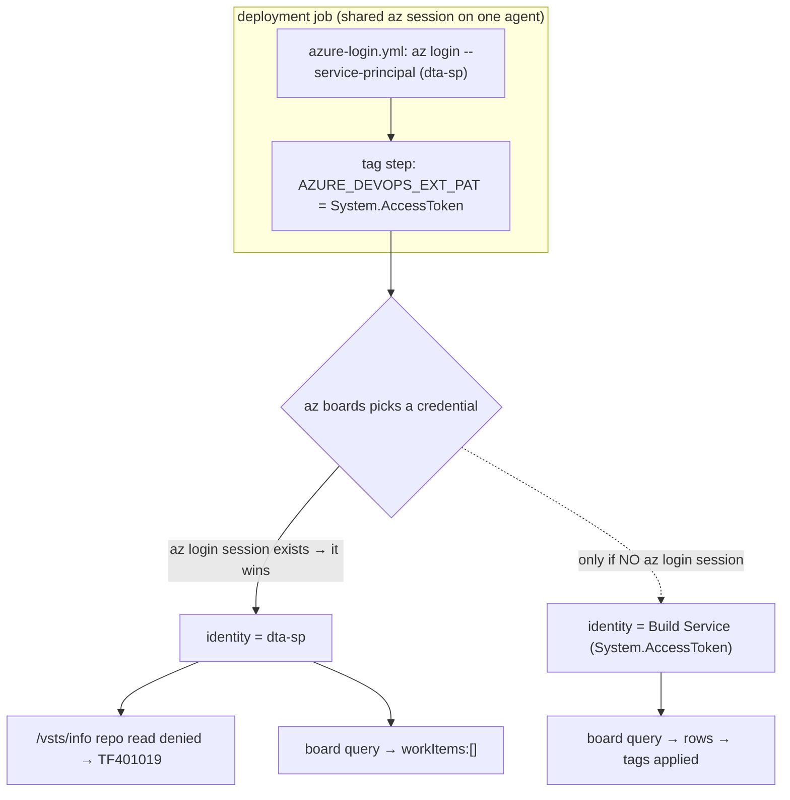
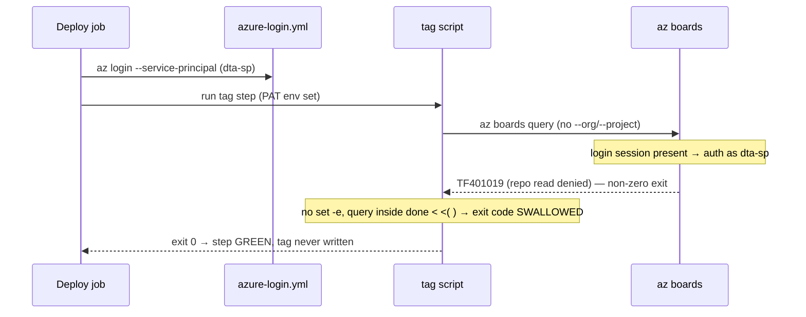

# Why BTM tagging never applies — and exactly how to fix it (so you can contribute the PR)

## Audience and scope

For Mr. Alex and the BTM team. After this you can **explain** why the tag step fails,
**reproduce** the key proof on your own laptop (read-only), **contribute** a fix PR to
`Eneco.Vpp.BehindTheMeter`, and **prove** it worked. In scope: the identity mechanism, the
two symptoms (`TF401019` and empty results), and the contributable fix. Out of scope: how
Azure Boards models work items; the Terraform deploy itself.

## What I corrected from the previous attempt (read this — it is the whole point)

The earlier write-up taught two things that turned out to be **wrong**, and you may have
relayed them. I am calling them out so you don't replicate a wrong mental model:

1. **Old lesson:** "the tag step runs as the Build Service identity; the fix is one line —
   `--detect false`." **Reality:** the tag step runs as the **deployment service principal**,
   and `--detect false` only removes the loud error; the tags still don't apply (the SP can't
   see the board). That is exactly why, when you tried `--detect false`, "the error was gone
   but the command output nothing."
2. **Old lesson:** "the sibling team's runner switch is a *mask*, not a fix; switching pools
   changes nothing." **Reality:** the sibling fix (PR 178802) **works**, and it works because
   their separate job **drops the Azure login step** — so the call runs as the Build Service
   identity. The pool was incidental. So the runner switch wasn't a mask; it was an identity
   change in disguise. And the good news for your cost concern: **you don't need a second
   runner** — a separate job *without* the login step on the **same** pool does it.

## Knowledge Contract

After reading this you will be able to:

1. **draw** the path from "deploy job logs in as a service principal" to "az boards runs as
   that SP" to "TF401019 / empty result";
2. **explain why** setting `AZURE_DEVOPS_EXT_PAT` did **not** make the call use the Build
   Service identity;
3. **reproduce**, on your own machine and read-only, the one counter-intuitive fact the whole
   diagnosis rests on (an `az login` session beats the PAT env var);
4. **reject** the two false fixes ("just add `--detect false`" and "switch the runner pool");
5. **contribute** the fix as a PR to `Eneco.Vpp.BehindTheMeter`, with copy-paste steps;
6. **defend** it (know what would falsify it) and **prove** it with a GO/NO-GO acceptance test.

This document does **not** make you able to state *why* the SP was added to Azure DevOps on
2026-04-22 — that needs the org audit log (admin-only), and it does not change the fix.

## TL;DR picture

```text
deploy job (one agent, one az session)
  └─ az login --service-principal  (mcc-btm-deployment-dta-sp)   ← for Terraform
        └─ tag step sets AZURE_DEVOPS_EXT_PAT = System.AccessToken (INTENDS Build Service)
              └─ az boards: an az login session already exists → it WINS → call runs as the SP
                    ├─ repo auto-detect (/vsts/info) denied to SP → TF401019  (loud symptom)
                    └─ work-item query as SP → workItems:[]                    (silent blocker)
FIX: run the tag step in its OWN job with NO az login → only the PAT is present → Build Service → it can read+tag
```

This single chain is the spine. Everything below proves one link.

## First-principles ladder

Climb in order; each rung is the smallest true statement the next one needs.

| Rung | Statement |
|------|-----------|
| **Term** | `az boards` is the Azure DevOps CLI for *work items*. To call the API it needs a credential. |
| **Two credential sources** | The `azure-devops` extension can authenticate from (a) the `AZURE_DEVOPS_EXT_PAT` environment variable, or (b) an existing `az login` session. |
| **Precedence (the key fact)** | When an `az login` session is **present**, the CLI uses it **in preference** to `AZURE_DEVOPS_EXT_PAT`. The PAT env var is the *fallback for when no login exists*, not an override. |
| **What the job does** | `azure-login.yml` runs `az login --service-principal` (as `dta-sp` for dev/acc) so Terraform can deploy. That leaves a login session on the agent. |
| **Consequence** | The tag step sets the PAT env var hoping for the Build Service identity — but because a login session already exists, `az boards` runs as the **SP**. |
| **Invariant** | To read a board area, the calling identity must have "View work items in this node" on that area. |
| **Failure** | The `dta-sp` has no such permission on Team BtM (area 6393); the Build Service does. Wrong identity → no access. |
| **Two faces of one failure** | The SP also lacks repo read, so the no-`--org` auto-detection (`/vsts/info`) is denied → `TF401019`. Remove that call and the SP's board query returns empty. Same root, two symptoms. |
| **Defense / repair** | Make the call run as the Build Service: remove the SP login from the tagging context (separate job, or `az logout`), so only the PAT is present. |

The surprise the ladder removes: you set an env var to choose the identity, and the platform
quietly used a different one. The env var was never in control once `az login` ran.

## System map — where the identity comes from

The question this answers: *which identity actually makes the board call, and why isn't it the
one the YAML names?*



Reading it: both credentials are present in the tag step, but the decision node only takes the
dashed "Build Service" branch when **no** `az login` session exists. Because Terraform's login
ran first, the solid branch is taken every time, and both failure arrows (`TF401019` and the
empty result) hang off the SP node. The fix is to make the decision node take the dashed branch
— by ensuring the tagging context has no SP login.

Keep this: **the fix is not a flag on the query; it is removing the competing login so the
intended identity wins.**

## Mechanism over time — why the build is green anyway

The question: *if the call fails, why does the pipeline pass?*



Reading it: the failure happens, the script throws away the failure, and the job reports success.
That is why this could rot for weeks unnoticed. The repair therefore has two parts: fix the
identity (so the call can succeed) **and** stop swallowing errors (so a future failure is loud).

## Reproduce the key fact yourself (local, read-only)

You asked to be able to inspect this locally. The single counter-intuitive claim — *an `az login`
session beats `AZURE_DEVOPS_EXT_PAT`* — is fully reproducible on your laptop, read-only, as
yourself. This is the proof you can run before trusting anything else here:

```bash
ORG="https://dev.azure.com/enecomanagedcloud"; PROJ="Myriad - VPP"
WIQL="SELECT [System.Id] FROM workitems WHERE [System.AreaId] = 6393"

# You are az login'd as yourself. Baseline: you can see the board.
az boards query --org "$ORG" --project "$PROJ" --detect false --wiql "$WIQL" --query "length(@)" -o tsv
#   -> 913

# Now set a deliberately INVALID PAT and run the same query.
AZURE_DEVOPS_EXT_PAT="invalid_zzz000" az boards query --org "$ORG" --project "$PROJ" --detect false \
  --wiql "$WIQL" --query "length(@)" -o tsv
#   -> 913   ← the invalid PAT was IGNORED; your az login session was used.
```

If the PAT env var controlled auth, the invalid value would have failed the second call. It
returned 913 — proving the `az login` session wins. In the pipeline, that "winning session" is
the `dta-sp`, which (unlike you) cannot see the board.

### What you can and cannot reproduce locally (be honest with yourself here)

| You CAN reproduce locally (read-only, as you) | You CANNOT reproduce locally |
|---|---|
| The precedence fact above (`az login` beats the PAT) | The empty result **as the SP** — you are not the SP, and you should not hold its credential. As *you*, the query returns 913, which would wrongly suggest "no bug." |
| The `TF401019` repo auto-detect call: `az boards query --debug --wiql "$WIQL" 2>&1 \| grep vsts/info` (cold cache) | The end-to-end "tag actually landed" — that needs a pipeline run (the acceptance test below). |
| The identity asymmetry on the board ACL (commands in `rca.md` L11) | The 2026-04-22 audit-log entry (admin-only). |

The closest inspectable proof of the SP's empty result is the recorded pipeline log:
`az devops invoke --area build --resource logs --route-parameters project="Myriad - VPP"
buildId=1668639 logId=19 --api-version 7.1 --org "$ORG"` — it shows
`ServicePrincipalCredential.acquire_token` (the SP) and a `200` response whose body is
`"workItems":[]`.

## The fix (one primary path — copy-paste, PR-ready)

**Target repo:** `Eneco.Vpp.BehindTheMeter` (the B2C pipeline, definition 4667). **Do NOT touch
`Eneco.Vpp.BehindTheMeter.B2B`** — the Aggregation team already fixed it (PR 178802).

**Primary fix = make tagging run as the Build Service identity, on the same pool, with a hardened
script.** Two coordinated changes:

### Change 1 — move each tag step into its own job (no `azure-login.yml`)

This is the operative fix and it mirrors what the sibling team merged — except you keep the
**same Microsoft-hosted pool** (no `sre-managed-linux`, no extra cost). For each environment
stage, remove the inline tag step from the `deployment` job and add a sibling `job` that depends
on it. Development shown; repeat for Acceptance (`TAG: ACC`) and Production (`TAG: PRD`):

```yaml
  - stage: Development
    jobs:
      - deployment: ApplyDevelopment
        displayName: Apply Development
        environment: btm-development
        variables:
          - group: eneco-btm-dta-lz
          - group: eneco-btm-deployment-dev
        strategy:
          runOnce:
            deploy:
              steps:
                - checkout: self
                  fetchDepth: 10
                - template: steps/azure-login.yml
                - template: steps/terraform.yml
                  parameters:
                    command: apply
                # (the inline 'Add DEV tag in ADO' step is REMOVED from here)

      # NEW: tagging runs in its own job with NO azure-login.yml → az boards uses
      # AZURE_DEVOPS_EXT_PAT (System.AccessToken = Build Service identity, which can read the board).
      - job: ApplyTagDevelopment
        displayName: Add DEV tag in ADO
        dependsOn: ApplyDevelopment
        # no 'pool:' override → inherits the pipeline default ubuntu-24.04 (no new runner)
        steps:
          - checkout: self
            fetchDepth: 10
          - script: ./azure-pipelines/steps/azure-boards-add-tag.sh
            env:
              AZURE_DEVOPS_EXT_PAT: $(System.AccessToken)
              TAG: DEV
            displayName: Add DEV tag in ADO
```

Why it works: the new job never runs `azure-login.yml`, so there is no `az login` session; the
only credential present is the PAT, which the CLI then uses — and the Build Service identity has
View/Edit on Team BtM.

### Change 2 — harden the script (kill `TF401019`, stop the silent-green, never block deploys)

Replace `azure-pipelines/steps/azure-boards-add-tag.sh` with the hardened version in this folder:
[`azure-boards-add-tag.fixed.sh`](./azure-boards-add-tag.fixed.sh). It:

- passes `--organization "$SYSTEM_COLLECTIONURI" --project "$SYSTEM_TEAMPROJECT" --detect false`
  to `az boards query` (removes the `/vsts/info` auto-detect → no `TF401019`) and `--org/--detect
  false` to `work-item show/update` (which reject `--project`);
- reads each item's current tags and writes the **union** (the original clobbered the tag list);
- **guards the empty work-item list** (an empty `IN ()` is a WIQL error, not a no-op);
- surfaces failures with `##vso[task.logissue]` + `SucceededWithIssues` — loud and visible, but
  non-blocking, because a cosmetic tag must never fail a deployment.

> Even with Change 1 alone the *identity* is fixed, but Change 2 is required because `TF401019`
> (cold-cache auto-detect) and the empty-`IN()` error are **separate failure modes** the script
> must also handle. Land both.

### Contribute the PR

```bash
ORG="https://dev.azure.com/enecomanagedcloud"; PROJ="Myriad - VPP"; REPO="Eneco.Vpp.BehindTheMeter"
BRANCH="fix/btm-tag-build-service-identity"

git clone "https://dev.azure.com/enecomanagedcloud/Myriad%20-%20VPP/_git/${REPO}"
cd "${REPO}"
git switch -c "${BRANCH}"

# Apply Change 1 (edit deploy-terraform.pipeline.yml) and Change 2 (copy the hardened script).
cp /path/to/azure-boards-add-tag.fixed.sh azure-pipelines/steps/azure-boards-add-tag.sh
shellcheck azure-pipelines/steps/azure-boards-add-tag.sh   # must be CLEAN
bash -n    azure-pipelines/steps/azure-boards-add-tag.sh   # must be OK

git add azure-pipelines/
git commit -m "fix(ci): BTM tag step runs as Build Service identity (own job, no SP login) + hardened script"
git push -u origin "${BRANCH}"

az repos pr create --org "${ORG}" --project "${PROJ}" --repository "${REPO}" \
  --source-branch "${BRANCH}" --target-branch main \
  --title "Fix BTM PR auto-tagging — run tag step as Build Service identity" \
  --description "The tag step ran as the deployment SP (mcc-btm-deployment-dta-sp) because azure-login.yml's az login session takes precedence over AZURE_DEVOPS_EXT_PAT; that SP lacks View work items on Team BtM, so tagging produced TF401019 then empty results (silent-green). Fix: run tagging in its own job WITHOUT azure-login.yml so az boards uses System.AccessToken (Build Service, which has board read/write), kept on the same MS-hosted pool (no extra runner). Hardened script adds --org/--project/--detect false, tag union, empty-list guard, and SucceededWithIssues. See log/.../2026_06_22_006_btm_scripts_ado/rca.md."
```

## GO / NO-GO acceptance test (prove it before you call it fixed)

Never trust the green build. After the PR deploys on a branch whose commits reference a Team BtM
work item:

```bash
# (a) The 'Add DEV tag in ADO' job log shows: Work item <id>: ... -> 'DEV'   AND no TF401019.
# (b) Assert the realized tag on that work item (the GO condition):
az boards work-item show --org https://dev.azure.com/enecomanagedcloud --detect false \
  --id <work_item_id> --query "fields.\"System.Tags\""
#   GO   = output contains DEV (and any tags it had before)
#   NO-GO= still empty / still TF401019  → fall through to the alternatives below
```

If NO-GO, capture the new state and do not re-fire blindly — escalate with the log.

## Alternatives (only if you want a smaller diff or the GO test fails)

| Alternative | What it is | When to use | Trade-off |
|---|---|---|---|
| `az logout` in the script | Add `az logout` at the top of the tag step so the SP session is dropped and the PAT is used | You prefer a one-file change over restructuring jobs | Slightly surprising to a reviewer; still needs Change 2 |
| Grant board permission | Give the tagging identity "View/Edit work items in this node" on Team BtM | Only if the GO test shows the Build Service unexpectedly lacks access (it currently does not) | Admin action, not a code PR; prefer NOT granting the *deployment* SP board write |

## Challenge-defense (survive a reviewer)

| Challenge | Defense |
|-----------|---------|
| "How do you know it's the SP, not the Build Service?" | The pipeline's own debug log (build 1668639, the inline query step) shows `ServicePrincipalCredential.acquire_token` with the client-credentials flow — the SP token, not a PAT. |
| "Maybe the empty result is the malformed `--project 6393`." | That call returned **HTTP 200** with `workItems:[]`, not a 404 project-not-found; the bad `--project` was ignored. The same area query returns 913 for a human. The only variable is identity. |
| "Maybe `--detect false` alone fixes it." | It removes `TF401019`, but the query still runs as the SP → empty. That is precisely what you observed when you tried it. |
| "What would change your mind?" | If, after Change 1, the GO test still returns empty, the Build Service would lack board read — then the fix becomes a permission grant. (The ACL evidence says it does have read, so this is unlikely.) |
| "Why not switch runners like the other team?" | The other team's switch worked because the new job dropped the login (identity change), not because of the pool. A separate job on the same pool achieves the same — without a second runner. |

## Self-test (rebuild the reasoning unaided)

1. The YAML sets `AZURE_DEVOPS_EXT_PAT=$(System.AccessToken)`. Why does the call still run as the
   SP? *(Answer: an `az login` session from `azure-login.yml` exists, and it takes precedence over
   the PAT env var.)*
2. You add `--detect false` and the `TF401019` disappears but no tags apply. What just happened?
   *(The query now runs but still as the SP, which can't see Team BtM → empty result.)*
3. Why does the build stay green through all of this? *(No `set -e`, and the query runs inside a
   process substitution, so the non-zero exit is swallowed.)*
4. Why does a separate job with no `azure-login.yml` fix it on the same pool? *(No login session →
   only the PAT is present → `az boards` uses the Build Service identity, which has board access.)*

If you can answer these without rereading, you can defend and adapt the fix.

## Durable principles (carry to the next incident)

1. **The identity a CLI uses is decided by the agent's auth state, not your env var.** An earlier
   `az login` can silently win. If you need a specific identity, make sure nothing else is logged in.
2. **A green step is not a realized effect.** Verify the tag, not the exit code.
3. **Removing a loud error can expose a silent one.** Close on the end effect, not on "error gone."
4. **A fix credited to a runner/pool switch may actually be an identity change.** Ask which identity
   the working version runs as before you copy its mechanism.
5. **Don't trust `az devops security permission show` for a service identity** — it reports "Not set"
   even when access exists; use the `accesscontrollists … includeExtendedInfo=true` effective-allow
   bitmask.
