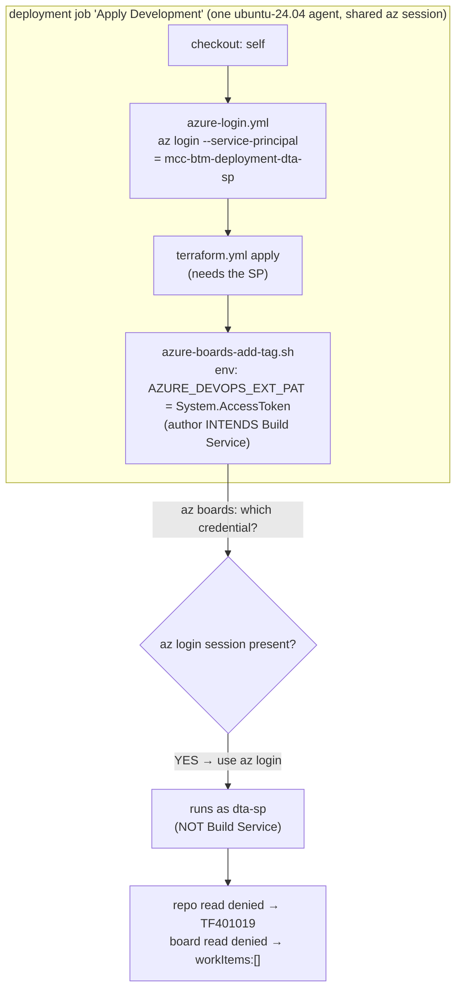
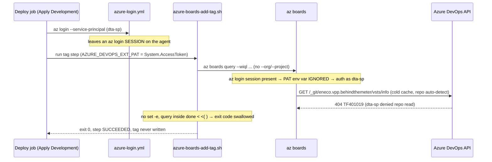

# Holistic RCA — Why the BTM deploy pipeline never tags its work items

> Teaching companion (first-principles, replicable): [`how-to-fix.md`](./how-to-fix.md).
> Raw evidence + live probe transcripts: `.ai/tasks/2026-06-22-010_btm-scripts-ado-rca-verify/`.
> This package **supersedes** [`old_attempt_to_fix_it/`](./old_attempt_to_fix_it/) — that
> earlier analysis was rigorous but diagnosed the wrong layer (see "Correction to the prior
> RCA").

## What is proven vs what is not yet proven (read this first)

You asked for 100% verification with no unverified claims. Here is the honest split, because
the distinction is itself load-bearing:

- **PROVEN LIVE (directly observed this session, re-confirmed under adversarial attack):**
  the pipeline's `az boards` calls authenticate as the **deployment service principal**
  (`mcc-btm-deployment-dta-sp`), not the Build Service identity; that SP **cannot read** the
  Team BtM board (its query returns an empty set in the actual pipeline); the **Build Service
  identity can** read and write that board; the SP was added to Azure DevOps on 2026-04-22;
  `az login` precedence over `AZURE_DEVOPS_EXT_PAT` is the mechanism. All of this is
  first-party evidence in the Evidence Ledger.
- **NOT YET PROVEN (structurally requires running the pipeline, which I did not do):** that
  the *fixed* pipeline produces a *realized tag end-to-end*. The fix is proven correct at the
  permission/identity layer (the Build Service has the rights), but the final
  "did the tag actually land" check is the **acceptance test the contributor runs after the
  PR merges** — see L9. This is the one residual, and it cannot be closed from a laptop.
- **BLOCKED (needs a Project/Collection Administrator), does NOT change the diagnosis or fix:**
  the exact Azure DevOps audit-log entry for the 2026-04-22 change, and the content of one
  build log that has aged out of retention.

## Executive summary

The "Behind The Meter" (BTM) team has a deployment pipeline that, after each environment
deploy, stamps a `DEV`/`ACC`/`PRD` tag onto the Azure DevOps **work item** linked to the
change — a board-hygiene signal showing "how far has this story shipped." That tagging
silently stopped working. The pipeline goes green; the tag never appears.

The visible error is `TF401019: The Git repository ... eneco.vpp.behindthemeter does not
exist or you do not have permissions ... 404`. The previous investigation concluded the cause
was a Git-repository auto-detection call (`/vsts/info`) being denied, with the fix being to add
`--detect false` to the `az boards` call. That is **correct but incomplete**: when the BTM
engineer applied that workaround, the error disappeared but the query came back **empty** — so
the tags still never applied. That second symptom is the real blocker, and it is the one this
RCA explains.

The actual mechanism is an **identity** problem, not a flag problem. The deploy job logs in to
Azure with a service principal (`mcc-btm-deployment-dta-sp` for dev/acc, `mcc-btm-deployment-prd-sp`
for prod) so Terraform can deploy. The tag step then sets `AZURE_DEVOPS_EXT_PAT=$(System.AccessToken)`
intending to talk to the board as the pipeline's own Build Service identity. But the Azure
DevOps CLI, when an `az login` session already exists on the agent, **uses that login session
in preference to the PAT environment variable**. So `az boards` actually runs as the **deployment
service principal** — and that service principal, added to the org on 2026-04-22, has **no permission
to view work items in the Team BtM area**. Two consequences fall out of the same root: the SP also
lacks the repo read that the auto-detection call needs (that is the `TF401019`), and once you remove
that call, the SP's board query simply returns nothing.

The impact is operational-visibility only: deployments succeed, the board's environment tags go
stale. No customer-facing or trading impact. But because the step swallows its own errors (no
`set -e`, the query runs inside a process substitution), it reports success while doing nothing —
so the failure was invisible until someone noticed the missing tags.

Why the alert/symptom is what it is: `TF401019` is Azure DevOps' documented "404 that really means
403" — the SP is denied a repository-context read and the API hides the 403 as a 404. The empty
result is a clean `HTTP 200` with zero rows — the query ran, the identity just couldn't see anything.

The fix that actually works restores the **author's original intent**: make the tag step run as the
Build Service identity, which *does* have board read/write. The cleanest way — and the one the
sibling Aggregation team already merged for their copy of this pipeline — is to run the tag step in
its **own job that does not perform the service-principal login**, so the `System.AccessToken` PAT is
the only credential present and is therefore used. This needs **no second/paid runner** (it can stay
on the same Microsoft-hosted pool), directly answering the BTM team's cost concern. Combine that with
the script hardening that kills the `TF401019` and surfaces failures loudly-but-non-blockingly.

What a future engineer should remember: **a green pipeline step is not a realized effect**, and **the
identity a CLI uses is not always the one you set in an env var** — an earlier `az login` can quietly
win. Verify the *tag*, not the exit code; verify the *identity*, not the YAML's intent.

## Context Ledger (zero-context reader)

| Term | Meaning | Relevance to this incident |
|------|---------|----------------------------|
| **BTM / Team BtM** | "Behind-The-Meter" — energy assets behind the customer meter. Names the team, the repo `Eneco.Vpp.BehindTheMeter`, and the board **area** `Myriad - VPP\Team BtM` (AreaId **6393**, node GUID `dfb04683-…`). | Owns the pipeline and the work items being tagged. |
| **VPP / Myriad** | Virtual Power Plant — Eneco's energy-trading platform. Azure DevOps project `Myriad - VPP`, org `enecomanagedcloud`. | The project that hosts the repo, pipeline, and board. |
| **PR auto-tagging** | A pipeline step (`azure-pipelines/steps/azure-boards-add-tag.sh`) that stamps `DEV`/`ACC`/`PRD` on the work item linked to a deployed change. | The thing that "broke". |
| **`az boards`** | The Azure DevOps CLI (the `azure-devops` az extension) for board / work-item operations. | The command that fails. |
| **Work item / WIQL** | A board item (story/bug); WIQL is the query language `az boards query` runs. | The query that returns empty for the SP. |
| **`System.AccessToken`** | The pipeline job's built-in OAuth token = the project **Build Service** identity (`Myriad - VPP Build Service (enecomanagedcloud)`). Independent of the agent pool. | The identity the script's author *intended* `az boards` to use. |
| **Build Service identity** | The project's automation identity behind `System.AccessToken`. A member of the project Contributors (and here Project Administrators), with board read/write. | The identity that *can* tag the board — the target of the fix. |
| **`mcc-btm-deployment-dta-sp` / `-prd-sp`** | Azure AD service principals used by `azure-login.yml` to log the agent into Azure so Terraform can deploy (dta = dev/test/acc, prd = prod). | The identity `az boards` *actually* uses — and which lacks board permission. |
| **`AZURE_DEVOPS_EXT_PAT`** | Env var the `az` devops extension reads as a Personal Access Token credential. | Set to `System.AccessToken` in the tag step — but ignored when an `az login` session exists. |
| **`az login` precedence** | When the agent already has an `az login` session, the devops CLI uses it in preference to `AZURE_DEVOPS_EXT_PAT`. | The crux: the SP login (for Terraform) hijacks the board call. |
| **`enforceJobAuthScope`** | Project setting "limit job authorization scope to current project" (true here). | Project-scopes the Build Service token; not the cause here, but it bounds the token. |
| **`TF401019`** | Azure DevOps error "repo does not exist OR you lack permission … 404" — a documented **404-masks-403**. | The loud symptom; here it is the SP being denied a repo-context read. |
| **`/vsts/info`** | The repo-context auto-detection call `az boards` makes when `--organization/--project` are omitted and its per-remote cache is cold. | The specific call that is denied → `TF401019`. |
| **Area-path permission** | "View work items in this node" / "Edit work items in this node" — the per-area ACL governing board read/write. | The exact permission the SP lacks and the Build Service has on AreaId 6393. |
| **PR 178802** | The Aggregation (`.B2B`) team's already-merged fix for the same pattern: tagging moved to a separate job on a different pool. | The precedent for the recommended fix — and proof the identity change is what worked. |

## RCA Knowledge Contract

After reading this package, a zero-context reader can:

1. **draw** the BTM deploy pipeline's boundary and name which identity each step runs as;
2. **trace** the mechanism from "green build" to "tag never applied", through both the
   `TF401019` and the empty-result symptoms, to the failed invariant (the board-calling
   identity lacks board permission);
3. **reproduce** the key probes from cold (the identity-precedence demo, the SP-vs-Alex
   query contrast, the area-path ACL read);
4. **reject** the two false explanations the prior package and the sibling team believed
   ("the fix is `--detect false`" and "switching the runner pool fixes it");
5. **repair** safely by moving tagging to the Build Service identity, and **prove** it with
   the realized-tag acceptance check;
6. **decide** what to remove from the hot path (the silent-failure pattern, the identity
   coupling) versus what to keep manual.

## L1 — Business — why BTM PR auto-tagging exists

The BTM team tracks each user story's delivery progress on its Azure Board. When a change
deploys to an environment, the pipeline stamps `DEV`/`ACC`/`PRD` on the linked work item so
the board shows "how far has this shipped" without anyone tagging by hand. It is **cosmetic
but operationally useful** board hygiene: a failure does not break a deployment, only the
team's release-visibility signal and any reporting that filters by environment tag. Priority
in the intake was low ("I can wait a couple of days"). **Who is blocked:** the BTM team's
board accuracy.

The mental handle: this is a *post-deploy side effect*, not part of the deploy. That is why it
can fail silently for weeks — nothing that gates a release depends on it.

## L2 — Repo system

| Repo | Role | Key artifacts | Incident relevance |
|------|------|---------------|--------------------|
| [`Eneco.Vpp.BehindTheMeter`](https://dev.azure.com/enecomanagedcloud/Myriad%20-%20VPP/_git/Eneco.Vpp.BehindTheMeter) (id `718866fa-…`) | The BTM service + its deploy pipeline | `azure-pipelines/deploy-terraform.pipeline.yml`, `azure-pipelines/steps/azure-login.yml`, `azure-pipelines/steps/azure-boards-add-tag.sh` | Holds the pipeline, the SP-login step, and the tag script — all three are in play |
| [`Eneco.Vpp.BehindTheMeter.B2B`](https://dev.azure.com/enecomanagedcloud/Myriad%20-%20VPP/_git/Eneco.Vpp.BehindTheMeter.B2B) (id `5bb311ec-…`) | The sibling Aggregation-team service, same tagging pattern | same pipeline shape; [PR 178802](https://dev.azure.com/enecomanagedcloud/Myriad%20-%20VPP/_git/Eneco.Vpp.BehindTheMeter.B2B/pullrequest/178802) | The team that already "fixed" this — and how they fixed it is the key to the real mechanism |

Both repos live in the **same** Azure DevOps project (`Myriad - VPP`). That single fact, established
in L2, becomes load-bearing in L8: because they share a project, both pipelines' `System.AccessToken`
resolve to the **same** Build Service identity — so whatever permission that identity has applies to
both teams' boards.

## L3 — Runtime architecture

The pipeline is [`deploy-terraform.pipeline.yml`](https://dev.azure.com/enecomanagedcloud/Myriad%20-%20VPP/_git/Eneco.Vpp.BehindTheMeter?path=/azure-pipelines/deploy-terraform.pipeline.yml)
(definition **4667**), default pool `vmImage: ubuntu-24.04` (Microsoft-hosted, **ephemeral**). It runs
`Build → Development → Acceptance → Production`. Each environment stage is a `deployment` job whose
`runOnce.deploy.steps` are, in order: `checkout: self` → `azure-login.yml` → `terraform.yml apply` →
**the tag step**. The tag step is the last step *inside the same job* as the SP login.

> The diagram below shows the one fact that the prior RCA missed: the tag step shares a job — and
> therefore a logged-in `az` session — with the service-principal login. Watch where the identity
> comes from.



Reading the picture: the deploy job logs in as the SP because Terraform needs it. That login leaves a
session on the agent. When the tag step runs `az boards`, the CLI sees the existing `az login` session
and uses it — *ignoring* the `AZURE_DEVOPS_EXT_PAT` the author set. So the box labelled "author intends
Build Service" does not get its wish: the call exits the job as the **deployment SP**. Everything
downstream (the `TF401019`, the empty result) follows from that single wrong identity. If the tag step
ran in a job *without* the SP login, the only credential present would be the PAT, and the picture would
end at "runs as Build Service → succeeds."

Mental model to keep: **identity is a property of the agent's auth state at call time, not of the env
var you set.** The SP login earlier in the job decides who `az boards` is.

## L4 — Application code flow

The tag script ([`azure-boards-add-tag.sh`](https://dev.azure.com/enecomanagedcloud/Myriad%20-%20VPP/_git/Eneco.Vpp.BehindTheMeter?path=/azure-pipelines/steps/azure-boards-add-tag.sh),
byte-identical on `main` and the test branch `fix/tagging`):

1. `work_items = git log … | grep 'Related work items:' | grep -Po '\d+'` — local, no auth.
2. Build a WIQL: `SELECT System.Id, System.Tags FROM workitems WHERE System.AreaId = 6393 AND System.Tags NOT CONTAINS '$TAG' AND System.Id IN ($work_items)`.
3. `done < <(az boards query --wiql "$query" --output table | tail -n +3)` — **the first network call**;
   it omits `--organization/--project`, so the CLI tries to auto-detect the repo via `/vsts/info`.
4. Per row: `az boards work-item update --field "System.Tags=$tags; $TAG"`.

Two structural defects compound the identity bug:

- **The query auto-detects the repo.** Omitting `--org/--project` on an ephemeral (cold-cache) agent
  forces the `/vsts/info` repo read every run. As the SP (which lacks repo read), that is the `TF401019`.
- **Errors are swallowed.** No `set -e`, and the query runs inside `done < <( … )` (a process
  substitution), so a non-zero exit never propagates. The step exits 0 → green build, zero tags.

So even before the identity question, the script is built to fail silently. The identity is *why* it
fails; the swallowing is *why nobody saw it*.

## L5 — The declarative contract (what should be true)

There is no Terraform for the tagging itself. The load-bearing "truths" are Azure DevOps settings and
ACLs:

| Truth | Value | How known |
|-------|-------|-----------|
| Project job-auth scope | `enforceJobAuthScope = true`, `enforceReferencedRepoScopedToken = false` | project `generalSettings` API |
| Area 6393 identity | `Myriad - VPP\Team BtM`, intact, ~913 work items | `az boards area project list` + live query |
| Build Service board ACL on area 6393 | explicit grant: View + Edit work items = **Allow** | area-path access-control-list (effective-allow bitmask) |
| deployment SP board ACL on area 6393 | View + Edit work items = **not granted** (only group = `Pool Creator`, which carries no work-item ACE) | area-path access-control-list + group membership |

The divergence: the script's author wrote the YAML as if the tag step would run as the Build Service
(which *does* satisfy the board ACL). The runtime identity is the SP (which does *not*). The declared
intent and the actual identity disagree — and the ACL only blesses the declared one.

## L6 — How the pipeline actually runs (the identity hand-off)

The sequence diagram makes the timing explicit: the error appears *before* any tagging, and as the
*wrong* identity.



If you instead suppress auto-detection (`--detect false`, what the BTM engineer tried), the `TF401019`
disappears but the query still runs as the dta-sp and returns an empty set — because the SP cannot see
Team BtM work items. That is exactly the "error gone but no output" the engineer reported.

## L7 — Timeline

| When | Event | How known |
|------|-------|-----------|
| 2024-11-06 | Tag script introduced (PR 101101) — its only commit ever | repo history |
| 2025-05-19 | `deploy-terraform.pipeline.yml` last changed | repo history |
| **2026-04-22 07:27Z** | `mcc-btm-deployment-dta-sp` **created as an Azure DevOps user** (Basic, AAD) | `az devops user list` |
| 2026-04-24 | Earliest surviving build (1621832) already shows `TF401019` | build log |
| 2026-05-26 | Sibling Aggregation fix merged (PR 178802) — same break, same window | PR metadata |
| 2026-06-04 | BTM engineer's debug build (1668639, branch `fix/tagging`) — the SP's board query returns `workItems:[]` | build log#19 |
| 2026-06-11 | Latest build (1676583) — still `TF401019` | build log |

No BTM code changed in the onset window. The `dta-sp` becoming an Azure DevOps user on 2026-04-22 sits
inside the window when tagging broke. The exact cause-and-effect of that change (did adding it as an
explicit user remove an implicit access it previously inherited?) is **not yet verified** — it needs the
org audit log, which is administrator-only. The diagnosis does not depend on pinning that down: the
present-state fact (the SP cannot read the board, the Build Service can) is what drives the fix.

## L8 — Fix

**Root cause:** the tag step runs as the deployment service principal (because an earlier `az login`
session takes precedence over `AZURE_DEVOPS_EXT_PAT`), and that SP lacks "View/Edit work items in this
node" on Team BtM (AreaId 6393). The repository auto-detection that produces the loud `TF401019` is the
same SP being denied a repo read.

**Primary fix (recommended — restores the author's intent, no new runner):** run the tag step in its
**own pipeline `job` that does not include `azure-login.yml`**, keeping the same Microsoft-hosted
`ubuntu-24.04` pool. With no SP login session present, `az boards` uses
`AZURE_DEVOPS_EXT_PAT = $(System.AccessToken)` — the **Build Service identity**, which has board
read/write. Pair it with the hardened script (explicit `--organization/--project/--detect false` to kill
the `TF401019`, tag-union to avoid clobbering, empty-list guard, and `SucceededWithIssues` so a real
failure is loud but never blocks the deploy). Full steps, the PR-ready diff, and the GO/NO-GO acceptance
test are in [`how-to-fix.md`](./how-to-fix.md).

**This is exactly what the sibling team did** (PR 178802): they moved tagging into a separate
`ApplyTag*` job. They believed the *pool* (`sre-managed-linux`) was the fix; in fact the operative change
was that the separate job **drops the `azure-login.yml` step**, so the Build Service token is used. The
pool was incidental. That is why BTM can get the same result on the **same MS-hosted pool** — no extra
paid runner, directly addressing the cost concern.

**What this fix does NOT change:** the deployment SP's own permissions (untouched); the Terraform deploy
path (untouched — the SP login it relies on stays in the deploy job); the `prd-sp` (which is not even an
Azure DevOps user — see L9).

**Alternative fixes (only if the acceptance test fails or the team prefers a smaller diff):**
(a) in the single job, run `az logout` at the top of the tag step so the PAT is used; (b) grant the
relevant identity "View/Edit work items in this node" on Team BtM. Trade-offs in [`how-to-fix.md`](./how-to-fix.md).

## L9 — Verification

The diagnosis was verified live (read-only) and survived a dedicated adversarial demolition pass. The
fix is verified at the **permission layer**: the Build Service identity has an explicit Allow for
View+Edit work items on the area tree that Team BtM inherits. The **end-to-end realized-tag** is the
one check that cannot be run from a laptop — it is the **contributor's acceptance test after the PR
merges**:

1. Run the deploy pipeline on a PR whose commits reference a Team BtM work item.
2. The `Add DEV tag in ADO` step log shows `Work item <id>: … -> 'DEV'` and **no `TF401019`**.
3. Assert the realized state (not the exit code):
   `az boards work-item show --org https://dev.azure.com/enecomanagedcloud --detect false --id <id> --query "fields.\"System.Tags\""` contains `DEV` **and** any pre-existing tags.

**Methodology warning for the next on-call (cost me, will cost you):** two read-only Azure DevOps
permission tools **lie** about a *subject's* effective permission:

- `az devops security permission show` → `effectivePermission` reports **"Not set"** for service and
  group identities even when they *do* have the permission via inheritance. (It happens to read
  correctly for the SP here, but reported the Build Service as "Not set" — which, if trusted, would
  have falsified the fix.)
- `POST _apis/security/permissionevaluationbatch` **ignores the subject descriptor** and evaluates the
  *caller* — a garbage descriptor returns `true`.

The only trustworthy read-only resolver is
`GET _apis/accesscontrollists/{namespace}?token=…&includeExtendedInfo=true` →
`acesDictionary[descriptor].extendedInfo.effectiveAllow` (a bitmask; bit 16 = View work items, bit 32 =
Edit). All board-ACL claims in this RCA are grounded on that bitmask.

## L10 — Lessons

1. **A green step is not a realized effect.** Scripts that swallow errors (no `set -e`; work inside
   `< <( )` or pipes) succeed while doing nothing. Verify the *tag*, not the status.
2. **The identity a CLI uses is not the identity you set.** When a job does `az login`, that session can
   take precedence over `AZURE_DEVOPS_EXT_PAT`. Setting the PAT env var does not guarantee the call runs
   as the Build Service. If you need a specific identity for `az boards`, make sure no other `az login`
   session is active (separate job, or `az logout`).
3. **"Switch the runner" relocates, it does not fix, an auth problem** — and conversely, a fix credited
   to a pool switch may actually be an identity change hiding inside a job restructure. Always ask *which
   identity* the working version runs as.
4. **`--detect false` was a real fix for a real symptom (`TF401019`) — but not the blocker.** Removing a
   loud error can expose a silent one. Close on the end effect.
5. **Do not trust `az devops security permission show` / `permissionevaluationbatch` for a subject's
   effective permission** — use the `accesscontrollists … includeExtendedInfo=true` effective-allow
   bitmask (L9).

## L11 — End-to-end command playbook (reproduce from cold, read-only)

Every probe below is read-only and runs as your own `az login` (no pipeline, no SP credential needed).
Full prose rationale for each is in [`how-to-fix.md`](./how-to-fix.md) — the compact replay:

```bash
ORG="https://dev.azure.com/enecomanagedcloud"; PROJ="Myriad - VPP"

# 1. Confirm the area exists and is populated for a privileged human (contrast baseline).
az boards query --org "$ORG" --project "$PROJ" --detect false \
  --wiql "SELECT [System.Id] FROM workitems WHERE [System.AreaId]=6393" --query "length(@)" -o tsv
#   -> 913   (you, as Alex, can see the board)

# 2. Prove az-login precedence: an INVALID PAT is ignored when an az login session exists.
AZURE_DEVOPS_EXT_PAT="invalid_zzz" az boards query --org "$ORG" --project "$PROJ" --detect false \
  --wiql "SELECT [System.Id] FROM workitems WHERE [System.AreaId]=6393" --query "length(@)" -o tsv
#   -> 913   (PAT ignored; the az login session was used)

# 3. Read the pipeline proof: the SP's own debug query returned empty in the real build.
az devops invoke --area build --resource logs --route-parameters project="$PROJ" \
  buildId=1668639 logId=19 --api-version 7.1 --org "$ORG" -o json | grep -o '"workItems":\[\]'
#   -> "workItems":[]   (ServicePrincipalCredential auth, HTTP 200, zero rows)

# 4. Confirm the identity asymmetry on the area-path ACL (authoritative bitmask; bit16=ViewWI).
#    (Build Service effAllow=241 -> ViewWI True;  dta-sp -> no work-item ACE)
az rest --method GET --resource 499b84ac-1321-427f-aa17-267ca6975798 \
  --url "$ORG/_apis/accesscontrollists/83e28ad4-2d72-4ceb-97b0-c7726d5502c3?token=vstfs:///Classification/Node/53090030-5179-48c8-904c-7cb607fee55c&includeExtendedInfo=true&api-version=7.1"
```

## L12 — One-page on-call playbook

```text
SYMPTOM: An ADO pipeline step using `az boards`/`az repos` prints
  "TF401019: The Git repository ... does not exist or you do not have permissions ... 404",
  OR the step is GREEN but the board tag / work-item update never happened.

5-MIN TRIAGE
  1. Does the job run `az login` (a service connection / azure-login template) BEFORE the
     az boards/az repos step?  -> If yes, the CLI is probably using THAT identity, not
     System.AccessToken, even if AZURE_DEVOPS_EXT_PAT is set. (az login beats the PAT.)
  2. Which identity is it really?  Read the step's --debug log for
     "ServicePrincipalCredential.acquire_token" (= the SP) vs a PAT/Basic header (= Build Service).
  3. Can that identity SEE the board?  As yourself:
     az boards query --org <org> --project "<proj>" --detect false --wiql "... WHERE [System.AreaId]=<id>"
     returns rows for you; if the pipeline gets [], it's an identity-permission gap, not a query bug.
  4. TF401019 specifically = the identity denied a repo read (often the cold-cache /vsts/info
     auto-detect). It is a 403 masked as 404.

FIX (cheapest first)
  - Run the boards step in its OWN job WITHOUT the az login step  -> uses System.AccessToken
    (Build Service), same MS-hosted pool, no extra runner.   [primary]
  - OR `az logout` before the boards call in the same job.    [smaller diff]
  - Add --organization/--project/--detect false to az boards query (kills TF401019).
  - Do NOT "switch the runner" expecting it to fix auth; it doesn't (it only changed identity
    in PR 178802 because the new job dropped the login).

VERIFY  (never trust green)
  - Step log shows the tag line + no TF401019.
  - az boards work-item show ... --query fields.System.Tags  -> tag present AND prior tags kept.

GOTCHA
  - az devops security permission show "effectivePermission" LIES for svc/group subjects.
    Use accesscontrollists?includeExtendedInfo=true -> extendedInfo.effectiveAllow (bit16=ViewWI).
```

## Correction to the prior RCA and to the answer Anton was given

The previous package ([`old_attempt_to_fix_it/`](./old_attempt_to_fix_it/)) and the Slack answer given to
Anton contained two claims that this investigation overturns. Per evidence discipline, they are quoted and
corrected rather than silently replaced:

- **Prior claim:** "your pipeline job runs under the Build Service Identity (System.AccessToken)" and
  "the fix is to pass `--organization/--project/--detect false`".
  **Correction:** the tag step runs under the **deployment service principal**, because the `az login`
  session from `azure-login.yml` takes precedence over the PAT env var. `--detect false` removes the
  `TF401019` but the query then returns empty (the SP can't read the board), so it is **necessary but not
  sufficient**. This matches exactly what Anton observed when he tried it.

- **Prior claim:** "the runner switch is not the correct fix … the pool swap does not change what is
  denied … [the sibling works because of] a different az/extension version or a broad cached credential
  (INFER)."
  **Correction:** the sibling fix (PR 178802) works because its separate job **omits `azure-login.yml`**,
  so `az boards` runs as the Build Service identity — an **identity** change, now directly evidenced, not
  a pool/version difference. This also *refines* the answer to Anton's cost question: he was right to
  resist a second runner — and he doesn't need one. A separate job **without** the SP login on the **same**
  Microsoft-hosted pool achieves the fix.

## Answer to the BTM team's two questions

**Q1 — "Why was `mcc-btm-deployment-dta-sp` created in ADO? Configure it, or delete it?"**
It is the dev/test/acceptance **deployment** service principal — `azure-login.yml` logs in as it so
Terraform can deploy to Azure. It became an explicit Azure DevOps *user* on **2026-04-22** (Basic, AAD);
*why* it was added on that date is **not yet verified** (the resolving step is the org audit log, which is
administrator-only: Organization Settings → Auditing, filter 2026-04-22, action on the user/permission).
**Recommendation: configure, do NOT delete.** Deleting it would break the dev/acc Terraform deploys that
depend on it. "Configure" here does **not** mean "grant the SP board access" (that would give the
deployment identity board write — more privilege than it should hold); the better path is the primary fix
(make tagging use the Build Service identity, which already has board access). **Deleting an identity is
destructive and requires explicit authorization — it is recommended against and was not performed.**

**Q2 — "Why did this start, and can you fix it?"** It started in the 2026-04-22…04-25 window (the SP became
an explicit ADO user on 04-22; tagging was already failing by 04-24). The fix is the primary fix in L8 /
[`how-to-fix.md`](./how-to-fix.md), contributable as a PR to `Eneco.Vpp.BehindTheMeter` (B2C). The sibling
`.B2B` repo is already fixed (PR 178802) — do not touch it.

## ADO-only actions (cannot be done from a laptop)

| Action | Local? | Note |
|--------|--------|------|
| Run the read-only diagnosis probes (L11) | **Local** | Read-only, as your own `az login`. Safe. |
| Open the fix PR on `Eneco.Vpp.BehindTheMeter` | **ADO** | Requires repo write; this is the contribution. |
| Re-run the pipeline + assert the realized tag (L9) | **ADO** | The acceptance test; requires a pipeline run. |
| (optional) Grant board permission / read the 2026-04-22 audit log | **ADO, admin** | Project/Collection Administrator only; not required by the primary fix. |
| Delete the `dta-sp` user | **ADO, destructive** | **Recommended against** (breaks deploys); requires explicit authorization; not performed. |

## Evidence Ledger

| # | Claim | Label | Evidence (re-runnable) |
|---|-------|-------|------------------------|
| E1 | `azure-login.yml` `az login`s as `dta-sp` (dev/acc) / `prd-sp` (prd) before tagging | A1 FACT | file content @ main: `az login --service-principal -u '$(mcc-btm-deployment-dta-sp-applicationid)'` |
| E2 | `az login` session takes precedence over `AZURE_DEVOPS_EXT_PAT` | A1 FACT | invalid-PAT query returns 913 (PAT ignored); `--debug` shows `UserCredential.acquire_token`, not Basic/PAT |
| E3 | The live pipeline `az boards` authenticates as the **SP** | A1 FACT | build 1668639 log#19: `ServicePrincipalCredential.acquire_token … grant_type: client_credentials` (agent ext 1.0.4) |
| E4 | The SP's board query returns **empty** in the pipeline | A1 FACT | build 1668639 log#19: `POST /_apis/wit/wiql` → HTTP 200, body `"workItems":[]` |
| E5 | The same query returns 913 for a privileged human | A1 FACT | `az boards query … WHERE [System.AreaId]=6393` → `length(@)`=913 |
| E6 | `dta-sp` lacks View/Edit work items on Team BtM | A1 FACT | area ACL bitmask: only group = `Pool Creator` (no work-item ACE); no direct ACE |
| E7 | Build Service identity HAS View+Edit work items on area 6393 | A1 FACT | area-root ACL bitmask: `Build:a7ef9a24…` effAllow=**241** (ViewWI+EditWI=True), inherited by Team BtM |
| E8 | `dta-sp` created in ADO 2026-04-22T07:27:25Z (Basic, AAD); `prd-sp` is not an ADO user | A1 FACT | `az devops user list` (2455 scanned) |
| E9 | `TF401019` real + continuous 2026-04-24 → 06-11; script fix never committed | A1 FACT | build logs 1621832/1663945/1676583; script md5 identical main vs fix/tagging |
| E10 | AreaId 6393 = `Myriad - VPP\Team BtM`, intact, ~913 items | A1 FACT | `az boards area project list`; node GUID `dfb04683-…` |
| E11 | `enforceJobAuthScope=true`, `enforceReferencedRepoScopedToken=false` | A1 FACT | project `generalSettings` |
| E12 | PR 178802 (B2B) = tag step moved to a separate `job` without `azure-login.yml` | A1 FACT | PR diff (changed file: `deploy-terraform.pipeline.yml`) |
| E13 | `System.AccessToken` = project Build Service identity, pool-independent; area-path "View work items in this node" governs board read | A1 FACT (docs) | Microsoft Learn: access-tokens, permissions namespace-reference |
| E14 | Fixed pipeline produces a realized tag end-to-end | A3 UNVERIFIED[blocked: requires a pipeline run] | resolving probe = L9 acceptance test after the PR merges |
| E15 | Exact 2026-04-22 audit entry / the purged 2026-04-15 build content | A3 UNVERIFIED[blocked: admin-only / aged out] | Org Settings → Auditing; does not change the diagnosis |

**Confidence:** the diagnosis (E1–E13) is fully evidenced and survived adversarial demolition. The only
open items (E14 runtime tag, E15 audit detail) do not affect the root cause or the fix-path correctness;
E14 is closed by the contributor's acceptance test, by design.

## Adversarial review (Mutation log)

- `socrates-contrarian` (goal-fidelity): 9 ask↔deliverable gaps; all accepted and folded in
  (proven-vs-unproven box, prior-RCA + prior-answer corrections, Q1 decision block, local-vs-ADO split,
  single-default fix + repo scope, in-document destructive gate, runnable precedence demo, named HTML
  producer). Artifact: `…/verification/adversarial-goalfidelity.md`.
- `el-demoledor` (technical demolition, live ADO): attacked all four load-bearing claims and could falsify
  none; upgraded the fix keystone (Build Service has board read) from inference to FACT; surfaced the
  permission-tool methodology landmine now recorded in L9. Artifact: `…/verification/adversarial-technical.md`.
