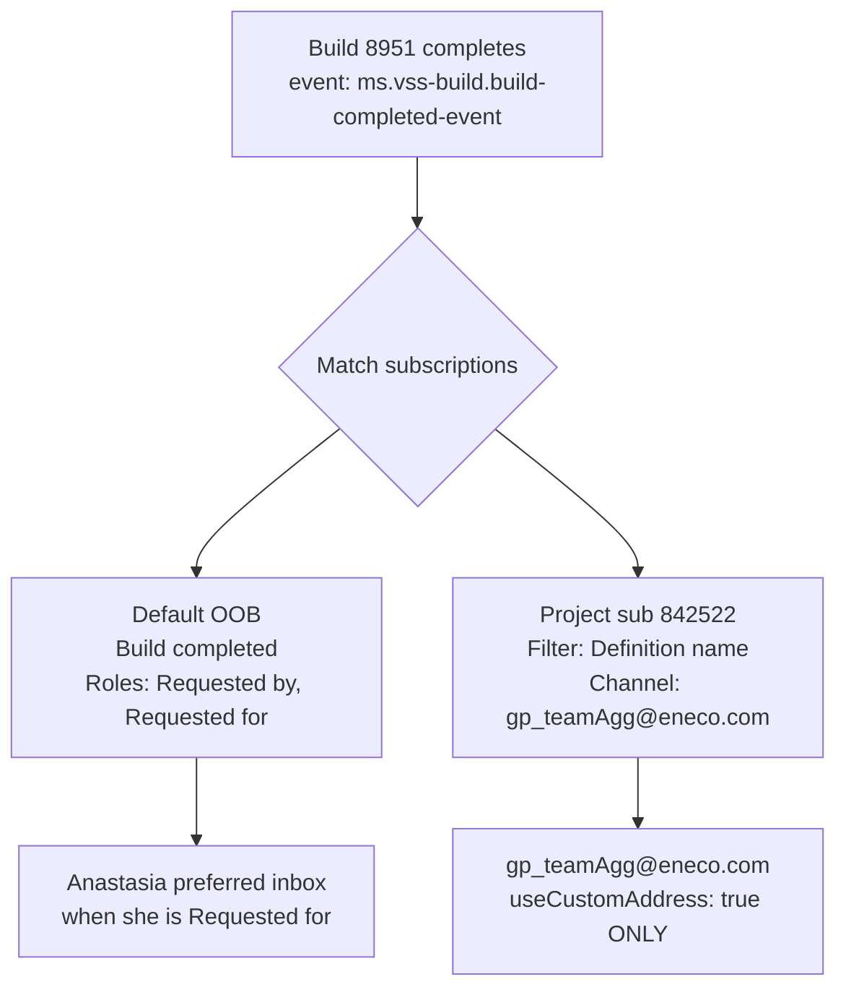

# Repro dossier: "Build notification only works for Anastasia, not the team"

## Executive summary

| Field | Value |
| --- | --- |
| **Status** | Partially reproducible (personal path); DL path **not yet verified** |
| **Severity** | Medium (team expectation mismatch; not production outage) |
| **Confidence in top hypothesis** | **High** (pending one email-header probe) |
| **Recommended handoff** | Platform: run discriminating probes below; do **not** treat Anastasia inbox as proof of 842522 |

**Verdict on "only works for her — is it our bug?"**

| Question | Answer |
| --- | --- |
| Is subscription **842522 misconfigured** as a personal sub? | **No** (KNOW from GET read-back: `useCustomAddress: true`, address `gp_teamAgg@eneco.com`, pipeline clause present) |
| Did Anastasia's email prove the **team DL sub works**? | **No** — email body strongly matches **default OOB** routing, not custom-address project delivery |
| Is this **our bug** (platform mis-implementation)? | **Unlikely — wrong attribution** until DL inbox + subscriptionId probes run. If DL never receives mail on next build **with correct To: gp_teamAgg**, then investigate mail-flow / filter (H3), not subscriber semantics (H5) |

---

## Symptom report (Five W's)

| W | Detail | Evidence class |
| --- | --- | --- |
| **What** | Anastasia says build-completion email "only works for her", not her team | INFER (Slack/report; no verbatim quote in repo) |
| **When** | Build **#20260624.1** succeeded; subscription **842522** created **2026-06-24** | KNOW ([spec-project-subscription-gp-teamagg.md](./spec-project-subscription-gp-teamagg.md)) |
| **Where** | Org `enecomanagedcloud`, project `Myriad - VPP`, pipeline **8951** | KNOW |
| **Who** | Filer: Anastasia Zenchik; subscriber on 842522: Alex.Torres@eneco.com; intended DL: `gp_teamAgg@eneco.com` | KNOW |
| **Why (expected)** | Team DL receives email when pipeline **B2B Behind The Meter - E2E tests** completes | REQUIREMENT ([spec](./spec-project-subscription-gp-teamagg.md)) |

### Observed email (screenshot evidence)

| Field | Value |
| --- | --- |
| Subject | `[Build succeeded] B2B Behind The Meter - E2E tests` |
| Build | `#20260624.1` **SUCCEEDED** |
| Body line | **Requested for: Zenchik, A (Anastasia)** |
| Sender | `azuredevops@microsoft.com` |

### Configured subscription 842522 (edit UI / GET)

| Field | Value |
| --- | --- |
| Subscriber (owner) | Torres, JA (Alex) |
| Deliver to | Other email → **`gp_teamAgg@eneco.com`** |
| Filter | Definition name = `\Myriad - VPP\B2B Behind The Meter - E2E tests` |
| REST channel | `useCustomAddress: true`, status `enabled` |

---

## Timeline

| Event | When | Evidence |
| --- | --- | --- |
| Intake: filer wants build emails; lacks Project Settings edit rights | 2026-06-22 | [requirements.md](./requirements.md), [slack-intake.txt](./slack-intake.txt) |
| Platform docs: personal route needs no grant; team DL needs admin | 2026-06-22 | [how-to-enable-ado-build-email-notifications.md](./how-to-enable-ado-build-email-notifications.md) |
| Project subscription **842522** created (REST POST) | 2026-06-24 | [spec-project-subscription-gp-teamagg.md](./spec-project-subscription-gp-teamagg.md) |
| Build **20260624.1** succeeds; Anastasia receives email | 2026-06-24 | User screenshot |
| Filer reports "only works for me" | 2026-06-24 | User report |
| DL delivery end-to-end verify | **Not done** | Spec step 2 still ⏳ |

**Timeline analysis:** Subscription was created **same day** as the cited build. Anastasia's email may predate or coincide with first DL test. No evidence anyone checked **`gp_teamAgg@eneco.com`** for the same build before concluding failure.

---

## ADO notification mechanics (reference)

Two independent delivery paths can fire on the same build completion:



| Mechanism | Source |
| --- | --- |
| Default **Build completed**: *"Notifies you when a build you queued or that was queued for you completes."* Roles include **Requested for** | [OOB built-in notifications](https://learn.microsoft.com/en-us/azure/devops/organizations/notifications/oob-built-in-notifications#supported-subscriptions) |
| Build **Completed** event roles: **Requested by**, **Requested for**, … | [OOB supported event types — Build](https://learn.microsoft.com/en-us/azure/devops/organizations/notifications/oob-supported-event-types#build-events) |
| `useCustomAddress: true` → deliver to **`channel.address`**, not subscriber preferred email | [Subscriptions Create REST](https://learn.microsoft.com/en-us/rest/api/azure/devops/notification/subscriptions/create), [Email recipients concepts](https://learn.microsoft.com/en-us/azure/devops/organizations/notifications/concepts-email-recipients) |
| `subscriber` on create defaults to **calling user** (ownership); does **not** restrict event to that user | [Subscriptions Create REST](https://learn.microsoft.com/en-us/rest/api/azure/devops/notification/subscriptions/create) |

**Critical inference:** Email showing **Requested for: Zenchik** is **consistent with** the default OOB path (she is in the **Requested for** role). That line is **build metadata** in the template and appears in **both** personal and DL emails — so it alone does not disprove 842522, but it **perfectly predicts** why Anastasia gets mail even when colleagues do not.

---

## Variable isolation

| Variable | Success (team works) | Failure (only Anastasia) | Causal? |
| --- | --- | --- | --- |
| Recipient path | Email in **gp_teamAgg** DL | Email only in **Anastasia personal** inbox | **Under test** |
| Subscription matched | Footer **View** link → id **842522** | Footer → personal/default sub id ≠ 842522 | **Discriminating** |
| Build **Requested for** | Anastasia | Anastasia | **Necessary for OOB to her** |
| `useCustomAddress` on 842522 | `true` → DL only | N/A if mis-set would go to Alex inbox | **Not mis-set** (GET confirms) |
| Pipeline filter | Full path clause matches 8951 | Wrong clause → no DL mail | **Unverified at runtime** |
| DL monitoring | Team reads shared mailbox | Team reads only personal inboxes | **Operational**, not ADO |

**Minimum conditions for "only Anastasia sees it" symptom (without 842522 working):**

1. Build completes with **Requested for = Anastasia** (triggers default OOB), **and**
2. Team expects mail in **personal** inboxes OR never checked **gp_teamAgg**, **and/or**
3. Subscription 842522 did not deliver to DL (H3 — mail-flow or filter — **unverified**)

---

## Hypotheses (ranked)

### Hypothesis 1: Default OOB "Build completed" — not subscription 842522 (Rank 1, Score 23/25)

| Dimension | Score | Rationale |
| --- | --- | --- |
| Parsimony | 5/5 | One built-in rule explains her mail without invoking broken DL sub |
| Evidence fit | 5/5 | **Requested for: Zenchik** matches OOB role table exactly |
| Falsifiability | 5/5 | Email **View** link subscriptionId ≠ 842522 |
| Prior probability | 4/5 | Default subs enabled for all users unless opted out |
| Temporal correlation | 4/5 | Symptom reported with build where she is Requested for |

**Mechanism:** Build completes → OOB sub matches **Requested for** role → email to Anastasia's **preferred ADO email**. Colleagues who did not queue/request the build receive **nothing** from OOB. This is **by design**, not team-wide delivery.

**Evidence for:**

- MS Learn OOB description (quoted above)
- Screenshot **Requested for: Zenchik, A (Anastasia)**
- Intake originally asked for **personal-style** setup ([slack-intake.txt](./slack-intake.txt): "enable email notifications" via project settings she cannot edit)

**Evidence against:**

- None until email footer subscriptionId is read

**Falsification probe:**

```text
Open Anastasia's email → footer "View" link → subscriptionId in URL
IF subscriptionId ≠ 842522 → H1 CONFIRMED for this email
IF subscriptionId = 842522 → H1 REJECTED for this email (investigate headers: To: should be gp_teamAgg)
```

---

### Hypothesis 2: DL received same mail; team does not monitor gp_teamAgg (Rank 2, Score 18/25)

| Dimension | Score |
| --- | --- |
| Parsimony | 4/5 |
| Evidence fit | 3/5 — no DL search performed |
| Falsifiability | 5/5 |
| Prior probability | 4/5 — common with DLs |
| Temporal correlation | 2/5 |

**Mechanism:** Both OOB (Anastasia) and 842522 (DL) fire. She sees mail in personal inbox; colleagues never open **`gp_teamAgg@eneco.com`**.

**Falsification probe:**

```text
Search gp_teamAgg@eneco.com for subject "[Build succeeded] B2B Behind The Meter" AND build 20260624.1
IF found → H2 CONFIRMED (842522 likely works; communication gap)
IF not found → H2 REJECTED; escalate H3
```

Also: confirm colleagues are **members** of DL (Exchange/AAD) — out of ADO scope but blocks "team" perception.

---

### Hypothesis 3: Subscription 842522 failed to deliver to DL; only personal path fired (Rank 3, Score 16/25)

| Dimension | Score |
| --- | --- |
| Parsimony | 3/5 |
| Evidence fit | 2/5 — sub shows enabled; no DL negative test |
| Falsifiability | 5/5 |
| Prior probability | 3/5 |
| Temporal correlation | 3/5 |

**Mechanism candidates:**

- Exchange rejects external sender to DL
- Filter clause mismatch at runtime (name/path drift)
- Junk/quarantine on DL

**Falsification probes:**

1. Negative: trigger build on **different** pipeline → DL must **not** get mail ([spec](./spec-project-subscription-gp-teamagg.md) step 3)
2. Positive: re-run **8951** → message at DL within ~5 min
3. `GET …/subscriptions/842522` → `status: enabled`, clause unchanged
4. Exchange message trace for `gp_teamAgg@eneco.com`, sender `azuredevops@microsoft.com`

**Route if confirmed:** Mail-flow / allowlist — not subscription recreate.

---

### Hypothesis 4: Anastasia on gp_teamAgg DL; she checked personal inbox by mistake (Rank 4, Score 13/25)

**Mechanism:** Dual delivery (OOB personal + DL copy if she is DL member). She reports personal mail as "it works".

**Falsification:** If her email **To:** is personal address only (not DL), H4 partial — she still conflated paths. If DL has no copy, H4 rejected.

---

### Hypothesis 5: subscriber=Alex makes project sub behave like personal "requester" sub (Rank 5, Score 11/25)

**Mechanism claimed:** Subscriber identity restricts delivery to build requester.

**Evidence against (KNOW):**

- REST: `subscriber` = owner; with `useCustomAddress: true`, delivery is **`address` only**
- Project sub filter has **no** "Requested for = subscriber" clause in GET 842522

**Falsification:** `GET 842522` → confirm no Requested for clause; confirm `useCustomAddress: true`. **Already satisfied** — H5 **refuted** on config grounds; runtime DL test still required.

---

## Discriminating probe matrix (run in order)

| # | Probe | Where | If true → | If false → |
| --- | --- | --- | --- | --- |
| 1 | Email **View** link `subscriptionId` | Anastasia's message footer | `≠842522` → **H1**; `=842522` → inspect **To:** | N/A |
| 2 | **To:/Delivered-To:** headers | Same message raw headers | Personal address → not DL sub email | `gp_teamAgg@…` → 842522 path |
| 3 | DL inbox search build **20260624.1** | `gp_teamAgg@eneco.com` | **H2** (works; educate team) | **H3** (delivery failure) |
| 4 | Anastasia **User settings → Notifications** | ADO UI | Find enabled default **Build completed** | Documents parallel OOB path |
| 5 | Re-run pipeline **8951** + DL watch | ADO + mailbox | Close ticket if DL receives | Message trace / filter debug |
| 6 | Another pipeline completes | ADO | No DL mail | Filter OK; if DL mail → clause too broad |

**API commands (platform):**

```bash
ORG="https://dev.azure.com/enecomanagedcloud"
RESOURCE="499b84ac-1321-427f-aa17-267ca6975798"

# Read subscription 842522
az rest --method get \
  --uri "${ORG}/_apis/notification/subscriptions/842522?api-version=7.1" \
  --resource "$RESOURCE"

# List project-scoped subs (include filters)
az rest --method post \
  --uri "${ORG}/_apis/notification/subscriptionquery?api-version=7.1" \
  --resource "$RESOURCE" \
  --headers "Content-Type=application/json" \
  --body '{"conditions":[{"scope":"a7ef9a24-213c-4c4c-85f4-c20a7db60c43"}],"queryFlags":"includeFilterDetails"}'
```

---

## MRE — reproduce "only I get email" (without proving DL broken)

**Environment:** `enecomanagedcloud` / `Myriad - VPP` / pipeline 8951

**Steps:**

1. User **A** (Anastasia) queues or is **Requested for** on build 8951.
2. User **A** has default OOB **Build completed** enabled (default on for most users).
3. Colleagues **B, C** are not Requested for/by on that build.
4. Project sub 842522 exists → `gp_teamAgg@eneco.com`.

**Expected (OOB alone):**

- **A** receives `[Build succeeded] …` with **Requested for: A**
- **B, C** receive **nothing** in personal inbox

**This reproduces the reported symptom even when 842522 works perfectly.**

**Deterministic team-wide delivery requires:** colleagues monitor **`gp_teamAgg@eneco.com`** (or get their own personal subs), not personal inboxes.

---

## Attribution verdict

```text
┌─────────────────────────────────────────────────────────────────┐
│ "Only works for her" — most likely WRONG ATTRIBUTION             │
│                                                                 │
│  Anastasia's email ≈ default OOB (Requested for role)           │
│  NOT proof that gp_teamAgg subscription 842522 failed            │
│                                                                 │
│  Platform config 842522: LIKELY CORRECT (not proven delivered)  │
│  Our bug: UNLIKELY until DL inbox + build re-test fail         │
└─────────────────────────────────────────────────────────────────┘
```

| Outcome after probes | Classification |
| --- | --- |
| Email links to non-842522 sub; DL empty | **Wrong attribution** — explain OOB vs project sub; verify DL on next build |
| Email links to 842522 but To: is personal | **ADO misdelivery** — escalate MS / re-create sub |
| DL has mail for 20260624.1 | **Works as designed** — team must use DL |
| DL empty after controlled 8951 re-run | **H3 delivery failure** — mail-flow or filter (platform ops) |

---

## Handoff notes

**To:** Platform / on-call (no pathologist needed — configuration + ops verification)

**Do not:**

- Grant Project Admin to Anastasia to "fix" personal OOB behavior
- Treat her inbox as acceptance test for **gp_teamAgg**

**Do:**

1. Run probe **#1** (subscriptionId in footer) — **5 minutes**, highest information gain
2. Search **gp_teamAgg** inbox for build 20260624.1
3. Reply to filer: personal default notifies **Requested for** only; team mail goes to **DL**
4. Close only after **received email at gp_teamAgg** on pipeline 8951 ([spec verify step 2](./spec-project-subscription-gp-teamagg.md))

**Slack-ready explanation (after probe #1 confirms H1):**

> The email you saw is likely Azure DevOps' **default** "Build completed" notification — it goes to whoever is **Requested for** on the run (you on #20260624.1). That is separate from the **project subscription** we created to **`gp_teamAgg@eneco.com`**. Teammates won't see that in personal inboxes; check the **gp_teamAgg** mailbox (or we can confirm delivery on the next pipeline run).

---

## Evidence archive

| Artifact | Path |
| --- | --- |
| Subscription spec + GET 842522 | [spec-project-subscription-gp-teamagg.md](./spec-project-subscription-gp-teamagg.md) |
| MS docs research | [.ai/unspecified/librarian/01-ado-notification-subscriptions-ms-docs.md](../../../.ai/unspecified/librarian/01-ado-notification-subscriptions-ms-docs.md) |
| How-to (personal vs shared) | [how-to-enable-ado-build-email-notifications.md](./how-to-enable-ado-build-email-notifications.md) |
| Intake | [slack-intake.txt](./slack-intake.txt) |

---

## Investigation metadata

| Field | Value |
| --- | --- |
| Duration | Single-pass dossier from repo evidence + MS Learn |
| Confidence | **High** on H1 mechanism; **Medium** on 842522 delivery (unprobed) |
| Blockers | No access to raw email headers or gp_teamAgg mailbox in this session |
| Recommended next step | Execute probe matrix #1–3 before any config change |
