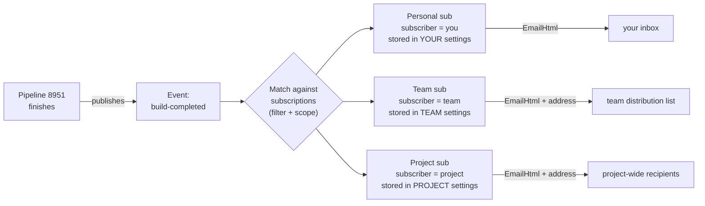
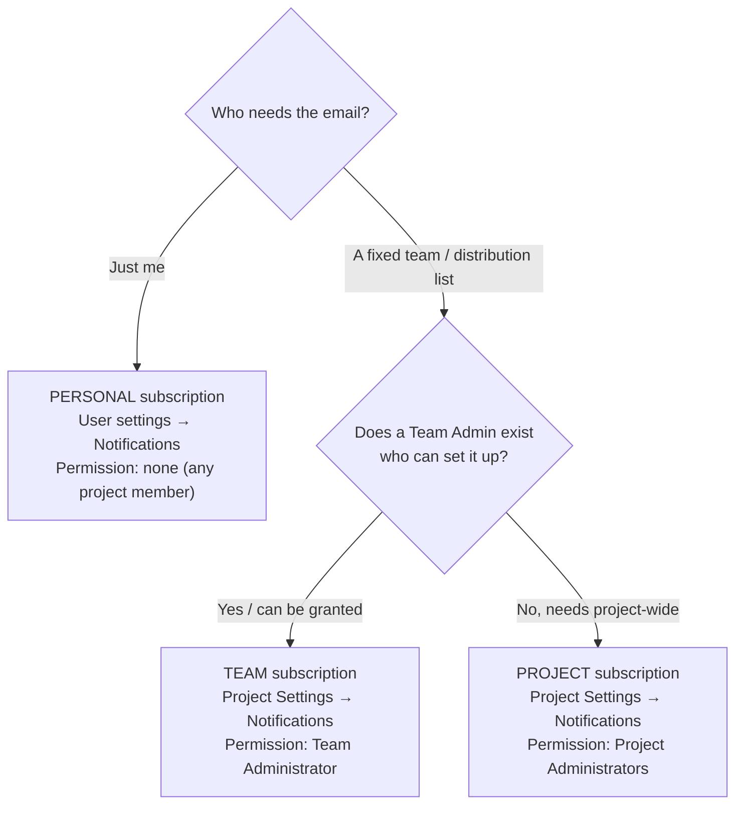

# How to Enable Email Notifications When an Azure DevOps Pipeline Completes

**Mastery level:** you will be able to set this up *and* explain why one route needs no permissions and another needs an admin — so you never again ask for rights you don't need.

## Audience and scope

Eneco Trade Platform engineers and the on-call platform team. Concrete target: org `enecomanagedcloud`, project `Myriad - VPP`, build pipeline `definitionId=8951`. Covers the **portal** path and the **`az` CLI / REST** path. It does **not** cover Slack/Teams webhook delivery or service-hook integrations — only email on build completion.

## Knowledge Contract

After reading this, you can:

1. **draw** how an Azure DevOps notification turns a finished build into an email (event → subscription → channel → inbox);
2. **explain why** a *personal* subscription needs no special rights, but a *shared* one does;
3. **choose** the right scope — personal, team, or project — for a given need;
4. **create** a "build completes" email subscription both in the portal and via `az rest`;
5. **reject** the over-privilege trap (asking for Project Administrator just to receive emails);
6. **defend and verify** the choice — prove the subscription actually fires.

This document does **not** make you able to author a *custom event-type* extension or change org-wide notification defaults — those are separate, rarer tasks.

## TL;DR

> You almost certainly do **not** need the edit rights you were about to ask for.
> If you want the email **for yourself**, create a **personal** subscription in *User settings → Notifications* — any project member can, no grant required.
> Only a **shared/team** subscription (one address for many people, managed centrally) needs an admin, and the least-privilege grant for that is **Team Administrator**, *not* Project Administrator.

## First principles: what a "notification" actually is

Strip the UI away and an Azure DevOps notification is one row in a rules table. When something happens in the product, the platform **publishes an event**. A **subscription** is a standing rule that says: *"when an event of this type, matching this filter, is published from this scope, deliver it through this channel to this subscriber."* Email is just one channel type.

So every subscription is made of exactly four parts:

- **Event type** — *what happened.* For us: `ms.vss-build.build-completed-event` ("Build completed"). (There are older `…-legacy-event` variants that **cannot** take new custom subscriptions — ignore them.)
- **Filter** — *which instances of that event you care about*, e.g. only one pipeline, or only failed builds.
- **Scope** — *which container the event must come from*, e.g. the `Myriad - VPP` project.
- **Channel + subscriber** — *how it's delivered and to whom*: an email channel, to a person or a team/group.

The single fact that resolves your whole request is **who the subscriber is**, because that decides whose settings store the rule — and therefore who is allowed to edit it.

```text
   A subscription = one rule row
   ┌───────────────────────────────────────────────┐
   │ event type : ms.vss-build.build-completed-event │  WHAT happened
   │ filter     : Build pipeline = 8951              │  WHICH builds
   │ scope      : project "Myriad - VPP"             │  FROM where
   │ subscriber : me  | a team | a project           │  TO whom  ◀── decides who may edit
   │ channel    : EmailHtml → inbox                  │  HOW delivered
   └───────────────────────────────────────────────┘
```

That box is the whole model. Keep it in your head: the **subscriber** field is the one that quietly determined you "didn't have edit rights" — you were editing the *project's* rules, not your own.

## The model, end to end

Here is what exists and how it connects, from a build finishing to an email landing. The question this answers: *where does the rule live, and why does that location gate who can edit it?*



Read it left to right: the build emits **one** event; the platform tests it against **all** subscriptions; each matching subscription fires its own channel. The three branches differ only in **who owns the rule's storage**. A personal rule lives in *your* notification settings, so *you* edit it. A team or project rule lives in shared settings, so a *team/project admin* edits it. Nothing about the build or the event changed between the branches — only ownership did. That is the entire reason the "Project Settings → Notifications" page refused you: you were standing at the *project-owned* door.

**Takeaway:** the same email can be produced by three different doors; pick the door whose owner is *you* whenever the audience is *you*.

## Choose your route (the decision that prevents an over-privilege request)

Before touching anything, decide what you actually need. This tree turns "I want build emails" into the minimum action that delivers them.



Read each leaf as *route + where + the exact permission it costs*. The cost climbs as you move right: **personal costs nothing**, **team costs the Team Administrator role**, **project costs full Project Administrators membership**. The filer's original request — "grant me edit rights for Project Settings → Notifications" — is the **rightmost, most expensive** leaf, and it's only justified if the audience is genuinely project-wide. If the audience is "me" or even "my team", you move left and the permission cost collapses.

**Takeaway:** the permission you need is a *consequence* of the audience you pick, not a prerequisite. Pick the audience first.

## Permission reality (so nobody grants too much)

Microsoft's documentation is explicit about who can manage each scope. There is **no** narrow "edit notifications" toggle — the project-level grant is effectively *membership in Project Administrators*. That is why a request to "edit the notifications view" is really a request for broad project admin. The cheaper, correct grants are below.

| Subscription scope | Where it's managed | Permission required | Reversibility |
|---|---|---|---|
| **Personal** | User settings → Notifications | **None** — any project member | n/a (self-managed) |
| **Team** | Project Settings → Notifications | **Team Administrator** of that team | Remove the role; delete the sub |
| **Project** | Project Settings → Notifications | **Project Administrators** group (or "Edit project-level information") | Remove from group; delete the sub |

## Do it — Path A: personal subscription (portal, self-serve, recommended)

This is the path that unblocks the filer **today, with no ticket to anyone**.

1. In Azure DevOps, click the **gear / User settings** icon (top-right) → **Notifications** (a.k.a. *Notification settings*).
2. Click **New subscription**.
3. Category **Build** → template **A build completes**.
4. In the dialog, set the **scope to the project** `Myriad - VPP`, then add a filter on the **Build pipeline / Definition name** field and select **your pipeline (8951)**. (Optional: narrow to *failed* builds only.)
5. Confirm the delivery email is your preferred address. **Save / Finish.**

Done. Emails now arrive in your inbox when pipeline 8951 completes. No admin involved.

## Do it — Path B: team / project subscription (portal, admin)

Use this only when many people need it via one shared address.

1. **Project Settings → Notifications** (requires Team Administrator for a team sub, or Project Administrators for a project sub).
2. **New subscription** → Build → **A build completes**.
3. Scope to `Myriad - VPP`; filter on **Build pipeline = 8951**.
4. Set **Deliver to** = a **specific email address** (a team distribution list), not an individual. **Save.**

## Do it — Path C: `az` CLI / REST (scriptable, repeatable)

Azure DevOps has **no** native `az devops notification` command, so we call the REST API. The reliable, fully-documented way is `az rest` with the Azure DevOps token audience GUID `499b84ac-1321-427f-aa17-267ca6975798`.

**Prerequisites**

```bash
# Sign in as a REAL USER identity that owns the target subscriber.
# (A service principal / account with no mailbox creates the sub but never receives email — see Verify.)
az login
ORG="https://dev.azure.com/enecomanagedcloud"

# Resolve the project id (scope.id). This form uses your `az login` token directly —
# NO azure-devops extension / PAT needed (avoids the "run the login command" prompt):
PROJECT_ID=$(az rest --method get \
  --uri "$ORG/_apis/projects/Myriad%20-%20VPP?api-version=7.1" \
  --resource 499b84ac-1321-427f-aa17-267ca6975798 --query id -o tsv)
[ -n "$PROJECT_ID" ] || echo "project id not resolved — check az login and the org/project name"
echo "$PROJECT_ID"
# (Extension alternative, only if you have run `az devops login` with a PAT:
#  PROJECT_ID=$(az devops project show --project "Myriad - VPP" --org "$ORG" --query id -o tsv) )
```

> **Version fallback:** if *any* `az rest` call below returns a version error, retry that call with `api-version=7.1-preview.1`.

**Create a personal "build completes" subscription** (scope = project; subscriber defaults to the caller; delivered to your preferred email):

```bash
cat > body.json <<JSON
{
  "description": "Build completes — Myriad - VPP",
  "filter": {
    "eventType": "ms.vss-build.build-completed-event",
    "criteria": { "clauses": [], "groups": [], "maxGroupLevel": 0 },
    "type": "Expression"
  },
  "channel": { "type": "EmailHtml" },
  "scope": { "id": "$PROJECT_ID" }
}
JSON

az rest --method post \
  --uri "$ORG/_apis/notification/subscriptions?api-version=7.1" \
  --resource 499b84ac-1321-427f-aa17-267ca6975798 \
  --headers "Content-Type=application/json" \
  --body @body.json
```

**Team/shared variant** — add a `subscriber` (the team's identity id) and a custom address:

```json
{
  "description": "Build completes — pipeline 8951 — team",
  "filter": { "eventType": "ms.vss-build.build-completed-event",
    "criteria": { "clauses": [], "groups": [], "maxGroupLevel": 0 }, "type": "Expression" },
  "subscriber": { "id": "<TEAM_OR_GROUP_IDENTITY_ID>" },
  "channel": { "type": "EmailHtml", "address": "your-dl@eneco.com", "useCustomAddress": true },
  "scope": { "id": "<PROJECT_ID>" }
}
```

**Restricting to pipeline 8951 in code — the honest part.** The `criteria.clauses` above are **empty**, so the rule matches *every* build in the project. The exact clause that filters to one pipeline (the `fieldName` string and whether it matches the pipeline **name** or the **id 8951**) is **not documented** by Microsoft. Do **not** guess it. Instead, create the filtered subscription **once in the portal** (Path A/B, which surfaces the *Build pipeline* field by name), then read it back and copy the real clause:

```bash
# List your subscriptions, find the one you just created, then:
az rest --method get \
  --uri "$ORG/_apis/notification/subscriptions/<SUBSCRIPTION_ID>?api-version=7.1" \
  --resource 499b84ac-1321-427f-aa17-267ca6975798
```

The returned JSON shows the exact `filter.criteria.clauses` entry — paste that into your `body.json` for repeatable creation.

> List the event types yourself (proves the id, no guessing):
> `az rest --method get --uri "$ORG/_apis/notification/eventtypes?publisherId=ms.vss-build.build-event-publisher&api-version=7.1" --resource 499b84ac-1321-427f-aa17-267ca6975798`

## Verify it actually fires (close on the effect, not the exit code)

A `201 Created` (or a green portal save) means the **rule exists**, not that an **email will arrive**. Confirm the real effect:

```text
Created the subscription?
        │ yes
        ▼
Run / re-run pipeline 8951 (or wait for the next completion)
        │
        ▼
Email arrives in the target inbox within a few minutes? ──no──► check:
        │ yes                                                   • right scope/project?
        ▼                                                       • filter too narrow (only "failed")?
DONE — close on this observed email,                           • channel address correct & not junk-filtered?
not on the HTTP 201.                                            • subscriber = intended recipient?
```

The discipline: an Azure DevOps "operation succeeded" is necessary but not sufficient — you have proven the subscription was *stored*, not that the *delivery path* works. Only the received email proves the end-to-end path.

## Anti-patterns (and the mechanism that makes each fail)

| Shortcut | Why it fails |
|---|---|
| **"Grant me edit rights on Project Settings → Notifications"** for a personal need | That grant is effectively **Project Administrators** membership — broad write access to the whole project's notifications — to solve a problem the **personal** page solves with zero rights. Over-privilege, and slower (waits on an admin). |
| Using a `…-legacy-event` build event type | Those event types have `customSubscriptionsAllowed: false`; a new custom subscription on them is rejected or silently ineffective. Use `ms.vss-build.build-completed-event`. |
| Guessing the REST `criteria.clauses` for "pipeline = 8951" | The field name/value is undocumented; a wrong clause yields a subscription that matches **nothing** (no emails) or **everything** (noise) while still returning `201`. Capture the clause from a portal-created sub instead. |
| `useCustomAddress` omitted but expecting a distribution-list to receive | Default is `false` → delivery goes to the **subscriber's preferred** address, not your `address`. For a DL you must set `"useCustomAddress": true`. |
| Creating the personal sub while signed in as a service principal / mailbox-less account | A personal sub delivers to the **caller's preferred ADO email**; an identity with no mailbox returns `201` and delivers **nothing, ever**. Use a real user identity, or set `channel.address` + `useCustomAddress: true`. |
| Closing on the HTTP `201` | The rule can exist with a filter that never matches; only a received email proves the path. |

## Evidence ledger

| # | Claim | Status | Source |
|---|---|---|---|
| 1 | Personal subscriptions live in *User settings → Notifications*; role required = "User" / project member | FACT | learn.microsoft.com/azure/devops/organizations/notifications/manage-your-personal-notifications · /about-notifications#notification-types |
| 2 | "A build completes" template is available for self/team/group; "Definition name" is a filterable field | FACT | /notifications/oob-built-in-notifications#supported-subscriptions · /oob-supported-event-types |
| 3 | Project-level subscriptions require Project Administrators (no narrow toggle; maps to "Edit project-level information") | FACT | /notifications/about-notifications#notification-types · #subscriptions |
| 4 | Team-level subscriptions are manageable by a Team Administrator without full Project Admin | FACT | /notifications/about-notifications#notification-types · /manage-team-group-global-organization-notifications |
| 5 | REST create endpoint + body schema (filter/channel/scope/subscriber) at api-version 7.1 | FACT | learn.microsoft.com/rest/api/azure/devops/notification/subscriptions/create?view=azure-devops-rest-7.1 |
| 6 | Event type id `ms.vss-build.build-completed-event`; legacy variants disallow custom subs | FACT | rest/api/azure/devops/notification/event-types/list?view=azure-devops-rest-7.1 |
| 7 | `az rest` audience GUID `499b84ac-1321-427f-aa17-267ca6975798` for dev.azure.com | FACT | learn.microsoft.com/azure/devops/cli/entra-tokens · /extend/publish/command-line |
| 8 | Email channel `EmailHtml` with `address` + `useCustomAddress` | FACT | rest …/subscriptions/create · javascript/api/azure-devops-extension-api/emailhtmlsubscriptionchannel |
| 9 | Exact REST `criteria.clauses` to filter by pipeline id 8951 | UNVERIFIED — undocumented; capture by reading back a portal-created subscription | (gap; resolving probe = `GET …/subscriptions/{id}`) |
| 10 | Literal `az devops invoke --area notification --resource subscriptions` names | UNVERIFIED — not in docs; `az rest` path is the confirmed substitute | (gap; resolving probe = `az devops invoke … GET eventtypes`) |

## Challenge defense

- **"Why not just grant me the edit rights I asked for?"** Because for a personal need the edit-rights grant is broad Project Administrators membership solving what the personal page solves with none — and it's slower. The grant is only warranted when the recipient is a shared address the whole team/project owns.
- **"How do you know personal needs no permission?"** Microsoft's permission reference lists "Set personal notifications" for Readers, Contributors, and Team admins alike — i.e. every project member.
- **"What would disprove the recommendation?"** If the filer's true requirement is *project-wide* delivery to people who can't self-serve, then Path A is insufficient and a shared (Path B) sub — with its admin cost — is correct. The audience is the falsifier.
- **"Where does this leak?"** The pipeline-id filter clause in REST is undocumented; the doc routes around it via the portal + read-back rather than guessing.

## Self-test (rebuild the reasoning, don't recall trivia)

1. Draw the four parts of a subscription and say which one decided you "lacked edit rights." (Answer: subscriber → it picks whose settings store the rule.)
2. A teammate asks for the *same* emails. Does your personal subscription cover them? Why not, and what's the cheapest fix? (Answer: no — personal = your inbox only; cheapest shared fix = a **team** sub via a Team Administrator, not Project Admin.)
3. Your `az rest` returns `201` but no email arrives after a build. Name two causes before you blame ADO. (Answer: filter matches nothing / wrong scope; or `useCustomAddress` default sent it to the preferred address; or junk-filtered.)
4. **Transfer:** you now want an email when a **release/deployment** completes instead of a build. What changes in the model, and how do you find the right event id? (Answer: only the **event type** changes; list it with `GET _apis/notification/eventtypes` and filter by the release publisher — the rest of the rule shape is identical.)

Success condition: you can reconstruct the event → subscription(filter, scope, channel, subscriber) → email chain unaided, and explain the permission cost of each scope.

## Durable principles

1. **Pick the audience first; the permission is a consequence.** Personal = free, team = Team Admin, project = Project Admin.
2. **The subscriber field is the access-control pivot.** Whose settings hold the rule decides who edits it.
3. **Don't request the rightmost door for a leftmost need.** Over-privilege is slower *and* riskier.
4. **Close on the email, not the `201`.** A stored rule with a dead filter is invisible failure.
5. **Never guess an undocumented filter clause — capture it from a working example.**
