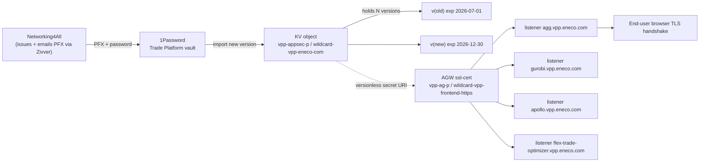
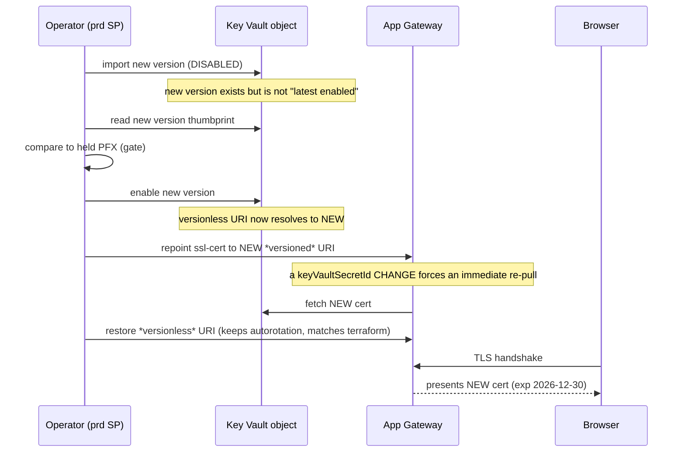

# How the VPP `*.vpp.eneco.com` TLS Rotation Works — and Why Only Production

This is the *understanding* companion to `rotation-execution-spec.md`. The spec tells you **what to run**; this tells you **why it works**, so you (or the next on-call) can reason about it, spot a wrong turn, and defend the scope under questioning.

## Audience and scope

A platform engineer who has never touched this certificate. By the end you should be able to reason about the rotation from first principles — not just paste commands.

## Knowledge Contract

After reading this, you will be able to:

1. **draw** the full path from the PFX file Networking4All sent us to a browser's TLS handshake on `agg.vpp.eneco.com`;
2. **explain** why we import the cert as a *new version of an existing Key Vault object* rather than a new object, and why a *versionless* secret URI is what makes that safe;
3. **trace**, in order, what happens when the new version is imported — and **explain why an empty `az network application-gateway update` does NOT propagate it**;
4. **predict** which environments this one wildcard can and cannot serve, and **defend** "production-only" with a label-counting argument;
5. **reject** three shortcuts that look correct but cause outages, by naming the mechanism that breaks each;
6. **name** the single probe that would prove the scope wrong.

This document does **not** make you able to run the change blind — pair it with the spec and its GO/NO-GO gates.

## TL;DR

We received a renewed wildcard certificate for `*.vpp.eneco.com`. Live inspection proved it is the renewal of exactly **one** object — `wildcard-vpp-eneco-com` in the **production** Key Vault `vpp-appsec-p` — whose current certificate **expires 2026-07-01**. The App Gateway `vpp-ag-p` reads that object through a *versionless* link, so we just add a new version, force one refresh, and four production sub-domains start serving the new cert. dev and acc use *different* certificates, so they are untouched.

## How we know this — the live inspections

The TL;DR says "live inspection proved." Here is exactly what was run, why, and what came back — nothing here is asserted from memory or the runbook. Each probe answers one question and feeds the next.

### 1. What certificate do we actually hold? (local, no Azure)

Rationale: everything downstream depends on the cert's identity — its names (SAN) and validity. The PFX is password-protected and legacy-encrypted, so OpenSSL needs `-legacy` and reads the password from the file (never echoed).

```bash
openssl pkcs12 -in 26061584690-_-vpp-eneco-com.pfx -nokeys -clcerts \
  -passin file:certificate_password.txt -legacy \
  | openssl x509 -noout -subject -issuer -enddate -ext subjectAltName
```

Found: `subject=CN=*.vpp.eneco.com`; SAN `*.vpp.eneco.com, vpp.eneco.com`; issuer `Trust Provider B.V.`; `notAfter=Dec 30 2026`. A check of the private key against the leaf confirmed the PFX is a complete, importable key-pair.

### 2. Which App Gateway and which Key Vault object? (control-plane, no firewall change)

Rationale: the colleague's runbook gave three *different* App-Gateway names, so names had to be resolved live. The App Gateway's SSL-cert config carries the `keyVaultSecretId`, which reveals the exact Key Vault object each listener binds — readable without opening any firewall.

```bash
az network application-gateway list -g mcprd-rg-vpp-p-res --subscription <prod> --query "[].name" -o tsv
az network application-gateway ssl-cert list --gateway-name vpp-ag-p -g mcprd-rg-vpp-p-res \
  --subscription <prod> --query "[].{name:name, kvSecretId:keyVaultSecretId}" -o json
az network application-gateway http-listener list --gateway-name vpp-ag-p -g mcprd-rg-vpp-p-res \
  --subscription <prod> --query "[?sslCertificate!=null].{host:hostName, sslCertId:sslCertificate.id}" -o json
```

Found: the real gateway is `vpp-ag-p` (the runbook's `vpp-agw-p` / `vpp-appgw-p` were both wrong). Its listeners `agg/gurobi/apollo/flex-trade-optimizer.vpp.eneco.com` bind ssl-cert `wildcard-vpp-frontend-https`, whose `keyVaultSecretId` is the **versionless** URI `…/secrets/wildcard-vpp-eneco-com`. So the object to rotate is `wildcard-vpp-eneco-com`.

### 3. Does the object actually hold *our* cert? (data-plane — needs a brief, surgical whitelist)

Rationale: names are not proof. The only certainty is reading the cert bytes the Key Vault object holds today and comparing them to the PFX. The KV firewall denies by default, so the operator IP is whitelisted only for the read, then removed.

```bash
az keyvault network-rule add --name vpp-appsec-p -g mcprd-rg-vpp-p-res --subscription <prod> --ip-address <myip>/32
sleep 25
az keyvault certificate show --vault-name vpp-appsec-p --name wildcard-vpp-eneco-com --query cer -o tsv \
  | openssl base64 -d -A | openssl x509 -noout -subject -enddate -ext subjectAltName
az keyvault network-rule remove --name vpp-appsec-p -g mcprd-rg-vpp-p-res --subscription <prod> --ip-address <myip>/32
```

Found (prod): `CN=*.vpp.eneco.com`, SAN `*.vpp.eneco.com, vpp.eneco.com`, `notAfter=Jul 1 2026`. Same names + CA as the held PFX, expiring imminently — i.e. the *old* version of what we hold. The identical reads on **dev** (`vpp-appsec-d`) and **acc** (`vpp-appsec-a`) returned `dev-mc.vpp.eneco.com` / `*.dev-mc.vpp.eneco.com` and `acc.vpp.eneco.com` / `*.acc.vpp.eneco.com` — different certs. After every read the whitelist was removed and the residual rule count re-checked as zero.

### 4. Who can do the rotation? (identity + permissions)

Rationale: the actor needs two *different* permissions — write the KV firewall (control-plane) and import a certificate (data-plane access policy). Your own account turned out to lack acc/prod rights; the MC service principal has both.

```bash
# As the human user, on acc/prd:
az keyvault network-rule add --name vpp-appsec-p ...   # → AuthorizationFailed (no Microsoft.KeyVault/vaults/write)
# As the prd service principal (cached from 1Password):
az keyvault network-rule add --name vpp-appsec-p ...   # → succeeds
az keyvault show -n vpp-appsec-p -g mcprd-rg-vpp-p-res --subscription <prod> \
  --query "properties.accessPolicies[?objectId=='<sp-object-id>'].permissions.certificates"
```

Found: the human user has **no** active role on acc/prd (hence the workaround uses the MC SP). The prd SP's access policy includes `Get, List, Create, Import, Update, Delete` on certificates — so it can both whitelist and import.

### 5. Is the App Gateway the only thing using this cert in production?

Rationale: a wildcard could be consumed elsewhere (another gateway, Front Door, API Management, AKS ingress). Any such consumer left on the old cert would break at the Jul 1 expiry. So the whole production subscription was swept, not just one resource group.

```bash
az network application-gateway list --subscription <prod> --query "[].{name:name,rg:resourceGroup}" -o table
az graph query -q "resources | where subscriptionId=='<prod>' | where type in~ (
  'microsoft.network/frontdoors','microsoft.cdn/profiles','microsoft.apimanagement/service',
  'microsoft.web/sites','microsoft.containerservice/managedclusters') | project type,name,resourceGroup"
```

Found: exactly **one** App Gateway in the prod subscription (`vpp-ag-p`), and **zero** Front Door / CDN / API Management / App Service / AKS resources. So within production this cert has a single consumer.

### 6. Will a manual import fight terraform? (drift check)

Rationale: if the cert object or its gateway binding is managed by terraform, a manual import could be reverted by CI or cause plan drift.

```bash
rg -l --glob '*.tf' 'azurerm_key_vault_certificate' /path/to/eneco-src          # → no matches
rg 'wildcard-vpp-eneco-com' /path/to/MC-VPP-Infrastructure/main/configuration/prd.tfvars
```

Found: no `azurerm_key_vault_certificate` resource anywhere — the cert object is **not** terraform-managed. The gateway *binding* is in terraform but uses the **versionless** URI, so importing a new version leaves the configured value unchanged → no drift, and the prod pipeline is `trigger: none` (no surprise auto-apply).

### 7. How does propagation actually work? (Microsoft documentation)

Rationale: the draft assumed an empty `az network application-gateway update` would force a refresh. That had to be confirmed, because if wrong the new cert would sit in the vault unserved until expiry.

Found (Microsoft Learn, App Gateway ↔ Key Vault troubleshooting, "Resolution E"): *"Application Gateway refetches the certificate from Key Vault only when the configured `keyVaultSecretId` changes. … running an empty `az network application-gateway update` command … doesn't force the gateway to pull the newer Key Vault version."* So the documented force-refresh is to point the binding at the *versioned* URI and then back to versionless — which is exactly what the spec now does.

These seven steps are the chain behind every claim in this document and the spec. With that established, here are the first principles that make the rotation itself make sense.

## First principles (the ladder)

Before any command, six small truths the whole change rests on:

```text
Term            → what it is
  TLS cert      → a public key + the names it is valid for, signed by a CA; proves "I am *.vpp.eneco.com"
  CN            → Common Name: the cert's single primary name (here: *.vpp.eneco.com). Legacy field.
  SAN           → Subject Alternative Name: the FULL list of names/wildcards a cert is valid for.
                  Modern browsers validate the hostname against the SAN list (they ignore CN alone).
                  A cert with SAN {a.com, *.b.com} is trusted for a.com and any single-label host under b.com.
                  OUR cert's SAN = { *.vpp.eneco.com , vpp.eneco.com } — that is what makes it usable, and
                  it is the field we compared in Key Vault to confirm scope.
  Wildcard      → a SAN entry like *.vpp.eneco.com that matches EXACTLY ONE left label (host.vpp.eneco.com)
  PFX (PKCS#12) → one file holding the leaf cert + chain + PRIVATE key, password-protected
Primitive       → what must exist first
  Key Vault     → stores the cert as an OBJECT that can hold many VERSIONS over time
  Secret URI    → how a consumer references the cert; "versionless" = no version GUID on the end
Invariant       → what cannot change without changing the thing
  AGW binding   → the App Gateway listener points at the versionless URI, so "latest enabled version" wins
Mechanism       → how they interact over time
  Rotation      → add a new VERSION under the same object → consumers on the versionless URI pick it up
Consequence     → what the user sees
  Served cert   → the browser handshake on host.vpp.eneco.com presents whatever AGW last pulled
Failure         → what breaks an invariant
  Stale serve   → if AGW never re-pulls, it serves the OLD version until it expires → TLS errors
```

The single most important line is the wildcard one: `*.vpp.eneco.com` matches `agg.vpp.eneco.com` (one label) but **not** `apollo.acc.vpp.eneco.com` (two labels). That one fact is the whole "why only production" argument.

## The topology — what exists and how it connects

Here is the chain the certificate travels, from the email Networking4All sends to the browser handshake. Read it as "who hands the cert to whom."



What you are looking at: the PFX flows left-to-right into **one** Key Vault object, which accumulates **versions**. The App Gateway does **not** point at a version — it points at the object through a *versionless* link (the dotted line). So the moment a new version becomes the latest enabled one, every listener downstream is eligible to serve it. The four listeners all share the **same** AGW ssl-cert resource (`wildcard-vpp-frontend-https`), which is why one rotation covers all four hosts — and why a check on any one of them is evidence for all four. Keep this picture: **object holds versions; consumer references the object, not a version.** The next diagram puts this in motion.

> Note the two-name trap drawn here: the **KV object** is `wildcard-vpp-eneco-com`, but the **AGW ssl-cert resource** that references it is named `wildcard-vpp-frontend-https`. They are different names for different things; commands that confuse them fail with "not found."

## The mechanism over time — what happens, in order

Topology shows what exists; this shows causality — the order that makes the rotation safe, and the one place it silently fails.



What this teaches: we import **disabled** first so a wrong cert can never go live before the thumbprint gate passes — the verification happens *before* exposure, not after. Only after the gate do we enable it. Then comes the subtle part: simply having a newer "latest enabled" version is **not enough to serve it now** — the App Gateway caches its copy and only re-fetches when its *configured* `keyVaultSecretId` **changes** (or on its slow 4-hour poll). So we deliberately change the link to the *versioned* URI to force an immediate re-pull, then change it **back** to versionless so future renewals still auto-rotate and the config still matches what terraform expects. The takeaway to keep: **propagation is triggered by a config change, not by the import.** That single fact is the difference between a real rotation and a silent non-event — which the next section makes concrete.

## The dangerous shortcut, by mechanism

The most expensive mistake here is invisible on the day you make it. This decision ladder is what to *not* do, and why.

```text
"I imported the new version, now refresh the gateway."
  ├─ run `az network application-gateway update` with no changes
  │     → exit 0, looks done
  │     → BUT a no-delta update does NOT change keyVaultSecretId
  │     → AGW does NOT re-pull → keeps serving the OLD cert
  │     → silent until 2026-07-01, then ALL four hosts throw TLS-expired → outage
  │     ✗ WRONG (Microsoft docs, Resolution E)
  └─ change keyVaultSecretId (versioned), then restore versionless
        → AGW re-pulls immediately → serves NEW
        ✓ CORRECT
```

Why it fools people: the command succeeds, so the feedback says "done." The real success signal is not the command's exit code — it is a **TLS handshake that presents the new expiry**. That is why the spec makes a handshake witness mandatory and treats `az` exit 0 as meaningless on its own.

Two more shortcuts to reject the same way:

- **Pinning to a versioned URI and leaving it there**: it serves the right cert today, but it turns off autorotation — the *next* renewal will silently not propagate, and it drifts from terraform (which stores the versionless URI). Use versioned only as a momentary force, then restore versionless.
- **Rolling back after the old cert expires**: rollback works by pointing back at the old version — which is only useful while the old version is still valid. After 2026-07-01 the "safe" fallback is itself expired, so a late rollback creates a *second* outage. This is why the change is scheduled with days of margin, not hours.

## Why only production (the part to defend)

This is the claim someone will challenge: "It's a wildcard — surely it's used everywhere?" The answer is a label-counting argument backed by live reads.

```text
Held cert SAN:  *.vpp.eneco.com   +   vpp.eneco.com
                 │                      │
   matches  X.vpp.eneco.com (ONE label)  and the apex
                 │
   does NOT match  X.dev-mc.vpp.eneco.com   (two labels)
   does NOT match  X.acc.vpp.eneco.com      (two labels)

Live Key Vault contents (read 2026-06-24):
   prod  vpp-appsec-p : wildcard-vpp-eneco-com  = *.vpp.eneco.com   ← MATCH (exp Jul 1)
   acc   vpp-appsec-a : wildcard-...            = *.acc.vpp.eneco.com   (different cert)
   acc   vpp-appsec-a : vpp-eneco-com           = acc.vpp.eneco.com      (single host)
   dev   vpp-appsec-d : wildcard-dev-mc-...     = *.dev-mc.vpp.eneco.com (different cert)
   dev   vpp-appsec-d : d-vpp-eneco-com         = dev-mc.vpp.eneco.com   (single host)
```

What this shows: acc and dev terminate TLS with their **own** certificates — env-specific wildcards (`*.acc.`, `*.dev-mc.`) plus single-host certs. None of them is a `*.vpp.eneco.com` cert, and a `*.vpp.eneco.com` wildcard cannot serve their two-label sub-domains anyway. So the renewal we hold belongs to production and nowhere else. The honest boundary of this claim: it was proven across the production subscription (where `vpp-ag-p` is the *only* consumer) by reading what each gateway and vault actually holds. It was **not** swept across the Sandbox/iactest subscriptions — see the challenge section for how to close that.

## Failure modes (trigger → symptom)

| Failure | Trigger | Symptom | Defense |
|---|---|---|---|
| Silent non-propagation | empty AGW `update` used as "refresh" | old cert served till Jul 1, then mass TLS-expired | force via versioned-URI change; verify by handshake |
| Listener disabled | AGW can't fetch the cert (KV firewall/permission/disabled version) | host stops serving HTTPS entirely | keep an enabled, resolvable version at all times; watch AGW Resource Health |
| Rollback too late | bad cert found after Jul 1 | rollback restores an expired cert = second outage | schedule ≥4 days before expiry; else fix-forward |
| Verify-after-live | enable then check | a wrong cert is briefly live before the gate | import disabled, gate, then enable |
| Firewall left open | whitelist-on without a guaranteed off | standing exposure on the prod KV | real `trap` removes the IP on any exit; residual check |

## Evidence ledger

| # | Claim | Status | Source |
|---|---|---|---|
| 1 | Held cert = `*.vpp.eneco.com` + `vpp.eneco.com`, exp 2026-12-30 | FACT | `openssl` on the PFX |
| 2 | prod `wildcard-vpp-eneco-com` current cert = same CN/SAN, exp 2026-07-01 | FACT | `az keyvault certificate show` (data-plane) |
| 3 | acc/dev hold only `*.acc.*` / `*.dev-mc.*` / single-host certs | FACT | data-plane reads of `vpp-appsec-a` / `-d` |
| 4 | `vpp-ag-p` is the only AGW / cert consumer in the prod sub | FACT | `az ... application-gateway list` + Resource-Graph (count 0 others) |
| 5 | Empty `az network application-gateway update` does NOT force re-pull | FACT | Microsoft Docs, AGW Key Vault troubleshooting, Resolution E |
| 6 | Cert object is not terraform-managed; AGW binding is versionless | FACT | grep of MC-VPP IaC (no `azurerm_key_vault_certificate`; `prd.tfvars` versionless URI) |
| 7 | Cross-subscription (Sandbox/iactest) usage of this wildcard | UNVERIFIED | not swept (prod SP can't see other subs); low risk by the env-specific-cert pattern |

## Challenge — defend it

- *"How do you know it's the renewal and not a coincidence?"* Same CN, same SAN list, same CA, and the live prod object expires exactly when a renewal would be needed (Jul 1) while the new one starts mid-June — a textbook overlap.
- *"What would prove the scope wrong?"* One consumer of a `*.vpp.eneco.com` cert outside `vpp-ag-p` — in another subscription or a non-App-Gateway consumer (ingress, Front Door, APIM). The settling probe is a cross-subscription Resource-Graph sweep run as a multi-subscription identity.
- *"Where does the abstraction leak?"* The versionless-URI auto-rotation has a ~4h lag and an explicit re-pull quirk (empty update is a no-op). That quirk is the whole reason for the versioned-toggle force.

## Self-test (rebuild the reasoning)

1. Draw the path PFX → browser handshake from memory; name the two differently-named resources in the middle.
2. Explain to a colleague why importing the version isn't enough to serve it, and what actually triggers propagation.
3. A teammate says "I'll just `az network application-gateway update` to refresh it." What do you tell them, and why?
4. Why can this cert serve `agg.vpp.eneco.com` but not `apollo.acc.vpp.eneco.com`?
5. It's June 30 and the new cert looks wrong. What's your move, and what changes if it's July 2?

Success condition: you can answer all five without rereading — especially #3 and #5.

## Durable principle

A certificate rotation is not "done" when the import succeeds; it is done when something **downstream presents the new cert**. Reference the object, not the version; force the re-pull deliberately; verify by handshake, not by exit code; and never let your rollback expire before your change window closes.
