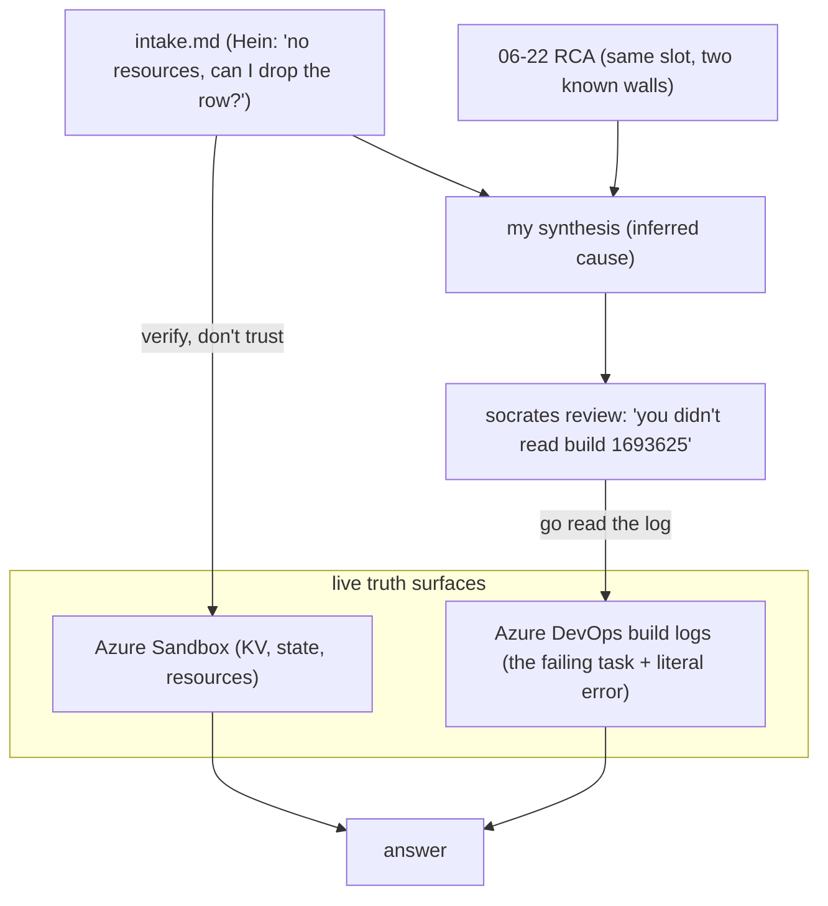

# How I diagnosed "free the `thor` FBE" — the method, the commands, the why

**Topic:** the exact reasoning path and commands I used to answer Hein's two questions about the stuck `thor` Feature Branch Environment — including the moment an adversarial review caught me about to ship an *inference* and made me go read the actual build log.
**Mastery level:** after this you can reproduce every probe from cold, explain why each was chosen, and defend the recommendation against a skeptical teammate.
**Audience & scope:** an on-call engineer who knows Azure CLI + Azure DevOps exist. Scope is *my diagnostic method*, not FBE internals — those live in the [06-22 RCA](../2026_06_22_004_tiago_thor_fbe_failed_deletion/rca.md).

---

## Knowledge Contract

After reading this you can:

1. **draw** the two pipeline "walls" that keep `thor` stuck and say which person hits which;
2. **explain** why I distrusted both the reporter's claim *and* my own first inference, and what probe settled each;
3. **trace** the commands I ran — live Azure state **and** the Azure DevOps build logs — and what decision each one closed;
4. **reject** "just set the bypass flag" as a complete fix, with the mechanism that makes it insufficient;
5. **defend** "auto-cleanup isn't broken" against "then why is it still stuck?".

This does **not** make you an expert in how an FBE is built — only in how I *triaged* this one.

---

## TL;DR picture

One slot, two walls, four failed delete runs over a week. Hold this before the commands.

```text
 thor delete pipeline (2629) — every run dies before the "release slot" step
 ┌────────────────────────────────────────────────────────────────────┐
 │ WALL 1  Preparation/DetermineEnvironment                            │
 │         bypass=false → lookup scoped to YOUR email → "no rows"      │  ← Hein's runs
 │                                                                      │
 │ WALL 2  DestroyAppConfiguration/Get Feature Flags                   │
 │         App Config already gone → `feature list -n ""` → exit 1     │  ← Roel's runs (got past wall 1)
 │                                                                      │
 │ RELEASE slot in the table  ← last step, downstream of both → never reached │
 └────────────────────────────────────────────────────────────────────┘
```

The single idea: **the step that frees the slot is last, behind two walls that nobody has cleared.** So the row stays `used` no matter how many people re-run delete.

---

## First-principles ladder

| Rung | Statement |
|---|---|
| **Term** | An FBE is a named slot (`thor`) whose "who owns it / is it free" lives in one Azure **Storage Table** row, separate from its Azure resources. |
| **Primitive** | The delete pipeline runs **stages in order**; the step that frees the slot (row → `unused`) is the **last** step of the **last** stage. |
| **Invariant** | The row only flips to `unused` if every prior stage **succeeds**. Any earlier failure leaves the row untouched. |
| **Mechanism** | Two independent earlier stages can fail: an owner check scoped to the runner's email, and a non-idempotent App-Config cleanup that chokes on an already-deleted store. |
| **Consequence** | Resources can be 90% gone while the slot still reads `used`. "Green pipeline" ≠ "slot freed"; "auto-cleanup runs" ≠ "slot freed". |
| **Defense** | Verify by **state** (the row, live resources) and by **reading the failing build's log** — never by an exit code, a reporter's summary, or your own pattern-match. |

---

## The method — and the adversarial catch that fixed it

My first pass *inferred* the cause of Hein's failed build from the prior incident's pattern. An adversarial reviewer subagent I dispatched against my own synthesis flagged the cardinal sin: **Hein handed me the build id and a log link, and I pattern-matched instead of reading it.** That one objection changed the work — I went and read the log, which turned an inference into a fact *and* surfaced a nuance I'd have missed (the bypass flag isn't sufficient).

This answers: "which surfaces decide the answer, and in what order did I consult them?"



**Reading it:** the two inputs (intake + old RCA) fed a synthesis that was *plausible but unverified*. The adversary sat between my synthesis and the deliverable and refused to let an inference ship. The fix was to consult the two live truth surfaces — Azure for resource state, Azure DevOps for the *literal* failure. **Takeaway:** the highest-information artifact (the build log) was free and offered; pattern-matching the old incident was the lazy path. Build an adversary into the loop precisely to catch that.

---

## The commands — each with the question it settled

Two groups: live Azure state, then the Azure DevOps build logs. Every row is "what I asked / why / what it returned".

| # | Command (abridged) | Question | Why it matters | Result |
|---|---|---|---|---|
| 0 | `az account set --subscription 7b1ba02e…` | Am I on Sandbox? | Default `az` sub is usually wrong → silent wrong-target | Confirmed Sandbox |
| 1 | `az resource list -g rg-vpp-app-sb-401 [?contains(name,'thor')]` | What `thor` resources exist? | Tests Hein's "nothing left" claim directly | **KV + smart-detector still there** → claim wrong |
| 2 | `az keyvault show vpp-fbe-thor-vuo` | Is the KV really live? | A live KV means a bare row-edit orphans it | **Exists**, not soft-deleted |
| 3 | `az storage blob list … tfstate` | Is the infra teardown finished? | State size = cheap "destroyed vs full" proxy | `terraform.thor` **313 KB full**, frozen 06-18 |
| 4 | `az keyvault certificate list` / `secret list [?managed]` | Can the old 403 recur? | Decides if a re-run path is viable | both empty → 403 class dead |
| 5 | **`az devops invoke … timeline buildId=1693625`** + **`… logs logId=6`** | *Exactly* why did Hein's run fail? | The adversary's demand: read it, don't infer | `bypass=[false]` → owner-scoped lookup → "No rows found" → exit 1 |
| 6 | `az pipelines build list --definition-ids 2629` + per-build `templateParameters.environment` | Has anyone freed thor? which slot did each run target? | Catch a possible already-fixed state (a `succeeded` run appeared) | the `succeeded` run was **ionix**, not thor; thor failed 4×, two at **wall 1**, two at **wall 2** |
| 7 | `az resource show … vpp-fbe-autodelete-trigger` + run history | Is auto-cleanup broken/off? | Q2 hinges on it | **Enabled**, daily, all **Succeeded** → not broken |

The order matters: probe 1 overturned Hein's premise cheaply; probe 5 (forced by the adversary) turned my inference into fact and revealed wall-vs-wall; probe 6 nearly tricked me — a green `succeeded` run that turned out to be a *different slot*; probe 7 stopped me asserting "auto-cleanup is broken" when it isn't.

---

## Why the answer is what it is (mechanism, not labels)

**"Can I just remove the table row?"** — Yes. Updating the row to `active=unused`/empty `createdby` *is* the pipeline's release step, and it frees the slot independently of everything else. But the Key Vault `vpp-fbe-thor-vuo` is **still alive** and the Terraform state still thinks thor's infra exists, so a bare row edit orphans a vault and leaves stale state. And update the row — never delete it — because it's the shared slot-pool table.

**"Why didn't auto-cleanup remove it?"** — Because "auto-cleanup" only *triggers a delete*; it doesn't guarantee the delete finishes. The Logic App runs daily and succeeds, but the delete pipeline it relies on can't reach its release step for `thor` — it dies at wall 1 or wall 2 every time. The row is downstream of both walls, so it never clears, by hand or automatically.

**Why bypass alone isn't the fix:** `bypassEnvironmentOwnerValidation=true` clears wall 1 (the owner scoping). But Roel's runs prove wall 2 (the non-idempotent App-Config stage) still kills the pipeline right after — that guard from the 06-22 incident was never merged. So you need *both*: bypass **and** the guard (or a break-glass).

---

## Diagnosis ladder — decide your path from the failing stage alone

When you inherit a stuck FBE, the failing stage names the wall — and your next move — for free. This answers: "given one failure message, what do I do?"

```text
Read the FAILING STAGE in the build timeline (az devops invoke … timeline)
│
├─ Preparation/DetermineEnvironment, "No rows found", bypass=[false]
│     → wall 1: lookup scoped to your email; you're not the owner
│     → set bypassEnvironmentOwnerValidation=true (clears THIS wall only)
│
├─ DestroyAppConfiguration/Get Feature Flags, "argument --name/-n: expected one argument"
│     → wall 2: App Config already gone (partial teardown) → empty name
│     → needs the idempotency guard merged (06-22) — bypass does NOT help here
│
└─ pipeline green but slot still "used"
      → release step never reached → check the TABLE ROW, not the checkmark
```

**Reading it:** Hein hit wall 1, Roel hit wall 2, on the same slot. The failing stage + literal error name the wall for free. **Takeaway:** triage by stage + error string first; touch nothing until you know which wall you're on — and remember clearing one wall just exposes the next.

---

## Evidence ledger

| Claim | Status | How known |
|---|---|---|
| KV `vpp-fbe-thor-vuo` still exists | A1 FACT | `az resource list` + `az keyvault show`, this session |
| Infra teardown incomplete | A1 FACT | `terraform.thor` blob = 313 KB, mtime 2026-06-18T07:36 |
| Wall 1: Hein's run failed owner-scoped lookup, bypass=false | A1 FACT | build 1693625 log 6, read verbatim |
| Wall 2: thor runs die at DestroyAppConfiguration (06-22 bug unmerged) | A1 FACT | builds 1692721 + 1690999 timeline (Roel) |
| The `succeeded` run was a different slot | A1 FACT | build 1693624 `templateParameters.environment=ionix` |
| Auto-evict Logic App enabled + running | A1 FACT | `az resource show` state=Enabled + daily run history all Succeeded |
| Slot row = `used`/`createdby=Tiago` | A3 BLOCKED | table read denied (no Storage Table Data Reader); inferred from wall-1 "No rows found" on Hein's email |

---

## Challenge-defense

- **"You trusted the old RCA."** No — the old RCA only told me *what to look for*; I re-read the live KV and the actual build logs this session.
- **"How do you know auto-cleanup isn't broken?"** Its Logic App is Enabled with a daily run history of all-Succeeded. It's not broken — the *delete it triggers* can't complete. Falsifier: if the Logic App were Disabled or its runs Failed, that answer flips.
- **"Maybe thor is already freed — there was a green run."** That green run targeted `ionix`. Probe 6 ran the falsifier and refuted it.
- **Where it could be wrong:** I could not read the table row directly (denied). If it were already `unused`, the framing collapses — but the live wall-1 "No rows found" on Hein's email is strong evidence it's still `used`/Tiago. I also did not trace a specific *auto-triggered* thor delete (all observed thor builds were manual), so Q2's "the auto path hits the same wall" is reasoned from the pipeline's demonstrated inability to complete, not from an auto-run log.

---

## Self-test (rebuild the reasoning)

1. Why did the adversary's "go read the build log" objection matter more than my prior-incident pattern-match? *(The log is the highest-information artifact and was handed over; the pattern-match was a plausible inference that turned out to need a nuance — bypass insufficiency — only the log revealed.)*
2. A teammate says "just set bypass=true and re-run." Why is that incomplete? *(It clears wall 1 but the pipeline then dies at wall 2 — the unmerged App-Config idempotency bug.)*
3. A delete pipeline is green but the slot still reads `used`. What do you check and why isn't green enough? *(The table row; the release step is conditional and may never have run.)*
4. Transfer: a teardown runs `kubectl delete ns $(resolve_ns)` and the namespace was already deleted in a prior partial run. Predict the failure + the one-line guard. *(Empty `$(resolve_ns)` → `delete ns ""` errors; same non-idempotent resolve-then-use class as wall 2; guard: skip when the resolved value is empty.)*

---

## Durable principles

1. **Read the highest-information artifact before you infer.** Hein handed over a build id + log link; pattern-matching the old incident nearly shipped a fix with a missing caveat. The log was free.
2. **Build an adversary into your own loop.** A typed reviewer against my synthesis is what forced probe 5; self-review wouldn't have.
3. **Verify the reporter's premise first.** "No resources left" was false; one `az resource list` caught it.
4. **State is the truth surface, not exit codes or summaries.** And a `succeeded` build can be a *different target* — always check what it acted on.
5. **Clearing one wall exposes the next.** Stacked, earlier-stage failures across re-runs are a signature, not noise.

_Source RCA + full mechanisms: [06-22 package](../2026_06_22_004_tiago_thor_fbe_failed_deletion/rca.md). This session's handover: [sre-intake.md](./sre-intake.md). Paste-ready reply: [slack-answer.md](./slack-answer.md)._
