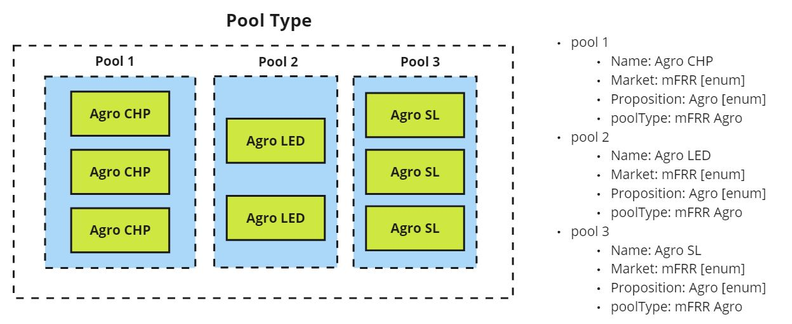

# Add pool type to Site Registry API

* Date: 2023-06-26
* Updated: 2023-06-21

# Context
* We are expanding the propositions and markets which the aggregation layer will support
* The current logic within the aggregation layer is very specific to the rooftop solar proposition
* We need to have a construct that enables us to act in accordance with the correct market and proposition requirements

# Decisions
* We will add new properties to the pool entity in Site Registry
    * Type
    * Market
    * Proposition

# Decision Drivers
1. We need the pool type to base our strategy off of in the required Azure Functions.