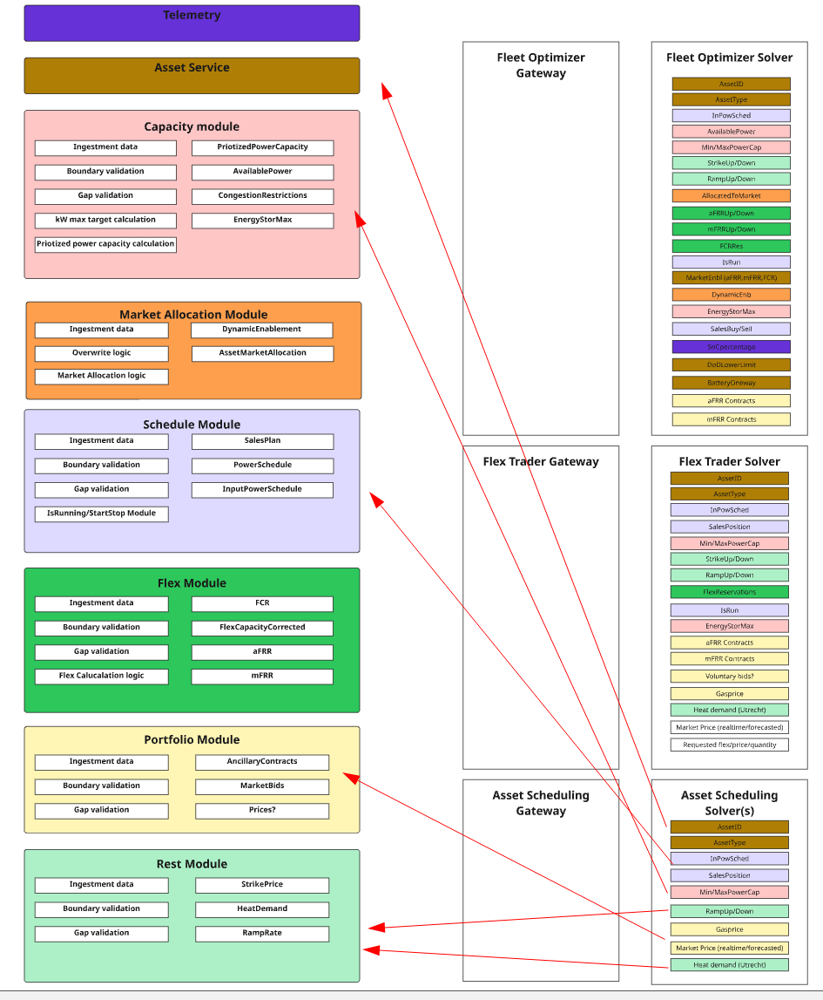
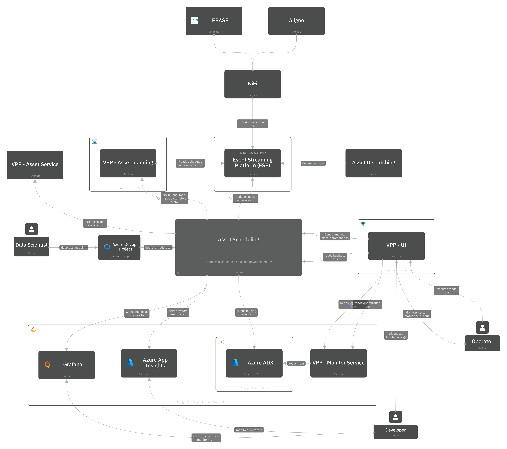

# 2. Integrate with vpp

Date: 2025-10-14

[[_TOC_]]

* Status: Accepted
* Date: 2025-10-14
* Deciders: Martijn Meijer, Ricardo Duncan, Alex Shymga
 

## Context

Asset scheduling has two requirements that tie closely with the VPP domain:

* Integrate with streams on ESP for optimization model's input data.
* Host features for operators to monitor optimization runs and intervene through overwrites.
* Host features for traders to read optimized trade proposals.

These requirements have an impact on the capabilities of each system. During a discussion with the VPP team
it was found that:

1. Handling data directly from ESP comes with the responsibility of validating, applying business rules and handling
   consumption correctly from Kafka
2. Asset scheduling depends on a subset of data available in Asset Planning
3. Asset scheduling can re-use the VPP UI for its operator and trader stakeholder requirements
4. Asset scheduling adheres to the same business rules for producing schedules as for handling input schedules

## Considered options

* Independent system
* Complete integration with VPP
* Partial integration with VPP

### Independent system

Asset Scheduling could be a completely separate system. It would have its own ingestion service, business logic and
UI.

* Pro: Asset Scheduling would function even with VPP going down
* Pro: Asset Scheduling and VPP can be deployed to separate clusters/environments.
* Pro: Asset Planning more freedom to change its business logic and data model independently of Asset Scheduling
* Con: Asset Scheduling would have its own monitoring infrastructure and UI
* Con: Asset Scheduling would have to develop and maintain its own components and logic to meet functional requirements

### Complete integration with VPP

VPP has a complete overlap in topics subscribed to with asset scheduling. Data coming from ESP is stored as series in
the Asset Planning service and redistributed through Service Bus
topics.

 > 👉 [See this miro board](https://miro.com/app/board/uXjVJdTgU7M=/)
for more information on the topics in asset planning and how they are used in downstream services.

The integration with VPP would entail the following:

1. Integration with Asset Planning to receive data from ESP
2. Asset scheduling reuses the VPP UI for its operator stakeholder requirements
3. Asset scheduling integrates with the observability and monitoring infrastructure of VPP
4. Asset scheduling produces schedules to ESP, which are in turn consumed by Asset Planning

This approach would have the following results:

* Pro: Asset Scheduling does not have to implement an ingestion service with the same features as Asset Planning.
* Con: It would create a single point of failure, or at least, strengthen a pre-existing one.

### Partial integration with VPP

Asset Scheduling could receive data from ESP. It would implement an ingestion service (inbox) that consumes from
a set of topics, filtered to the data relevant to assets that are scheduled in Asset Scheduling. Asset scheduling
would integrate with the observability and monitoring infrastructure of VPP only.

By integrating with ESP, Asset Scheduling should apply validation independently of Asset Planning. The validation done
should be coordinated with Asset Planning because it adheres to the same business rules.

* Pro: Asset Scheduling does not have to implement UI and monitoring features.
* Con: Asset Scheduling would have to develop and maintain its own components for data handling and validation from ESP

## Decision matrix

| Option               | P1 | P2 | P3 | P4 | P5 | P6 | Total |
|----------------------|----|----|----|----|----|----|-------|
| Independent system   | 3  | 2  | 2  | 4  | 4  | 2  | 17    |
| Complete integration | 5  | 4  | 4  | 5  | 4  | 4  | 26    |
| Partial integration  | 4  | 3  | 3  | 4  | 4  | 3  | 21    |

1. One Eneco, International Architecture (P1): Complete integration scores highest as it provides unified architecture
   across regions. Independent system scores lowest due to fragmentation.
2. Sustainable First (P2): Complete integration enables better resource utilization and maintenance efficiency.
   Independent system requires more resources to maintain.
3. Modular, Reusable, Adaptable (P3): Complete integration leverages existing components effectively. Independent system
   creates duplicate capabilities.
4. Service Exposability (P4): All options provide good service interfaces, with complete integration offering most
   cohesive API exposure.
5. In-house Capabilities (P5): All options maintain core capabilities in-house equally well.
6. Benefits, Cost, Risk Balance (P6): Complete integration offers best balance through shared infrastructure and reduced
   maintenance costs, while independent system has highest implementation and maintenance costs.

## Decision

As Asset Planning and Asset Scheduling share a domain with business rules and product requirements, the consensus
is that it could be understood as the same system.

Re-using business logic and ingestion infrastructure fits naturally given the requirements of Asset Planning and Asset
Scheduling.

It has been decided to integrate Asset Scheduling with Asset Planning to reduce overall complexity, create domain
synchronicity and with that allow better control of quality on the system as a whole.

The following integration paths will be implemented:

1. Asset scheduling receives asset data from Asset Planning
2. Asset scheduling produces schedules to ESP which in turn is consumed by Asset Planning
3. Asset scheduling provides endpoints for the VPP UI:
    1. Requesting optimization logs (run logs)
    2. Submitting overwrites and manual runs
    3. Requesting business metrics
4. Asset scheduling produces log messages to Event Hub for the general "Log book" view
5. Asset scheduling uses the VPP alarm service so it can benefit from the same monitoring
   implementation

> 📝 **Note:** The integrations mentioned for monitoring do not provide a complete solution for observability. Another
> ADR will follow
> for that.

## Consequences

### Positive

* Reduced development effort by reusing existing ingestion infrastructure and business logic
* Better domain synchronicity through shared business rules and validation
* Simplified system architecture by avoiding duplicate data processing
* Consistent data handling and validation across both scheduling and planning functions
* Leveraging existing VPP UI capabilities for operator requirements

### Negative

* Increased coupling between Asset Planning and Asset Scheduling services
* Single point of failure risk with Asset Planning becoming a critical dependency
* Potential scalability challenges if Asset Planning becomes a bottleneck
* Changes to Asset Planning may impact Asset Scheduling functionality

### Attention points

* Maintain comprehensive documentation of integration points and dependencies
* Create disaster recovery procedures for Asset Planning service disruptions
* Establish clear communication channels between Asset Planning and Asset Scheduling teams
* Regular review of shared business rules and validation logic to ensure alignment

