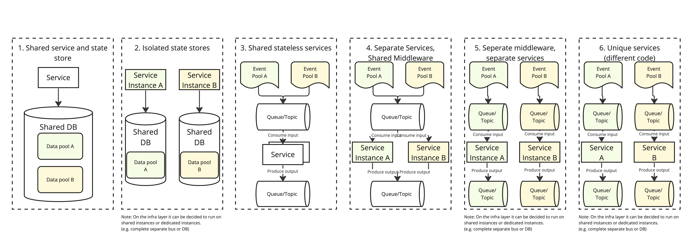

# Functional scaling patterns VPP

* Status: proposed
* Deciders: Rene Pingen, Ricardo Duncan, Arne Knottnerus, Mark Beukeboom 
* Date: 14/06/2023
## Context and Problem Statement
One of the key requirements of the VPP is to be market agnostic, asset agnostic and support multiple countries. As such, we need clear guidance how to scale the VPP from both a functional and technical perspective.

## Guiding principles for selecting the right pattern
- **Keep it simple, both functional processes and implementation:** We need to ensure the platform in terms of business logic as well as technical implementation remains maintainable and manageable on the long run. Try to avoid proposition/asset/market specific exceptions by challenging business and modeling things as generic solutions.
- **Think ahead:** Today you are implementing proposition x for a specific type of assets for a specific market and country. What do we already know that will come, how can we incorporate that without overengineering upfront?
- **Scalability and resiliency:** Think about how the solution should scale, and how resilient a solution should be. How many assets does a functionality need to support? To what extent should propositions/markets/asset types be isolated if specific logic for one proposition/market/asset type fails?
- **Design your data model and abstractions:** The solution can only scale if the data model and abstractions are correctly designed.
- **Joint responsibility of product owner and lead developer/architect:** The patterns to select higly depend on functional requirements, process standardisation and forward looking on functionality,process, data and technology domains. This is a joint effort.
## Patterns

