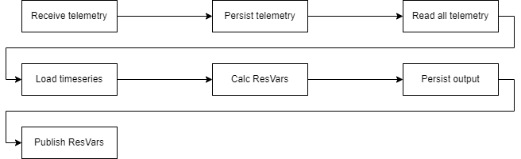
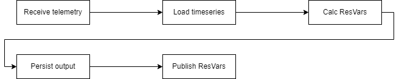
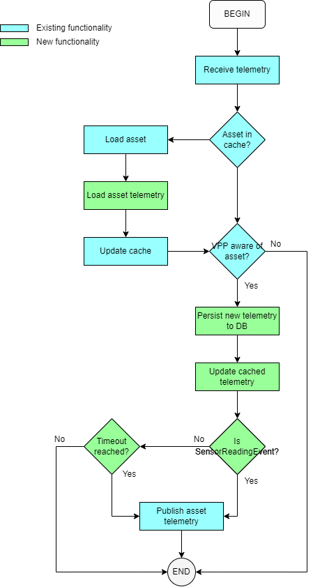

# Utilize partitions to cache and buffer telemetry to reduce load on the VPP.

* Status: [proposed]
* Deciders: ???

## Context and Problem Statement

Previously, the VPP used to receive a `SensorReadingEvent` for an asset every ~4s. This is still the case but now the VPP also receives a `DerivedTelemetryEvent` every ~4s, at almost
exactly the same time as the `SensorReadingEvent`. This leads to double the messages downstream in the VPP, which not only increases load on the service bus but also for downstream services
like DataPrep and the Monitor services.

The impact is specifically significant when it comes to DataPrep, not only does DataPrep calculate and publish resulting variables for each telemetry message it receives, since all telemetry for an asset is not present in a telemetry message, DataPrep needs to persist the received telemetry and then also load all telemetry for an asset every time it needs to calculate resulting variables, [see flow below](##current-dataprep-flow).


## Decision Drivers

* Eliminate the double publish that is a result of receiving the 2 types of telemetry so close together.
* Reduce amount of resulting variable calculations in DataPrep.
* Reduce load on the DataPrep, Dispatcher, Reference Signal DB.
* Reduce load on service bus.

## Considered Options

* Option 1: Use partitions and caching within telemetry service to buffer telemetry.
* Option 2: Expose the event/telemetry type within the VPP.
* Option 3: Keep telemetry service as is, and let downstream services deal with telemetry.

## Decision Outcome

**Option 1**, because it keeps the complexity of dealing with telemetry within the telemetry ingestion service and makes good use of the partitioning functionality available to us. It is also the only option that really satisfies all the decision drivers.

### Positive Consequences

* Leverages stream partitions.
* Simplifies and reduces load on DataPrep.
* Reduces load on the monitor service.
* Reduces load on the service bus.
* Follow up decision, do we keep SQL or do we make use of CosmosDB/Redis in the telemetry ingestion service.

### Negative Consequences

* Some telemetry might arrive ~4s later.
* Telemetry ingestion service needs to persist data again.

## Pros and Cons of the Options

### Option 1: Use partitions and caching within telemetry service to buffer telemetry.

The telemetry ingestion service consumes telemetry from a stream on ESP. This stream is partitioned by asset which guarantees that each instance of the telemetry ingestion service will process telemetry for its own set of assets, in the order the telemetry was published onto the stream for those assets.

This allows us to cache & buffer telemetry for assets, which means we can control how and when we publish telemetry within the VPP from the telemetry ingestion service. Thus, this option proposes the following [approach to processing telemetry](#new-telemetry-processing-flow).

By following this approach we'll only publish telemetry when we receive a `SensorReadingEvent`, meaning we reduce the amount of telemetry messages we need to process downstream by half, not taking `AssetHealthEvent`s into account which are only sent every minute.

DataPrep would now only receive one telemetry message every 4s per asset, instead of two every 4s, which reduces the resulting variable calculations by half as well. Since all telemetry is present in the telemetry message itself, this will eliminate the need for DataPrep to write and then load all telemetry for an asset. In fact, it will remove the need for DataPrep to store any telemetry at all, eliminating a [significant portion](#dataprep-requests-per-minute-per-collection) of the load on its DB.

* Good, we actually make good use of the partitioning functionality.
* Good, we reduce the amount of telemetry messages published within the VPP by ~50%.
* Good, we reduce the amount of resulting variables calculated (and by extension, published) by ~50%.
* Good, we increase the performance of resulting variable calculations as the persist/load telemetry steps are removed.
* Good, we reduce the load on the DataPrep DB since it no longer has to store telemetry.
* Bad, the telemetry service would have to persist and keep the latest telemetry for all assets. This could slow telemetry processing down a bit.
* Bad, `DerivedTelemetryEvent` may lag behind by ~4s as it might only get published when the next `SensorReadingEvent` is received.
* Bad, the Monitor service *might* have to store additional data or should try to not store duplicates.
    - Keep in mind that this would be a fairly rare occurrence, probably only on a cold start of telemetry ingestion and then probably only the telemetry that was contained in the `DerivedTelemetryEvent`.

### Option 2: Expose the event/telemetry type within the VPP.

We could add the event type to the telemetry messages we publish in the VPP. This could allow downstream services to then implement specific functionality based on the event type it received. For example, DataPrep could just calculate resulting variables if it received an event indicating it was a `SensorReadingEvent`.

* Good, we reduce the amount of resulting variables calculated (and by extension, published) by ~50%.
* Good, keeps telemetry ingestion service lightweight.
* Bad, exposes internals (the EventTypes) of another system to the entire VPP.
    - We could represent them differently in the VPP of course.

### Option 3: Keep telemetry service as is, and let downstream services deal with telemetry.

* Good, keeps telemetry ingestion service lightweight.
* Bad, pushes the complexity down to other services while telemetry ingestion service has the correct mechanism to deal with this.

## Appendix

## Current DataPrep flow


## Proposed DataPrep flow


## New telemetry processing flow


#### Notes
- The timeout functionality shown in the flow diagram could be as simple as something like this:
```python
def should_publish(event, last_published):
	if event.type == SensorReadingEvent || event.type == AssetHealthEvent:
		return true
		
	return last_published < (utc_now - some_configured_value)
```
* As shown above, we can always adjust the functionality to also always publish telemetry if an `AssetHealthEvent` is received.

#### Component overview


## DataPrep requests per minute per collection

