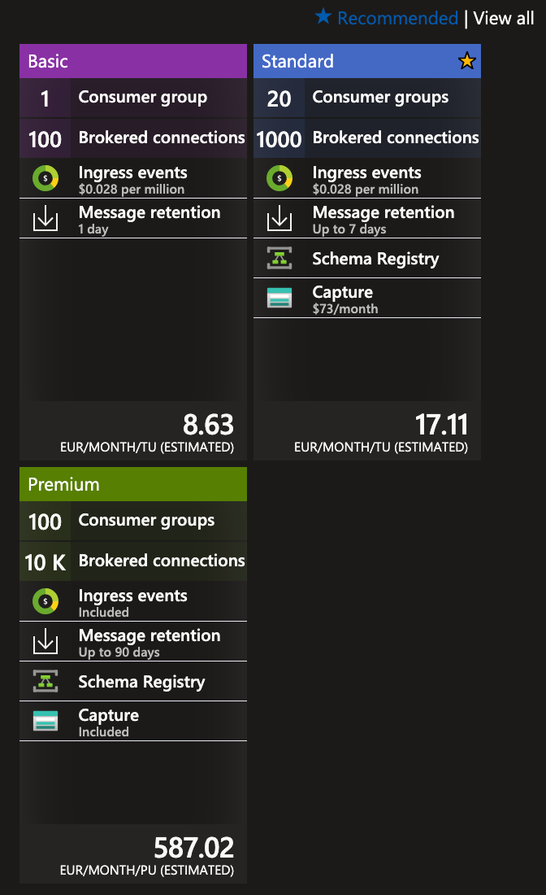

# Use Azure EventHubs instead of service bus for Telemetry 

* Status: Proposed
* Date: 2023-10-06
* Deciders: Ricardo, Henko

## Context and Problem Statement

With the Monitor V2 service we are seeing a lot of service bus events and having to consume that in a timely manner and process the events to Redis, SignalR and ADX is currently using a lot of compute on the service.

While looking into what possible solutions there could be to help solve this and lower the amount of instances and CPU usage per instance we investigated a couple of options.

One of these options is to switch from using service bus to event hubs, allowing us to ingest data into ADX directly and possibly negating the need for a mix of Redis and ADX.

## Decision Drivers

* **Driver 1**: Improving our scalability as the VPP an asset count grows
* **Driver 2**: Decrease complexity required in Monitoring the assets within the VPP

## Considerations

Possible features we might loose when switching from Service bus to Eventhubs

We currently have the following functionality that we have added onto our service bus implementation that we would not have if we move to eventhubs.

 - Outbox pattern (on some topics)
 - Eventual consistency (on some topics)
 - SerliogEnricher to ensure logging is in place for sending and receiving messages and enriched with meta data.

## Costs

An overview of the monthly cost can be found in the screenshot below  

  

For details how the cost is distibuted across individual tiers is displayed below  

### Telemetry Service:
- Does not make us of outbox pattern
- Eventual Consistency is not used for TelemetryCreated Event

### DataPreprocessing Service:
 - Does not make use of outbox pattern
 - Eventual Consistency is not used for ResultingVariablesCalculated Event

### SerliogEnricher
 - We would need to ensure we have the same level of logging details in place for the eventhub implementation.

## Considered Options

* **Leave as is, Only service bus**
  
  The current solution uses service bus to send all data between internal VPP services. Leaving this as is the monitor service is using a lot of CPU to consume the current amount of events and distribute it across Redis, ADX & SignalR.

* **Publish events to Eventhub** [**Selected option**]

  Add eventhub to telemetry service and DataPreprocessing services to publish TelemetryCreatedEvent and  ResultingVariablesCalculatedEvent to eventhub as well as service bus. Allowing us to ingest directly into ADX, removing the need to consume it in .net and batch ingest to ADX, potentially also removing the need for Redis for Hot data.

## Decision Outcome

Chosen option: "Publish events to Eventhub", because this opens us up to future growth and scalabilty, it also leads to reduced load on the cluster, and potentially leads to simplifying the architecture by removing Redis (TBD). 

## Pros and Cons of the Options

### Current architecture

* Good, because there is no code changes needed.
* Bad, because we need more nodes and use a lot more CPU and will have to scale up as we add new assets in the future
* Bad, because we have a more complex architecture with Redis and ADX

### Switching to Eventhubs

* Good, because eventhubs is a much better event streaming for the amount of messages we will need to handle in the future.
* Good, because we will be able to ingest data directly into ADX, removing the need to have the Monitor service act as a middle man.
* Good, because we could potentially remove the need for Redis since we will be able to query the telemetry directly from ADX in real time.
* Bad, because it will add a bit of extra load on the telemetry service and Datapreprocessing service while we are migrating from service bus to eventhubs. (We will need to publish to both until all consumers have switched)