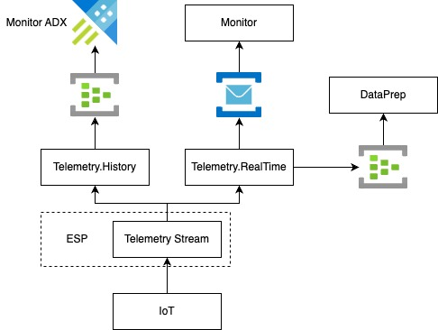
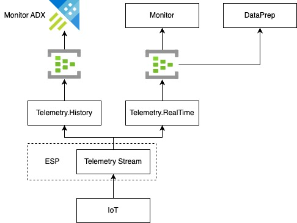

# Realtime Telemetry Stream

* Status: [proposed]
* Deciders: Team Dispatcher, Ricardo Duncan
* CC: Team Operations

## Context and Problem Statement

We currently receive all Telemetry for assets on a single stream via ESP. We then consume those records and send them via EventHubs and ServiceBus to Monitor and DataPrep.

In the VPP, we need Telemetry for 3 cases:

1. Calculating RVCs from Data Prep (Real Time)
2. Operator UI for viewing asset at Real Time (Real Time)
3. Historic data via the operator UI (Historic)

Based on the above, we have two needs for Telemetry, we have one path that cares for consistency and another path that cares about availability. 
We shouldn't be limiting each of these paths based on the other's requirements, we should create a separate stream for each case.

Since we consume and process every message on this stream, this leads to two problems:

### Problem 1

If IoT has failure and produces more messages than we can consume, we end up falling behind and consuming Telemetry that is old and we cannot steer assets.

This happened recently where IoT had a bad deployment and they ended up sending us telemetry events from 24 hours ago in a very short space of time, which caused us to report assets as ESM External.

### Problem 2

If we go down for some reason, we need to consume the backlog of messages before we can start steering assets. This can take us minutes/hours to do, which is stopping us from steering.

### Current Flow

## Decision Drivers

* Ability to recover as quickly as possible
* Have two separate streams in VPP
* Historic processes should not affect realtime processes

## Decision Outcome

* Option 2 - Only use RealTime telemetry

### Positive Consequences

* One technology used (EventHubs)
* We can take advantage of partitioning and add caching to Data Prep
* Faster recovery after an outage
* There will be a history in ADX, but there may be gaps in the UI

### Negative Consequences

* Since we will discard old Telemetry, there could be gaps in the UI.
* Since we will discard messages on the Real Time stream, the UI when showing that information via Signal R might have some gaps in the graphs. This would only be after an outage.

## Options

### Option 1 - Create two streams

We want to create two separate streams from Telemetry Ingestion. 

#### Historic Stream

This would work as the current stream, we would consume every message we receive via ESP and only ignore messages for Asset's we do not have in the VPP.

This would be published via EventHubs as it currently is, towards ADX.

This stream would:

1. Never discard Telemetry based on age.
2. Commit offsets.
3. Start at last committed offset.

#### Real Time Stream

This stream would only consume the latest messages in ESP and discard anything that we consider to old. The idea here is that this stream is for the Real Time processes, i.e Data Prep.

This stream would:

1. Discard Telemetry older than x seconds (2).
2. Never commit offset.
3. Start at latest offset.

#### Stream Migration

This would require work from both the Dispatcher and Operations team.

To start with, we would produce to both EventHubs and ServiceBus, this would allow time migrate implementations that are using Service Bus to use EventHubs. 
We would allow for 2 release cycles to make the switch as we do not want to produce twice indefinitely. 

Once Teams have moved over to EventHubs, we would drop the Service Bus producer. We would then be in the following state.

Each way of producing will be behind a feature flag so that we can turn each producer on/off.

#### Other Considerations/Questions

* How would this impact alarms?

#### Stream Migration

This would require work from both the Dispatcher and Operations team.

To start with, we would produce to both EventHubs and ServiceBus, this would allow time migrate implementations that are using Service Bus to use EventHubs.
We would allow for 2 release cycles to make the switch as we do not want to produce twice indefinitely.

Once Teams have moved over to EventHubs, we would drop the Service Bus producer. We would then be in the following state.

Each way of producing will be behind a feature flag so that we can turn each producer on/off.

### Option 2 - Only have a Real Time Stream

We do not worry about keeping the complete historic picture of Telemetry, we only care about the real time data.

We would update Telemetry Ingestion to discard Telemetry that is older than 2 minutes (this is currently configured in Data Prep to ignore Telemetry older than 2 minutes). This would provide the same benefits as the "RealTime Stream" from Option 1.

This stream would:

1. Discard Telemetry older than x seconds (2).
2. Never commit offset.
3. Start at latest offset.

"No data is clean, but most is useful." - Dean Abbott, Co-founder and Chief Data Scientist at SmarterHQ