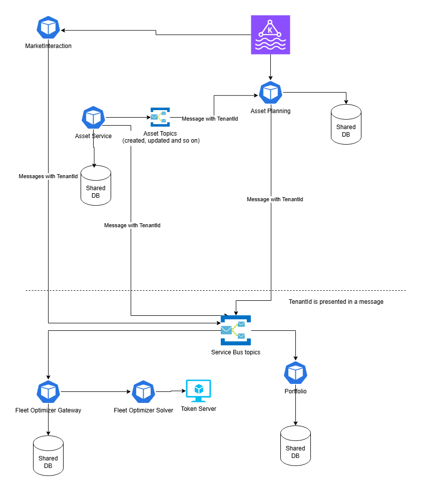
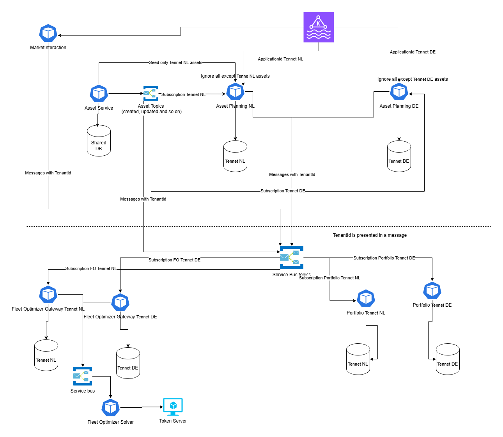
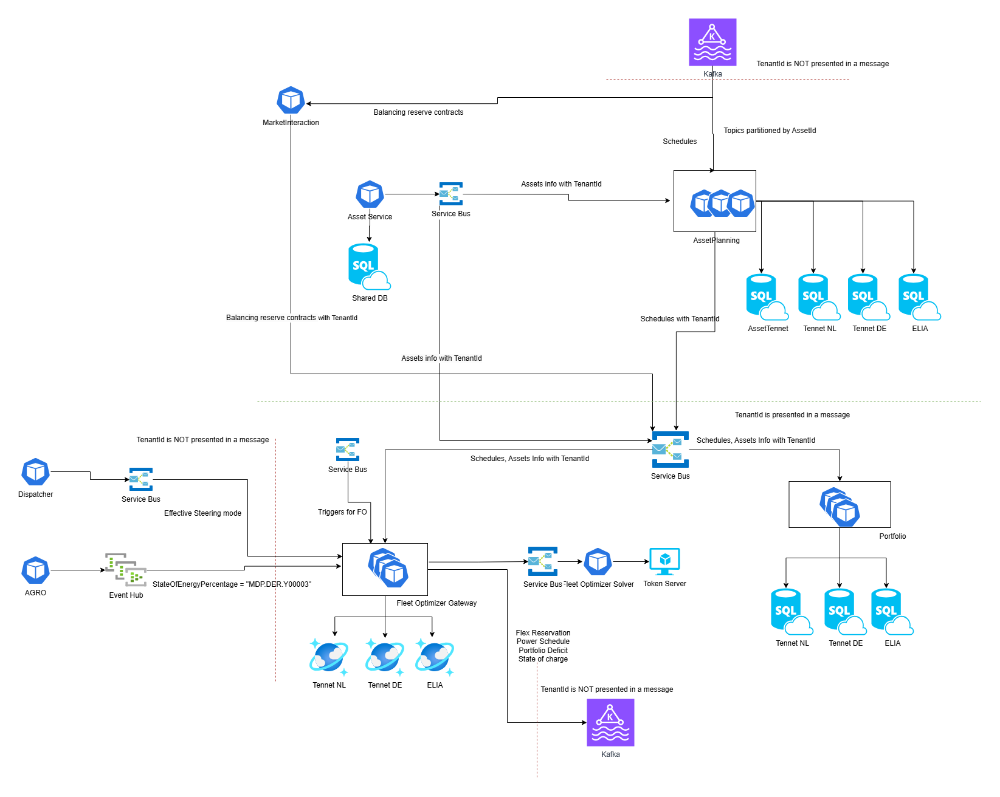

# Planning multi TSO

* Status: [proposed]
* Deciders: Quinten de Wit, Ihar Bandarenka, Dmytro Ivanchyshyn, Alex Shmyga, Ricardo Dunсan

## Context and Problem Statement

Currently Planning services support the only one TSO (TenneT NL).
Eneco its virtual power plant should be scalable to other countries which each has one or more TSO's. Examples are TenneT DE in Germany and Elia in Belgium. In the near future (coming half year), the planning domain should support these TSO's

* 60 assets in PROD.
* Currently data is stored without any information about TSO.
* UI is not adapted to multi TSO data.

Services load messages per second:
* Asset Planning - 1.5 messages per second
* Market Interaction - 0.001 messages per second
* Portfolio Service (reads Asset Planning messages)- 1.5 messages per second
* Fleet Optimizer (reads Asset Planning, Market Interaction, Dispatcher, IoT messages) - 1.5 - 2 messages per second
* Fleet Optimizer Solver (Reads Fleet Optimizer messages) - 0.001 messages per second

Incoming data sources:
* For Schedules: Aligne, Bofit, Ebase, Hub. Communication channel: Kafka.
* For Assets: Asset Owner (from Asset service). Communication channel: ServiceBus.
* Effective steering mode (from Dispatcher). Communication channel: ServiceBus.
* StateOfEnergyPercentage (from Agro). Communication channel: EventHub.
    * StateOfChargePercentage: energy available of the total (e.g. battery) in %, where 100% equals MDP.DER.100002 and 0% equals
    * MinStateOfEnergy (MDP.DER.300045). Also, see MDP.DER.100001 for absolute values. This is a value between 0 and 100.
    * https://dev.azure.com/enecomanagedcloud/Myriad%20-%20VPP/_wiki/wikis/Myriad---VPP.wiki/33801/MDP-Code-Aggregation-rules

## ESP topics configuration
- AssetCurtailmentSchedule_v1
  - partitions: 3
  - key: `"key": { "assetIdentifierCodingScheme":"PL", "assetIdentifier":"37" }`
- AssetAvailability_v2
  - partitions: 3
  - key: `"key": { "assetIdentifierCodingScheme":"PL", "assetIdentifier":"37" }`
- AssetProductionForecast_v1
  - partitions: 3
  - key: `"key": { "assetIdentifierCodingScheme":"PL", "assetIdentifier":"37" }`
- AssetStrikePrices_v1
  - partitions: 3
  - key: `"key": null`
- AssetFlexCapacityCorrected_v1
  - partitions: 3
  - key: `"key": null`
- AssetMarketAllocation_v1
  - partitions: ??? (*have no access*)
  - key: `"key": "e31f49d0-d5f0-4802-8f98-c0f1ad40eb40"`
- CongestionRestrictions_v1
  - partitions: 3
  - key: ??? (*topic is empty*)
- AssetEnergyCapacityForecast_v1
  - partitions: 3
  - key: `"key": { "assetIdentifierCodingScheme":"PL", "assetIdentifier":"37",  "regimeIdentifier": null }`
- AligneAssetSalesPlanAggregated_v1
  - partitions: 3
  - key: `"key": "HERMES"` (BUFFALO etc)
- AssetCapacityForecast_v1
  - partitions: 3
  - key: `"key": { "assetIdentifierCodingScheme":"PL", "assetIdentifier":"37",  "regimeIdentifier": null }`
- AssetFlexReservation_v1
  - partitions: 3
  - key: `"key": { "assetIdentifierCodingScheme":"PL", "assetIdentifier":"37",  "regimeIdentifier": null }`
- AssetRampRateForecast_v1
  - partitions: 3
  - key: `"key": { "assetIdentifierCodingScheme":"PL", "assetIdentifier":"37" }`
- AssetFeasiblePowerSchedule_v1
  - partitions: 3
  - key: `"key": { "assetIdentifierCodingScheme":"PL", "assetIdentifier":"37" }`
- AssetPowerSchedule_v1
  - partitions: 3
  - key: `"key": "e31f49d0-d5f0-4802-8f98-c0f1ad40eb40"`

### Current Flow

## Decision Drivers

* Scalability. It is desired to have up to 500 assets as a target state. It is expected to have some of the following TSOs: ELIA, TRANSNETBW, TENNETDE, AMPRION, 50HERTZ, RTE, TENNETNL, NATIONALGRID, ESO, SONI, SHETRANSMISSION, SPTRANSMISSION.
* Availability and Isolation. It is expected to have the same availability for multi TSO solution as it is for single TSO. (Busy neighbor problem)
* Maintenance. It is desired to have low 'effort' maintenance of the new design.
* Deployment simplicity. Deployment should not be fragile. It should be as few manual steps as possible. Deployment should be fast and trackable.
* Bugs prone. Changes should not lead to many bugs which is very difficult to spot. For instance changes in SQL scripts and store procedures.
* Costs. System should be efficient with the lowest cost.
* Speed of development. PoC FO DE can be developed really quickly.
* The same codebase per service for all TSOs.

## Considered Options

* Option 1: Hybrid approach

    

    * Asset Service:
        * Asset Service should be updated to provide Seed API with TSO filter parameter. Asset Planning instances configured per TSO will call this API.
        * Asset service should send messages with TenantId reflecting TSO of an Asset.
    * Asset Planning (competing consumers):
        * Competing consumers
        * New DB TenantAsset to determine TSO by checking in shared Assets Table by Asset External Identifier. Then service use TSO to pick the main DB.
        * Asset Planning service has separate DBs per TSO. Connection string is dynamically picked depends on TSO determined on previous step.
        * Asset Planning produces Integration and Claim check events with new field TenantId with the information about TSO.
        * UI should be updated to target different instance per TSO.
    * Market interaction (no changes in configuration):
        * Market interaction produces Integration events with new field TenantId with the information about TSO.
    * Fleet Optimizer (competing consumers):
        * Fleet Optimizer service has separate DBs per TSO. Connection string is dynamically picked depends on TenantId field in the message.
        * Fleet Optimizer is triggered by the Queue message with TSO Key. Messages in the Queue is added by Fleet Optimizer CRON jor or external service.
        * Solver does not need any changes. RunId will be associated with TSO in the DB. (change in code and DB needed. for instance add this info to RunStatus).
        * API should be updated to let UI filter data by TSO.
    * Portfolio service (competing consumers):
        * Portfolio service has separate DBs per TSO. Connection string is dynamically picked depends on TenantId field in the message.
        * API should be updated to let UI filter data by TSO.
    
* Option 2: Low isolation

    

    * Asset Service:
        * Asset service should send messages with TenantId reflecting TSO of an Asset.
    * Asset Planning (competing consumers):
        * Shared DB with TenantId column in all tables for data isolation. (Can be other options as well: separation on rows level)
        * Shared Application Id to read Kafka messages.
        * Asset Planning ingests any message from Kafka. Determine TSO by checking in shared Assets Table by Asset External Identifier. Then service use TSO to populate TenantId column in all tables.
        * Asset Planning produces Integration and Claim check events with new field TenantId with the information about TSO.
        * API should be updated to let UI filter data by TSO.
    * Market interaction (no changes in configuration):
        * Market interaction produces Integration events with new field TenantId with the information about TSO.
    * Fleet Optimizer (competing consumers):
        * Fleet Optimizer retrieve TSO from the message TenantId.
        * Fleet Optimizer has shared DB. Data isolation performed by different Partition Keys. (code changes needed).
        * Fleet Optimizer is triggered by the Queue message with TSO Key. Messages in the Queue is added by Fleet Optimizer CRON job or external service.
        * Solver does not need any changes. RunId will be associated with TSO in the DB. (change in code and DB needed. for instance add this info to RunStatus).
        * API should be updated to let UI filter data by TSO.
    * Portfolio service (competing consumers):
        * Portfolio retrieve TSO from the message TenantId.
        * Shared DB with TenantId column in all tables for data isolation. (Can be other options as well: separation on rows level)
        * API should be updated to let UI filter data by TSO.

* Option 3: High isolation

    

    * Asset Service:
        * Asset Service:
        * Asset Service should be updated to provide Seed API with TSO filter parameter. Asset Planning instances configured per TSO will call this API.
        * Asset service should send messages with TenantId reflecting TSO of an Asset.
    * Asset Planning (configured per TSO):
        * Separate compute configured per TSO.
        * Application Id to read Kafka messages per TSO.
        * Asset Planning ingests only target TSO Kafka messages ignores other.
        * Subscription to Asset Topic per TSO. Asset Planning ingests new Assets (and updates for existing Assets) only if the Asset belongs to target TSO. The rest Assets are ignored.
        * Separate DBs per TSO for Asset Planning Service. If Asset is not found in the database Schedule should be ignored.
        * Asset Planning produces Integration and Claim check events with new field TenantId with the information about TSO.
        * UI should be updated to target different instance per TSO.
    * Market interaction (no changes in configuration):
        * Market interaction produces Integration events with new field TenantId with the information about TSO.
    * Fleet Optimizer (configured per TSO):
        * Separate compute statically configured per TSO.
        * Separate subscription from one topic per TSO. Can fe routed/filtered by message broker.
        * Fleet Optimizer service has separate DBs per TSO. Connection string is determined by static configuration.
        * Solver does not need any changes. RunId will be associated with TSO in the DB. (change in code and DB needed. for instance add this info to RunStatus).
        * Optionally solver can also be separated per TSO. Multi token required to perform parallel optimizations.
        * API should be updated to let UI filter data by TSO.
    * Portfolio service (configured per TSO):
        * Separate compute statically configured per TSO.
        * Separate subscription from one topic per TSO. Can fe routed/filtered by message broker.
        * Portfolio service has separate DBs per TSO. Connection string is determined by static configuration.
        * API should be updated to let UI filter data by TSO.

## Options comparison

### Let's first take a look at shared DB vs DB per TSO comparison:

| Characteristic | Shared DB | DB per TSO |
| ---------------|:----------:| ----------:|
| Data Isolation | Medium. This can be done by TenantId column or roles per row  | High. After the right connection string is picked all data is isolated |
| Scalability | Medium. Elastic pool can be adjusted to handle bigger loads. Changes for such a big database like adding a new index may block a table for a long time. | High. Every database can be in a separate elastic pool. |
| Cost | The same in one pool | The same in one pool |
| Backups | All TSO at once | Per TSO |
| Availability | Business critical. | Business critical per TSO. |
| Busy neighbor | Possible if some TSO is hot. | Not applicable. |
| Code changes | Medium. A lot of places should be changed and tested. Some bugs can be overlooked. | Low. Almost no changes in code, some in configuration. |
| Performance | Large DB can be slower. Additional column TenantId and filters associated with it can slow down query execution. | No changes | 
| Maintainability | Low. No changes. | Medium. More efforts for more databases. |

* Looking at this comparison "DB per TSO" approach looks the way to go. For example currently for ~50 assets Asset Planning DB size is 150GB. Looking at target of up to 500 assets Shared DB can be size of 1.5T. Manipulations with DBs of such size always take too much time. Also isolation and simple code changes adds to it.

### Let's look at compute isolation:

There are 2 options: 
    1. Competing consumers. Can work with requests for any TSO.
    2. Statically Configured service per TSO. Can work with requests for particular TSO.

| Characteristic | Competing consumers | Compute per TSO |
| ---------------|:----------:| ----------:|
| Isolation | Low. "Busy neighbor" problem can arise. But can be fixed by adding more consumers | High. A high load for one TSO will be isolated. |
| Scalability | High. | High. Can be done fine-grained per TSO. |
| Cost | Low | Can be higher. Because small TSOs still require at least one instance. |
| Availability | High. Although poisoned messages for one TSO can kill all the instances. This can be solved by decreasing the retry count. | High. Fail domain restricted by TSO. |
| Busy neighbor | Possible if some TSO is hot. | Not applicable. |
| Code changes | Low. Scoped to "pick the right connection string". | Medium. Configuration changes are required. |
| Data transfer | One topic - one subscription. No changes. | Filters on broker side desirable. One subscription per TSO. |

 * Looking at these options both are good. Competing consumers easier to configure. "Compute per TSO" works good and provide better isolation. Can be the next step if we apply filters on topics to separate data per TSO.
 * Asset Planning is a special case. Kafka message does not contain information about TSO. Having competing consumers is difficult because before "pick the right connection string" step TSO should be identified from some lookup. Having separate instances per TSO solves this problem. Every instance has its own ApplicationId in Kafka and can filter out messages for non-target TSO by checking in TSO specific database.

## Decision Outcome

* Option 1 - Hybrid approach.

Showcase of 3 TSOs:

### Positive Consequences
* Hybrid approach is easier to implement.
* No changes for transport (currently Service Bus) is needed.
* Data isolation is enough for current system load.
* Overall costs are lower.
* Easy to switch to Option 3.

### Negative Consequences
* Busy neighbor problem on compute level. Can be solve by adding more consumers.
* Busy neighbor problem on data transport side can be solved by increasing Service bus MU or enabling partitions on topics.
* More configuration than Option 2 for storage. But also more scalability opportunities.

## Appendix