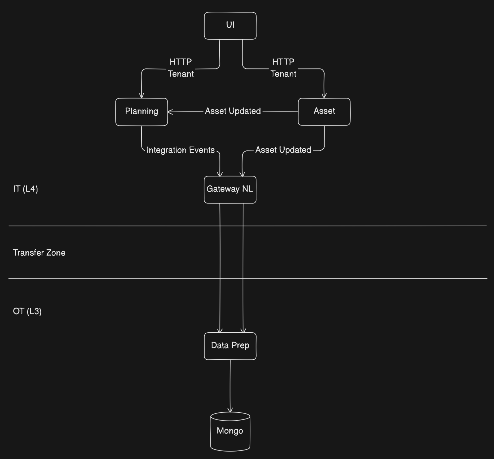

# Hydrations for Disaster Recovery

* Status: accepted
* Deciders: Team Core + Team Optimum + Alex Shmyga
* Date: 2025-08-07

Technical Story: 
- [Feature 716834](https://dev.azure.com/enecomanagedcloud/Myriad%20-%20VPP/_backlogs/backlog/VPP%20Core/Epics/?workitem=716834): Target State - Hydrations

## Context and Problem Statement

When we move to target state and move the Dispatcher services down to the OT Layer (Layer 3), we need to ensure that in a disaster scenario, we will restore our MongoDB from a back up. Our database will be backed up hourly, which means that if we did a backup at 15:00 and we lost the database at 15:59 and we received some new schedules during that time, they wouldn't be in the database that is restored. This means we need a mechanism to hydrate schedules and also reseed asset data.

## Decision Drivers

* OT Layer needs to be able to keep dispatching for 6 hours after losing connection to the IT Layer.
* This process should be easy and seemless.
* We need to ensure we don't overload any services.

## Considered Options

* **Option 1:** Perform these actions from the Gateway Service.
* **Option 2:** Use the Offset to replay messages.
* **Option 3:** Perform these actions from the service themselves via the UI.

## Pros and Cons of the Options

### Option 1: Perform these actions from the Gateway Service

We could have the Gateway service handle hydrations of schedules and asset seeding. The gateway would decide which schedules and assets need to be sent and produce events to get the data via integration events.

* Good, Planning and Asset Service would be load balanced as we'd use competing consumers.
* Good, load will not be on a single instance.
* Bad, Gateway would need to store the assets so that it knows which assets to request for.
* Bad, adds an unnecessary hop.
* Bad, work would still need to be done in Planning and Asset Service.
* Bad, more work for the Gateway which is already a "god" service.

### Option 2: Use the Offset to replay messages

We could store the offset for the messages in MongoDB, then when the DB is restored the application would pick up from that offset in the DB and fetch all the messages that are after that offset.

* Good, far less work than other options
* Good, functionality could be added to the library and used in other places
* Good, No additional hops to get data into all the layers
* Good, service will be up to date right after start up
* Good, no user interaction needed
* Bad, if the offset is old and there are a lot of messages, it could take a long time to process
* Bad, we need to do some development to store and retrieve the offset

### Option 3: Perform these actions from the service themselves via the UI

We can add a new page that is behind a user role that allows these actions to happen by a button click. The service will receive the request via an HTTP endpoint and would have the TenantId in the request. Each service can then retrieve the assets and schedules from that tenant and use the existing integration events to send the schedules. When the service receive the request, it can generate events for each asset so that the requests can be load balanced across instances.

* Good, actions performed from the UI via a single button click.
* Good, load will not be on a single instance.
* Good, actions performed in the service with the same domain.
* Bad, it's not an automatic action.

## Decision Outcome

Chosen Option: **Option 2:** Use the Offset to replay messages.

### Positive Consequences

* Hydration happens immediately on DB restore.
* No manual intervention required.
* Less development work.
* No additional hops to get data into all the layers

### Negative Consequences

* if the offset is old and there are a lot of messages, it could take a long time to process.
* we need to do some development to store and retrieve the offset.
