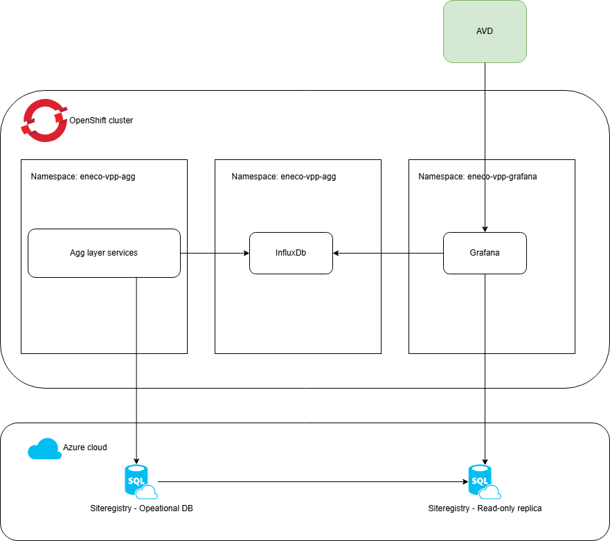
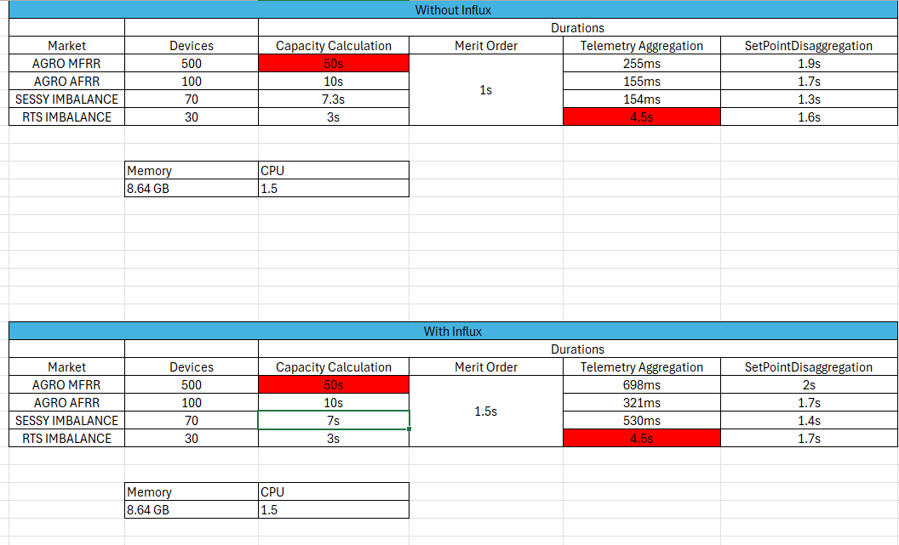
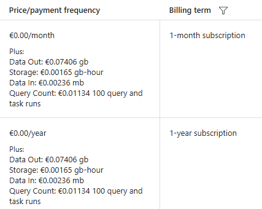

# VPPAL functional monitoring POC

* Status: Proposed
* Deciders: Cameron Goss, Arne Knottnerus, Khyati Bhatt, Illia Larka, Johnson Lobo, Alex Shmyga, Roel van den Grint, Ricardo Duncan
* Date: 12-12-2024

## Context and Problem Statement

Pool-level monitoring is done within VPP Core and its UI. Device-level monitoring is generally considered outside the responsibility of the VPP, as it is too granular and not actionable by anyone within VPP domain. As a result, no business requirement for a monitoring mechanism is in place for VPP Aggregation Layer.
However, we are often faced with situations where checking device behavior and investigating possible undesirable behavior/bugs is necessary.
As we have no dashboards in place for functional data, we are manually checking data in ESP streams, internal databases, etc.
This is a very time intensive and ineffective process.

In order to make this process efficient, we are investigating options for what a dashboarding solution for VPP Aggregation Layer could look like.
In this, we want to present data similar to that in VPP Core UI:
- Telemetry data
- Scheduling data
- Asset metadata
- Internally calculated values, such as device capacity (similar to resulting variables in VPP Core)

However, we also want to iterate very quickly on the content of the dashboards.
The current tools we have in place do not allow for this for various reasons.

Any solution should meet the following requirements:
1. There should be no performance degradation of operational processes as a result of a monitoring setup.
2. Cost levels are no more than ~ €1 / device / month
3. Dashboards can be created on the fly, Everyone who has access to grafana can create and view the dashboard.
4. Data is available in near-real time (max ~1 minute of delay before data can be shown in a dashboard), and the UI is responsive.

There is a strong preference for a timeseries database as the main data source.
Apart from semi-static metadata from VPPAL Site registry, all data will be timeseries data.

**An important note. As this setup will mostly be used for (exploratory) data analysis, it is nearly impossible to test the solution without using real data.
For this reason, an unconventional approach will be taken. We will deploy this PoC all the way to production, and evaluate it there.**

This ADR covers the PoC and not the final solution. Because of this, several topics will not be covered as extensively as would normally be expected:
- Support impact
- Expected uptime
- Maintenance
- Resiliency
- etc.

Plainly put, if this PoC setup breaks in production, there is no impact aside from inconvenience.
What does matter, is that it does not impact VPPAL or the VPP Cluster as a whole.

We will evaluate the chosen setup in production for some time (say 1-2 months) and then conclude the PoC.
- If we are positive about the setup, we will create a new ADR that covers these topics more extensively.
- If we are not positive about the setup, we will decommission it, and evaluate other options.

## Decision Drivers / Requirements

1. Operational impact
2. Cost
3. Ease of use
4. Performance
5. Data governance

## Considered Options

* SQL + InfluxDB[Self managed] > Grafana
* SQL + Telegraph + InfluxDB[Self managed] > Grafana
* SQL + InfluxDB[Cloud] > Grafana
* SQL + CosmosDB > Grafana
* Snowflake > Grafana
* Snowflake > PowerBI
* Azure Application Insights
* Azure Data Explorer  

### SQL + InfluxDB[Self managed] > Grafana

This is the preferred option. It matches the 5 main requirements we have well, and - very importantly - it is a proven setup in previous projects.

##### Requirements:
1. Yes
2. Yes
3. Yes
4. Yes
5. Yes

##### Technical changes

- Integrate C# influx client with VPPAL functions
- Deploy InfluxDb on mission critical environment and expose it to VPPAL functions
- Add InfluxDb datasource to grafana
- Add Sqldata source to grafana

#### Ease of use

Grafana and InfluxDB have a long-running partnership, and cooperate in development of their respective products.
This shows in how well this combination works, and this setup has been used in several previous projects and has been the preferred option there.

#### InfluxDb setup on Mission critical cluster

#### Storage requirements
InfluxDB ingesters require local storage to store the Write Ahead Log (WAL) for incoming data. The recommended storage size is minimum of 2 gibibytes (2Gi)

In order to store the data permanently, InfluxDb makes use of object store database. we can use azure blob storage as object storage.

### SQL + Telegraph + InfluxDB[Self managed] > Grafana

#### Requirements:
1. Yes
2. Yes
3. No
4. Yes
5. Yes

Telegraph is a data collection agent for collecting and reporting metrics. This tool offers varierty of plugins that lets us quickly and easily collect metrics from many different sources like Azure Event Hub etc

#### Advantageous:

1. Data Collection: It can gather details from many sources, like how your app is performing, how much space your database is using, and basic 
computer health stats like CPU and memory usage. It can also collect data from online services.
2. Data Processing: Telegraf can tidy up and organize the data it collects. This means it can filter out stuff you don't need, change names of data points, 
and even figure out where internet traffic is coming from.
3. Data Output: After sorting the data, Telegraf can send it off to places where it can be stored and looked at, like InfluxDB or other platforms.

#### Disadvantageous:

1. As most of the aggregation data sits on cosmosdb, we could not find a plugin that helps us in exporting data from cosmosdb.
2. Telegraph needs knowledge of Go programming language.
3. Telegrah requires additional deployment and maintenance effort

### SQL + InfluxDB[Cloud] > Grafana

This would have been a preffered option if data governance was not an issue.
We share our environment/streams/etc. with VPP Core and the topics we obtain our data from also contains the data of ***ALL*** Mission Critical assets, as well as sensitive strategic information about pricing. As such, exposing this data through any other path than what has been established thus far (ESP -> EDP, or resources directly obtained through Microsoft in our Azure environmen such as CosmosDB) requires explicit approvals.

This approval must be given by:
- Myriad Solution Architect
- Myriad Product owner
- Data owner of the data set(s)

#### Requirements:
1. Yes
2. Yes
3. Yes
4. Yes
5. No

### Operational impact & performance
To evaluate the performance impact of pushing data to InfluxDB, load tests were done in the acceptance environment.

Currently we have 604 devices across 3 markets[aFRR, mFRR, Imbalance] on production. 

### Testing with Cloud Hosted InfluxDb

We did performance testing in 3 iterations by varying the devices across 3 markets. please find the result from each iteration

**700 Devices**

**2400 Devices**

**5000 Devices**

### Testing with Self Hosted InfluxDb

We did performance testing with self hosted influxdb having 2500 devices spanning across 4 different pools as below.

1. 1000 MFRR
2. 1000 AFRR
3. 250 Sessy
4. 250 RTS

Suggested resource configuration for production instance (based on metrics from screenshots below):

|Resource type|Request|Limit|Remarks|
|-|-|-|-|
|CPU|0.06|0.3| Confirmed by Platform these resources are available
|Memory|300Mi|500Mi| Confirmed by Platform these resources are available
|Storage|50Gb||Agreed with Roel that this is a lot of storage and it can be reconfigured (up or down) based on POC outcome

CPU:
   Request: .06 CPU
   Limit: .3 CPU
Memory
   Request: 300 Mi
   Limit: 500Mi
Storage:
   Capacity: 50Gb

Below is the CPU/Memory/Network usage 

Below is the storage space used by influxdb. during the test, it peaked and almost remained constant after the perf testing

#### Cost for InfluxDb cloud

In a previous project we have ran this solution for many years albeit in AWS. For 10k devices, cost level is roughly 40$ / month in total. This includes storage and compute.
This does not 1-1 compare with 10k devices in VPPAL, as we have higher telemetry frequency. Either way, we do not expect excessive costs here during the PoC period, but will sharply monitor this. If we find costs are significantly above acceptable levels, we can choose to end the PoC immediately and decommission the setup.

An important part of why this (kind of) setup can be very cost effective is this:
- Many transformations/calculations will be done on the data
- These transformations and calculations can, with InfluxDB as data source, easily be done on-demand within Grafana by including them in query logic.
- This means that these will be done on a very small subset of devices, and a very small subset of time.

#### Cost estimation 
- Costing information was quite difficult to gauge in the short term. However the total we spent for entire POC is 6.21 euros.Below is the breakdown of the cost structure

   

   

### SQL + CosmosDB > Grafana

Directly getting data from our operational databases has the risk of causing performance degradation in our operational process.
The Azure Cosmos DB data source plugin allows to query and visualize Cosmos DB data in Grafana, but this plugin is for Grafana Enterprise only

#### Requirements:
1. No
2. No
3. No
4. No
5. Yes

### Snowflake > Grafana

There are several issues with this setup:
- There is a delay in data showing up in snowflake, as timed jobs process the input data. This delay is often too long for this purpose.
- Getting data set up in the right places in Snowflake is beyond our control, as we need DTS teams involved. The internal data is not yet on ESP, let alone in EDP. This would take many months to realize.
- The plugin for Snowflake in Grafana is only available for Cloud or Enterprise versions of Grafana.

#### Requirements:
1. Yes
2. No
3. No
4. No
5. Yes

### Snowflake > PowerBI

There are several issues with this setup:
- There is a delay in data showing up in snowflake, as timed jobs process the input data. This delay is often too long for this purpose.
- Getting data set up in the right places in Snowflake is beyond our control, as we need DTS teams involved. The internal data is not yet on ESP, let alone in EDP. This would take many months to realize.
- PowerBI is not quick for creating new dashboards. It is best suited for recurring reports.

#### Requirements:
1. Yes
2. No
3. No
4. No
5. Yes
   
### Azure Application Insights

App insights has a dataformat which is not well suited for timeseries plotting.
As quickly creating custom dashboards is the main purpose, the effort level of converting the data is prohibitive.

#### Requirements:
1. Yes
2. No
3. No
4. No
5. Yes

### Azure Data Explorer  

We have tried ADX in the past, and found the following:
- High cost levels
- Slow UI
- Unintuitive interface

From my understanding, ADX is mostly beneficial if used both as the operational database, with monitoring directly on that database.
As we do not want to risk having any performance degradation on our operational databases, this setup is not suitable.
In this case, we would stick to cosmosDB for operational purposes, and then duplicate the data to ADX.

#### Requirements:
1. No
2. No
3. No
4. No
5. Yes

## Decision outcome

We have chosen to proceed with SQL + InfluxDB[Self managed] > Grafana as it meets all the requirements.

### Advantageous

1. Data ingestion/creation and exports are in one codebase.
2. Extremely easy to customize the data before it goes to InfluxDb
3. Export data in batchs to limit the number of requests to InfluxDb
4. No knowledge on additional programming language required
5. Static data from site registry SQL database can be exposed through the read-scale out feature available on the Azure SQL.
The Read Scale-Out feature permits a read-only replica of Azure SQL database and use that replica to perform read-only queries instead of using the 
main instance and so without affecting its performance.

### Negative Consequences

1. If the InfluxDb is down due to transient faults, we could lose the functional data. we accept this risk of missing data occasionally rather than hindering the operational performance