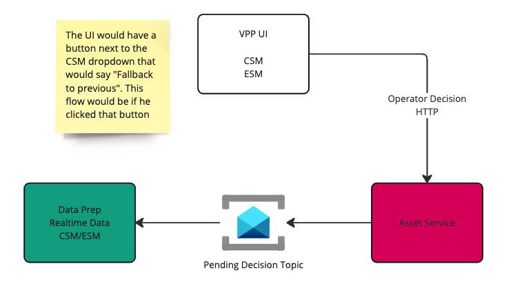
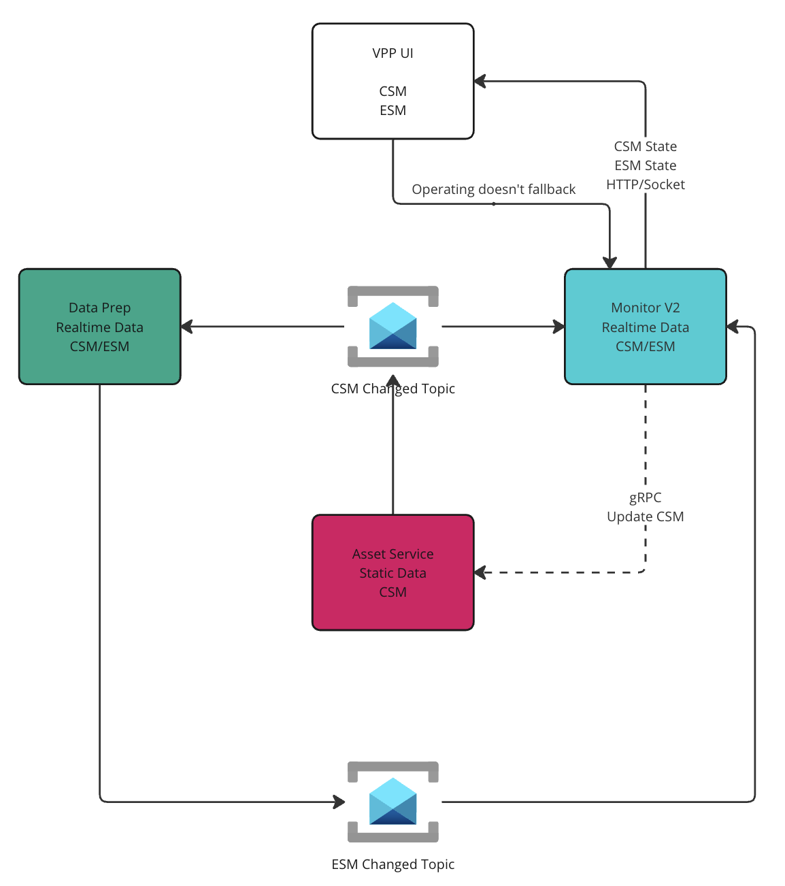
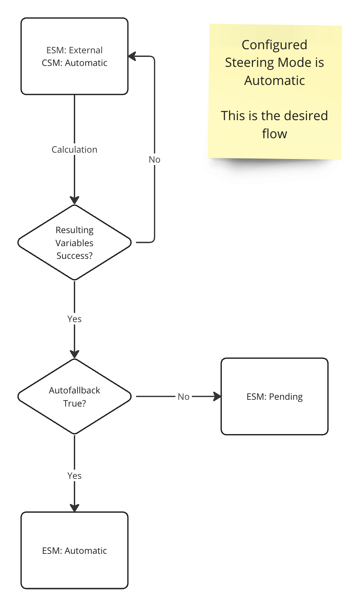

# Effective Steering Mode Improvements

* Status: [proposed]
* Deciders: Pedro Alonso, Wesley Coetzee, Hein Leslie, Johan Bastiaan, Henko Rabie, Alexandre Borges
* CC: Ricardo Duncan

## Context and Problem Statement

In our current implementation the Asset Service is required to ingest the `ResultingVariablesCalculatedEvent` so that it can determine if the Effective Steering Mode (ESM) has changed. 
If the ESM has changed to `Pending_Operator_Decision`, we currently update the Configured Steering Mode (CSM) to `Pending_Operator_Decision` to provide the operator with a way to release the asset from this pending state.

* This first problem is that the Asset Service should only care about static data, and ESM is not static data. ESM reflects the way the asset is currently being (or not being) steered.
* Asset Service is ingesting a very high throughput message to determine a single value that is fairly constant. This leads to the service doing a lot more work than what is needed.
* ESM is being used in the Asset Service for 1 API call that retrieves all the assets that are currently being steered, i.e. Automatic.
* CSM currently has a option of `Pending_Operator_Decision`, which it should not have.
* In the current flow, the asset gets put into a CSM of `Pending_Operator_Decision`, which means the operator cannot see what the previous CSM was.

### Current Flow

## Decision Drivers

* Reduce load on Asset Service.
* Serve data from fit for purpose services.
* Remove additional clutter from CSM states.
* Increase performance in services.

## Considered Options

* Option 1: Asset Service handles CSM, Asset Monitor OR Client Gateway handles releasing of `Pending_Operator_Decision`.
* Option 2: Asset Monitoring becomes a Backend For Frontend (BFF) to handle CSM and ESM release.

## Decision Outcome

* Option 1 - It allows us to keep the current CSM flow within Asset Service, while also decoupling ESM from Asset Service.

### Positive Consequences

* Reduce load on Asset Service.
* We do not need to redesign the current CSM flow.
* Monitor already consumes the `ResultingVariablesEvent` from Data Prep.
* Reduce complexity in the current ESM calculation within Data Prep.
* CSM will remain what was selected by the Operator.

### Negative Consequences

* UI will need to change where it retrieves the ESM value from.
* The UI currently fetches the list of `Assets in steering` from the Asset Service, which is based on the ESM state, this would need to be retrieved from the Monitor service.
* Another event within the system.

## Options

Both options work fairly similar, so I will break the options up into two parts

### Releasing an Asset from Pending_Operator_Decision

The current implementation has tried to use the CSM to force the operator to make a decision on the asset's steering mode, as outlined above.
The idea here is that there is a new button that will be visible on the UI when the asset is has an ESM of `Pending_Operator_Decision`, which will give the operator the ability to put the asset back in the asset's last CSM.
If the operator would like to choose a different steering mode, they can then just change the CSM from the dropdown as per usual.

The flow would be that if the operator decides to fallback, an event would be fired from either the ClientGateway OR Monitor service that tells Data Prep that it can change the ESM to whatever the last CSM is.
This would be done by updating the last calculation result for the asset in the Resulting Variables Collection to the value of the last CSM for that asset.

* Good, no more `Pending_Operator_Decision` in CSM.
* Good, releasing the asset from `Pending_Operator_Decision` has it's own independent flow.
* Good, removes RVC ingestion in Asset Service.
* Good, removes Asset Service dependency on ESM.

* Bad, requires a fair amount of testing (I think this may be automated already to an extent).
* Bad, requires code changes in multiple services, which means either publishing to multiple streams at once as we migrate, or we need to carefully plan the migration.

### Option 1 - Asset Service handles CSM changes as usual

In the situation where the operator wants to change the asset's CSM to something other than its previous state, i.e CSM is in Automatic, ESM is now in Pending, Operator wants to change the asset to External. 
The operator would use the regular CSM dropdown to change the CSM of the asset. This would propagate through to Data Prep which would calculate the new ESM and pass this along to the Monitor service. We would essentially treat ESM as telemetry.

* Good, less development work as CSM flow remains unchanged.
* Good, no more `Pending_Operator_Decision` in CSM.

* Bad, Some asset data comes from Asset Service, and some from the Monitor service.

### Option 2 - Monitor service becomes a BFF

Very similar to option 1, the only difference is that the CSM change moves to the Monitor service. The reason for this is that Monitor and Client Gateway are meant to be BFF (Backend For Frontend) services for the VPP. 
Moving this there is something that should happen in the future regardless.

* Good, follows BFF architectural pattern.
* Good, allows Asset Service to care only about static data that does not change.
* Good, no more `Pending_Operator_Decision` in CSM.

* Bad, a lot more development work.
* Bad, a lot more testing and existing automation would be less useful than option 1.
* Bad, CSM would probably have to propagate to Asset Service anyways.

## Appendix

### State Diagram

### Ideal Flow

The above diagram shows how we would split these two flows into two separate events.

The first event will be the regular CSM flow, where the operator can specify the desired CSM he would like the asset in. In the case where an asset is in ESM of `Pending_Operator_Decision`,
the operator may decide that he does not want to let the asset fallback to it's previous state and might want to change the ESM/CSM entirely.
This also allows the operator to see what the current CSM of the asset is, as in the current solution we update the CSM to `Pending_Operator_Decision`, meaning the operator cannot see what the CSM was before.

The second event will handle the releasing of `Pending_Operator_Decision`, this will allow the operator to release the asset without affecting the CSM of the asset. If you consider how the asset would get into the `Pending_Operator_Decision` state,
it would require the asset moving from `Automatic` (All data is available for the asset to be steered) -> `External` (Something is missing) -> `Pending_Operator_Decision` (Asset is good, but we need confirmation),
99% of the time the operator would probably put the asset's ESM back into `Automatic`. This event would allow the operator do do this via a button click.

Splitting this into two streams gives us a clear separation between CSM and ESM, which allows us to keep CSM as a more static value and ESM as a realtime value. This also eliminates Asset Service needing to maintain the ESM state,
which means it will no longer need to ingest the ResultingVariablesCalculatedEvent which is a very heavy event to consume.

### Links

- [Miro](https://miro.com/app/board/uXjVNKAc4IU=/?moveToWidget=3458764571149060226&cot=14)

"First be effective and then be efficient" - Ron Kaufman