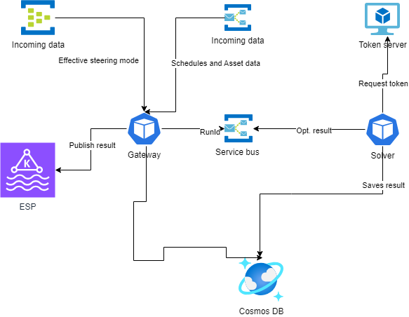

# Fleet Optimizer Multi Market

* Status: [proposed]
* Deciders: Quinten de Wit, Ihar Bandarenka, Ivan Derevianko, Dmytro Ivanchyshyn, Alex Shmyga, Ricardo Duncan

## Context and Problem Statement

Currently implementation of the Fleet Optimizer supports optimization for the only one TSO - TenneT.
Desired state is to support multi TSO: TenneT, TenneT DE, Elia and other optimizations.

* Currently data is stored without any information about TSO.
* The service runs every 15 minutes. And retries every minute if run is failed.
* Service produce data to ESP without any TSO indication.
* Only one optimization can be executed at the same time.

### Current Flow

## Decision Drivers

* Data for different TSO is independent and should not be used for the same optimization.
* Only one Token to perform the optimization vs Unlimited parallel optimizations.
* Possibility of optimizations overlapping for different TSOs
* Complexity to handle all TSOs in one service and database.
* Service and database performance/scalability
* Costs
* Speed

## Considered Options

* Option 1: Modify existing solution. Add TenantId to the data and use queues to prevent overlapping of optimizations.
    * Pros:
        * Does not require any changes in deployment process.
        * Costs is overall lower.
    * Cons:
        * Requires code changes to store and extract data per TSO.
        * Database can be overloaded if different parts of the optimization process execute at the same time. For example prepare input for NL and save output for DE.
        * Cost increase is max of processes execute at the time. Which is difficult to predict.
        * Database RUs consumption could be autoscaled, but it cost 1.5 times permanent provisioning.
        * One spoiled message can stop overall execution for some time.
    
* Option 2: Create separate deployments with different configurations for different TSO.
    * Pros:
        * Optimizations can be easily executed in parallel.
        * Flexibility in independent scalability of resources per TSO.
        * Almost no code changes. Changes in configuration is expected.
        * If one TSO fails other TSOs are not impacted.
        * Monitoring per TSO.
    * Cons:
        * Additional costs for additional resources.
        * Flexible, but complicated deployment.
        * More maintenance because of more resources.

## Decision Outcome

* Option 2 - It allows us to keep optimize model for different TSOs. It also brings scalability, flexibility and increase overall availability of the system.

Both options are good. The decision point is flexibility and atomicity. Option 2 can be fine tuned in terms of scalability, configuration. It also does not require a lot of code changes what is a big cost reduction.
If one TSO can not be optimized other TSOs are not affected. Database split provides refined partition keys and prevents potential scalability issues.

### Positive Consequences

* Optimizations can be easily executed in parallel.
* Flexibility in independent scalability of resources per TSO.
* Almost no code changes. Changes in configuration is expected.
* If one TSO fails other TSOs are not impacted.
* Monitoring per TSO.

### Negative Consequences

* Costs associated with additional resources.
* Flexible, but more complex deployment. One code base will be deployed on many copies of Fleet Optimizer. Set up estimation: 1 - 1.5 week by platform team.
* More maintenance because of more resources.

## Appendix