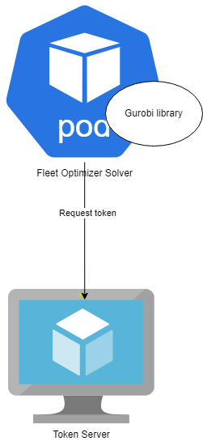

# Gurobi parallel models

* Status: [proposed]
* Deciders: Quinten de Wit, Ihar Bandarenka, Ivan Derevianko, Dmytro Ivanchyshyn, Alex Shmyga, Ricardo Duncan

## Context and Problem Statement

Currently Gurobi token setup does not allow parallel execution. It is only possible to execute one optimization at a time.
Desired state is to parallel execution of optimizations for multi TSO and ID trading.

* Currently there is token server which provides token to Fleet Optimizer Solver.
* It is only possible to have one token at a time.

### Current Flow

## Decision Drivers

* Price
* Deployment
* Adaptiveness
* Performance
* Availability
* Scalability 
* Speed

## Considered Options

* Option 1: 
    * Single-Machine, Compute Server license: 
    * Locked to a single machine (can be a VM / cloud machine, cannot be in a container e.g. Docker)
    * Unlimited number of people can access the license
    * Allows unlimited parallel solves
    * Model is built on any machine in the network and solved on the machine hosting the Compute Server license
    * Client-Server separation. An unlimited number of client machines in the network can submit jobs to the dedicated optimization server (hosting the Gurobi license).
    * Queuing of jobs enabled.
    * Sold according to the number of cores, with 8 physical cores (=max. machine size) enabled as standard.  Costs below are for 8 cores.
    * 1-Year Term – 1x $44,480 Annual Payment
    * Additional cost applies for each additional core required (10% of the annual fee per core per year)
    * Full details here: https://www.gurobi.com/products/gurobi-compute-server/.

* Option 2: 
    * Single-Machine, Unlimited-Use license
    * Locked to a single machine (can be a VM / cloud machine, cannot be in a container e.g. Docker)
    * Unlimited number of people can access the license
    * Allows unlimited parallel solves
    * Model is built and solved on the same single machine
    * Sold according to the number of cores, with 8 physical cores (=max. machine size) enabled as standard.  Costs below are for 8 cores.
    * 1-Year Term – 1x $26,690 Annual Payment 
    * Additional cost applies for each additional core required (10% of the annual fee per core per year)

## Decision Outcome

* Option 1 - It allows to execute multiple optimizations at the same time for different TSOs.

* Speed is comparable for both options. Option 1 is slightly slower because of network roundtrip.
* Scalability depends on number of CPU cores and Clock speed. If "Single-Machine" has enough resources it calculates the result.
* The biggest difference is "Model is built and solved on the same single machine" which creates a lot of open questions and inconveniences.

### Positive Consequences

* Client-Server separation. It allows to connect multiple applications hosted anywhere to use Compute Server in parallel. 
* It allows to deploy and host applications as we do now. (Open shift)
* Preparation of the model for different applications will not affect "Single-Machine" performance.
* If "Single-Machine" is down applications can still work and send models to the queue. Is it in-memory queue or not?
* Support and maintenance time for the Machine will not affect availability of applications.

### Negative Consequences

* Price
* If queue is in-memory, retry mechanism should be implemented on caller side.

## Appendix