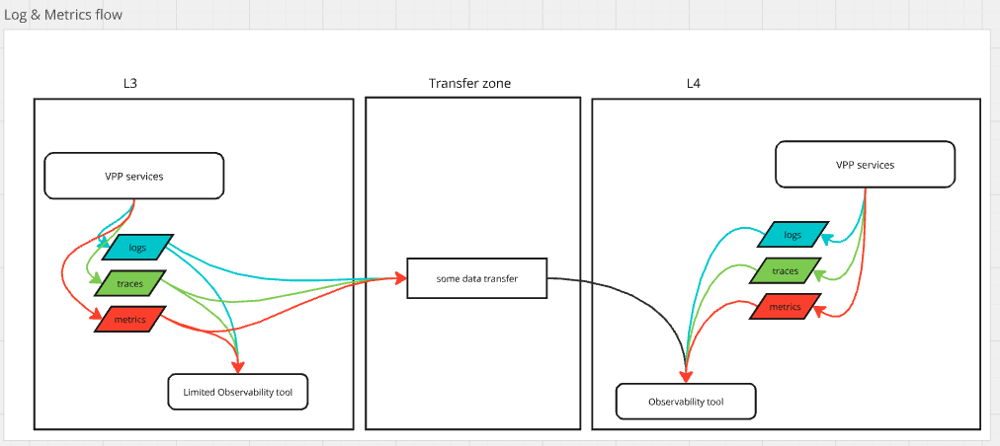
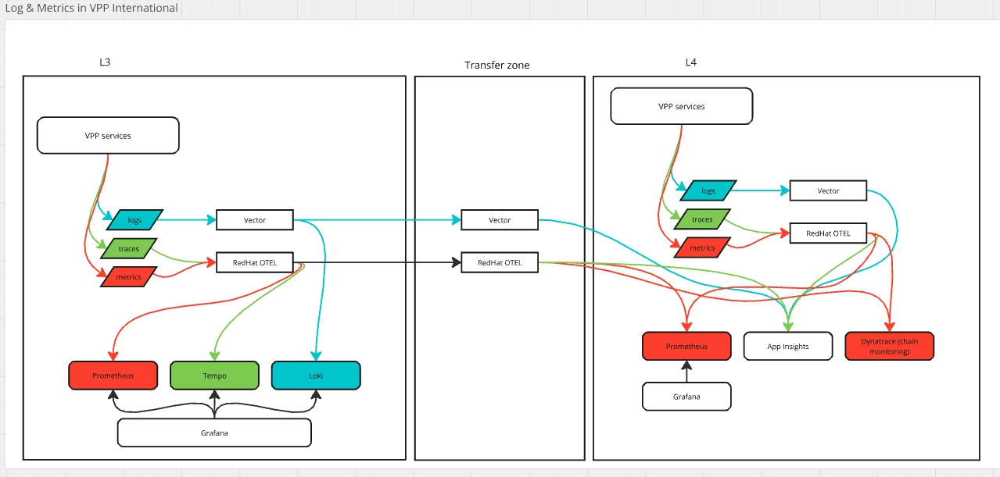

# Technical monitoring and logging in VPP international (target state) on L3.

* Date: 2024-10-01
* Deciders: Ricardo Duncan, Alex Shmyga, Roel van de Grint

## Glossary
- AppInsights - observability tool on Azure
- Prometheus - database for metrics, also has alarm engine
- Grafana - visualization of metrics, alarm engine
- OTEL collector - an application that allows you to process that telemetry and send it out to various destinations
- L4 zone - security Purdue model 4, public cloud IT landing zone. OpenShift cluster with network and resource isolation
- L3 zone - security Purdue model 3, private cloud, on-prem, OT landing zone. OpenShift cluster with network and resource isolation
- Transfer Zone – so-called Purdue 3.5, part of OT landing zone, used for transferring data between L3 and L4 zone
- Stamp - OpenShift cluster with dispatcher services and infra. In L3 will be 2 stamps, one active, and one redundant hot stand-by.
- Chain monitoring - all Eneco tools and platforms are going to stream metrics and logs into one platform which is going to have a holistic overview of Eneco tech
- RBAC - Role-based access control (RBAC), also known as role-based security, is a mechanism that restricts system access

# Context
Currently VPP Core runs in the L4 zone. It publishes logs, traces, and metrics to AppInsights, also metrics (mostly functional) are published to Prometheus/Grafana via OTEL collector.
Engineers and 24/7 support use AppInsights and Grafana to monitor the tech behaviour of the system.

To go VPP international we are moving dispatcher services to the L3 zone. In L3 we will have 2 stamps to have higher availability via redundancy.
L3 has higher security requirements compared to L4, and no direct access is possible from the internet. 
To do technical monitoring and logging we need to streamline logs, traces and metrics to L4 into AppInsights and Prometheus via Transfer Zone.

L3 has higher availability than TransferZone and L4. So, when TransferZone and/or L4 is down then L3 should be able to operate/dispatch up to X hours.
Engineers should be able to log in to the L3 zone via Citrix if something happens to TransferZone and/or L4.

Eneco decided to use Dynatrace for chain monitoring, so it should be possible to stream metrics and potentially logs and traces there evantually.

## Requirements
- logs and metrics should be streamed from L3 to L4 (via Transfer Zone) to be able to have all logs and metrics in one place, for example, App Insights + Prometheus/Grafana as it's now
- in case Transfer Zone and/or L4 is down 
    - logs and technical metrics should be stored on L3 for X hours
    - logs and technical metrics should be accessible via some UI
- in case Transfer Zone and/or L4 is down and later restored, then all logs and technical metrics which were generated during the downtime of TZ/L4 should be streamed to L4
- each country can generate 10GB of logs/traces/metrics daily in each stamp. So for 3 countries (NL, DE, BE), we expect to have around 30GB of data per stamp on L3.
- the retention period for storing data is 24 hours.

## Decision Drivers 
- services in L3 and L4 should use similar implementations to log metrics and logs, this includes using the same nuget packages, etc.
- keep an option that eventually we might switch from AppInsights to Dynatrace in L4, or any other observability tool/platform
- acceptable costs
- ease of maintenance
- low latency between L3 and L4 for transferring data (logs and metrics)
- we can have one observability setup for all countries, however, RBAC per country should be in place

## Considered Options

| criteria  | Dynatrace | Loki + Prometheus + Grafana (as OpenShift operators) | ElasticSearch(VM) + Prometheus + Grafana/Kibana |  "generic logging" from CMC  + Prometheus + Grafana | preferable option |
|--|--|--|--|--|--|
| logging support| ✅ | ✅ | ✅ | ✅ | any of them |
| metrics support | ✅ | ✅ | ✅ | ✅ | any of them |
| traces support | ✅ | ❌ or ✅ (if Tempo is installed) | ✅ | ✅ | any of them |
| alarm support | ✅ | ✅ | ✅ | ✅ |  |
| hardware requirements | Small deployment consisting out of 3 nodes 8 CPU’s / 64GB RAM / 1.3TB storage|  | Elastic part: 1 storage node 4GB RAM + 100GB storage + 2 master nodes 4GB RAM each. 4CPU for each node.  |  | Anything except Dynatrace, since its default setup is quite heavy |
| license costs | commercial | free | free | n/a | Loki/Grafana or Elasticsearch |
| compliance with OTEL standard | ✅ | ✅ | ✅ | ✅ | any of them |
| retention period |  |  ✅  | ✅ | ✅ | any of them |
| authentication and authorization | ✅ | ✅  | ✅ | ✅ | any of them |
| multi-tenancy support | ✅ | ✅ | ✅ | ✅ (by different indexes) | any of them |
| technical fit |  | ✅  | ✅ | ✅ | ✅ | Loki + Prometheus + Grafana since the team has already experience with it, also the same stack is going to be used for functional monitoring
| run & maintain | high effort | low | medium-high | low | Loki + Prometheus + Grafana, since all of them can be installed as OpenShift operators |

## Decisions
Based on the comparison table above we can say that all options can fulfill our requirements for L3 tech monitoring. However, Loki + Prometheus + Grafana (as OpenShift operators) looks like a preferable option because of low maintenance effort, familiarity with technology (it's already used) and require fewer resources to run it (which has a positive impact on costs). 

So the setup will look like this:

where Vector is used to collect logs, and RedHat build of OTEL collector is used to collect traces and metrics and forward them to both L3 observability tools (Loki + Prometheus + Grafana) and to TransferZone Vector & OTEL collectors, which will be transferring them further to L4. From L4 they will be transferred to AppInsights and Dynatrace. Vector & OTEL collectors will be persisting that data unless it's transferred to a target, so in case a target is down we won't lose any tech monitoring data.

In this case, we are selecting a set of tools which can meet our expectations, will be easy to maintain and will leave us a window for changing observabilities tools in the future without making too many changes to the codebase. 

## Links and references
- https://www.elastic.co/blog/sizing-hot-warm-architectures-for-logging-and-metrics-in-the-elasticsearch-service-on-elastic-cloud
- https://discuss.elastic.co/t/hardware-requirements-for-elasticssearch/359059
- https://docs.dynatrace.com/managed/managed-cluster/installation
- https://docs.dynatrace.com/managed/managed-cluster/installation/managed-hardware-requirements-for-clouds
- https://grafana.com/docs/loki/latest/operations/multi-tenancy/

