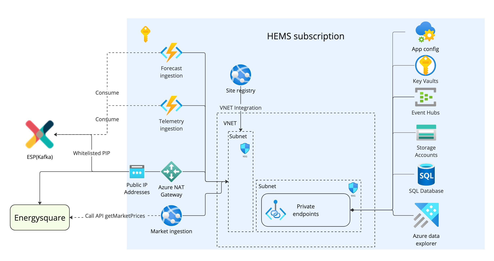

VPP HEMS Pilot v1 build permit 
---

 PERMIT #: 2023-09-01  

##HEMS Belgium pilot
Development of the first version of the Home Energy management System (HEMS) as part of the VPP by delivering the HEMS Belgium pilot for 100 customers. Functional scope is optimising EV charging schedules based on solar forecast, dynamic prices and taking into account capacity tarrif limits. Key proofpoints:
- Myriad is able to launch HEMS use cases in < 6 months
- Myriad can design, develop and implement their own optimisation models
- Myriad can build a platform for home energy management that can be built out to a scalable HEMS platform

<h1 style="font-size:30px;color:#E12A03" >APPROVALS: </h1>

**Product Owner approval:**
- [X] Yes 
- [ ] No

**Solution Architect approval:**
- [X] Yes 
- [ ] No

**DevOps approval:**
- [ ] Yes 
- [ ] No

**Platform approval:**
- [ ] Yes 
- [ ] No

**QA approval:**
- [ ] Yes 
- [ ] No

 **DATE ALL APPROVED:**  tbd

## DEVELOPMENT TEAM(S) & INDIVIDUALS:
- Product manager (temporary): René Pingen
- Developers: Sebastian du Rand, Vincent Kok
- Data scientist: Titus Kervezee

<h1 style="font-size:30px;color:#E12A03" > PRODUCT PERSPECTIVE </h1>

1. List of key functionalities to be developed: 

## Scope for HEMS BE Pilot
- 100 pilot customers
- Optimisation of charge schedules based on customer preferences
- integration with Enode for device connectivity through IoT
- Integration with customer app

## Version 1: Proof we can create charging schedules based on set charge target, time while optimising cost
- Manual onboarding of new customers
- Receive forecasts (from EDP)
- Receive telemetry from IoT
- Run optimisation (DA prices for EV and PV)
  - Time scheduled or event triggered
  - Base optimisation framework with parallelisation
- Dsitribute schedules to assets
- Capacity tariff limit detection
- Trigger push notification to app
- Trigger stop charge event
- Set charging schedule (through App)
## Version 2: Insights+configurable charge strategies (other functionalities currently in HEMS BE EVD Scope)
- Change charging settings (smart/solar/boost)
- Insights in App:
  - Get charging schedule
  - Get charging session (to show in App)
  - Request charging session (start/stop charging through app)
  - Get solar predictions
  - Get monthly savings
  - Get charging sessions
 - Technical monitoring interface for analytical insights/debugging by Myriad team

2. Not in scope: 

- Automated User & Device onboarding (& offboarding)
- Customer support UI (insights & processes)
- Unhappy flows & anomaly handling (e.g. notifications)
- Technical scalability to 100k customers
- Billing

3. Non-functional requirements (NFR's): 

- Optimisation framework should be able to optimise up to 10k homes in under 5 minutes
- Functionalities need to take into account unreliable communication and data from homes

4. Extensibility/ Product Vision: 
- Device and site data model should be extendable for future use cases
- Future integration with the VPP aggregation layer should be supported. For example adding imbalance steering through the pooling functionality in aggregation layer should be possible with limited effort.
- Future abilities to develop and test new optimisation models with limited changes in the optimisation framework and supporting infrastructure (e.g. different models based on customer preferences, a/b testing)

5. Planned Delivery date: 
- V1: 01-12-2023
- V2: Q1 2024

<h1 style="font-size:30px;color:#E12A03" > TECHNICAL PERSPECTIVE </h1>

1. Solution design diagram:

## Data Flows

## Infra design

2. Solution Context: 
- Integration with ESP: 
  - Consume: telemetry from IoT, forecasts from EDP
  - Produce: schedules and setpoints
- Integration with Apigee:
  - Provide API for digital core(customer app) to change preferences and get insights
- Integration with Energy square (API):
 - Consume BE market prices

3. Infrastructure & network design: 

- New subscriptions for HEMS in business critical environment to support pilot
- independent VNET (not peered with Eneco network)
- Azure functions on app service plan

4. Dependencies on other teams:
- Data streams as of september 2023 already available, so limited dependencies

5. Key design principles:

- Focus on proving the optimisation works with relatively short time to market.

6. Technical Debt:

Is there any technical debt that
must be paid back later in order to reduce time-to-market?

- No focus on QA
- Limited functionalities/functional scalability
- Limited to 100 customers
- No UI

7. Quality/ Health Metrics:

What quality/ health metrics will be
exposed to reflect health of the feature?

Not applicable for pilot

8. A high-level QA strategy has been agreed by relevant stakeholders 

- [x] Yes (no priority for pilot phase)
- [ ] No

 Describe the high level QA strategy here e.g. which test tooling will be used (Specflow, etc), will new automated tests be developed?
Any challenges regarding test data availability or volume? External test dependencies?
Other test challenges? Highlight important non-functional tests.

QA not a priority in this phase.

9. Key DevOps changes, if any, have been identified 
- [x] Yes 
- [ ] No
New subscriptions, new ADO project. 

10. Accepted Risks:

- Risk of going from Pilot to scale production. We accept that rework will be needed to accomodate at scale production environment.

