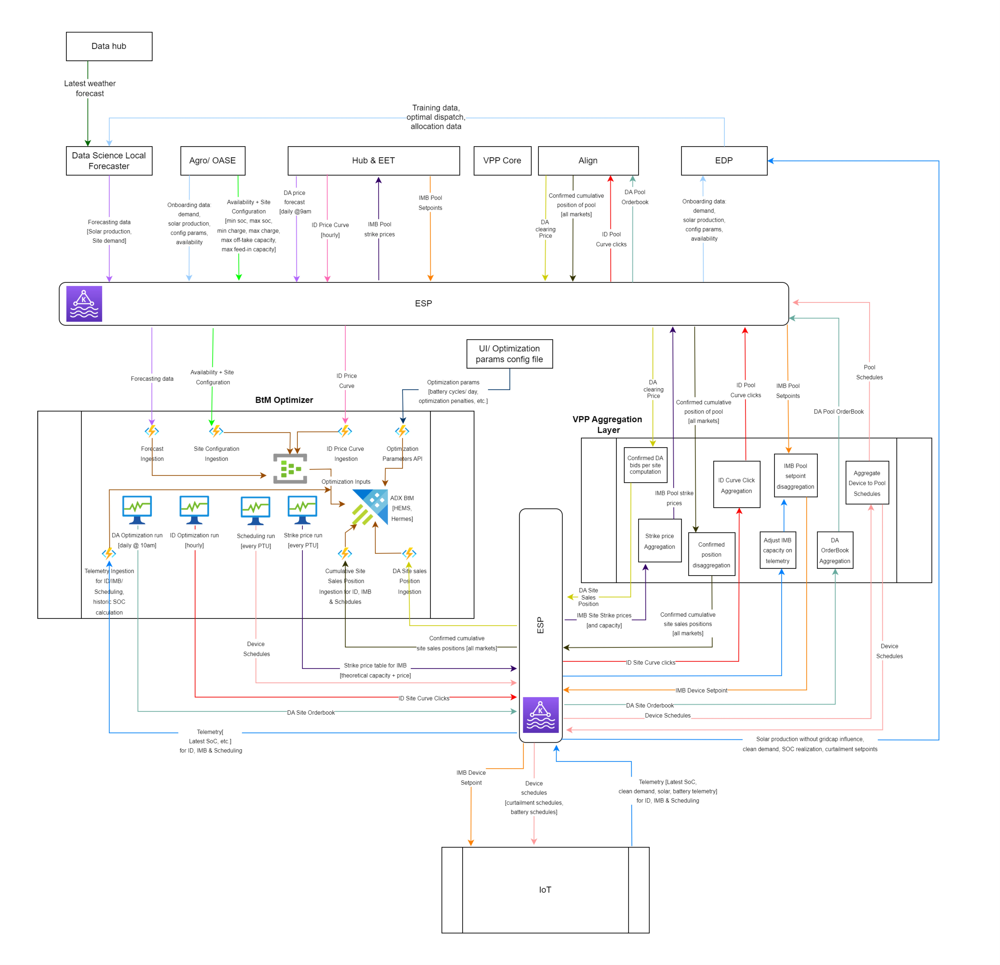

 MYRIAD BTM OPTIMIZATION LAYER BUILD PERMIT - HERMES SCOPE 
---

 PERMIT #: 2023-12-04  

|        |        |
|-------------------|----------------------------------------------------------------------------------------------------------------------------|
|**TITLE:**| **Myriad BtM build Permit**                                                                                                        | 
| **Summary of proposition/ feature:**|   Myriad BtM Optimization Layer (VPPBOL) is a separate application responsible for local optimization, scheduling and steering of energy assets for both B2B and B2C customers on various markets. Local optimization means optimizing energy assets at a specific location taking the location's production, demand and pricing forecasts into account. 
The v1 release of the BtM platform will be scoped to the Hermes (B2B) and HEMS (B2C) proposition requirements only, but will lay a foundation to scale for future propositions. BtM optimization and trade-related flows require specific functionality to be added to the VPPAL (VPP aggregation layer). The VPPAL expansion for Hermes will be covered by a separate build permit/ ADR's and is a key depedency for delivery of Hermes end-to-end. v1 of VPPBOL will support Day Ahead (DA), Intraday (ID) and IMB markets, with subsequent releases supporting other markets (aFRR, FCR and GOPACS). The initial workloads supported by BtM will be Hermes in the Netherlands and HEMS in Belgium and the Netherlands.                                                                        |

<h1 style="font-size:30px;color:#E12A03" >APPROVALS: </h1>

**Business Owner approval:**
- [] Yes 
- [ ] No

**Product Owner approval:**
- [] Yes 
- [ ] No

**Solution Architect approval:**
- [ ] Yes 
- [ ] No

**DevOps approval:**
- [ ] Yes 
- [ ] No

**Platform approval:**
- [ ] Yes 
- [ ] No

**QA approval:**
- [ ] Yes 
- [ ] No

 **DATE ALL APPROVED:**  TBC 

## DEVELOPMENT TEAM(S) & INDIVIDUALS:
**1. Myriad Team BtM:**
- Sebastian Du Rand (VPP developer)
- Hein Leslie (VPP developer)
- Vincent Kok (VPP developer)
- Titus Kervezee (EET data scientist)
- Simon Veenker (Product Manager)
- Rene Pingen (Solution Architect)
- Ricardo Duncan (Solution Architect)

<h1 style="font-size:30px;color:#E12A03" > PRODUCT PERSPECTIVE </h1>

1. List of key functionalities to be developed: 

- BtM Foundation (solver framework)
- Hermes Timer triggers for market optimizations
- Hermes DA and ID flow support, including the scheduling of assets
- Hermes Imb support, including steering through setpoints
- HEMS workflows (smart charging schedules)

2. Not in scope: 

- Dashboards/UI components for Customers or EET. These can be added later. Onboarding for Agro Hermes customers will be via ESP.
- aFRR and mFRR markets (will be covered by separate build permit)
- E-boilers
- Settlement logic (Settlement data will be sent to EDP in real-time so no need for reporting-specific data transformations).

3. Non-functional requirements (NFR's): 

- Scalability: support 1 B2B customer by 1st of July, support 10 B2B customers by Q4 2024. This application will also be used in the future for Hems clients. This means in the future the scalability of this application needs to be increased significantly (thousands of assets). So the architecture should be future proof when it comes to scalabilty.
- Performance: end to end flows (initiating a solver until sending a schedule) should take no more than 2(?) minutes
- Reliability: B2B Customers lose a lot of money when their devices don't receive a proper schedule. So the reliability when it comes to device schedules should be extremely high. Consider a backup solution when schedules can't be sent. 
- Privacy and Security: B2B data and B2C data should be segregated.
- Keep costs as low as possible, especially since margins for B2C are particularly low. This wil be achieved by using as much shared resources in Azure as possible, notwithstanding data segregation for B2B/ B2C. Secondly the Azure resources/ cost consumed should be dynamically scalable with increasing load i.e. incur more Azure costs with increased number of locations being optimized.

4. Extensibility/ Product Vision: 

Will this functionality need to be extended?

Yes, as explained in the non functional requirements, the BtM application will be the foundation of many propositions. The most important ones are Hermes (B2B clients) and Hems (B2C clients). Where the emphasis with B2B clients should lay on the reliability of the solution, for the B2C clients the emphasis should lay on scalability. Secondly, this application should support different markets and assets in the future. The BtM application should be built market and asset agnostic in such a way that it can handle all kinds of optimizations, depending on the proposition and markets.

5. Planned Delivery date: 

28-06-2023

<h1 style="font-size:30px;color:#E12A03" > TECHNICAL PERSPECTIVE </h1>

1. Solution design diagram:

Be sure to include all external interfaces, internal VPP components and infrastructure dependencies in the diagram

The below design is the over-arching solution architecture, showing how to implement market flows per proposition across the different stages of the optimization pipeline. All markets and flows are not shown as the focus is to illustrate the overall flow from data ingestion, to proposition-based timer triggers, the solver execution, through to publishing of the solver output. The solver framework/ engine executes solvers by name and is therefore capable of executing any solver for any market and proposition.

The VPPBOL architecture will comprise shared BtM components and proposition-specific components as depicted above. Adding new propositions should just require work in the solver timer/ event triggers, and solver output publishing stages. If there are new data inputs required, these can be added to the common ingestion stage as well. Data ingestion is typically common across propositions, but the assets they refer to differ. The execution of the solver, solver audit trail production and solver errors handled generically. A key goal is to maximize the extent of shared components and to strive for standardization/ generalization.

2. Solution Context: 

How does the solution fit into
the broader landscape? What are the external Interfaces?

**Solution context diagram:**

The BtM application will communicate with the VPPAL (VPP Aggregation Layer) and several VPP-external systems (such as Agro, Align, Hub) via ESP topics (Kafka-based Enterprise Streaming platform). Some of the ESP topics are listed below.

- ESP topic to receive forecasting data (solar production & Location demand) from the Data Science Local Forecaster
- ESP topic to receive onboarding data and Location availability & configuration from Agro/ OASE
- ESP to receive DA (Day ahead) forecasts from Hub/ EET
- ESP topic to receive IMB (Imbalance) setpoints from Hub/ EET
- ESP topic to receive the ID (Intra Day) Price curve from Hub/ EET
- ESP topic to send IMB Pool striker prices to Hub/ EET
- ESP topic to receive DA clearing prices from Align
- ESP topic to receive cumulative pool position from Align
- ESP topic to send ID Pool Curve clicks to Align
- ESP topic to send DA Orderbook to Align
- ESP topic to send various data to EDP e.g. omboarding data,solar production, availability, etc.
- Various ESP topics to send and receive data between BtM and VPPAL
- ESP topic to receive telemetry from IoT
- ESP topic to send device schedules to IoT
- ESP topic to send IMB device setpoints to IoT

Note: ESP topics and message schemas to be agreed with dependent system responsible parties early in the project, and should be proposition-agnostic where possible.

A description of all data flows for Hermes can be found in the
[wiki] (https://dev.azure.com/enecomanagedcloud/Myriad%20-%20VPP/_wiki/wikis/Myriad---VPP.wiki/32711/Functional-Flows)

3. Infrastructure & network design: 

What infrastructure changes
are needed?

- A separate dedicated Azure subscription for the BtM application per environmet (Development, Test, Acceptance and Production environments).
- Creation of any needed ESP topics
- Provisioning of certificates for ESP
- Application Insights and Log Analytics for logging, monitoring and alerting
- CMC to setup networking in subscriptions (1 VNET, peering of BtM VNET to CMC hub, subnets, ESP connectivity and connectivity to internet, etc. as outlined in diagram below)
- Terraform-based deployment of Azure resources (Eventhubs, SQL, Azure Function Apps, etc.)
- All Azure function apps and web apps to run in a single App Service initially, but can scale to several app services in future as workload scale increases. This App Service will use VNET integration with a single Integration Subnet initially (an additonal integration subnet per new App Service will be provisioned in future if/ when the neeed arises.)
- HEMS backoffice and B2B site registry private endpoints to be exposed to relevant Eneco office network subnets (not exposed publically).
- Only public exposure is the BtM API as the Eneco Apigee environment runs in AWS. BtM API is protected by Azure Application Gateway with IP addresses of Apigee whitelisted, using token based authentication of tokens included in API requests from Eneco Digital Core.

4. Dependencies on other teams:

Summarize the work required by
other teams for this feature/proposition to go live?

To prevent delays during the project lifecycle it is crucial that product management and the tech team define the ESP message schemas and align with dependent teams at the very start of the project.

- Agro: Responsible for connecting locations and managing location configuration and availability. Agro uses a system called OASE as site registry. Agro ensures that location onboarding data and availability changes are published to ESP (at least 1 day ahead) to be be consumed by VPPBOL and VPPAL. Agro to ensure that assets in the same site are not simulateneously allocated to exclusive markets (e.g. aFRR and mFRR). Whether Agro controls market allocation in this way is still be to confirmed. There is no market exclusivity for DA, ID and IMB. Agro Energy uses a sub-contractor called Tenergy to manage telemetry data published via Eneco IoT.
- Data science: Receive weather forecasts from Data hub and training and allocation data from EDP in order to produce local forecasts which are sent to BtM over ESP.
- Hub/ EET: To send DA Price forecasts daily @ 9am, ID price curves hourly and IMB setpoints when applicable.
- B2B: Responsible for deals with clients
- AD&R: take care of battery and/ or solar panel leases.
- Align: To send DA clearing prices and cumulative pool positions when applicable. Receive and process ID Pool curve clicks and DA Pool Orderbook from BtM via ESP.
- VPPAL: Receive ID Location Curve clicks, device schedules, and DA Location orderbooks from BtM via ESP and forward the aggregated data to Hub/ EET and Align via their respective ESP topics. Receive DA clearing prices via ESP and compute DA bids per location and forward location Sales positions to BtM via ESP. Receive cumulative pool position from ESP, disaggregate to location level and forward location sales positions to BtM over ESP. For DA and ID there is no pooling of devices in the VPPAL so it is likely the entire DA and ID flow could be descoped from VPPAL. VPPAL will receive IMB Pool setpoints via ESP, disaggregate setpoints to device level, and forward device level setpoints to IoT over ESP. The VPPAL design will be elaborated in a separate build permit/ ADR's.
- VPP Core: Updates on the locations and devices have impact on the pool and therefore on the asset in the core. A synchronization mechanism will be built that will synchronize the core asset after the following triggers. Confirm which of these functionalities already exist within the VPPAL:
    - Ramprate changes
    - Strikeprice changes
    - New location being added/deleted

5. Key design principles:

What are the key design principles
that must be adhered to?

The below is a mix of design principles and design decisions that have already been made.
- v1 of VPPBOL will support 1 Hermes location only (with small handful following during the first year). This needs to govern all design decisions for v1, in order to accelerate time to market.
- A solver framework to execute solvers will need to be developed. However due to the limited number of locations that must be supported for v1, discretion should be applied when selecting which of the below solver framework features to implement in V1:
  - A solver framework will be developed that is capable of executing any solver for B2B or B2C propositions at scale (see scalability requirements in NFR section)
  - The solver framework needs to support autoscaling to execute solver job requests as the number of local location optimizations required increases over time.
  - The solver framework must log audit information capturing important location/ site, timing and key result details for each solver run. Querying a previous solver run for any location should be simple and exhibit low latency.
  - Solvers need to be developed to be as generic as possible and as proposition agnostic as possible. The solver is simply characterized by its input data contract, the algorithm itself, and the output data contract.
  - It should be possible to execute different solvers for a given location simultaneously (to compare output), but at most one solver for a location, at a given time, can be marked as active (only active solver ouput is published downstream to third parties).
  - If possible a solver executing for a B2B location should not have access to B2C data and vice versa.
  - The solver framework must support A/B testing of solver algoriths with ease. This can be supported by scheduling multiple solver jobs per location, each using a different solver algorithm.
  - Selecting a different solver algorithm, from the basket of algorithms available, for a given location should require no code changes/ deployments, only configuration changes
  - It should be possible to run a solver retrospectively, taking input data from a day/ time in the past. This is mostly used for diagnostic/ comparative purposes. When executing, the solver executor should save a copy of the solver input data to a table in ADX so that it is available for this purpose. This should be possible in all environments, and if need be production solver input data snapshots can be manually or automatically copied into test environments.
  -  A Timer-triggered function will be created for each "market run" and is mostly proposition-specific. Each timer-triggered function will load the location/ solver configuration/ specification per location, fetch the solver's input data and post the  location configuration and input data as a single message to the solver job queue. As a result the solver itself is decoupled from proposition-specific data loading mechanisms, and is only bound to the data contract of the message. Consequently solvers also incurr less latency as there is no need to additionally retrieve the input data over a network connection. The input data contract is explicitly versioned and the solver is backwards compatible with X versions of the data contract. Azure Event Hubs will be used as the solver job queue. Initial estimates for payload message size indicate a size less than 1 MB (Event Hub premium limit) per message. If payload size starts approaching this limit, the design will evolve to use the claim-check pattern, whereby the prepared solver input data is not sent in the solver job request message itself, but instead saved to a durable data store and a reference to the prepared data included in the solver job request message.
  
  - Important busines rules:
    - There will be 1 Hermes DA "pool" and 1 Hermes ID "pool". The "pools" for these markets in Hermes are conceptual i.e. they will not exist as pools of devices in VPPAL, but are mere aggregations of DA location Orderbooks and ID Location Curve Clicks across all locations.
    - Devices in the same site cannot be active in mutually exclusive markets at the same time e.g. aFRR and IMB
    - Since demand forecasts will be sent to VPPBOL on device level, each device in a location will require its meter, and when this is not the case the devices without a meter will be grouped into a virtual device at Agro and data shared with VPPBOL on this virtual device level.

- B2B and B2C data must be segregated to support different compliancy, governance and privacy policies (e.g. use Resource Groups, different tables/ views/ functions in ADX, etc.). Compute isolation is not required but is an option, and if desired must be costed.
- BtM common and proposition-specific code to be segregated in code repository.
- Group Azure functions into separate Functions Apps aligned with the stages of the VPPBOL pipeline, as each stage has a certain load profile (i.e. 4 function apps per proposition):
  -  Data Ingestion
  -  Timer Triggers and data preparation
  -  Solver Execution
  -  Solver Output Producers
- Landing a new proposition on VPPBOL would typically require adding functions to the Timer Triggers and Solver Output producer function apps. The solver execution function app should remain unchanged. New solver algorithms could be added to the solver library, but the solver executor itself remains unchanged. If new ingestions are needed that do not yet exist, they can also be added to the BtM common ingestion stage.
- BtM common and proposition-specific Azure resources to be segregated using Resource Groups (different resource group per proposition). This will assist with cost management across BtM propositions. 
- Handle solver crashes consistently and apply basic sanity check validations to solver output. Each failed solver execution should generate an alert containing enough contextual detail for subsequent investigation. Consider the use of default schedules as fallback for failure in the workflow.

6. Technical Debt:

Is there any technical debt that
must be paid back later in order to reduce time-to-market?

- To reduce time-to-market, the decision could be taken to onboard the first few B2B (e.g. Hermes) locations manually. This would incurr technical debt to add the automation of onboarding in a later phase of the build. Agro has however integrated with ESP previously, so automated onboarding is feasible for v1. 
- Option to not expose an API to modify optimization parameters, but inject parameters directly into the VPPBOL database(s).
- Option to exclude aggregation layer from v1 end-end setup initially as there will only be 1 location initially which does not require aggregation/ disaggregation.
- Fully managed Azure serverless functions will be used for VPPBOL (as opposed to Azure functions running in VPP pods) to reduce time to market and overhead of managing a Kubernetes/ Openshift cluster. Depending on future scale, this decision can be revisited if migrating to a k8s cluster would be more cost effective.

7. Quality/ Health Metrics:

What quality/ health metrics will be
exposed to reflect health of the feature?

- Monitor the solver execution duration based on relevant categorization e.g. market, proposition, algorithm used etc.
- Monitor the total duration for a given market run e.g. total duration of all DA optimizations, total duration of ID optimization run across all locations that is executed hourly, etc.
- CPU utilization of the solver execution
- Ingestion latency and ingestion errors into ADX (built-in)
- Application errors in AppInsights. Keep the count low and alert when threshold breached.
- Eventhub throughput and throttled requests
- For logging use tracing to enable tracking a solver job from job request, through solver input data retrieval, solver execution, to the final production of output from the solver.

8. A high-level QA strategy has been agreed by relevant stakeholders 

- [ ] Yes 
- [ ] No

 Describe the high level QA strategy here e.g. which test tooling will be used (Specflow, etc), will new automated tests be developed?
Any challenges regarding test data availability or volume? External test dependencies?
Other test challenges? Highlight important non-functional tests.

Key QA goals:
 
Important to initially focus on testing the business deliverable/ value, which is the output generated by the solver e.g.:
1) Automated Unit testing of solvers for various location configurations, using input data sets loaded via CSV, and validation of expected outputs
2) Testing of error handling (e.g. crashed solvers, corrupt or invalid solver data inputs)
3) Automated integration testing

9. Key DevOps changes, if any, have been identified 
- [ ] Yes 
- [ ] No
- Provision certificates for ESP access
- Development of CI/CD pipelines for BtM codebase
- Terraform-based provisioning of Azure resources (Eventhubs, SQL, Azure Function apps, ADX, Azure Application Gateway, backoffice web-apps, etc) and Azure metric-based alerting.
- Key metrics pertaining to agreed SLI's to be monitored in Grafana

10. Accepted Risks:

- None

