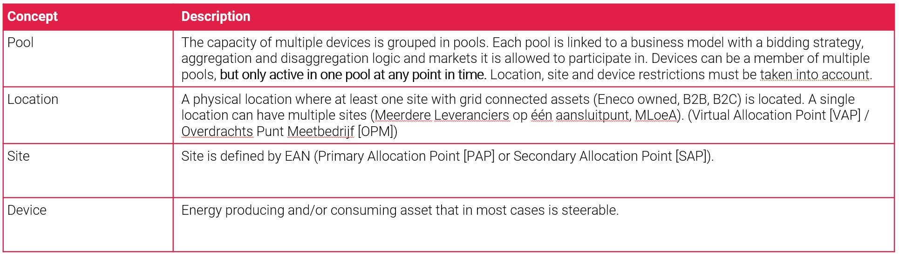
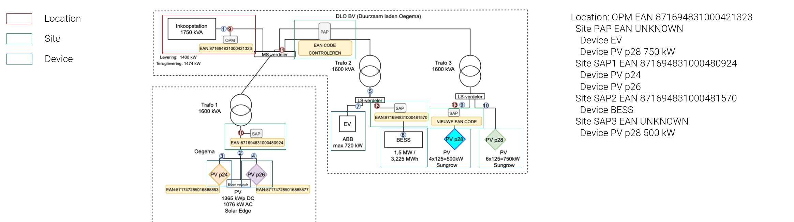

# Pooling on device level

* Date: 2023-10-16
* Updated: 

# Glossary
- VPPAL: Virtual Power Plant Aggregation Layer
- VAP: Virtueel AansluitPunt
- PAP: Primair AllocatiePunt
- SAP: Secundair AllocatiePunt
- TI: Technische Installatie

# Context
Initially, we decided that pooling should happen on site level, with all of the devices at that site sitting within the same pool.
This would ease the enforcement of having devices behind one EAN only active on one market since they'd all be in the same pool, and no reason was seen to have it differently.

Now, we have a requirement from Agro to group devices behind one EAN into different pools, as they have very different strike prices.

# Decisions
* We will have a new entity, **Location** in the VPPAL.
* We will not implement the previously discussed entity **Metering Point**
* A location is defined as being the VAP, and can have multiple sites. It has an EAN, but this EAN is not used in TenneT processes.
* A site is defined as being a PAP/SAP, and can have multiple devices. It has an EAN, and this EAN is used in TenneT processes.
* A device is defined as being a TI, capable of producing or consuming power and being monitored or controlled by the VPPAL.
* Devices will be assigned to pools.
* Sites will no longer be assigned to pools.
* Enforcing site-market rules will be done by checking that all devices on a site are active on the same market. If not, raise alert & ignore site in disaggregation.

# Decision Drivers
1. We must support devices on one site being allocated to different pools 
2. We must be able to enforce that a site is only active on one exclusive market (aFRR,mFRR,Imbalance,Congestion)
3. Optimization can take place across multiple sites that belong to one customer and are geographically close, this needs to have a related entity: Location
4. We have not found any reason to have metering point in the data model (Not from HEMS team, not from VPPAL, not from Agro Energy)

Below two images that show first the concepts as explained here, but in more detail.

Secondly, an example of a real installation with the concepts modeled on it.

