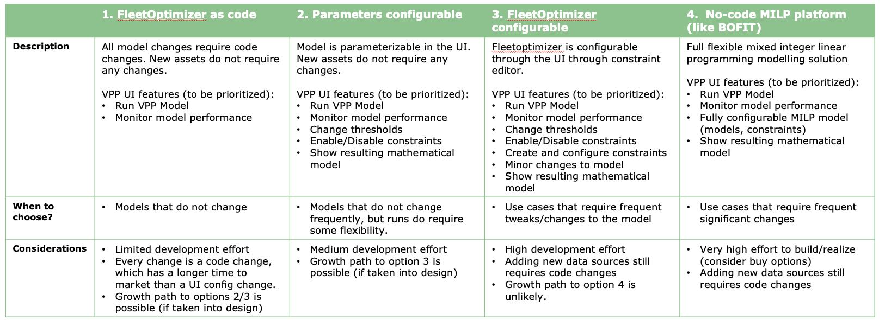

# The FleetOptimizer in the VPP will be based on a parameterizable UI

* Status: proposed
* Deciders: Arne Knottnerus, Mark Beukeboom 
* Date: 16/01/2023
## Context and Problem Statement

The FleetOptimizer is currently developed in BOFIT, where the mathematical model can be constructed using a visual interface. Although flexible, data changes such as adding assets typically require model changes which results in a longer time to market. The question is how to integrate this into the VPP
Also note that similar trade-offs will need to be made for the market allocation model, the asset specific schedule models and site optimization models (behind the meter).
## Requirements/constraints
- Adding new assets should be automated, meaning that the asset can be automatically added in the constraints of the fleetoptimizer model.
- Small frequent changes such as thresholds or enabling/disabling constraints should be possible quickly (without changing code).
- The resulting mathematical model should be transparant to the end-user, meaning that it can be validated.
- Modelers/data scientists can propose changes, only developers will make code changes to ensure quality. 

## Decision Drivers

* Scalable: adding more assets should not lead to extra work.
* Maintainable: it should be fast to make changes to the model.
* Time-to-Market: development time for the VPP FleetOptimizer should be acceptable.

## Considered Options

## Decision Outcome

Chosen option: **"2.Parameters configurable"**, as it offers enough flexibility for the current version and can be implemented with a reasonable amount of effort and time. Towards the future this can grow to option 3, but option 4 is excluded as it will be too much effort.