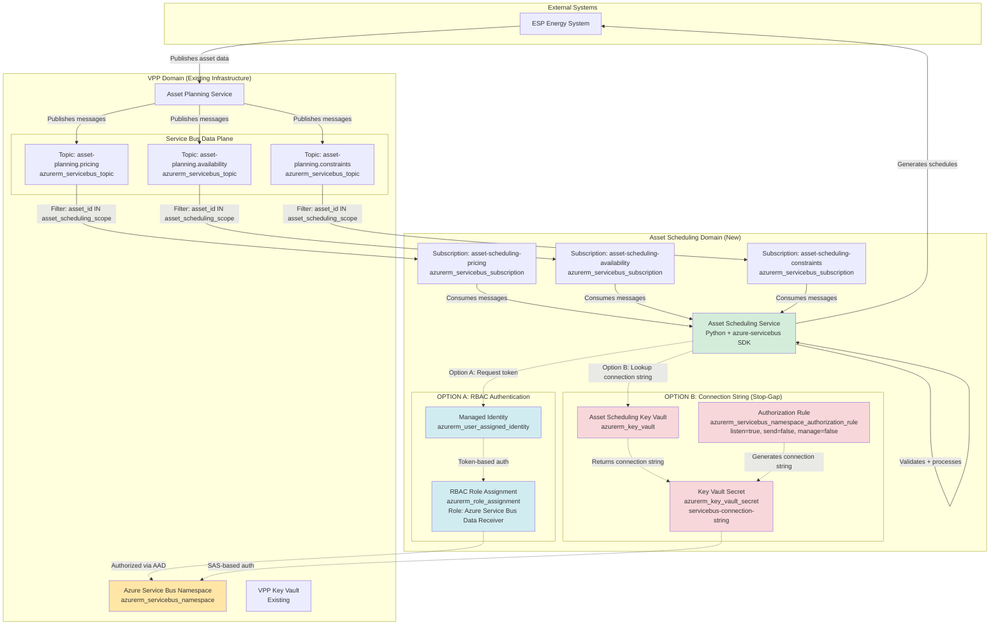
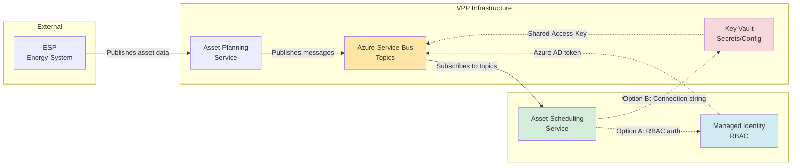
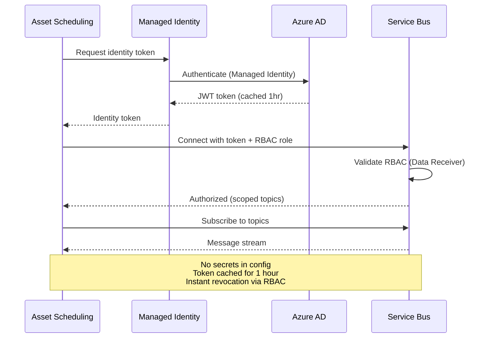
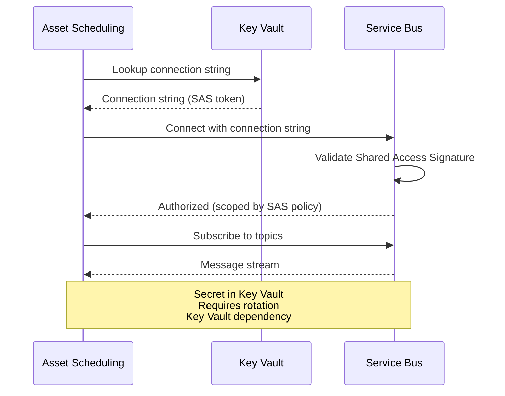
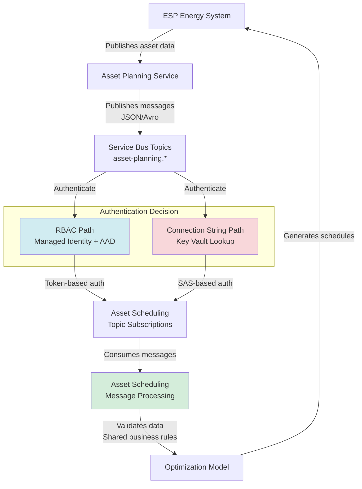

# System Thinker Analysis: Asset Scheduler Service Bus Integration

**Date**: 2025-11-13
**Analyst**: AI Assistant
**Protocol**: System Thinker Analysis v1.2
**Mode**: Design Doc / Infrastructure Analysis

---

## Executive Summary

This document analyzes the proposed solutions for integrating Asset Scheduling with VPP's Azure Service Bus infrastructure, focusing on authentication, authorization, and infrastructure management patterns. The analysis applies systematic reasoning across five dimensions: Data-Flow, Flow-Stream, Causality, Holistic System View, and Rationale Documentation.

**Key Finding**: The discussion reveals a strategic decision between RBAC-based authentication (preferred, secretless) versus key-based authentication (fallback), with significant implications for security posture, operational complexity, and Terraform state management.

---

## Step 1: Pre-Flight for System Thinking

**Mode Classification**: **Design Doc / Infrastructure** (hybrid of ADR implementation + troubleshooting)

**Scope**:
- Azure Service Bus authentication and authorization for Asset Scheduling
- Key Vault access patterns
- Terraform data plane management
- Topic-level access control (scoped permissions)

**Key Questions**:
1. How should Asset Scheduling authenticate to Service Bus securely?
2. Can RBAC and connection string auth coexist?
3. Who manages Service Bus data plane (topics, subscriptions) and how?
4. What access scope does Asset Scheduling need (which topics)?
5. How does this fit with existing ADR decision (complete integration)?

**Analysis Lenses Applied**:
- Data-Flow: Authentication flow, message consumption path
- Flow-Stream: Event-driven pub/sub patterns, backpressure
- Causality: Why this problem exists, root causes
- Holistic: Cross-cutting security, compliance, operational concerns
- Rationale: Decision logic, alternatives, tradeoffs

---

## Step 2: Context Extraction

**From ADR (AS001 - Integrate with VPP)**:
- **Decision**: Complete integration between Asset Scheduling and Asset Planning/VPP
- **Rationale**: Reduce complexity, domain synchronicity, shared business rules
- **Key Integration Point**: Asset Scheduling receives data from Asset Planning via Service Bus
- **Score**: 26/30 (highest among alternatives)

**From Request Thread (Slack/Teams conversation)**:
- **Initial Ask**: Asset Scheduling wants to use VPP's Key Vault to access Service Bus connection string
- **Platform Response** (Roel): Proposes RBAC-first approach, connection string fallback
- **Concerns Raised**:
  - Data plane (topics, subscriptions) not managed via Terraform → brittleness
  - Access control: Asset Scheduling should only access specific topics
  - RBAC viability: Can RBAC and key-based auth coexist in Service Bus?
  - Python implementation: No auto-topology-creation libraries (prevents accidental topic creation)

**Key Stakeholders**:
- **Martijn Meijer** (Asset Scheduling): Requesting access, implementation owner
- **Roel van de Grint** (Platform/VPP): Infrastructure owner, proposing authentication strategy
- **Alex Shmyga** (Product/Architecture): Conceptual approval, wants detailed ADR
- **Ricardo Duncan** (Asset Planning): Confirms topic ownership, consumption model

---

## Step 3: Data-Flow Analysis

### Visual Architecture Overview

**Intent**: This section shows the complete data flow with both authentication approaches (RBAC vs Connection String), revealing Azure resource dependencies and system component interactions.

#### Diagram 1: Complete System Data Flow with Authentication Options



**ASCII Fallback**:
```
ESP → Asset Planning → Service Bus Namespace
                            ↓
        [Topics: pricing, availability, constraints]
                            ↓
        [Subscriptions: asset-scheduling-pricing, -availability, -constraints]
                            ↓
                    [Authentication Decision]
                    ↙                              ↘
    OPTION A: RBAC                          OPTION B: Connection String
    ├─ Managed Identity                      ├─ Authorization Rule (listen-only)
    ├─ RBAC Role Assignment                  ├─ Key Vault Secret (connection string)
    ├─ Token from Azure AD                   └─ Asset Scheduling Key Vault
    └─ Service Bus Data Receiver role             ↓
                    ↓                              ↓
        Asset Scheduling Service (Python)
                    ↓
        Message Processing → Optimization Model → ESP
```

---

### Detailed Component Analysis

#### Entry Point: Asset Planning → Service Bus

**Data Flow**:
```
1. ESP publishes asset data (pricing, availability, constraints)
2. Asset Planning ingests data (validation, business rules)
3. Asset Planning publishes to Service Bus topics:
   - asset-planning.pricing (JSON messages, ~1KB/msg)
   - asset-planning.availability (JSON messages, ~500B/msg)
   - asset-planning.constraints (JSON messages, ~2KB/msg)
```

**Rationale**: Asset Planning owns ingestion from ESP to reduce duplication (per ADR AS001 decision: "Complete integration to reduce complexity").

---

#### Transformation 1: Authentication (Two Approaches)

##### OPTION A: RBAC-Based Authentication (Preferred)

**Components**:
1. **Managed Identity** (`azurerm_user_assigned_identity`)
   - Created for Asset Scheduling service
   - Assigned to AKS pod or App Service
   - No credentials stored anywhere

2. **RBAC Role Assignment** (`azurerm_role_assignment`)
   - Role: `Azure Service Bus Data Receiver` (built-in)
   - Scope: Service Bus namespace OR specific topics
   - Principal: Managed Identity ID

3. **Azure AD Token Flow**:
   ```
   Asset Scheduling → azure-identity SDK → Azure AD → JWT token (cached 1hr)
   ```

**Terraform Resources (OPTION A)**:
```hcl
# Managed Identity for Asset Scheduling
resource "azurerm_user_assigned_identity" "asset_scheduling" {
  name                = "asset-scheduling-identity"
  resource_group_name = azurerm_resource_group.asset_scheduling.name
  location            = azurerm_resource_group.asset_scheduling.location
}

# RBAC Role Assignment: Service Bus Data Receiver
resource "azurerm_role_assignment" "asset_scheduling_servicebus_receiver" {
  scope                = azurerm_servicebus_namespace.vpp.id
  role_definition_name = "Azure Service Bus Data Receiver"
  principal_id         = azurerm_user_assigned_identity.asset_scheduling.principal_id
}

# (Optional) Topic-scoped RBAC (more granular)
resource "azurerm_role_assignment" "asset_scheduling_topic_pricing" {
  scope                = azurerm_servicebus_topic.pricing.id
  role_definition_name = "Azure Service Bus Data Receiver"
  principal_id         = azurerm_user_assigned_identity.asset_scheduling.principal_id
}
```

**Rationale**:
- **Security**: No secrets in configuration, connection string empty or contains only namespace endpoint
- **Auditability**: Azure AD logs every authentication attempt (who, when, from where)
- **Revocability**: Remove RBAC role assignment instantly (no credential rotation lag)
- **Least Privilege**: Can scope to specific topics, not entire namespace

---

##### OPTION B: Connection String-Based Authentication (Stop-Gap Solution)

**Components**:
1. **Authorization Rule** (`azurerm_servicebus_namespace_authorization_rule`)
   - Name: `asset-scheduling-listener`
   - Permissions: `listen = true, send = false, manage = false`
   - Generates connection string with scoped permissions
   - Scoped to namespace (topic-level auth rules also supported via `azurerm_servicebus_topic_authorization_rule`)

2. **Asset Scheduling Key Vault** (`azurerm_key_vault`)
   - Separate Key Vault for Asset Scheduling (NOT VPP's Key Vault)
   - Isolation principle: Each service owns its secrets
   - Soft-delete enabled, purge protection recommended

3. **Key Vault Secret** (`azurerm_key_vault_secret`)
   - Name: `servicebus-connection-string`
   - Value: Connection string from Authorization Rule
   - Rotation: Manual or automated (Azure Function + Key Vault events)

4. **Connection String Lookup Flow**:
   ```
   Asset Scheduling startup → azure-keyvault SDK → Key Vault → Connection string → Service Bus
   ```

**Terraform Resources (OPTION B)**:
```hcl
# Authorization Rule: Listen-only access
resource "azurerm_servicebus_namespace_authorization_rule" "asset_scheduling_listener" {
  name         = "asset-scheduling-listener"
  namespace_id = azurerm_servicebus_namespace.vpp.id

  listen = true
  send   = false
  manage = false
}

# Asset Scheduling Key Vault (separate from VPP)
resource "azurerm_key_vault" "asset_scheduling" {
  name                       = "asset-scheduling-kv"
  location                   = azurerm_resource_group.asset_scheduling.location
  resource_group_name        = azurerm_resource_group.asset_scheduling.name
  tenant_id                  = data.azurerm_client_config.current.tenant_id
  sku_name                   = "standard"
  soft_delete_retention_days = 90
  purge_protection_enabled   = true

  # RBAC for Key Vault access (Asset Scheduling service identity)
  enable_rbac_authorization = true
}

# Store connection string in Key Vault
resource "azurerm_key_vault_secret" "servicebus_connection_string" {
  name         = "servicebus-connection-string"
  value        = azurerm_servicebus_namespace_authorization_rule.asset_scheduling_listener.primary_connection_string
  key_vault_id = azurerm_key_vault.asset_scheduling.id

  # Prevent accidental exposure in Terraform state (use sensitive outputs)
  lifecycle {
    ignore_changes = [value]
  }
}

# RBAC for Asset Scheduling to read Key Vault secrets
resource "azurerm_role_assignment" "asset_scheduling_keyvault_reader" {
  scope                = azurerm_key_vault.asset_scheduling.id
  role_definition_name = "Key Vault Secrets User"
  principal_id         = azurerm_user_assigned_identity.asset_scheduling.principal_id
}
```

**Rationale**:
- **Isolation**: Separate Key Vault prevents VPP's connection string (with broader permissions) from being used
- **Least Privilege**: Authorization rule scoped to `listen` only (cannot send/manage)
- **Fallback Viability**: Works if RBAC incompatible with existing setup
- **Operational Burden**: Requires secret rotation (30-90 day cadence), Key Vault dependency

**Stop-Gap Designation**:
- **Why "stop-gap"?**: Connection strings are security liability (secrets in storage, rotation required)
- **Migration Path**: Deploy with OPTION B initially → Test RBAC in parallel → Migrate to OPTION A → Decommission authorization rule

---

#### Transformation 2: Topic Subscription (Data Plane)

**Components**:
1. **Topics** (`azurerm_servicebus_topic`):
   - `asset-planning.pricing`
   - `asset-planning.availability`
   - `asset-planning.constraints`
   - Owned by Asset Planning team
   - ⚠️ Currently NOT in Terraform (manual creation) → Drift risk

2. **Subscriptions** (`azurerm_servicebus_subscription`):
   - `asset-scheduling-pricing` (on topic `asset-planning.pricing`)
   - `asset-scheduling-availability` (on topic `asset-planning.availability`)
   - `asset-scheduling-constraints` (on topic `asset-planning.constraints`)
   - Filter rules: `asset_id IN (...asset_scheduling_scope...)`
   - Owned by Asset Scheduling team

**Terraform Resources (Data Plane)**:
```hcl
# Topics (should be in Terraform, currently manual)
resource "azurerm_servicebus_topic" "asset_planning_pricing" {
  name         = "asset-planning.pricing"
  namespace_id = azurerm_servicebus_namespace.vpp.id

  # Topic settings
  max_size_in_megabytes        = 5120
  default_message_ttl          = "P7D"  # 7 days
  partitioning_enabled         = true   # For scale
  support_ordering             = false  # Asset Scheduling doesn't require ordering
}

# Subscriptions for Asset Scheduling
resource "azurerm_servicebus_subscription" "asset_scheduling_pricing" {
  name               = "asset-scheduling-pricing"
  topic_id           = azurerm_servicebus_topic.asset_planning_pricing.id
  max_delivery_count = 10  # Retry 10 times before dead-letter

  # Filter: Only messages for assets in Asset Scheduling scope
  # (Requires azurerm_servicebus_subscription_rule for SQL filters)
}

# Subscription Rule: Filter by asset_id
resource "azurerm_servicebus_subscription_rule" "asset_scheduling_pricing_filter" {
  name            = "asset-id-filter"
  subscription_id = azurerm_servicebus_subscription.asset_scheduling_pricing.id
  filter_type     = "SqlFilter"
  sql_filter      = "asset_id IN ('asset-1', 'asset-2', 'asset-3')"  # Asset Scheduling scope
}
```

**Rationale**:
- **Scoped Consumption**: Filters prevent Asset Scheduling from seeing all Asset Planning data
- **Least Privilege**: Subscription-level isolation (Asset Scheduling can't access other subscriptions)
- **Operational Simplicity**: Python SDK consumes from subscription, not topic directly

---

#### Transformation 3: Message Processing

**Data Flow**:
```
1. Asset Scheduling consumes messages from subscriptions
2. Validates data (shared business rules with Asset Planning)
3. Feeds optimization model (constraint solver, scheduling algorithm)
4. Generates schedules
5. Publishes schedules to ESP (separate flow)
```

**Rationale**: Business logic isolation (Asset Scheduling owns optimization, Asset Planning owns ingestion).

---

### Dependencies Mapped

**Asset Scheduling Dependencies**:
1. **Service Bus Namespace** (VPP-owned)
   - Availability: 99.9% SLA (Standard tier), 99.95% (Premium tier)
   - Failure mode: Asset Scheduling cannot consume data → Degraded mode (local cache per ADR)

2. **Key Vault** (OPTION B only)
   - Availability: 99.9% SLA
   - Failure mode: Connection string lookup fails → Use cached connection string (TTL: 1 hour)

3. **Azure AD** (OPTION A only)
   - Availability: 99.99% SLA
   - Failure mode: Token refresh fails → Use cached token (TTL: 1 hour)

**Terraform State Dependencies**:
- Service Bus Namespace → Topics → Subscriptions (hierarchical)
- Authorization Rule → Connection String → Key Vault Secret (OPTION B chain)
- Managed Identity → RBAC Role Assignment (OPTION A chain)

---

## Step 4: Flow-Stream Analysis

```
Flow-Stream Analysis:
- Stream Type: Event-driven pub/sub (Azure Service Bus)
  - Rationale: Asynchronous, decoupled, enables independent scaling

- Flow Path:
  Asset Planning → Service Bus Topics → Asset Scheduling Subscriptions → Asset Scheduling Processing

- Flow Control Mechanisms:
  - Service Bus: Message TTL, dead-letter queue, max delivery count
  - Asset Scheduling: Consumer prefetch, batch processing
  - Rationale: Prevents message loss, enables retry, controls backpressure

- Bottlenecks:
  - Service Bus throttling limits (messages/sec per tier)
  - Key Vault lookup latency (if connection string approach)
  - RBAC token refresh (if RBAC approach, cached tokens mitigate)
  - Rationale: Service Bus Premium tier provides higher throughput, RBAC tokens cached for 1 hour

- Temporal Characteristics:
  - Message ordering: Not guaranteed (Service Bus standard)
  - Delivery guarantee: At-least-once (requires idempotent processing)
  - Latency: <100ms p99 for Service Bus Premium
  - Rationale: Asset Scheduling must handle duplicates, out-of-order messages

- Optimization Opportunities:
  - Batch message consumption (reduce roundtrips)
  - Persistent connections (connection pooling)
  - Prefetch optimization (balance latency vs throughput)
```

---

## Step 5: Causality Chain Mapping

```
Causality Chain:
- Effect: Asset Scheduling needs Service Bus access

- Immediate Cause: ADR decision (complete integration with VPP)
  - Mechanism: Asset Scheduling consumes data from Asset Planning
  - Rationale: Reuse ingestion infrastructure, shared business rules (ADR score: 26/30)

- Root Cause: Asset Scheduling requires real-time asset data for optimization
  - Mechanism: Optimization model needs pricing, availability, constraints from ESP
  - Rationale: Asset Planning already consumes this data, no duplication of effort

- Authentication Decision Point: RBAC vs Connection String
  - Immediate Cause: Security best practice (avoid secrets in config)
  - Mechanism A (RBAC): Azure Managed Identity + Azure AD + RBAC role assignment
    - Rationale: Secretless, identity-based, audit trail, revocable
  - Mechanism B (Connection String): Shared Access Signature in Key Vault
    - Rationale: Fallback if RBAC not viable (compatibility concerns)

- Terraform Data Plane Gap:
  - Immediate Cause: Service Bus data plane (topics, subscriptions) not in Terraform
  - Mechanism: Manual topic creation → drift risk, no version control
  - Root Cause: Terraform provider limitations OR team practice
  - Rationale: Without IaC, topology changes are brittle, undocumented, error-prone

- Topic Access Control Requirement:
  - Immediate Cause: Least privilege security principle
  - Mechanism: Asset Scheduling should only access topics it needs (not all VPP topics)
  - Rationale: Prevents accidental data access, reduces blast radius of credential compromise

- Feedback Loops:
  - Manual topic creation → Drift → Configuration errors → Debugging effort → Technical debt (positive loop)
  - RBAC adoption → Secretless config → Reduced Key Vault dependency → Simplified rotation (negative loop, stabilizing)

- Second-Order Effects:
  - RBAC approach → Sets precedent for other services → Organization-wide pattern
  - Connection string approach → More Key Vault lookups → Key Vault becomes critical path
  - Unmanaged data plane → Future migration complexity → Technical debt accumulation
```

---

## Step 6: Holistic System Analysis

```
Holistic System Analysis:
- Component Context: Service Bus exists because system needs asynchronous, decoupled communication
  - Rationale: Enables independent scaling of Asset Planning and Asset Scheduling
  - Alternative: Direct HTTP calls (rejected: tight coupling, cascading failures)

- System Boundaries:
  - VPP Domain: Owns Service Bus infrastructure, Key Vault, monitoring
  - Asset Scheduling Domain: Owns service identity, business logic, optimization
  - Boundary: Service Bus topic subscriptions (interface contract)
  - Rationale: Clear ownership prevents conflicting changes

- Cross-Cutting Concerns:
  - **Security**: Authentication (RBAC vs keys), authorization (topic-level ACLs), secret rotation
  - **Observability**: Connection failures, message consumption rate, dead-letter queue monitoring
  - **Compliance**: Audit trail (who accessed which topics, when), data residency (Azure region)
  - **Cost**: Service Bus tier (Standard vs Premium), message ingress/egress, Key Vault operations
  - **Operational Complexity**: Terraform state, manual topology changes, disaster recovery
  - Rationale: Decisions impact entire organization, not just Asset Scheduling

- Propagation Analysis (if RBAC chosen):
  - Change: Adopt RBAC for Service Bus authentication
  - Propagates to:
    - Infrastructure: RBAC role assignments in Terraform (new resource types)
    - Code: Azure Identity SDK integration (azure-identity library in Python)
    - Deployment: Managed Identity assignment in AKS/App Service
    - Monitoring: RBAC permission errors (new alert types)
    - Documentation: Authentication guide updates, runbooks
  - Rationale: Architectural decision requires coordinated changes across layers

- Propagation Analysis (if Connection String chosen):
  - Change: Create scoped connection string for Asset Scheduling
  - Propagates to:
    - Infrastructure: New Shared Access Policy in Service Bus (Azure Portal or ARM template)
    - Security: New Key Vault secret (terraform resource)
    - Code: Key Vault lookup in application startup (azure-keyvault SDK)
    - Operations: Secret rotation procedures (manual or automated)
    - Monitoring: Key Vault access metrics, connection failures
  - Rationale: Connection string approach adds operational burden (rotation, storage)

- Emergent Properties:
  - System exhibits **tight coupling** between Asset Scheduling and VPP infrastructure
    - Mechanism: Service Bus downtime → Asset Scheduling cannot consume data
    - Mitigation: Circuit breaker, local cache, degraded mode (per ADR "Attention Points")
  - System exhibits **shared fate** for Service Bus
    - Mechanism: Service Bus performance degradation affects all consumers
    - Mitigation: Service Bus Premium tier (higher throughput, isolation)
```

---

## Step 7: Rationale Documentation

### Primary Decision: Authentication Method

```
Rationale Documentation:
- Decision: Use RBAC-based authentication for Service Bus access (preferred)

- Rationale:
  1. **Security**: No secrets in configuration (connection string contains credentials)
  2. **Auditability**: Azure AD logs show which identity accessed which resource
  3. **Revocability**: RBAC roles can be revoked instantly (no credential rotation lag)
  4. **Least Privilege**: Granular permissions (Data Receiver role, scoped to specific topics)
  5. **Operational Simplicity**: No secret rotation procedures needed

- Alternatives Considered:
  - **Alternative A**: Shared connection string (existing VPP Key Vault)
    - Rejected because: Violates security best practice (secrets in config), VPP connection string may have broader permissions than needed
  - **Alternative B**: New scoped connection string (Asset Scheduling Key Vault)
    - Fallback if RBAC not viable
    - Pros: Least privilege (scoped access), isolated secret storage
    - Cons: Requires secret rotation, Key Vault dependency, operational overhead
  - **Alternative C**: Direct database access (bypass Service Bus)
    - Rejected because: ADR decision already made (complete integration via Service Bus)

- Constraints:
  1. **Technical**: RBAC and connection string auth must coexist (confirmed by Roel's proposal)
  2. **Organizational**: Python libraries must NOT auto-create topics (prevents accidental topology changes)
  3. **Infrastructure**: Terraform data plane gap (topics not managed as code)
  4. **Timeline**: Asset Scheduling needs access soon (blocking development)

- System Goal Alignment:
  - ADR Goal: "Reduce overall complexity, create domain synchronicity"
  - RBAC Alignment: ✅ Simplifies secret management, reduces Key Vault dependency
  - Connection String Alignment: ⚠️ Adds complexity (rotation), but viable fallback

- Risk Assessment:
  - **RBAC Risks**:
    - Azure AD outage → Authentication failures (mitigation: regional redundancy, cached tokens)
    - RBAC misconfiguration → Access denied errors (mitigation: infrastructure testing, monitoring)
  - **Connection String Risks**:
    - Secret leak → Unauthorized access (mitigation: Key Vault + secret rotation)
    - Rotation failures → Service disruption (mitigation: automation, alerting)
```

### Secondary Decision: Terraform Data Plane Management

```
Rationale Documentation:
- Decision: Acknowledge Terraform gap, document as technical debt (NOT blocking)

- Rationale:
  - Current state: Topics created manually (brittle, no version control)
  - Ideal state: Topics managed via Terraform (IaC, auditable, repeatable)
  - Pragmatic approach: Proceed with manual topics, add to backlog for infrastructure team

- Alternatives Considered:
  - **Alternative A**: Block Asset Scheduling until Terraform data plane implemented
    - Rejected because: Business timeline pressure, Terraform provider limitations may require significant effort
  - **Alternative B**: Use ARM templates for data plane
    - Possible, but adds another IaC tool (complexity)
  - **Alternative C**: Use Pulumi for data plane (supports all Azure resources)
    - Rejected because: Team unfamiliar with Pulumi, Terraform already adopted

- Constraints:
  - Terraform azurerm provider may not support all Service Bus data plane operations
  - Team capacity for infrastructure work (Roel mentioned lack of time for ADR)
  - Risk acceptance: Manual topology is acceptable short-term (per Roel's assessment)

- System Goal Alignment:
  - ADR Goal: "Simplified system architecture by avoiding duplicate data processing"
  - Terraform Alignment: ⚠️ Misaligned (manual topology adds complexity), but not ADR-blocking
```

### Open Questions / Things to Verify with Humans

1. **RBAC Viability** (CRITICAL):
   - ❓ Can Azure Service Bus support RBAC AND connection string auth simultaneously?
   - ❓ If yes, does RBAC take precedence or connection string?
   - ❓ What are the performance implications of RBAC token acquisition (latency, caching)?
   - **Action**: Platform team (Roel) to confirm with Azure documentation or testing

2. **Topic Access Scope** (CRITICAL):
   - ❓ Which specific topics does Asset Scheduling need access to?
   - ❓ Are topics already created, or do they need to be provisioned?
   - ❓ What are the naming conventions (asset-planning.*, vpp.*, asset-scheduling.*)?
   - **Action**: Asset Planning team (Ricardo) to provide topic list

3. **Terraform Data Plane** (MEDIUM PRIORITY):
   - ❓ Is Terraform azurerm provider limitation the root cause, or team practice?
   - ❓ What is the timeline for Terraform data plane implementation?
   - ❓ Can ARM templates be used as interim solution?
   - **Action**: Platform team to investigate Terraform provider capabilities

4. **ADR Completeness** (MEDIUM PRIORITY):
   - ❓ Should authentication details be added to existing ADR (AS001) or new ADR?
   - ❓ What level of detail is expected (high-level vs implementation-specific)?
   - **Action**: Alex Shmyga to clarify ADR expectations

5. **Subscription Creation Permissions** (LOW PRIORITY):
   - ❓ Should Asset Scheduling be able to create subscriptions (consumer groups)?
   - ❓ Or should subscriptions be pre-created by platform team?
   - **Action**: Martijn mentioned "handy but not required", clarify if operational flexibility needed

6. **Fallback Strategy** (LOW PRIORITY):
   - ❓ If RBAC fails (Azure AD outage), does connection string provide disaster recovery?
   - ❓ Or should Asset Scheduling implement local caching (per ADR "Attention Points")?
   - **Action**: Define disaster recovery procedures

---

## Step 8: Visual Synthesis

### Intent Statement

**This section provides visual diagrams** to clarify the authentication flow comparison (RBAC vs Connection String), Service Bus data flow, and system topology. Diagrams compress complex relationships into scannable formats, accelerating understanding.

---

### Diagram 1: Proposed Architecture - Service Bus Integration

**Intent**: This diagram shows the high-level integration between Asset Scheduling, VPP infrastructure (Service Bus, Key Vault), and Asset Planning, revealing component relationships and data flow paths.



**ASCII Fallback**:
```
ESP → Asset Planning → Service Bus Topics → Asset Scheduling
                              ↓
                          Key Vault (Option B: Connection String)
                              OR
                       Azure AD + RBAC (Option A: Managed Identity)
                              ↓
                       Asset Scheduling authenticates → Consumes messages
```

---

### Diagram 2: Authentication Flow Comparison

**Intent**: This sequence diagram contrasts RBAC-based authentication (Option A) with connection string authentication (Option B), highlighting security and operational differences.

**OPTION A: RBAC-Based Authentication (Preferred)**



**OPTION B: Connection String Authentication (Fallback)**



**ASCII Fallback**:
```
OPTION A (RBAC):
Asset Scheduling → Managed Identity → Azure AD (token) → Service Bus (RBAC check) → Authorized

OPTION B (Connection String):
Asset Scheduling → Key Vault (lookup) → Connection String → Service Bus (SAS check) → Authorized

Key Difference:
- RBAC: No secrets, identity-based, instant revocation
- Connection String: Secret storage, rotation required, Key Vault dependency
```

---

### Diagram 3: Service Bus Data Flow (Detailed)

**Intent**: This diagram traces the complete data flow from ESP through Asset Planning to Asset Scheduling, showing authentication decision point and message processing.



**ASCII Fallback**:
```
ESP → Asset Planning → Service Bus Topics
                            ↓
                    [Authentication Decision]
                    ↙                    ↘
        RBAC (Managed Identity)    Connection String (Key Vault)
                    ↓                    ↓
        Asset Scheduling Subscriptions (scoped topics)
                    ↓
        Message Processing (validation, shared business rules)
                    ↓
        Optimization Model → Schedules → ESP
```

---

## Step 9: Validation Check

**7-Point System-Thinking Validation Checklist**:

1. ✅ **Data Flow**: All data paths traced from ESP → Asset Planning → Service Bus → Asset Scheduling → Optimization Model
   - Entry points: ESP asset data
   - Transformations: Publishing, authentication, subscription, consumption, validation
   - Exit points: Schedules back to ESP

2. ✅ **Flow Stream**: System understood as continuous event-driven process
   - Async pub/sub pattern (Service Bus)
   - At-least-once delivery, idempotent processing
   - Backpressure via consumer prefetch, batching

3. ✅ **Causality**: Every effect has identified cause with mechanism
   - Root cause: Asset Scheduling needs real-time asset data → ADR decision (complete integration) → Service Bus access required
   - Authentication decision: Security best practice (no secrets) → RBAC preferred
   - Terraform gap: Manual topology creation → drift risk → technical debt

4. ✅ **Holistic**: Components analyzed in system context
   - Cross-cutting concerns: Security (RBAC vs keys), observability (monitoring), compliance (audit trail), cost (Service Bus tier)
   - System boundaries: VPP owns infrastructure, Asset Scheduling owns business logic
   - Propagation: RBAC adoption affects infrastructure, code, deployment, monitoring

5. ✅ **Rationale**: Every decision has explicit "why"
   - RBAC preferred: Secretless, auditability, revocability, least privilege
   - Connection string fallback: Viable if RBAC not compatible
   - Terraform gap acknowledged: Pragmatic short-term acceptance, backlog item
   - Alternatives considered: Shared connection string (rejected), direct DB access (rejected per ADR)

6. ✅ **Completeness**: All critical relationships documented
   - Asset Scheduling ↔ Service Bus (authentication, authorization, data flow)
   - Service Bus ↔ Key Vault (Option B only)
   - Asset Scheduling ↔ Managed Identity (Option A only)
   - Service Bus ↔ Terraform (data plane gap)

7. ✅ **Clarity**: Analysis explains system behavior, not just describes it
   - WHY RBAC preferred: Security model, operational simplicity, audit trail
   - WHY connection string fallback: Compatibility concerns, risk mitigation
   - WHY Terraform gap matters: Drift risk, no version control, brittle topology
   - HOW authentication affects system: Token caching, error modes, disaster recovery

---

## Recommendations

### Immediate Actions (Week 1)

1. **Confirm RBAC Viability** (BLOCKING):
   - Platform team (Roel) to test RBAC + connection string coexistence in Service Bus
   - Document Azure Service Bus RBAC roles (Data Sender, Data Receiver) and scope
   - **Success Criteria**: RBAC confirmed working, connection string can be omitted from config

2. **Define Topic Access Scope** (BLOCKING):
   - Asset Planning team (Ricardo) to provide list of topics Asset Scheduling needs
   - Platform team to create RBAC role assignment scoped to those topics only
   - **Success Criteria**: Least-privilege access documented and tested

3. **Update ADR or Create New ADR** (BLOCKING):
   - Clarify with Alex Shmyga whether to extend AS001 or create AS002
   - Document authentication approach (RBAC preferred, connection string fallback)
   - **Success Criteria**: ADR approved by deciders

### Short-Term Actions (Month 1)

4. **Implement RBAC Authentication**:
   - Asset Scheduling: Integrate azure-identity SDK (Python)
   - Infrastructure: Add Managed Identity to Asset Scheduling deployment (Terraform)
   - Infrastructure: Add RBAC role assignments in Terraform
   - **Success Criteria**: Asset Scheduling connects to Service Bus without connection string

5. **Connection String Fallback (If Needed)**:
   - If RBAC not viable, create scoped Shared Access Policy for Asset Scheduling
   - Store connection string in Asset Scheduling Key Vault (separate from VPP)
   - Implement secret rotation automation (Azure Key Vault + Azure Functions)
   - **Success Criteria**: Asset Scheduling can authenticate via connection string as fallback

6. **Monitoring and Alerting**:
   - Add Service Bus connection failure alerts
   - Add RBAC permission denied alerts (if RBAC chosen)
   - Add Key Vault lookup failure alerts (if connection string chosen)
   - **Success Criteria**: Operations team notified within 5 minutes of auth failures

### Long-Term Actions (Quarter 1)

7. **Terraform Data Plane Implementation**:
   - Investigate Terraform azurerm provider capabilities for Service Bus data plane
   - Evaluate alternatives: ARM templates, Pulumi, manual with documentation
   - Prioritize based on drift risk vs. implementation effort
   - **Success Criteria**: Service Bus topics managed as code (version controlled, repeatable)

8. **Disaster Recovery Procedures**:
   - Document fallback if Azure AD unavailable (cached tokens provide 1-hour grace period)
   - Document fallback if Service Bus unavailable (per ADR: local cache, degraded mode)
   - Test DR procedures (chaos engineering: disable RBAC, simulate Service Bus outage)
   - **Success Criteria**: Asset Scheduling can operate in degraded mode for 4 hours without Service Bus

9. **Architecture Documentation**:
   - Update VPP architecture diagrams with Asset Scheduling integration
   - Document Service Bus topic naming conventions
   - Document RBAC role assignment patterns (template for future services)
   - **Success Criteria**: New services can replicate Asset Scheduling authentication pattern

---

## Appendices

### A. Terminology

- **RBAC**: Role-Based Access Control (Azure AD identity-based permissions)
- **SAS**: Shared Access Signature (connection string with embedded credentials)
- **Data Plane**: Service Bus topics, subscriptions, messages (vs. Control Plane: Service Bus namespace, pricing tier)
- **Managed Identity**: Azure AD identity automatically managed by Azure (no credential storage)
- **Key Vault**: Azure service for secure secret storage (passwords, connection strings, API keys)

### B. Related ADRs

- **AS001**: Integrate with VPP (complete integration decision)
- **AS002** (pending): Service Bus Authentication (this analysis informs AS002)

### C. References

- [Azure Service Bus RBAC Documentation](https://docs.microsoft.com/azure/service-bus-messaging/service-bus-role-based-access-control)
- [Azure Managed Identity](https://docs.microsoft.com/azure/active-directory/managed-identities-azure-resources/overview)
- [Slack/Teams Thread](./request.txt)
- [ADR AS001](./contextual-adr-integration-assertscheduler-vpp.md)

---

**Document Version**: 1.0
**Last Updated**: 2025-11-13
**Next Review**: After ADR approval or implementation decision
